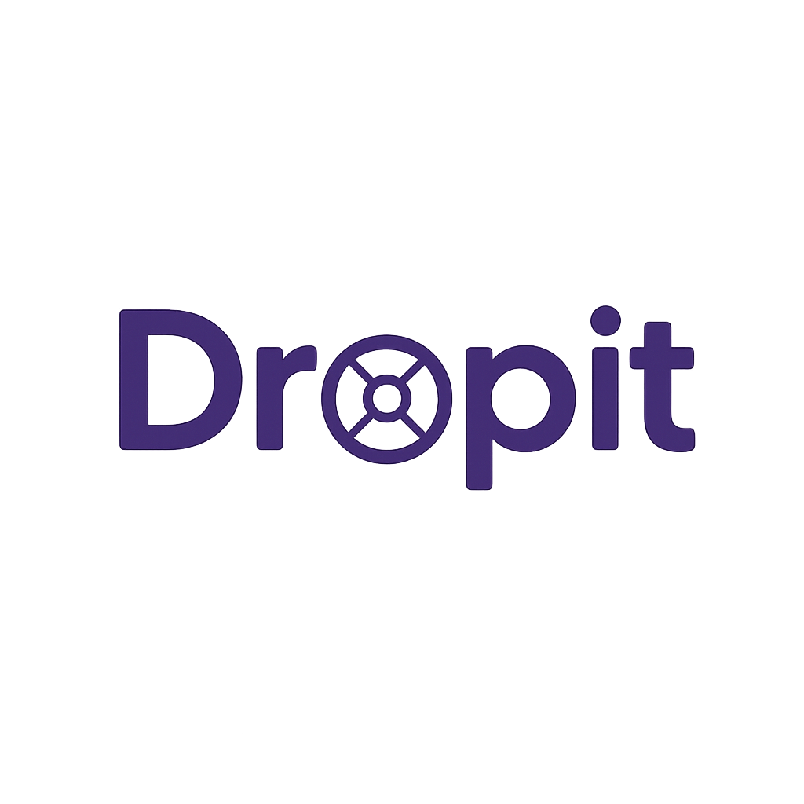

<a name="readme-top"></a>

<!-- LOGO DU PROJET -->
<br />
<div align="center">
  <a href="https://github.com/Netsbump/dropit-documentation">
    
  </a>

<h3 align="center">DropIt Documentation : Application de Club d'Haltérophilie</h3>

  <p align="center">
    La documentation officielle du projet DropIt, une application web et mobile dédiée à la gestion des clubs d'haltérophilie.
    Ce projet est développé dans le cadre de la préparation du titre professionnel
    "Concepteur Développeur d'Applications" (RNCP Niveau 6).
    <br />
    <br />
    <a href="https://docs-dropit.pages.dev/">Voir la Documentation</a>
    ·
    <a href="https://github.com/Netsbump/dropit-documentation/issues">Signaler un Manque</a>
    ·
    <a href="https://github.com/Netsbump/dropit-documentation/issues">Suggérer une Amélioration</a>
  </p>
</div>

---

## 📖 À propos

DropIt est une application web et mobile conçue pour simplifier la gestion des clubs d'haltérophilie. L'application propose deux interfaces distinctes :

- **Interface Web (Coachs)** : Une application web complète permettant aux coachs de gérer leurs athlètes, créer et planifier des séances d'entraînement
- **Application Mobile (Athlètes)** : Une application mobile dédiée aux athlètes pour consulter leurs programmes, enregistrer leurs performances et suivre leur progression

Ce projet s'inscrit dans le cadre de la formation "Concepteur Développeur d'Applications" et vise à répondre aux besoins réels des clubs sportifs en matière de suivi des athlètes et organisation des entraînements.

Cette documentation détaille l'ensemble du processus de développement, depuis l'analyse des besoins jusqu'au déploiement, en passant par la conception technique et les choix d'architecture.

## 📁 Structure du Projet

```
dropit-documentation/
├── src/
│   ├── assets/                    # Images et ressources
│   │   ├── auth-better-auth.png
│   │   ├── global-architecture.png
│   │   └── ...
│   ├── content/
│   │   └── docs/                  # Contenu de la documentation
│   │       ├── index.mdx          # Page d'accueil
│   │       ├── introduction/
│   │       │   ├── presentation.md    # Présentation du projet
│   │       │   └── contexte.md        # Contexte et enjeux
│   │       ├── conception/
│   │       │   ├── analyse.md         # Analyse des besoins
│   │       │   ├── architecture.md    # Architecture logicielle
│   │       │   ├── interfaces.md      # Interfaces utilisateur
│   │       │   ├── presentations.md   # Couche présentation
│   │       │   ├── base-donnees.md    # Modélisation BDD
│   │       │   └── acces-donnees.md   # Couche d'accès aux données
│   │       ├── securite/
│   │       │   ├── conception.md      # Conception sécurité
│   │       │   ├── authentification.md # Système d'authentification
│   │       │   └── permissions.md     # Gestion des permissions
│   │       ├── tests/
│   │       │   ├── plans.md           # Plans de tests
│   │       │   └── validation.md      # Stratégies de validation
│   │       ├── deploiement/
│   │       │   ├── preparation.md     # Préparation au déploiement
│   │       │   └── production.md      # Mise en production
│   │       ├── gestion/
│   │       │   ├── contribution.md    # Guide de contribution
│   │       │   └── documentations.md  # Maintenance de la doc
│   │       └── annexes/
│   │           ├── glossaire.md       # Glossaire technique
│   │           ├── bilan.md           # Bilan du projet
│   │           ├── analyses-besoins.md
│   │           ├── architecture-technique.md
│   │           ├── authentifications.md
│   │           ├── conception-bdd-technique.md
│   │           ├── implementation-acces-donnees.md
│   │           ├── implementation-presentations.md
│   │           └── permissions.md
│   ├── styles/
│   │   └── mermaid.css            # Styles pour les diagrammes
│   └── content.config.ts          # Configuration des collections
├── public/                        # Assets statiques
│   └── beoe/                      # Diagrammes Mermaid générés
├── scripts/                       # Scripts utilitaires
│   └── generateScreenshots.js    # Génération de captures d'écran
├── astro.config.mjs              # Configuration Astro
├── package.json
└── pnpm-lock.yaml
```

## 🛠️ Technologies Utilisées

- **Astro 5.1.5** - Framework de génération de sites statiques
- **Starlight** - Template de documentation pour Astro
- **Mermaid** - Génération de diagrammes (@beoe/rehype-mermaid)
- **Playwright** - Génération de captures d'écran
- **pnpm** - Gestionnaire de paquets

## 🚀 Commandes

Toutes les commandes doivent être exécutées depuis la racine du projet :

| Commande          | Action                                              |
| :---------------- | :-------------------------------------------------- |
| `pnpm install`    | Installer les dépendances                           |
| `pnpm dev`        | Démarrer le serveur de développement (localhost:4321) |
| `pnpm build`      | Construire le site de production dans `./dist/`     |
| `pnpm preview`    | Prévisualiser le build en local                     |
| `pnpm astro ...`  | Exécuter des commandes Astro CLI                    |

## 📚 Informations Techniques

Ce projet est construit avec le template Starlight d'Astro. Pour plus d'informations techniques sur le fonctionnement de Starlight et Astro, consultez le fichier [README.starlight.md](./README.starlight.md).

## 🌐 Déploiement

La documentation est déployée sur Cloudflare Pages : [https://docs-dropit.pages.dev/](https://docs-dropit.pages.dev/)

## 📄 Licence

Ce projet de documentation est développé dans le cadre d'une formation professionnelle.
