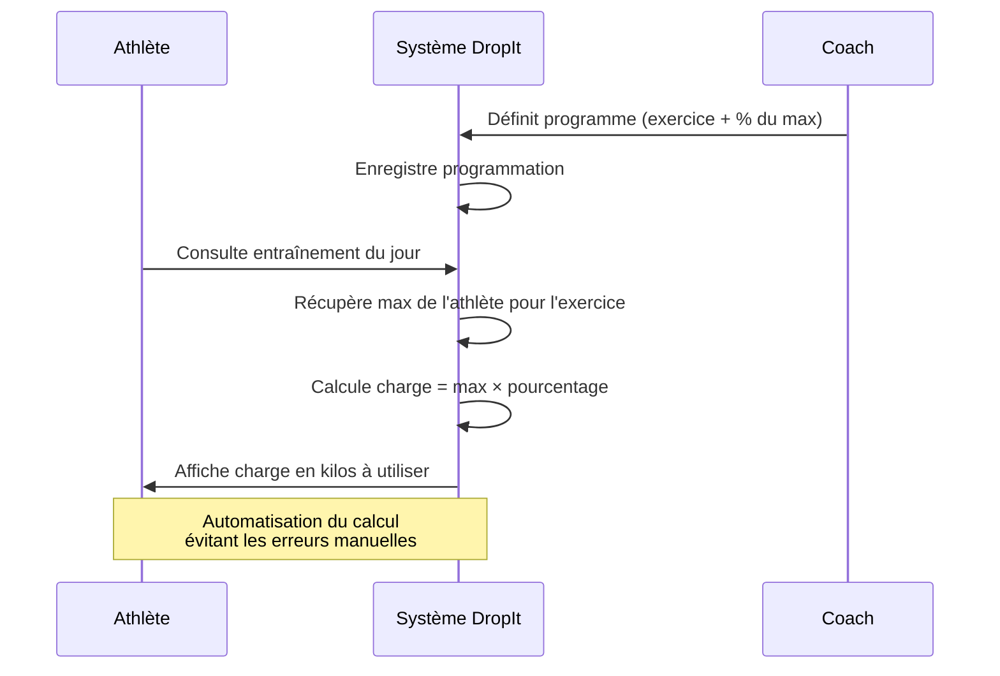

## Exemple de flux d'interaction

### Accéder à son entraînement personnalisé (Athlète)

- L'**athlète** accède à la section des **entraînements**
- Le système affiche les **entraînements** disponibles classés par **date**
- L'**athlète** sélectionne un **entraînement**
- Le système calcule et affiche les **charges** en kilos basées sur les **pourcentages** définis par le **coach** et les **maximums** de l'**athlète**

### Gestion des entraînements (Coach)

- Le **coach** accède à la gestion des **entraînements**
- Le système propose deux vues : bibliothèque des éléments ou planification
- Pour créer un **exercice** : nom, type, description optionnelle, vidéo de démonstration
- Pour créer un **bloc d'exercices** : sélection de minimum 2 **exercices**, ordre d'exécution, paramètres
- Pour créer un **entraînement** : combinaison d'**exercices** et **blocs**, avec séries, répétitions, pourcentages et temps de repos
- Planification via **calendrier** avec assignation aux **athlètes**

## Entités identifiées

L'analyse de ces flux a permis d'identifier les entités principales du système :

### Entités métier
- **Athlète** : profil, catégories de compétition, historique des maximums
- **Coach** : profil, liste des athlètes suivis
- **Exercice** : nom, type (haltérophilie, musculation, cardio), description, vidéo
- **Complex** : composition d'exercices selon un ordre d'exécution
- **Entraînement** : composition d'exercices et complexes avec paramètres
- **Maximum** : valeur en kilos par exercice et athlète, historisé
- **Programmation** : assignation d'entraînements à des dates et athlètes

### Entités de paramétrage
- **Type d'exercice** : haltérophilie, musculation, cardio, mobilité
- **Type de complex** : Complex d'arraché, Complex épaulé-jetté, Complex de renforcement
- **Catégorie de poids** : classifications officielles de compétition
- **Niveau athlète** : rookie, régional, national

## Règles métier identifiées

### Calculs automatiques
- **Calcul de charge** : `charge = maximum_athlète × pourcentage_coach`
- **Validation des maximums** : Les valeurs doivent être positives et réalistes
- **Historique des maximums** : Conservation de tous les records avec dates

### Contraintes d'intégrité
- **Exercices** : Nom obligatoire, type dans liste prédéfinie
- **Blocs d'exercices** : Minimum 2 exercices, ordre d'exécution défini
- **Entraînements** : Combinaison d'exercices et/ou blocs, paramètres complets
- **Athlètes** : Profil complet avec catégories de compétition

### Permissions et accès
- **Coachs** : Accès complet à la gestion des entraînements et athlètes
- **Athlètes** : Accès limité à leurs propres données et programmes assignés

## Système de calcul automatique des charges

Le système de calcul automatique des charges basé sur les pourcentages des maximums illustre l'intégration des spécificités techniques de l'haltérophilie. Plutôt que de laisser les athlètes calculer manuellement leurs charges d'entraînement, l'application automatise cette tâche en s'appuyant sur les données de leurs maximums et les pourcentages définis par le coach.

