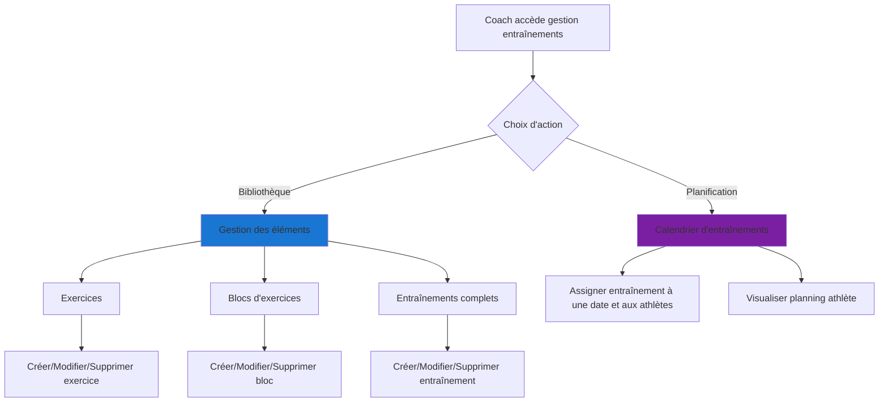

## Introduction

Cette annexe présente les flux d'interactions détaillés entre les utilisateurs et le système DropIt. Ces spécifications fonctionnelles permettent de comprendre précisément les étapes de chaque action et d'identifier les entités métier nécessaires à la conception de la base de données.

Chaque flux décrit les échanges entre l'utilisateur et le système, révélant ainsi les besoins en données (exercices, programmes, maximums, athlètes) et les règles métier à implémenter (calculs de charges, validations, contraintes d'intégrité).

## Flux d'interactions détaillés

### 1. Accéder à son entraînement personnalisé (Athlète)

Ce flux répond au besoin prioritaire identifié : l'accès rapide et fiable au programme du jour. L'optimisation de ce parcours constitue un enjeu crucial pour l'adoption de l'application.

- L'**athlète** ouvre l'application et accède à la section des **entraînements**
- Le système affiche une liste **d'entrainements** disponibles pour l'athlète classés par **date**.
- L'**athlète** sélectionne un **entrainement**
- Le système récupère **l'entraînement** correspondant à la **date choisie**
- Le système charge le détail des éléments de **l'entraînement** (**répétitions**, **charges**, **temps de repos**, etc.)
- Le système affiche pour chaque **exercice** ou **bloc d'exercices** les charges en kilos que l'**athlète** doit utiliser basées sur le **pourcentage** du **maximum** souhaité par le **coach**

### 2. Gestion des maximums (Athlète)

La gestion des maximums constitue un aspect fondamental de l'entraînement en haltérophilie. Cette fonctionnalité permet aux athlètes de maintenir leurs données à jour, garantissant la précision des calculs de charges.

- L'**athlète** accède à la section des **maximums**
- Le système affiche la liste des **exercices** pour lesquels l'**athlète** a des **maximums** enregistrés
- Si l'**athlète** souhaite modifier **maximums** : 
  - L'**athlète** sélectionne un **exercice** à mettre à jour
  - L'**athlète** entre la nouvelle valeur du Maximum pour cet **exercice**
  - Le système enregistre le nouveau **maximums** avec la **date actuelle**
  - Le système met à jour l'historique des **maximums** pour cet **exercice**
- Si l'**athlète** souhaite ajouter un nouveau **maximum** pour un **exercice** : 
  - L'**athlète** sélectionne l'ajout d'un nouveau **maximum**
  - Le système propose de choisir l'**exercice** parmi la liste disponible
  - L'**athlète** sélectionne l'**exercice** et saisit le **maximum** en kilos
  - Le système enregistre le nouveau **maximum** avec contrainte de validation métier
  - Le système horodate l'enregistrement

### 3. Visualisation du calendrier de la programmation globale (Athlète)

Cette fonctionnalité répond au besoin de vision d'ensemble sur la planification des entraînements, permettant aux athlètes d'anticiper leurs séances et de mieux organiser leur emploi du temps.

- L'**athlète** accède à la section **programmation**
- Le système récupère la **programmation** actuelle de l'**athlète**
- Le système affiche un **calendrier** avec les **entraînements** prévus par le **coach**
- L'**athlète** peut naviguer entre les semaines/mois/année
- Pour chaque jour, le système affiche un résumé de l'**entraînement** (**type d'entrainements** et/ou **description**)
- L'**athlète**  peut sélectionner une **date spécifique** pour voir les **détails de l'entraînement**

### 4. Gestion du profil (Athlète et Coach)

La gestion du profil intègre les spécificités de l'haltérophilie, notamment les catégories de compétition et les mesures physiques qui influencent la programmation des entraînements.

- L'**utilisateur** (**athlète** ou **coach**) se connecte à l'application
- L'**utilisateur** accède à la section de la gestion du **profil**
- Le système affiche les informations actuelles du **profil** :
  - Informations de base (nom, prénom, date de naissance)
  - Club affilié
  - Pays
  - Avatar (image)
- Si l'utilisateur est un **athlète**, le système affiche également :
  - **Niveau de l'athlète** (niveau : régional, national, rookie)
  - **Catégorie de sexe** pour la compétition
  - **Catégorie de poids** pour la compétition
  - **Mesures physiques** (poids, taille, etc.)
  - Nom du **coach** associé
- L'utilisateur peut modifier ses informations personnelles
- Si l'utilisateur est un **coach**, il peut :
  - Voir la liste de ses **athlètes** associés
  - Ajouter ou retirer des **athlètes** de sa liste

### 5. Communication vie du club (Athlète et Coach)

Cette fonctionnalité vise à centraliser les communications du club, répondant directement au problème de dispersion de l'information dans les messageries instantanées.

- **Athlètes** : consultation des actualités non lues avec notifications optionnelles par email
- **Coachs** : publication d'actualités du club (compétitions, informations importantes)

### 6. Gestion des entraînement (Coach)

Cette fonctionnalité constitue le cœur de l'application côté coach. Sa conception s'appuie sur l'observation des méthodes de travail des entraîneurs de mon club et vise à optimiser leur productivité.

- Le **coach** accède à la page permettant de gérer les **entraînements**
- Le système présente le choix entre une vue proposant un choix entre la bibliothèques des éléments liés aux **entrainements** ou la **planification** des **entrainements** des **athlètes** : 
  - Si le **coach** souhaite accéder à la vue de la bibliothèque des **entrainements** : 
    - Le système lui présente des listes d'**exercices**, **bloc d'exercices** et **entrainements** sous forme d'onglets.
    - Pour chaque onglets il peut sélectionner un élément de la liste pour le modifier ou le supprimer ou créer un élément.
    - Si le **coach** souhaite créer des éléments d'**entraînement** : 
      - Si le **coach** crée un **exercice** : 
        - Le système présente une interface de création d'**exercice**
        - Il saisi le nom de l'**exercice**
        - Il choisi le type d'**exercice** parmi une liste de type d'**exercice** possibles (ex: haltérophilie, musculation, cardio...)
        - Il peut ajouter une description spécifique à l'**exercice**
        - Il peut ajouter le nom anglais de l'**exercice** s'il y a lieu d'être
        - Il peut ajouter une abréviation à ce nom d'exercice s'il le souhaite 
        - Il peut ajouter une **vidéo** de démonstration de **exercice**
        - Il valide la création de l'**exercice**
        - Le système enregistre le nouvel **exercice** avec la **date actuelle** de création
      - Si le **coach** crée un **bloc d'exercices** : 
        - Le système présente une interface de création d'un **bloc d'exercices**
        - Il choisi le type de **bloc d'exercices** à réaliser parmi une liste de **type de blocs d'exercice** possibles (ex: Renforcement, Complex d'arraché, Complex epaulé-jetté, AMRAP, TABATA, etc.).
        - Il choisi au minimum deux **exercices** parmi la liste des **exercices** existants dans la bibliothèque d'**exercice**.
        - Il choisi l'ordre d'exécution des **exercices**.
        - Il peut ajouter une description pour la réalisation du **bloc d'exercices**. (ex: commentaire, point d'attention, objectif du bloc)
        - Il valide la création du **bloc d'exercices**
        - Le système enregistre le nouveau **bloc d'exercices** avec la **date actuelle** de création
      - Si le **coach** crée un **entrainement** :
        - Le système présente une interface de création d'un **entrainement**
        - Il choisi d'ajouter un ou plusieurs **exercices** combiné ou non à un ou plusieurs **bloc d'exercices** parmi les listes des éléments de chaque déjà créé
        - Le système propose également un raccourci vers la création d'un **exercice** ou d'un **bloc d'exercices** dans les listes des éléments proposés
        - Pour chaque élément de l'**entraînement**, le **coach** saisie :
          - Le nombre de répétitions
          - Le nombre de séries
          - Le pourcentage de charge (basé sur le **maximum** de l'**athlète** pour l'**exercice** défini)
          - Le temps de repos (si applicable)
          - La durée (si applicable)
        - Le **coach** peut réordonner les éléments d'**entraînement**
        - Le système enregistre l'**entraînement** dans la bibliothèque des **entrainements**
  - Si le **coach** souhaite accéder à la **planification** des **entraînements** : 
    - Le système présente un **calendrier**
    - Le **calendrier** comprend différents mode d'affichage par semaine/mois/année
    - Le **coach** peut visualiser ou ajouter des **entrainements** en sélectionnant un jour sur le calendrier

### 7. Gestion des athlètes (Coach)

Cette fonctionnalité s'inspire directement des besoins exprimés par les coachs de mon club concernant le suivi individualisé de leurs athlètes.

- Le **coach** accède à la page permettant de gérer les **athlètes**
- Le système présente sa liste d'**athlètes** sous forme de grid ou cards avec le **nom**, **prénom**, **pays**, **catégorie**, **poids de l'athlète**, **année de naissance**, niveau de l'**athlète** et son **maximum** sur les deux mouvements de l'haltérophilie
- La liste d'**athlètes** peut être filtré par recherche (**nom, prénom**), par **catégorie de poids** (compétition), par **catégorie de sexe** (compétition) ou par **niveau** des **athlètes** (rookie, national, regional)
- Le **coach** peut accéder au **détail** de la fiche d'un **athlète** en cliquant dessus afin de visualiser des informations supplémentaire ou d'effectuer des modification sur celle ci (niveau par exemple)

## Règles métier identifiées

### Calculs automatiques
- **Calcul de charge** : `charge = maximum_athlète × pourcentage_coach`
- **Validation des maximums** : Les valeurs doivent être positives et réalistes
- **Historique des maximums** : Conservation de tous les records avec dates

### Contraintes d'intégrité
- **Exercices** : Nom obligatoire, type dans liste prédéfinie
- **Blocs d'exercices** : Minimum 2 exercices, ordre d'exécution défini
- **Entraînements** : Combinaison d'exercices et/ou blocs, paramètres complets
- **Athlètes** : Profil complet avec catégories de compétition

### Permissions et accès
- **Coachs** : Accès complet à la gestion des entraînements et athlètes
- **Athlètes** : Accès limité à leurs propres données et programmes assignés
- **Communication** : Coachs peuvent publier, athlètes peuvent consulter
