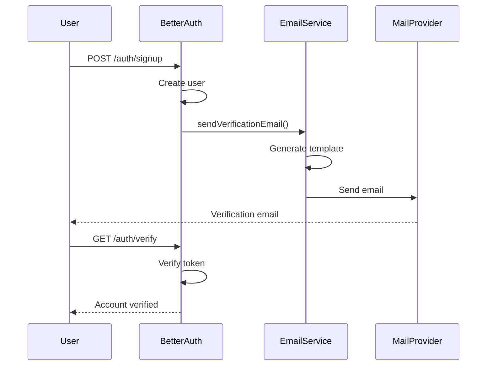

## Choix de la solution d'authentification

### Contraintes techniques identifiées

L'architecture multi-plateforme constitue le premier défi majeur. Le backoffice web et l'application mobile nécessitent des approches d'authentification potentiellement différentes, tout en maintenant une cohérence de sécurité. Cette contrainte m'a orienté vers la recherche d'une solution unifiée capable de s'adapter aux spécificités de chaque plateforme.

Le second défi concerne la scalabilité. Bien que DropIt commence avec un nombre limité d'utilisateurs, j'ai souhaité concevoir une architecture capable d'évoluer. Cette anticipation influence directement les choix d'authentification, notamment en favorisant les solutions stateless qui facilitent la montée en charge.

### Analyse comparative des solutions

#### Solution 1 : Développement from scratch

**Avantages dans le contexte DropIt :**
- Contrôle total sur l'implémentation et les fonctionnalités
- Adaptation parfaite aux besoins spécifiques du club d'haltérophilie
- Aucune dépendance externe ou coût de licensing

**Inconvénients majeurs :**
- Complexité de sécurisation : nécessite l'implémentation manuelle du stockage salé, PBKDF2/Argon2, rotation de clés
- Risque élevé de vulnérabilités par manque d'expertise en sécurité
- Temps de développement considérable pour des fonctionnalités non-différenciantes
- Maintenance et mise à jour des bonnes pratiques de sécurité à ma charge

#### Solution 2 : Librairie externe (Better-Auth)

**Avantages dans le contexte DropIt :**
- Sécurité éprouvée avec implémentation des standards actuels
- Gain de temps significatif sur le développement
- Documentation et communauté active
- Architecture hybride JWT/Sessions répondant aux besoins de révocation
- Support multi-plateforme natif (web/mobile)

**Inconvénients :**
- Dépendance à une librairie tierce
- Courbe d'apprentissage pour maîtriser l'écosystème Better-Auth
- Moins de flexibilité que le développement sur mesure

#### Solution 3 : Identity Provider externe (Auth0, Firebase, etc.)

**Avantages :**
- Sécurité de niveau enterprise
- Fonctionnalités avancées (SSO, authentification sociale)
- Maintenance déléguée au provider

**Inconvénients dans le contexte DropIt :**
- Coûts récurrents non justifiés pour un seul club
- Surdimensionné pour les besoins actuels
- Dépendance forte à un service tiers
- Complexité d'intégration pour des besoins simples

### Décision retenue

Le choix de Better-Auth s'impose comme le meilleur compromis pour DropIt, offrant la sécurité d'une solution éprouvée avec la flexibilité nécessaire pour s'adapter aux besoins spécifiques du projet.

## Détails d'implémentation Better-Auth

### Schémas de base de données

#### Modèle Conceptuel de Données (MCD)

TODO: Importer le schéma PNG du MCD Better-Auth

#### Rôles des entités

- **User** : Entité centrale stockant les informations utilisateur de base
- **AuthSession** : Gestion des sessions actives avec métadonnées de sécurité
- **AuthVerification** : Tokens temporaires pour vérification email et reset password
- **AuthAccount** : Support des providers OAuth (préparation future)

### Architecture hybride JWT/Sessions

#### Comparaison technique

| Aspect | JWT Pur | Sessions Traditionnelles | Hybride Better-Auth |
|--------|---------|-------------------------|-------------------|
| **Révocation** | ❌ Impossible | ✅ Immédiate | ✅ Immédiate |
| **Performance** | ✅ Stateless | ❌ Requête DB | ✅ Optimisé |
| **Scalabilité** | ✅ Horizontale | ❌ Sticky sessions | ✅ Horizontale |
| **Sécurité** | ⚠️ Exposition token | ✅ Serveur only | ✅ Double protection |

#### Fonctionnement de l'approche hybride

TODO: Importer le diagramme de séquence de l'architecture hybride JWT/Sessions

### Configuration complète du service

```typescript
// Configuration détaillée Better-Auth pour DropIt
export class AuthService implements OnModuleInit {
  private _auth: BetterAuth;

  async onModuleInit() {
    this._auth = betterAuth({
      // Sécurité de base
      secret: config.betterAuth.secret,
      trustedOrigins: config.betterAuth.trustedOrigins,

      // Base de données
      database: new Pool({
        connectionString: config.database.connectionString,
      }),

      // Authentification email/password
      emailAndPassword: {
        enabled: true,
        requireEmailVerification: true,
        sendResetPassword: async (data) => {
          await this.emailService.sendPasswordReset({
            to: data.user.email,
            resetLink: data.url,
            userName: data.user.name,
          });
        },
      },

      // Vérification email
      emailVerification: {
        sendOnSignUp: true,
        expiresIn: 60 * 60 * 24 * 10, // 10 jours
        sendVerificationEmail: async (data) => {
          await this.emailService.sendVerificationEmail({
            to: data.user.email,
            verificationLink: data.url,
            userName: data.user.name,
          });
        },
      },

      // Protection contre les attaques
      rateLimit: {
        window: 60, // 1 minute
        max: 5, // 5 tentatives max
      },

      // Configuration cookies
      cookies: {
        secure: process.env.NODE_ENV === 'production',
        httpOnly: true,
        sameSite: 'strict',
        maxAge: 60 * 60 * 24 * 7, // 7 jours
      },

      // Configuration JWT
      jwt: {
        expiresIn: 60 * 60 * 24, // 24 heures
      },

      // Plugins
      plugins: [
        openAPI(), // Documentation automatique
        organization({
          allowUserToCreateOrganization: false, // Seuls les admins créent des clubs
        }),
      ],

      // Hooks personnalisés
      hooks: {
        before: createAuthMiddleware(async (ctx) => {
          console.log(`[Auth] ${ctx.method} ${ctx.path}`);
        }),

        after: createAuthMiddleware(async (ctx) => {
          if (ctx.path === '/sign-up' && ctx.returned) {
            // Log des nouvelles inscriptions
            console.log(`[Auth] New user registered: ${ctx.returned.user?.email}`);
          }
        }),
      },
    });
  }

  get auth() {
    return this._auth;
  }

  get api() {
    return this._auth.api;
  }
}
```

### Intégration système d'email

#### Architecture de notification



#### Service d'email intégré

```typescript
@Injectable()
export class EmailService {
  constructor(private readonly mailer: MailerService) {}

  async sendVerificationEmail(data: VerificationEmailData) {
    return this.mailer.sendMail({
      to: data.to,
      subject: 'Vérifiez votre compte DropIt',
      template: 'verification',
      context: {
        userName: data.userName,
        verificationLink: data.verificationLink,
        clubName: 'Club Haltérophilie',
      },
    });
  }

  async sendPasswordReset(data: PasswordResetData) {
    return this.mailer.sendMail({
      to: data.to,
      subject: 'Réinitialisation de votre mot de passe',
      template: 'password-reset',
      context: {
        userName: data.userName,
        resetLink: data.resetLink,
        expiryTime: '24 heures',
      },
    });
  }
}
```

### Configuration côté clients

#### Client web (React)

```typescript
// Configuration client web
import { createAuthClient } from "@better-auth/react";

export const authClient = createAuthClient({
  baseURL: process.env.NEXT_PUBLIC_API_URL,

  // Configuration cookies automatique
  fetchOptions: {
    credentials: 'include',
  },
});

// Hook d'usage
export function useAuth() {
  const { data: session, isPending } = useSession();

  return {
    user: session?.user,
    isAuthenticated: !!session,
    isLoading: isPending,
  };
}
```

#### Client mobile (Expo)

```typescript
// Configuration client mobile
import { createAuthClient } from "@better-auth/react";
import { expoClient } from "@better-auth/expo/client";
import * as SecureStore from "expo-secure-store";

export const authClient = createAuthClient({
  baseURL: process.env.EXPO_PUBLIC_API_URL,

  plugins: [
    expoClient({
      scheme: "dropit",
      storagePrefix: "dropit-auth",
      storage: SecureStore,

      // Configuration deep linking
      linking: {
        prefixes: ["dropit://"],
        config: {
          screens: {
            AuthCallback: "auth/callback",
          },
        },
      },
    }),
  ],
});
```

### Sécurisation avancée

#### Protection CSRF et XSS

```typescript
// Middleware de sécurité personnalisé
const securityMiddleware = createAuthMiddleware(async (ctx) => {
  // Vérification origin pour CSRF
  const origin = ctx.headers.get('origin');
  const referer = ctx.headers.get('referer');

  if (origin && !config.betterAuth.trustedOrigins.includes(origin)) {
    throw new Error('Invalid origin');
  }

  // Headers de sécurité
  ctx.responseHeaders.set('X-Content-Type-Options', 'nosniff');
  ctx.responseHeaders.set('X-Frame-Options', 'DENY');
  ctx.responseHeaders.set('X-XSS-Protection', '1; mode=block');
});
```

#### Audit et monitoring

```typescript
// Table d'audit automatique
@Entity('auth_audit_log')
export class AuthAuditLog {
  @PrimaryKey()
  id!: string;

  @Property()
  userId?: string;

  @Property()
  action!: string; // login, logout, signup, etc.

  @Property()
  ipAddress!: string;

  @Property()
  userAgent!: string;

  @Property()
  success!: boolean;

  @Property()
  createdAt = new Date();
}
```

Cette implémentation complète me fournit une base d'authentification robuste, conforme aux standards de sécurité actuels, et adaptée aux besoins évolutifs de DropIt. 


