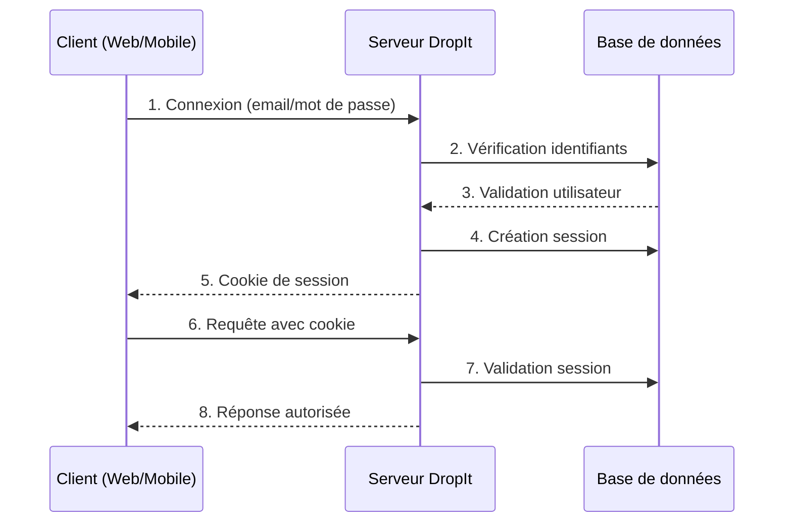
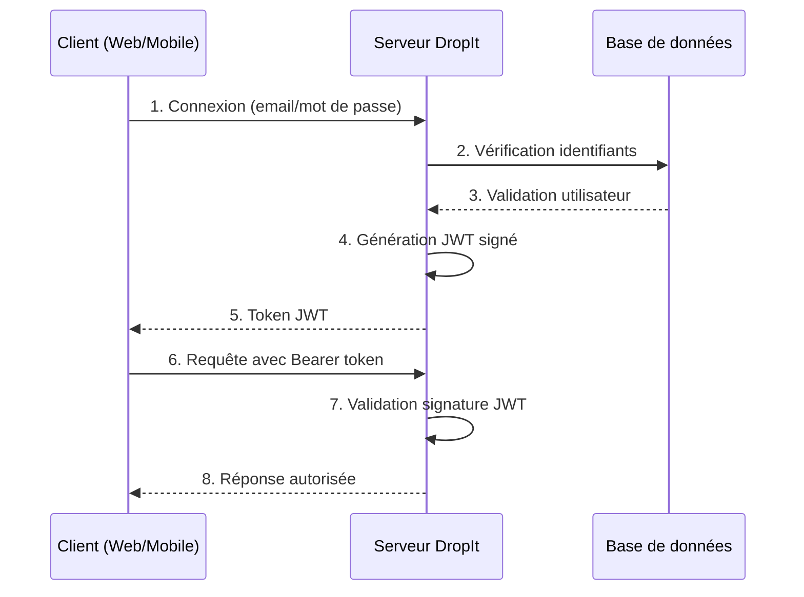
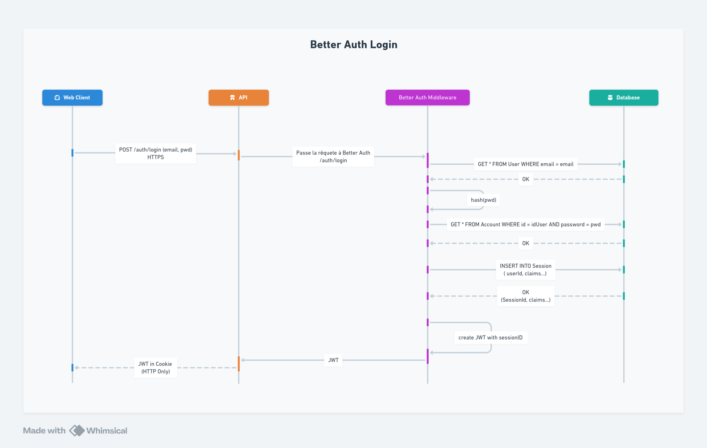
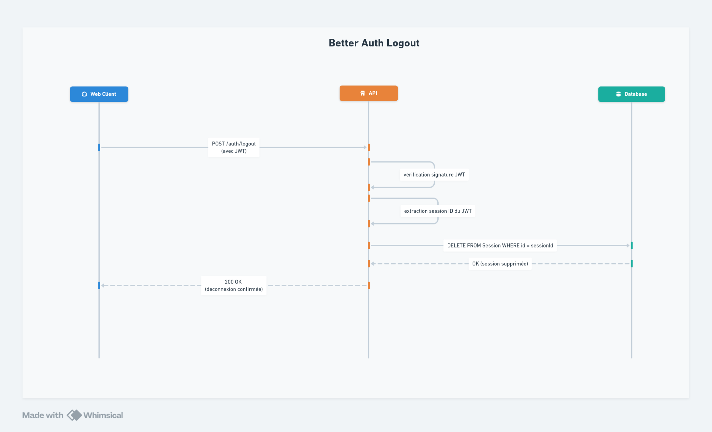
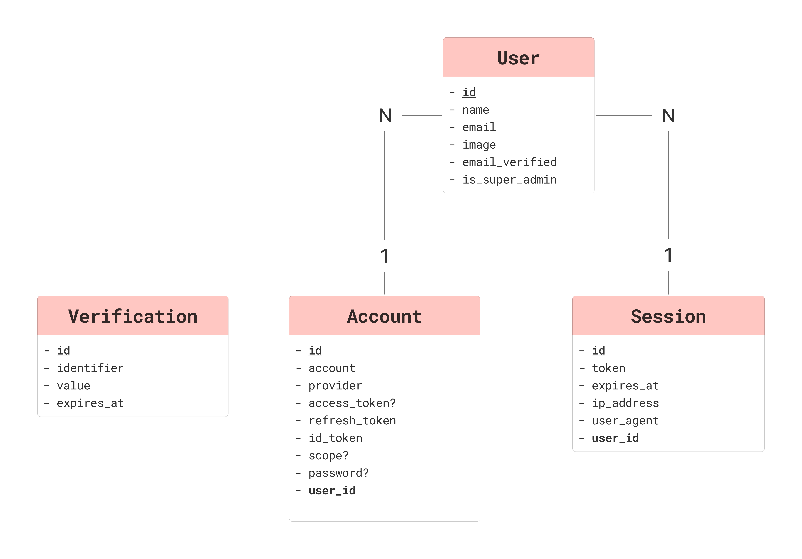

L'architecture multi-plateforme de DropIt impose des contraintes spécifiques : cookies HttpOnly pour le web et stockage sécurisé natif pour mobile. La contrainte de révocation immédiate constitue un besoin métier essentiel: un coach doit pouvoir suspendre instantanément l'accès d'un athlète sans attendre l'expiration d'un token.

## Analyse comparative des solutions

### Solution 1 : Développement from scratch

**Analyse technique détaillée :**

Cette approche nécessiterait d'implémenter manuellement le hachage sécurisé, la génération de tokens, la gestion des sessions, les protections CSRF/XSS et le rate limiting.

**Évaluation pour DropIt :**

**Avantages :**
- **Contrôle total** : adaptation précise aux besoins métier du club
- **Aucune dépendance** : pas de risque de discontinuité de service tiers

**Inconvénients :**
- **Expertise sécurité requise** : risque de vulnérabilités par méconnaissance des bonnes pratiques
- **Temps de développement** : 3-4 semaines estimées vs 1 semaine avec librairie
- **Maintenance continue** : veille sécuritaire et mises à jour à ma charge

### Solution 2 : Librairie externe (Better-Auth)

**Analyse technique détaillée :**

Better-Auth propose une architecture hybride sessions + JWT résolvant les limitations des approches pures, avec support multi-plateforme natif, sécurité intégrée et extensibilité via plugins.

**Évaluation pour DropIt :**

**Avantages :**
- **Réponse aux contraintes** : révocation immédiate + multi-plateforme
- **Sécurité éprouvée** : protection contre les vulnérabilités courantes (injection, XSS, CSRF), communauté active
- **Productivité** : 1 semaine d'implémentation vs 3-4 semaines from scratch
- **Évolutivité** : plugins pour futures fonctionnalités (OAuth, 2FA)

**Points d'attention :**
- **Dépendance externe** : mais librairie open-source avec communauté active
- **Courbe d'apprentissage** : 2-3 jours pour maîtriser l'API

### Solution 3 : Identity Provider externe (Auth0, Firebase, etc.)

**Analyse technique détaillée :**

Les IdP externes offrent sécurité enterprise, fonctionnalités avancées et scalabilité garantie avec maintenance déléguée.

**Évaluation pour DropIt :**

**Avantages :**
- **Sécurité enterprise** : niveau de sécurité maximal
- **Zéro maintenance** : pas de gestion technique côté développeur

**Inconvénients :**
- **Coût prohibitif** : ~50€/mois pour 100 utilisateurs vs gratuit avec Better-Auth
- **Vendor lock-in** : migration complexe en cas de changement
- **Surdimensionné** : fonctionnalités enterprise non nécessaires pour un club
- **Complexité d'intégration** : configuration OAuth, gestion des redirections

### Décision retenue

Au regard de l'analyse comparative, Better-Auth répond de manière optimale aux contraintes spécifiques de DropIt. La solution from scratch présenterait des risques sécuritaires importants et un coût de développement disproportionné pour un projet de cette envergure. Les Identity Providers externes, bien que techniquement excellents, introduisent des coûts récurrents incompatibles avec le budget d'un club de sport et des fonctionnalités surdimensionnées.

Better-Auth offre le niveau de sécurité requis tout en répondant précisément aux contraintes identifiées : révocation immédiate via l'architecture hybride, support natif multi-plateforme pour React et React Native, et extensibilité via le système de plugins pour les évolutions futures (2FA, OAuth). Le temps d'implémentation réduit (1 semaine) me permet de me concentrer sur la valeur métier de l'application plutôt que sur l'infrastructure d'authentification.

Cette décision s'appuie sur une évaluation pragmatique du rapport bénéfice/coût/risque dans le contexte spécifique de DropIt, privilégiant la sécurité et la productivité sans sur-ingénierie.

---

## Implémentation des décorateurs

```typescript
/**
 * Décorateur pour marquer une route comme publique (accessible sans authentification)
 */
export const Public = () => SetMetadata('PUBLIC', true);

/**
 * Décorateur pour marquer une route comme optionnelle (accessible avec ou sans authentification)
 */
export const Optional = () => SetMetadata('OPTIONAL', true);

/**
 * Décorateur pour injecter la session dans un contrôleur
 */
export const Session = createParamDecorator(
  (_data: unknown, context: ExecutionContext) => {
    const request = context.switchToHttp().getRequest();
    return request.session;
  }
);

/**
 * Décorateur pour injecter l'utilisateur connecté dans un contrôleur
 */
export const CurrentUser = createParamDecorator(
  (_data: unknown, context: ExecutionContext) => {
    const request = context.switchToHttp().getRequest();
    return request.user;
  }
);
```

Ces décorateurs permettent d'annoter les routes avec des métadonnées de sécurité (`@Public()`, `@Optional()`) et d'injecter directement les données d'authentification dans les paramètres de méthode (`@CurrentUser()`, `@Session()`).

## Implémentation du Guard

Le Guard AuthGuard implémente la logique de sécurité qui s'exécute avant chaque route pour valider l'authentification selon les métadonnées définies par les décorateurs.

```typescript
@Injectable()
export class AuthGuard implements CanActivate {
  constructor(
    private readonly reflector: Reflector,
    private readonly authService: AuthService
  ) {}

  async canActivate(context: ExecutionContext): Promise<boolean> {
    const request = context.switchToHttp().getRequest();

    try {
      // Récupération de la session via Better-Auth
      const session = await this.authService.api.getSession({
        headers: fromNodeHeaders(request.headers),
      });

      // Injection session et utilisateur dans la requête
      request.session = session;
      request.user = session?.user ?? null;

      // Vérification des métadonnées de route
      const isPublic = this.reflector.get('PUBLIC', context.getHandler());
      const isOptional = this.reflector.get('OPTIONAL', context.getHandler());

      if (isPublic) return true;
      if (isOptional && !session) return true;

      if (!session) {
        throw new UnauthorizedException('You must be logged in to access this resource');
      }

      return true;
    } catch (error) {
      throw new UnauthorizedException('Authentication failed');
    }
  }
}
```

Le Guard utilise le service `Reflector` de NestJS pour lire les métadonnées ajoutées par les décorateurs et adapter son comportement selon le niveau de sécurité requis pour chaque route.

## Exemple d'usage concret

Cet exemple illustre l'utilisation concrète des décorateurs et Guards dans un contrôleur de l'API DropIt.

```typescript
@Controller()
export class WorkoutController {
  constructor(
    private readonly workoutUseCases: WorkoutUseCases
  ) {}

  getWorkouts(@CurrentUser() user: AuthenticatedUser) {
    return this.workoutUseCases.getWorkouts(organizationId, user.id);
  }
}
```

Cet exemple montre l'`AuthGuard` global vérifiant l'authentification, le décorateur `@CurrentUser()` injectant l'utilisateur connecté, et l'absence de `@Public()` rendant l'authentification obligatoire pour cette route.

---

## Étude comparative des solutions d'authentification

Cette section détaille la comparaison technique JWT vs Sessions mentionnée dans la page d'implémentation. Bien que Better-Auth impose une architecture hybride, cette analyse démontre ma compréhension des différentes approches d'authentification moderne et justifie pourquoi l'hybride constitue la meilleure solution.

### Sessions

L'authentification par sessions constitue l'approche classique où le serveur maintient l'état de connexion de chaque utilisateur. Cette méthode **stateful** implique que le serveur stocke les informations de session en mémoire ou en base de données, créant un état persistant côté serveur.



**Analyse technique détaillée :**

**Avantages :**
- **Révocation immédiate** : suppression de la session en base = déconnexion instantanée
- **Sécurité renforcée** : les données sensibles restent côté serveur
- **Contrôle total** : gestion fine des sessions actives, détection d'activités suspectes
- **Simplicité conceptuelle** : mécanisme bien maîtrisé et documenté

**Limitations pour DropIt :**

L'architecture multi-plateforme pose un défi majeur car React Native ne gère pas nativement les cookies HttpOnly, rendant difficile la sécurisation des sessions mobiles.

La scalabilité horizontale nécessite de résoudre le problème du partage d'état entre serveurs. Deux solutions existent : les "sticky sessions" qui forcent un utilisateur à toujours utiliser le même serveur (créant un point de défaillance unique), ou un stockage de sessions partagé comme Redis (ajoutant une couche d'infrastructure).

Les performances sont impactées par la nécessité de vérifier chaque session en base de données à chaque requête, contrairement aux JWT qui se valident localement. Enfin, la gestion des sessions expirées requiert un mécanisme de nettoyage automatique pour éviter l'accumulation de données obsolètes.

### JWT

Les JSON Web Tokens représentent une approche **stateless** où le serveur ne stocke aucune information de session. Chaque token contient toutes les données nécessaires à sa validation, signées cryptographiquement pour garantir leur intégrité.

**Structure technique d'un JWT :**
Un JWT se compose de trois parties séparées par des points :
- **Header** : algorithme de signature (HMAC SHA256, RSA256)
- **Payload** : données utilisateur (userId, rôles, expiration)
- **Signature** : hash cryptographique pour vérifier l'intégrité 



**Analyse technique détaillée :**

**Avantages :**
- **Performance optimale** : validation locale sans requête en base de données
- **Scalabilité horizontale** : aucun état partagé entre serveurs
- **Multi-plateforme natif** : compatible web et mobile via header Authorization
- **Transport d'informations** : payload inclut rôles et permissions, réduisant les appels API
- **Standard ouvert** : RFC 7519, interopérabilité garantie

**Exemple de payload DropIt :**
```json
{
  "userId": "123",
  "role": "coach",
  "organizationId": "club-paris",
  "permissions": ["read:workouts", "write:athletes"],
  "exp": 1609459200,
  "iat": 1609455600
}
```

**Limitations :**

Le problème majeur des JWT réside dans l'impossibilité de révocation avant l'expiration naturelle. Une fois émis, un token reste valide même si l'utilisateur doit être immédiatement déconnecté, ce qui pose un risque sécuritaire inacceptable pour DropIt.

Le stockage côté client introduit des vulnérabilités : localStorage expose les tokens aux attaques XSS, tandis que les cookies sans HttpOnly restent accessibles au JavaScript malveillant. La taille des tokens peut également impacter les performances réseau, particulièrement sur mobile avec des payloads volumineux contenant de nombreuses permissions.

Enfin, la rotation des clés de signature nécessite une infrastructure complexe pour maintenir la compatibilité avec les tokens existants tout en renouvelant régulièrement les secrets cryptographiques.

### Architecture hybride JWT/Sessions

L'architecture hybride de Better-Auth combine intelligemment les avantages des deux approches pour résoudre leurs limitations respectives. Cette solution constitue l'évolution logique des systèmes d'authentification modernes.

Better-Auth génère simultanément :
1. **Un JWT** pour la validation rapide des requêtes API
2. **Une session en base** pour permettre la révocation immédiate

Le JWT contient les informations nécessaires à l'autorisation (rôles, permissions) tandis que la session en base maintient l'état de validité du token. À chaque requête, le serveur vérifie d'abord la signature JWT puis contrôle l'existence de la session associée.

Better-Auth optimise les performances en ne vérifiant pas systématiquement la session en base à chaque requête. La vérification s'effectue selon plusieurs critères configurables :

**Critères de vérification en base :**
- **Intervalle temporel** : par défaut toutes les 5 minutes depuis la dernière vérification
- **Actions sensibles** : changement de mot de passe, modification de permissions
- **Premier accès** : à la connexion initiale pour valider l'existence de la session

**Implémentation dans Better-Auth :**
```typescript
// Configuration de la fréquence de vérification
export const auth = betterAuth({
  session: {
    maxAge: 7 * 24 * 60 * 60, // 7 jours
    updateAge: 5 * 60, // Vérification DB toutes les 5 minutes
  }
});

// Dans le Guard NestJS
const session = await this.authService.api.getSession({
  headers: fromNodeHeaders(request.headers),
  // Better-Auth vérifie automatiquement selon updateAge
});
```

Cette approche combine la rapidité des JWT (validation locale de la signature) avec la sécurité des sessions (vérification périodique en base). Entre les vérifications, seule la signature cryptographique est contrôlée, garantissant des performances optimales tout en conservant la capacité de révocation.

### Séquences d'authentification Better-Auth

**1. Processus de connexion (Login)**



Ce diagramme illustre la génération simultanée du JWT et de la session en base. Better-Auth gère automatiquement la vérification des credentials, la création de la session en PostgreSQL, et la génération du token signé renvoyé au client. L'architecture hybride se met en place dès cette étape.

**2. Processus de déconnexion (Logout)**



La déconnexion démontre l'avantage de l'architecture hybride : la suppression de la session en base invalide immédiatement l'accès, même si le JWT reste techniquement valide côté client. Cette révocation immédiate répond à l'exigence critique identifiée pour DropIt.

**3. Accès à une ressource protégée**


Ce diagramme illustre l'optimisation des performances : Better-Auth vérifie d'abord la signature JWT (rapide, local) puis contrôle la session en base uniquement selon les critères configurés (intervalle de 5 minutes, actions sensibles). Cette approche combine rapidité et sécurité.

---

## Modèle Logique de Données Better-Auth

Bien que Better-Auth génère automatiquement ses structures de base de données, cette modélisation MLD selon la méthode Merise démontre ma compréhension de l'architecture relationnelle sous-jacente et ma capacité à analyser un schéma existant.



**Analyse des relations :**
- **User** : Entité centrale stockant identifiants et données de profil
- **Session** : Relation (1,n) avec User, stocke token, expiration et métadonnées de sécurité
- **Verification** : Tokens temporaires (1,n) pour vérification email et réinitialisation
- **Account** : Support OAuth futurs, relation (0,n) avec User

--- 

## Configuration côté clients de Better-Auth

Cette section détaille les configurations multi-plateforme mentionnées dans la page d'implémentation. Les exemples concrets montrent comment Better-Auth s'adapte automatiquement aux spécificités de chaque environnement (cookies HttpOnly pour le web, stockage sécurisé pour mobile) tout en maintenant une API unifiée.

### Client web (React)

```tsx
// Configuration client web
import { createAuthClient } from "@better-auth/react";

export const authClient = createAuthClient({
  baseURL: process.env.NEXT_PUBLIC_API_URL,

  // Configuration cookies automatique
  fetchOptions: {
    credentials: 'include',
  },
});

// Hook d'usage
export function useAuth() {
  const { data: session, isPending } = useSession();

  return {
    user: session?.user,
    isAuthenticated: !!session,
    isLoading: isPending,
  };
}
```

**Configuration web :** `credentials: 'include'` pour l'envoi automatique des cookies HttpOnly. Better-Auth sécurise automatiquement les cookies (Secure, SameSite).

### Client mobile (Expo)

```typescript
// Configuration client mobile
import { createAuthClient } from "@better-auth/react";
import { expoClient } from "@better-auth/expo/client";
import * as SecureStore from "expo-secure-store";

export const authClient = createAuthClient({
  baseURL: process.env.EXPO_PUBLIC_API_URL,

  plugins: [
    expoClient({
      scheme: "dropit",
      storagePrefix: "dropit-auth",
      storage: SecureStore,

      // Configuration deep linking
      linking: {
        prefixes: ["dropit://"],
        config: {
          screens: {
            AuthCallback: "auth/callback",
          },
        },
      },
    }),
  ],
});
```

**Configuration mobile :** Plugin `expoClient` avec stockage sécurisé via `expo-secure-store` (Keychain iOS/EncryptedSharedPreferences Android). Deep linking `dropit://` pour futures redirections OAuth.

---

## Mécanismes de sécurité avancés

Cette section détaille les mécanismes de protection CSRF/XSS mentionnés dans les pages conception et implémentation. Ces fonctionnalités automatiques de Better-Auth renforcent la sécurité de l'authentification dans DropIt.

### Protection CSRF et XSS automatique

```typescript
// Middleware de sécurité personnalisé
const securityMiddleware = createAuthMiddleware(async (ctx) => {
  // Vérification origin pour CSRF
  const origin = ctx.headers.get('origin');
  const referer = ctx.headers.get('referer');

  if (origin && !config.betterAuth.trustedOrigins.includes(origin)) {
    throw new Error('Invalid origin');
  }

  // Headers de sécurité
  ctx.responseHeaders.set('X-Content-Type-Options', 'nosniff');
  ctx.responseHeaders.set('X-Frame-Options', 'DENY');
  ctx.responseHeaders.set('X-XSS-Protection', '1; mode=block');
});
```

**Détail des protections implémentées :**

**Protection CSRF automatique :** Better-Auth génère automatiquement des tokens double-submit pour chaque requête POST/PUT/DELETE. Un token est envoyé dans le cookie (inaccessible en JavaScript grâce à HttpOnly) et un autre dans le header de la requête. Le serveur valide que les deux tokens correspondent, empêchant un site malveillant de forger des requêtes au nom de l'utilisateur.

**Protection XSS via cookies HttpOnly :** Les tokens de session ne sont accessibles qu'au serveur, pas au JavaScript côté client. Même si un attaquant injecte du code malveillant dans la page, il ne peut pas voler le token de session.

**Headers de sécurité complémentaires :**
- `X-Frame-Options: DENY` prévient le **clickjacking** : empêche l'intégration de DropIt dans une iframe malveillante où l'attaquant pourrait superposer des éléments invisibles pour tromper l'utilisateur
- `X-Content-Type-Options: nosniff` empêche l'**injection de contenu** : force le navigateur à respecter le Content-Type déclaré et bloque l'exécution de fichiers JavaScript déguisés en images
- `X-XSS-Protection: 1; mode=block` active la protection XSS native du navigateur qui bloque l'exécution de scripts suspects

### Métadonnées de session pour le monitoring

La table `Session` de Better-Auth stocke automatiquement certaines métadonnées utiles pour le monitoring de sécurité :

**Détection d'anomalies :** Les métadonnées IP et User-Agent enregistrées dans chaque session permettent d'identifier des connexions suspectes (nouvelle localisation, nouveau navigateur) pour alerter l'utilisateur ou déclencher des vérifications additionnelles.

**Informations stockées :** Chaque session enregistre l'adresse IP d'origine, le User-Agent du client, ainsi que les timestamps de création et d'expiration. Ces informations constituent une base pour implémenter des fonctionnalités de monitoring de sécurité.