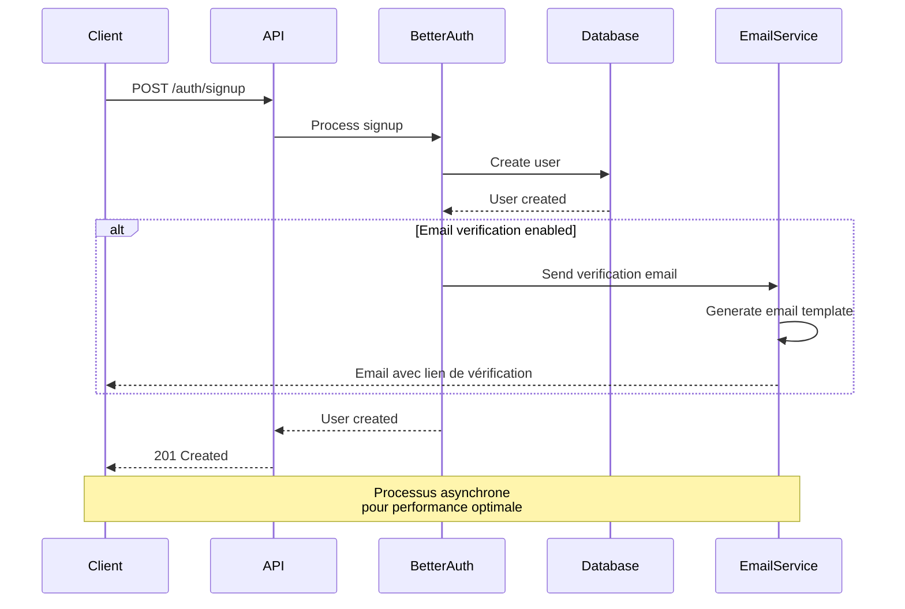

TODO : Faire une presentation des forces et faiblesses de chacune des méthodes d'une manière générale et des besoin au sein de dropit

Notes:
Exige de ré-implémenter : stockage salé, PBKDF2/argon2, rotation de clés privée
IDP = Identity Provider
SSO = Single Sign-On
- Idéal si le club devient SaaS pour plusieurs fédés ; inutile aujourd’hui.
Surdimensionné et payant en maintenance pour un seul club.

### Contraintes techniques

L'architecture multi-plateforme constitue le premier défi majeur. Le backoffice web et l'application mobile nécessitent des approches d'authentification potentiellement différentes, tout en maintenant une cohérence de sécurité. Cette contrainte m'a orienté vers la recherche d'une solution unifiée capable de s'adapter aux spécificités de chaque plateforme.

Le second défi concerne la scalabilité. Bien que DropIt commence avec un nombre limité d'utilisateurs, j'ai souhaité concevoir une architecture capable d'évoluer. Cette anticipation influence directement les choix d'authentification, notamment en favorisant les solutions stateless qui facilitent la montée en charge. Contrairement aux sessions traditionnelles qui nécessitent un stockage serveur et compliquent la répartition de charge entre plusieurs instances, les solutions stateless permettent à chaque serveur de valider indépendamment les tokens sans coordination centralisée, simplifiant ainsi l'ajout de nouvelles instances selon les besoins. 

### From Scratch

### Libraire externe

### Délégation à un identity provider


## Annexes d'implémentations Better auth 

## Configuration et service principal

### Implémentation du service Better-Auth

Le cœur du système d'authentification réside dans le service Better-Auth que j'ai configuré pour répondre aux besoins spécifiques de DropIt. Parler aussi du systeme d'email, à quoi il sert? 

```typescript
// Configuration Better-Auth adaptée à DropIt
this._auth = betterAuth({
  secret: config.betterAuth.secret,
  trustedOrigins: config.betterAuth.trustedOrigins,
  
  // Authentification email/password adaptée au contexte club
  emailAndPassword: {
    enabled: true,
    sendResetPassword: async (data) => {
      // Intégration avec le service email pour réinitialisation
      await this.emailService.sendPasswordReset(data);
    },
  },
  
  // Vérification email pour sécuriser les comptes
  emailVerification: {
    sendOnSignUp: true,
    expiresIn: 60 * 60 * 24 * 10, // 10 jours - adapté aux habitudes utilisateur
    sendVerificationEmail: async (data) => {
      await this.emailService.sendVerificationEmail(data);
    },
  },
  
  // Connexion PostgreSQL pour cohérence avec l'architecture
  database: new Pool({
    connectionString: config.database.connectionString,
  }),
  
  // Configuration rate limiting pour protection DDoS
  rateLimit: {
    window: 50,
    max: 100,
  },
  
  // Hooks personnalisés pour logique métier DropIt
  hooks: {
    before: createAuthMiddleware(async (ctx) => {
      // Hook de pré-traitement pour logs et validation
    }),
  },
  
  plugins: [openAPI()], // Documentation automatique des endpoints
});
```

### Intégration avec le système d'email

L'intégration du système d'email avec Better-Auth facilite la gestion des notifications d'authentification. Cette implémentation prépare l'évolution vers des communications plus riches (notifications push, SMS). Le détail de cette intégration est disponible dans les [Annexes authentification](/annexes/authentifications/).





