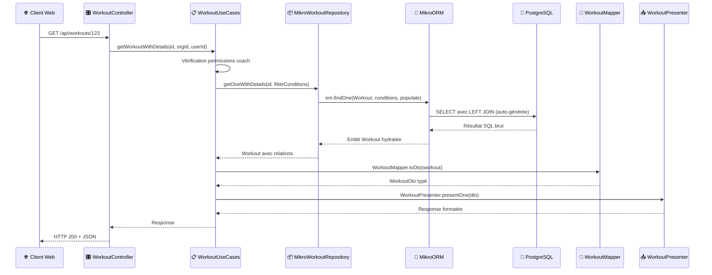

## Comparaison des approches d'implémentation

### Database First

Cette approche aurait consisté à créer directement les tables PostgreSQL via des scripts SQL, puis générer les entités TypeScript à partir du schéma existant. Voici comment j'aurais pu créer la table `workout` :

```sql
CREATE TABLE workout (
    id UUID PRIMARY KEY DEFAULT gen_random_uuid(),
    title VARCHAR(255) NOT NULL,
    description TEXT NOT NULL,
    category_id UUID NOT NULL,
    created_by UUID,
    created_at TIMESTAMP DEFAULT NOW(),
    updated_at TIMESTAMP DEFAULT NOW(),
    FOREIGN KEY (category_id) REFERENCES workout_category(id),
    FOREIGN KEY (created_by) REFERENCES users(id)
);

-- Table de jointure polymorphe pour les éléments de workout
CREATE TABLE workout_element (
    id UUID PRIMARY KEY DEFAULT gen_random_uuid(),
    workout_id UUID NOT NULL,
    type VARCHAR(20) NOT NULL CHECK (type IN ('exercise', 'complex')),
    exercise_id UUID,
    complex_id UUID,
    order_position INTEGER NOT NULL,
    sets INTEGER DEFAULT 1,
    reps INTEGER DEFAULT 1,
    rest INTEGER,
    start_weight_percent DECIMAL(5,2),
    FOREIGN KEY (workout_id) REFERENCES workout(id) ON DELETE CASCADE,
    FOREIGN KEY (exercise_id) REFERENCES exercise(id),
    FOREIGN KEY (complex_id) REFERENCES complex(id),
    CONSTRAINT check_one_element_type CHECK (
        (type = 'exercise' AND exercise_id IS NOT NULL AND complex_id IS NULL) OR
        (type = 'complex' AND complex_id IS NOT NULL AND exercise_id IS NULL)
    )
);
```

**Avantages** :
- Contrôle total sur la structure de la base de données
- Performances optimales grâce à la maîtrise fine des index et contraintes

**Inconvénients** :
- Synchronisation problématique entre schéma de base de données et code applicatif
- Maintenance complexe des migrations
- Risque de divergence entre environnements

### Schema First

Une approche intermédiaire utilise un fichier de définition de schéma central pour générer à la fois la base de données et les entités TypeScript.

**Avantages** :
- Source de vérité unique
- Résout les problèmes de cohérence de l'approche Database First

**Inconvénients** :
- Redondance avec les schémas Zod existants dans le monorepo
- Intégration native TypeScript compromise
- Complexité de maintenance accrue

### Code First

J'ai retenu l'approche Code First qui définit les entités directement en TypeScript avec les décorateurs MikroORM.

**Avantages** :
- Intégration native dans l'écosystème du monorepo
- Génération automatique des migrations
- Auto-complétion et vérification de types TypeScript
- Cohérence technique complète avec les packages partagés

## Exemples complets d'entités MikroORM

### Structure type d'une entité

```typescript
@Entity()
export class Workout {
  @PrimaryKey({ type: 'uuid', defaultRaw: 'gen_random_uuid()' })
  id!: string;

  @Property()
  title!: string;

  @Property()
  description!: string;

  @ManyToOne(() => WorkoutCategory)
  category!: WorkoutCategory;

  @ManyToOne(() => User, { nullable: true })
  createdBy!: User | null;

  @OneToMany(() => WorkoutElement, (element) => element.workout)
  elements = new Collection<WorkoutElement>(this);

  @Property({ onCreate: () => new Date() })
  createdAt: Date = new Date();

  @Property({ onUpdate: () => new Date() })
  updatedAt: Date = new Date();
}
```

Cette entité `Workout` illustre plusieurs patterns adoptés systématiquement :

- **Identifiants UUID** : L'utilisation de `gen_random_uuid()` évite les conflits lors des synchronisations entre environnements
- **Relations typées** : Les décorateurs `@ManyToOne` et `@OneToMany` établissent les relations avec typage strict
- **Collections MikroORM** : Le type `Collection<T>` encapsule la logique de chargement paresseux
- **Timestamps automatiques** : Les propriétés `createdAt` et `updatedAt` s'actualisent automatiquement

### Gestion des relations polymorphes

```typescript
@Entity()
@Check({
  name: 'check_one_element_type',
  expression: `
    (type = 'exercise' AND exercise_id IS NOT NULL AND complex_id IS NULL) OR
    (type = 'complex' AND complex_id IS NOT NULL AND exercise_id IS NULL)
  `,
})
export class WorkoutElement {
  @Enum({ items: () => Object.values(WORKOUT_ELEMENT_TYPES) })
  type!: WorkoutElementType;

  @ManyToOne(() => Exercise, { nullable: true })
  exercise?: Exercise;

  @ManyToOne(() => Complex, { nullable: true })
  complex?: Complex;

  @Property()
  sets!: number;

  @Property()
  reps!: number;
  
  // Autres propriétés communes...
}
```

Le décorateur `@Check` traduit la contrainte logique en contrainte PostgreSQL, garantissant l'intégrité des données même en cas d'accès direct à la base.

## Architecture en couches détaillée

### Structure du projet backend

```markdown
apps/api/src/
├── modules/                   # Modules métier organisés par domaine
│   ├── identity/              # Authentification, autorisation, organisations
│   │   ├── domain/            # Entités métier et règles business
│   │   ├── application/       # Use cases et services applicatifs
│   │   ├── infrastructure/    # Implémentations (repositories, services)
│   │   └── interface/         # Controllers, DTOs, guards
│   ├── training/              # Gestion des entraînements et exercices
│   │   ├── domain/            # Modèle métier de l'entraînement
│   │   ├── application/
│   │   │   ├── use-cases/     # Logique applicative
│   │   │   └── ports/         # Interfaces des repositories
│   │   ├── infrastructure/    # Implémentations MikroORM
│   │   └── interface/         # API REST et validation
│   └── athletes/              # Gestion des athlètes
├── config/                    # Configuration centralisée
├── seeders/                   # Données de test et d'initialisation
└── main.ts                    # Point d'entrée de l'application
```

Cette architecture backend constitue un bon terrain pour les principes du Domain-Driven Design et de l'architecture hexagonale dans un contexte concret. L'approche par ports et adaptateurs que j'ai adoptée garantit une flexibilité future non négligeable : si demain je souhaite migrer vers un autre ORM ou une base de données différente, cette transition pourra s'effectuer sans remettre en cause la logique métier, aspect crucial pour la maintenabilité à long terme d'un projet qui évoluera au-delà de ma formation.

### Diagramme de l'architecture

```markdown
┌─────────────────────────────────────────────────────────────┐
│                    🌐 Interface Layer                        │
│                                                             │
│  ┌─────────────────┐ ┌─────────────────┐ ┌─────────────────┐│
│  │ Controllers REST│ │ Guards &        │ │ DTOs &          ││
│  │                 │ │ Middlewares     │ │ Validators      ││
│  └─────────────────┘ └─────────────────┘ └─────────────────┘│
└─────────────────────────────────────────────────────────────┘
                                │
                                ▼
┌─────────────────────────────────────────────────────────────┐
│                   📋 Application Layer                      │
│                                                             │
│  ┌─────────────────┐           ┌─────────────────┐          │
│  │ Use Cases       │           │ Services        │          │
│  │                 │           │ Applicatifs     │          │
│  └─────────────────┘           └─────────────────┘          │
└─────────────────────────────────────────────────────────────┘
                                │
                                ▼
┌─────────────────────────────────────────────────────────────┐
│                      💎 Domain Layer                        │
│                                                             │
│  ┌─────────────────┐ ┌─────────────────┐ ┌─────────────────┐│
│  │ Entités Métier  │ │ Règles Business │ │ Ports/Interfaces││
│  │                 │ │                 │ │                 ││
│  └─────────────────┘ └─────────────────┘ └─────────────────┘│
└─────────────────────────────────────────────────────────────┘
                                │
                                ▼
┌─────────────────────────────────────────────────────────────┐
│                   🔧 Infrastructure Layer                   │
│                                                             │
│  ┌─────────────────┐ ┌─────────────────┐ ┌─────────────────┐│
│  │ Repositories    │ │ Services        │ │ Adaptateurs     ││
│  │ MikroORM        │ │ Externes        │ │                 ││
│  └─────────────────┘ └─────────────────┘ └─────────────────┘│
└─────────────────────────────────────────────────────────────┘
```

### Interface Layer : exposition HTTP

#### Controllers avec exemples complets

```typescript
@UseGuards(PermissionsGuard) // 1. Garde globale sur toutes les méthodes
@Controller()
export class WorkoutController {
  
  @TsRestHandler(c.getWorkout) // 2. Respect du contrat ts-rest
  @RequirePermissions('read')  // 3. Permission spécifique requise
  getWorkout(
    @CurrentOrganization() organizationId: string, // 4. Extraction contexte organisation
    @CurrentUser() user: AuthenticatedUser         // 5. Extraction utilisateur authentifié
  ): ReturnType<typeof tsRestHandler<typeof c.getWorkout>> {
    return tsRestHandler(c.getWorkout, async ({ params }) => {
      // 6. Délégation immédiate vers la logique métier
      return await this.workoutUseCases.getWorkoutWithDetails(params.id, organizationId, user.id);
    });
  }

  @TsRestHandler(c.createWorkout)
  @RequirePermissions('create') // Permission différente pour la création
  createWorkout(
    @CurrentOrganization() organizationId: string,
    @CurrentUser() user: AuthenticatedUser
  ): ReturnType<typeof tsRestHandler<typeof c.createWorkout>> {
    return tsRestHandler(c.createWorkout, async ({ body }) => {
      return await this.workoutUseCases.createWorkout(body, organizationId, user.id);
    });
  }
}
```

Le controller orchestre plusieurs mécanismes de sécurité en cascade :

- **Niveau 1 - Authentification** : Le `PermissionsGuard` vérifie que l'utilisateur possède un token valide
- **Niveau 2 - Isolation organisationnelle** : Le décorateur `@CurrentOrganization()` garantit l'accès uniquement aux ressources de l'organisation
- **Niveau 3 - Permissions granulaires** : `@RequirePermissions('read')` vérifie les droits spécifiques
- **Niveau 4 - Contrat d'API** : `@TsRestHandler(c.getWorkout)` assure la type safety

#### Mappers avec exemples

```typescript
export const WorkoutMapper = {
  toDto(workout: Workout): WorkoutDto {
    return {
      id: workout.id,
      title: workout.title,
      workoutCategory: workout.category.name, // Simplification : juste le nom au lieu de l'objet complet
      description: workout.description,
      elements: workout.elements.getItems().map(/* transformation des éléments */),
    };
  }
}
```

Les mappers remplissent deux rôles essentiels :
- **Respect du contrat d'API ts-rest** défini dans `@dropit/contract`
- **Protection du schéma de base de données** en ne exposant pas directement les structures internes

#### Presenters avec exemples

```typescript
export const WorkoutPresenter = {
  // Succès avec données
  presentOne(workout: WorkoutDto) {
    return { status: 200 as const, body: workout };
  },
  
  // Succès avec liste
  presentList(workouts: WorkoutDto[]) {
    return { 
      status: 200 as const, 
      body: workouts 
    };
  },

  // Succès de création (code différent)
  presentCreationSuccess(message: string) {
    return { 
      status: 201 as const, 
      body: { message } 
    };
  },

  // Gestion centralisée des erreurs
  presentError(error: Error) {
    if (error instanceof BadRequestException) {
      return { status: 400 as const, body: { message: error.message } };
    }
    if (error instanceof ForbiddenException) {
      return { status: 403 as const, body: { message: error.message } };
    }
    if (error instanceof NotFoundException) {
      return { status: 404 as const, body: { message: error.message } };
    }
    
    // Masquage des erreurs internes en production
    console.error('Workout error:', error);
    return {
      status: 500 as const,
      body: { message: 'An error occurred while processing the request' }
    };
  }
}
```

Le Presenter joue un rôle crucial dans :
- **Normalisation des codes de statut** : Codes HTTP appropriés pour chaque type d'opération
- **Sécurisation des messages d'erreur** : Filtrage des erreurs techniques internes
- **Centralisation du formatage** : Format de réponse cohérent pour l'ensemble de l'API
- **Évolutivité du format de sortie** : Possibilité d'adapter pour d'autres formats (XML, CSV, HTML)

### Application Layer : orchestration métier

#### Use Cases avec exemples complets

```typescript
async createWorkout(workout: CreateWorkout, organizationId: string, userId: string) {
  // 1. Vérifications d'autorisation métier
  const isCoach = await this.memberUseCases.isUserCoachInOrganization(userId, organizationId);
  if (!isCoach) throw new ForbiddenException('User is not coach of this organization');

  // 2. Vérification de l'existence de la catégorie avec filtres organisationnels
  const coachFilterConditions = await this.memberUseCases.getCoachFilterConditions(organizationId);
  const category = await this.workoutCategoryRepository.getOne(workout.workoutCategory, coachFilterConditions);

  if (!category) {
    throw new NotFoundException(
      `Workout category with ID ${workout.workoutCategory} not found or access denied`
    );
  }

  // 3. Vérification de l'existence et de l'accès aux exercices/complexes
  for (const element of workout.elements) {
    if (element.type === WORKOUT_ELEMENT_TYPES.EXERCISE) {
      const exercise = await this.exerciseRepository.getOne(element.id, coachFilterConditions);
      if (!exercise) {
        throw new NotFoundException(`Exercise with ID ${element.id} not found or access denied`);
      }
    } else {
      const complex = await this.complexRepository.getOne(element.id, coachFilterConditions);
      if (!complex) {
        throw new NotFoundException(`Complex with ID ${element.id} not found or access denied`);
      }
    }
  }

  // 4. Si une session d'entraînement est demandée, vérifier l'existence des athlètes
  if (workout.trainingSession) {
    for (const athleteId of workout.trainingSession.athleteIds) {
      const athlete = await this.athleteRepository.getOne(athleteId);
      if (!athlete) {
        throw new NotFoundException(`Athlete with ID ${athleteId} not found`);
      }
    }
  }

  // 4. Création avec logique d'orchestration
  const createdWorkout = await this.workoutRepository.save(workoutToCreate);
  
  // 5. Transformation pour l'exposition
  const workoutDto = WorkoutMapper.toDto(createdWorkout);
  return WorkoutPresenter.presentOne(workoutDto);
}
```

Les Use Cases appliquent des vérifications métier qui nécessitent l'accès aux données et orchestrent plusieurs règles d'autorisation en combinant différentes vérifications.

### Domain Layer : modèle métier

#### Entités avec décorateurs MikroORM

```typescript
@Entity() // Décorateur qui marque cette classe comme une entité de base de données
@Check({
  name: 'check_one_element_type',
  expression: `(type = 'exercise' AND exercise_id IS NOT NULL) OR (type = 'complex' AND complex_id IS NOT NULL)`
})
export class WorkoutElement {
  @PrimaryKey({ type: 'uuid', defaultRaw: 'gen_random_uuid()' })
  id!: string;

  @Enum({ items: () => Object.values(WORKOUT_ELEMENT_TYPES) })
  type!: WorkoutElementType; // Enum contraint à 'exercise' ou 'complex'
  
  @ManyToOne(() => Exercise, { nullable: true })
  exercise?: Exercise; // Relation optionnelle vers un exercice
  
  @ManyToOne(() => Complex, { nullable: true })
  complex?: Complex; // Relation optionnelle vers un complexe
  
  @Property()
  sets!: number; // Nombre de séries
  
  @Property()
  reps!: number; // Nombre de répétitions
  
  @Property({ onCreate: () => new Date() })
  createdAt: Date = new Date(); // Timestamp automatique
}
```

Chaque décorateur MikroORM a un rôle spécifique :
- `@Entity()` : Indique que cette classe correspond à une table en base de données
- `@Property()` : Mappe les propriétés simples vers des colonnes de base de données
- `@ManyToOne()` : Établit les associations entre entités et génère les clés étrangères
- `@Check()` : Traduit une règle métier en contrainte PostgreSQL
- `@Property({ onCreate: () => new Date() })` : Configure des comportements de lifecycle

### Infrastructure Layer : accès aux données

#### Repositories personnalisés

```typescript
@Injectable()
export class MikroWorkoutRepository extends EntityRepository<Workout> implements IWorkoutRepository {
  constructor(public readonly em: EntityManager) {
    super(em, Workout);
  }

  // Méthode spécialisée avec populate profond et filtrage organisationnel
  async getOneWithDetails(id: string, coachFilterConditions: CoachFilterConditions): Promise<Workout | null> {
    return await this.em.findOne(
      Workout,
      { id, $or: coachFilterConditions.$or },
      {
        populate: [
          'category',
          'elements',
          'elements.exercise',
          'elements.exercise.exerciseCategory',
          'elements.complex',
          'elements.complex.complexCategory',
          'elements.complex.exercises',
          'elements.complex.exercises.exercise',
          'elements.complex.exercises.exercise.exerciseCategory',
          'createdBy'
        ],
      }
    );
  }
}
```

Cette approche hybride donne le meilleur des deux mondes : l'héritage d'`EntityRepository<Workout>` conserve l'accès aux méthodes MikroORM optimisées, tandis que l'implémentation de `IWorkoutRepository` garantit le respect du contrat métier.

## Pattern Unit of Work et gestion transactionnelle

### Le pattern Unit of Work

Le pattern Unit of Work consiste à maintenir une liste de tous les objets modifiés pendant une transaction et à coordonner leur écriture en base de données en une seule fois.

MikroORM implémente nativement ce pattern : lorsque je modifie une entité chargée, elle est automatiquement marquée comme "dirty" sans déclencher immédiatement une requête SQL. C'est seulement lors de l'appel à `flush()` que toutes les modifications sont synchronisées avec la base de données.

### Transactions et propriétés ACID

Les transactions garantissent les propriétés ACID essentielles pour l'intégrité des données :

- **Atomicité** : Soit toutes les opérations réussissent, soit aucune n'est appliquée
- **Cohérence** : Les contraintes de base de données sont respectées à la fin de la transaction
- **Isolation** : Les transactions concurrentes n'interfèrent pas entre elles
- **Durabilité** : Une fois validée, la transaction persiste même en cas de panne système

### Fonctionnement automatique avec NestJS

MikroORM s'intègre avec le système d'intercepteurs de NestJS pour fournir automatiquement une transaction par requête HTTP :

```typescript
async save(workout: Workout): Promise<Workout> {
  await this.em.persistAndFlush(workout); // Persiste et flush dans la transaction courante
  return workout;
}
```

L'`EntityManager` suit automatiquement les modifications apportées aux entités chargées et génère les requêtes SQL optimales lors du flush.

### Gestion des suppressions en cascade

```typescript
async remove(id: string, coachFilterConditions: CoachFilterConditions): Promise<void> {
  const workoutToDelete = await this.em.findOne(
    Workout,
    { id, $or: coachFilterConditions.$or },
    { populate: ['elements'] }
  );
  
  if (!workoutToDelete) {
    return;
  }

  // Suppression explicite des éléments pour respecter les contraintes
  const elements = workoutToDelete.elements.getItems();
  for (const element of elements) {
    this.em.remove(element);
  }

  await this.em.removeAndFlush(workoutToDelete);
}
```

Cette gestion manuelle permet d'éviter les contraintes CASCADE au niveau SQL et donne plus de contrôle sur le processus de suppression.

## Configuration et optimisations

### Configuration MikroORM adaptée aux environnements

```typescript
export function createMikroOrmOptions(options?: CreateMikroOrmOptions) {
  const { isTest, ...restOptions } = options ?? {};
  const isTestEnvironment = isTest || config.env === 'test';

  return defineConfig({
    entities: ['./dist/**/*.entity.js'],
    entitiesTs: ['./src/**/*.entity.ts'],
    dbName: config.database.name,
    host: config.database.host,
    port: config.database.port,
    user: config.database.user,
    password: config.database.password,
    metadataProvider: TsMorphMetadataProvider,
    forceUtcTimezone: true,
    extensions: [SeedManager, Migrator],
    debug: config.env === 'development', // Logs SQL uniquement en développement
    allowGlobalContext: isTestEnvironment,
  });
}
```

Cette configuration révèle plusieurs optimisations importantes :
- **Découverte automatique des entités** : Via l'analyse des patterns de fichiers
- **Analyse statique performante** : Le `TsMorphMetadataProvider` analyse le code TypeScript à la compilation
- **Cohérence temporelle** : `forceUtcTimezone: true` garantit que toutes les dates sont en UTC

### Gestion des migrations en production

```typescript
migrations: {
  path: './dist/modules/db/migrations',
  pathTs: './src/modules/db/migrations',
  allOrNothing: true, // Transactions atomiques
  disableForeignKeys: false, // Préservation de l'intégrité
},
```

**Stratégie de migration** :
- **Génération automatique** : Le processus `npm run db:migration:create` génère automatiquement les fichiers
- **Application atomique** : `allOrNothing: true` encapsule toutes les migrations en attente dans une transaction unique
- **Préservation des contraintes** : `disableForeignKeys: false` maintient l'intégrité référentielle
- **Traçabilité complète** : Chaque migration appliquée est enregistrée dans une table système

### Exemple de migration générée

```typescript
import { Migration } from '@mikro-orm/migrations';

export class Migration20240115000000 extends Migration {

  async up(): Promise<void> {
    this.addSql('alter table "workout" add column "difficulty_level" int null;');
    this.addSql('alter table "workout" add constraint "workout_difficulty_level_check" check ("difficulty_level" >= 1 and "difficulty_level" <= 5);');
  }

  async down(): Promise<void> {
    this.addSql('alter table "workout" drop constraint "workout_difficulty_level_check";');
    this.addSql('alter table "workout" drop column "difficulty_level";');
  }

}
```

## Seeders et données de test

### Système de seeders modulaire

```typescript
export async function seedComplexes(em: EntityManager): Promise<Complex[]> {
  const exercisesMap = await seedExercises(em); // Dépendance des exercices

  const complexCategories = [
    { name: 'Arraché', description: "Exercices focalisés sur la technique de l'arraché" },
    { name: 'Épaulé', description: "Exercices focalisés sur la technique de l'épaulé-jeté" },
    { name: 'Renforcement', description: 'Exercices de musculation spécifiques' },
  ];

  // Création des catégories
  const complexCategoriesMap: Record<string, ComplexCategory> = {};
  for (const complexCategory of complexCategories) {
    const categoryToCreate = new ComplexCategory();
    categoryToCreate.name = complexCategory.name;
    categoryToCreate.createdBy = null;
    await em.persistAndFlush(categoryToCreate);
    complexCategoriesMap[complexCategory.name] = categoryToCreate;
  }

  // Création des complexes avec leurs exercices
  const complexesToCreate = [
    {
      category: 'Arraché',
      description: "Focus sur la technique de l'arraché",
      exercises: [
        { name: 'Arraché Debout', reps: 3 },
        { name: 'Tirage Nuque', reps: 5 },
        { name: 'Squat Clavicule', reps: 2 },
      ],
    },
    // Autres complexes...
  ];

  const complexesCreated: Complex[] = [];
  for (const complexData of complexesToCreate) {
    const complex = new Complex();
    complex.description = complexData.description;
    complex.complexCategory = complexCategoriesMap[complexData.category];
    
    await em.persistAndFlush(complex);

    // Création des relations exercice-complexe avec ordre
    for (let i = 0; i < complexData.exercises.length; i++) {
      const exerciseData = complexData.exercises[i];
      const exerciseComplex = new ExerciseComplex();
      exerciseComplex.complex = complex;
      exerciseComplex.exercise = exercisesMap[exerciseData.name];
      exerciseComplex.order = i;
      exerciseComplex.reps = exerciseData.reps;
      
      await em.persistAndFlush(exerciseComplex);
    }
    
    complexesCreated.push(complex);
  }

  return complexesCreated;
}
```

Ce système de seeders respecte les contraintes d'intégrité référentielle et garantit un environnement de développement reproductible. La structure modulaire permet de réutiliser les données entre différents seeders tout en maintenant la cohérence des relations.

L'aspect particulièrement intéressant est le rôle des seeders dans la création de ressources partagées via `createdBy = null`. Ces entités publiques constituent un socle commun d'exercices officiels d'haltérophilie que tous les clubs peuvent utiliser.

## Flux de données

### Diagramme de séquence



Ce diagramme illustre comment chaque couche a sa responsabilité spécifique et comment les données circulent de manière structurée à travers l'architecture.

## Sécurité applicative et protection OWASP

L'architecture intègre des mesures de sécurité spécifiques pour contrer les principales vulnérabilités répertoriées par l'OWASP :

- **OWASP A03 (Injection SQL)** : MikroORM avec requêtes paramétrées + validation Zod
- **OWASP A01 (Contrôle d'accès)** : Guards NestJS + isolation par organisation
- **OWASP A04 (Validation)** : Schémas Zod stricts dans `@dropit/schemas`

Cette approche centralisée évite les disparités de validation qui pourraient créer des failles de sécurité.
