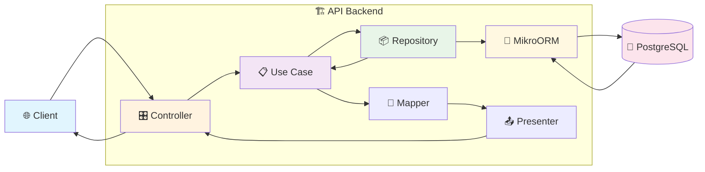

## Comparaison des approches d'implémentation

### Database First

Cette approche aurait consisté à créer directement les tables PostgreSQL puis générer les entités TypeScript. L'avantage principal est le contrôle total sur la structure et les performances, mais elle pose des problèmes de synchronisation entre schéma de base et code applicatif, complique la maintenance des migrations et risque des divergences entre environnements.

### Schema First

Approche intermédiaire utilisant un fichier de définition central (ex: Prisma schema) pour générer base et entités. L'avantage est la source de vérité unique, mais elle nécessite de maintenir un schéma séparé en plus des validations Zod déjà existantes dans le monorepo et limite l'utilisation native des types TypeScript dans la logique métier.

### Code First

J'ai retenu l'approche Code First qui définit les entités directement en TypeScript avec les décorateurs MikroORM. Cette approche offre une intégration native dans l'écosystème du monorepo, génère automatiquement les migrations, fournit l'auto-complétion et la vérification de types TypeScript, et assure une cohérence technique complète avec les packages partagés.

## Exemples complets d'entités MikroORM

### Structure type d'une entité

```typescript
@Entity()
export class Workout {
  @PrimaryKey({ type: 'uuid', defaultRaw: 'gen_random_uuid()' })
  id!: string;

  @Property()
  title!: string;

  @Property()
  description!: string;

  @ManyToOne(() => WorkoutCategory)
  category!: WorkoutCategory;

  @ManyToOne(() => User, { nullable: true })
  createdBy!: User | null;

  @OneToMany(() => WorkoutElement, (element) => element.workout)
  elements = new Collection<WorkoutElement>(this);

  @Property({ onCreate: () => new Date() })
  createdAt: Date = new Date();

  @Property({ onUpdate: () => new Date() })
  updatedAt: Date = new Date();
}
```

Cette entité `Workout` illustre plusieurs patterns adoptés systématiquement :

- **Identifiants UUID** : L'utilisation de `gen_random_uuid()` évite les conflits lors des synchronisations entre environnements
- **Relations typées** : Les décorateurs `@ManyToOne` et `@OneToMany` établissent les relations avec typage strict
- **Collections MikroORM** : Le type `Collection<T>` encapsule la logique de chargement paresseux
- **Timestamps automatiques** : Les propriétés `createdAt` et `updatedAt` s'actualisent automatiquement

### Gestion des relations polymorphes

```typescript
@Entity()
@Check({
  name: 'check_one_element_type',
  expression: `
    (type = 'exercise' AND exercise_id IS NOT NULL AND complex_id IS NULL) OR
    (type = 'complex' AND complex_id IS NOT NULL AND exercise_id IS NULL)
  `,
})
export class WorkoutElement {
  @Enum({ items: () => Object.values(WORKOUT_ELEMENT_TYPES) })
  type!: WorkoutElementType;

  @ManyToOne(() => Exercise, { nullable: true })
  exercise?: Exercise;

  @ManyToOne(() => Complex, { nullable: true })
  complex?: Complex;

  @Property()
  sets!: number;

  @Property()
  reps!: number;
  
  // Autres propriétés communes...
}
```

Le décorateur `@Check` traduit la contrainte logique en contrainte PostgreSQL, garantissant l'intégrité des données même en cas d'accès direct à la base.

## Architecture en couches détaillée

### Structure du projet backend

```markdown
apps/api/src/
├── modules/                   # Modules métier organisés par domaine
│   ├── identity/              # Authentification, autorisation, organisations
│   │   ├── domain/            # Entités métier et règles business
│   │   ├── application/       # Use cases et services applicatifs
│   │   ├── infrastructure/    # Implémentations (repositories, services)
│   │   └── interface/         # Controllers, DTOs, guards
│   ├── training/              # Gestion des entraînements et exercices
│   │   ├── domain/            # Modèle métier de l'entraînement
│   │   ├── application/
│   │   │   ├── use-cases/     # Logique applicative
│   │   │   └── ports/         # Interfaces des repositories
│   │   ├── infrastructure/    # Implémentations MikroORM
│   │   └── interface/         # API REST et validation
│   └── athletes/              # Gestion des athlètes
├── config/                    # Configuration centralisée
├── seeders/                   # Données de test et d'initialisation
└── main.ts                    # Point d'entrée de l'application
```

Cette architecture backend constitue un bon terrain pour les principes du Domain-Driven Design et de l'architecture hexagonale dans un contexte concret. L'approche par ports et adaptateurs que j'ai adoptée garantit une flexibilité future non négligeable : si demain je souhaite migrer vers un autre ORM ou une base de données différente, cette transition pourra s'effectuer sans remettre en cause la logique métier, aspect crucial pour la maintenabilité à long terme d'un projet qui évoluera au-delà de ma formation.

### Diagramme de l'architecture



### Interface Layer : exposition HTTP

#### Controllers

```typescript
@UseGuards(PermissionsGuard) // 1. Garde globale sur toutes les méthodes
@Controller()
export class WorkoutController {
  
  @TsRestHandler(c.getWorkout) // 2. Respect du contrat ts-rest
  @RequirePermissions('read')  // 3. Permission spécifique requise
  async getWorkout(
    @CurrentOrganization() organizationId: string, // 4. Extraction contexte organisation
    @CurrentUser() user: AuthenticatedUser         // 5. Extraction utilisateur authentifié
    { params }
  ) {
    // 6. Délégation immédiate vers la logique métier
    return await this.workoutUseCases.getWorkoutWithDetails(params.id, organizationId, user.id);
  }
}
```

Le controller orchestre plusieurs mécanismes de sécurité en cascade :

- **Niveau 1 - Authentification** : Le `PermissionsGuard` vérifie que l'utilisateur possède un token valide
- **Niveau 2 - Isolation organisationnelle** : Le décorateur `@CurrentOrganization()` garantit l'accès uniquement aux ressources de l'organisation
- **Niveau 3 - Permissions granulaires** : `@RequirePermissions('read')` vérifie les droits spécifiques
- **Niveau 4 - Contrat d'API** : `@TsRestHandler(c.getWorkout)` assure la type safety

#### Mappers

```typescript
export const WorkoutMapper = {
  toDto(workout: Workout): WorkoutDto {
    return {
      id: workout.id,
      title: workout.title,
      workoutCategoryName: workout.category.name, // Simplification : juste le nom au lieu de l'objet complet
      description: workout.description,
      elements: workout.elements.getItems().map(/* transformation des éléments */),
    };
  }
}
```

Les mappers remplissent deux rôles essentiels :
- **Respect du contrat d'API ts-rest** défini dans `@dropit/contract`
- **Protection du schéma de base de données** en ne exposant pas directement les structures internes

#### Presenters avec exemples

```typescript
export const WorkoutPresenter = {
  // Succès avec données
  presentOne(workout: WorkoutDto) {
    return { status: 200 as const, body: workout };
  },
  
  // Gestion centralisée des erreurs
  presentError(error: Error) {
    if (error instanceof NotFoundException) {
      return { status: 404 as const, body: { message: error.message } };
    }
    
    return {
      status: 500 as const,
      body: { message: 'An error occurred while processing the request' }
    };
  }
}
```

Le Presenter joue les rôles de :
- **Normalisation des codes de statut** : Codes HTTP appropriés pour chaque type d'opération
- **Sécurisation des messages d'erreur** : Filtrage des erreurs techniques internes
- **Centralisation du formatage** : Format de réponse cohérent pour l'ensemble de l'API
- **Évolutivité du format de sortie** : Possibilité d'adapter pour d'autres formats (XML, CSV, HTML)

### Application Layer : orchestration métier

#### Use Cases avec exemples complets

```typescript
async createWorkout(workout: CreateWorkout, organizationId: string, userId: string) {
  // 1. Vérifications d'autorisation métier
  const isCoach = await this.memberUseCases.isUserCoachInOrganization(userId, organizationId);
  if (!isCoach) throw new ForbiddenException('User is not coach of this organization');

  // 2. Vérification de l'existence de la catégorie avec filtres organisationnels
  const coachFilterConditions = await this.memberUseCases.getCoachFilterConditions(organizationId);
  const category = await this.workoutCategoryRepository.getOne(workout.workoutCategory, coachFilterConditions);
  if (!category) {
    throw new NotFoundException(`Workout category not found or access denied`);
  }

  // 3. Vérification de l'existence et de l'accès aux exercices/complexes
  for (const element of workout.elements) {
    const resource = element.type === WORKOUT_ELEMENT_TYPES.EXERCISE
      ? await this.exerciseRepository.getOne(element.id, coachFilterConditions)
      : await this.complexRepository.getOne(element.id, coachFilterConditions);

    if (!resource) throw new NotFoundException(`${element.type} not found or access denied`);
  }

  // 4. Création avec logique d'orchestration
  const createdWorkout = await this.workoutRepository.save(workoutToCreate);

  // 5. Transformation pour l'exposition
  const workoutDto = WorkoutMapper.toDto(createdWorkout);
  return WorkoutPresenter.presentOne(workoutDto);
}
```

Les Use Cases appliquent des vérifications métier qui nécessitent l'accès aux données et orchestrent plusieurs règles d'autorisation en combinant différentes vérifications.

### Domain Layer : modèle métier

#### Entités avec décorateurs MikroORM

```typescript
@Entity() // Décorateur qui marque cette classe comme une entité de base de données
@Check({
  name: 'check_one_element_type',
  expression: `(type = 'exercise' AND exercise_id IS NOT NULL) OR (type = 'complex' AND complex_id IS NOT NULL)`
})
export class WorkoutElement {
  @PrimaryKey({ type: 'uuid', defaultRaw: 'gen_random_uuid()' })
  id!: string;

  @Enum({ items: () => Object.values(WORKOUT_ELEMENT_TYPES) })
  type!: WorkoutElementType; // Enum contraint à 'exercise' ou 'complex'
  
  @ManyToOne(() => Exercise, { nullable: true })
  exercise?: Exercise; // Relation optionnelle vers un exercice
  
  @ManyToOne(() => Complex, { nullable: true })
  complex?: Complex; // Relation optionnelle vers un complexe
  
  @Property()
  sets!: number; // Nombre de séries
  
  @Property()
  reps!: number; // Nombre de répétitions
  
  @Property({ onCreate: () => new Date() })
  createdAt: Date = new Date(); // Timestamp automatique
}
```

Chaque décorateur MikroORM a un rôle spécifique :
- `@Entity()` : Indique que cette classe correspond à une table en base de données
- `@Property()` : Mappe les propriétés simples vers des colonnes de base de données
- `@ManyToOne()` : Établit les associations entre entités et génère les clés étrangères
- `@Check()` : Traduit une règle métier en contrainte PostgreSQL
- `@Property({ onCreate: () => new Date() })` : Configure des comportements de lifecycle

**Note** : Dans une architecture hexagonale pure, ces entités devraient être découplées de MikroORM avec des entités domaine séparées et un système de mapping. Cette séparation constitue un objectif d'évolution future pour renforcer l'indépendance de la couche métier vis-à-vis des détails d'infrastructure.

### Infrastructure Layer : accès aux données

#### Repositories personnalisés

```typescript
@Injectable()
export class MikroWorkoutRepository extends EntityRepository<Workout> implements IWorkoutRepository {
  constructor(public readonly em: EntityManager) {
    super(em, Workout);
  }

  // Méthode spécialisée avec populate profond et filtrage organisationnel
  async getOneWithDetails(id: string, coachFilterConditions: CoachFilterConditions): Promise<Workout | null> {
    return await this.em.findOne(
      Workout,
      { id, $or: coachFilterConditions.$or },
      {
        populate: [
          'category',
          'elements',
          'elements.exercise',
          'elements.exercise.exerciseCategory',
          'elements.complex',
          'elements.complex.complexCategory',
          'elements.complex.exercises',
          'elements.complex.exercises.exercise',
          'elements.complex.exercises.exercise.exerciseCategory',
          'createdBy'
        ],
      }
    );
  }
}
```

Cette approche hybride donne le meilleur des deux mondes : l'héritage d'`EntityRepository<Workout>` conserve l'accès aux méthodes MikroORM optimisées, tandis que l'implémentation de `IWorkoutRepository` garantit le respect du contrat métier.


## Gestion des migrations en production

Lorsqu'un développeur modifie une entité, il génère la migration correspondante via `pnpm db:migration:create`. MikroORM analyse automatiquement les changements et produit le script SQL nécessaire.

### Exemple de migration générée

```typescript
import { Migration } from '@mikro-orm/migrations';

export class Migration20240115000000 extends Migration {

  async up(): Promise<void> {
    this.addSql('alter table "workout" add column "difficulty_level" int null;');
    this.addSql('alter table "workout" add constraint "workout_difficulty_level_check" check ("difficulty_level" >= 1 and "difficulty_level" <= 5);');
  }

  async down(): Promise<void> {
    this.addSql('alter table "workout" drop constraint "workout_difficulty_level_check";');
    this.addSql('alter table "workout" drop column "difficulty_level";');
  }
}
```

Lors du processus de mise en production, la CI vérifie l'application de ces migrations avant le déploiement complet par mesure de sécurité.
