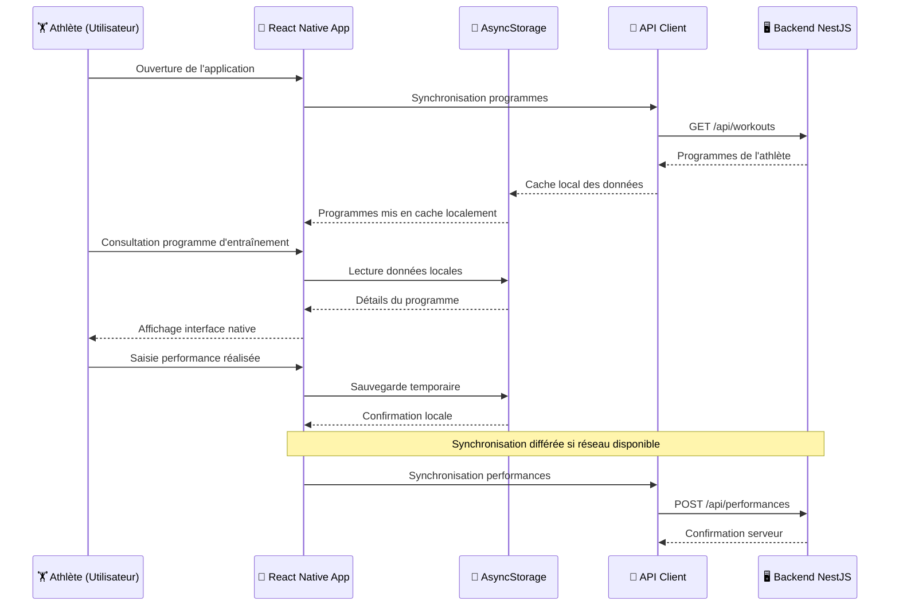

## Formulaires avec React Hook Form et validation Zod

```tsx
// Intégration React Hook Form + Zod avec schémas partagés
import { createExerciseSchema } from '@dropit/schemas';

export function ExerciseCreationForm() {
  const form = useForm({
    resolver: zodResolver(createExerciseSchema), // Validation Zod automatique
    mode: 'onChange',
  });

  const { mutateAsync: createExercise } = useMutation({
    mutationFn: (data) => api.exercise.createExercise({ body: data }),
  });

  const onSubmit = async (data) => {
    await createExercise(data);
    toast.success('Exercice créé');
    form.reset();
  };

  return (
    <form onSubmit={form.handleSubmit(onSubmit)}>
      <FormField
        control={form.control}
        name="name"
        render={({ field }) => (
          <FormItem>
            <FormLabel>Nom de l'exercice</FormLabel>
            <Input placeholder="Ex: Squat" {...field} />
            <FormMessage />
          </FormItem>
        )}
      />

      <Button type="submit" disabled={form.formState.isSubmitting}>
        {form.formState.isSubmitting ? 'Création...' : 'Créer'}
      </Button>
    </form>
  );
}
```

Cette approche centralise la validation via les schémas Zod partagés et optimise l'expérience utilisateur avec une validation temps réel.

## Synchronisation des données avec Tanstack Query

```tsx
// Récupération et cache des catégories d'exercices
const { data: exerciseCategories, isLoading } = useQuery({
  queryKey: ['exercise-categories'],
  queryFn: async () => {
    const response = await api.exerciseCategory.getExerciseCategories();
    if (response.status !== 200) throw new Error('Failed to load categories');
    return response.body;
  },
  staleTime: 1000 * 60 * 5, // Cache pendant 5 minutes
  retry: 3, // 3 tentatives en cas d'échec
});

// Mutation avec invalidation automatique du cache
const { mutateAsync: createExercise } = useMutation({
  mutationFn: createExerciseRequest,
  onSuccess: () => {
    // Revalidation automatique des listes d'exercices
    queryClient.invalidateQueries({ queryKey: ['exercises'] });
    toast.success('Exercice créé avec succès');
  },
  onError: (error) => {
    toast.error(`Erreur: ${error.message}`);
  },
});
```

## Implémentation i18n

```tsx
// Configuration du client i18next
import { resources } from '@dropit/i18n';

// Usage dans les composants
const CreateWorkoutButton = () => {
  const { t } = useTranslation('workout');

  return (
    <Button onClick={handleCreate}>
      {t('create.button')} // "Créer un programme"
    </Button>
  );
};
```

## Exemple d'implémentation Tailwind

```tsx
// Composants réutilisables avec Tailwind
export function WorkoutCard({ workout }) {
  return (
    <Card className="group hover:shadow-lg transition-shadow duration-200">
      <CardHeader>
        <CardTitle className="text-lg group-hover:text-dropit-primary-600 transition-colors">
          {workout.name}
        </CardTitle>
      </CardHeader>
      <CardContent>
        <div className="flex items-center space-x-4 text-sm text-muted-foreground">
          <Clock className="h-4 w-4" />
          <span>{workout.estimatedDuration}min</span>
        </div>
      </CardContent>
    </Card>
  );
}
```

## Exemple d'implémentation Shadcn/ui

```tsx
// Import sélectif des composants Shadcn/ui
import { Button } from "@/components/ui/button"
import { Dialog, DialogContent, DialogTrigger } from "@/components/ui/dialog"
import { Input } from "@/components/ui/input"

// Utilisation avec accessibilité intégrée
export function CreateExerciseDialog() {
  return (
    <Dialog>
      <DialogTrigger asChild>
        <Button variant="outline">
          <Plus className="h-4 w-4 mr-2" aria-hidden="true" />
          Nouvel exercice
        </Button>
      </DialogTrigger>

      <DialogContent>
        <DialogHeader>
          <DialogTitle>Créer un exercice</DialogTitle>
        </DialogHeader>
        <Input placeholder="Nom de l'exercice" aria-required="true" />
      </DialogContent>
    </Dialog>
  );
}
```

## Exemple d'implémentation Lucide React

```tsx
// Import sélectif des icônes nécessaires
import { Plus, Dumbbell, TrendingUp, AlertTriangle } from "lucide-react"

// Usage simple avec accessibilité
<Button variant="outline">
  <Plus className="h-4 w-4 mr-2" aria-hidden="true" />
  Nouvel exercice
</Button>

// Icônes informatives avec label
<div className="flex items-center gap-2">
  <AlertTriangle
    className="h-5 w-5 text-amber-600"
    aria-label="Attention : exercice à risque élevé"
  />
  <span>Épaulé-jeté 85% 1RM</span>
</div>

// États dynamiques
<Button disabled={isLoading}>
  {isLoading ? (
    <Loader2 className="h-4 w-4 mr-2 animate-spin" aria-hidden="true" />
  ) : (
    <Plus className="h-4 w-4 mr-2" aria-hidden="true" />
  )}
  {isLoading ? "Création..." : "Créer"}
</Button>
```

## Architecture mobile flux de données



## Exemple d'implémentation React Native

```tsx
// Même logique de validation côté mobile
import { createPerformanceSchema } from '@dropit/schemas';
import { useForm } from 'react-hook-form';
import { zodResolver } from '@hookform/resolvers/zod';

export function PerformanceForm() {
  const form = useForm({
    resolver: zodResolver(createPerformanceSchema), // Même validation que le web
  });

  const { mutateAsync } = useMutation({
    mutationFn: (data) => api.performance.create({ body: data }), // Même contrat API
  });

  return (
    <View style={styles.container}>
      <Text style={styles.label}>Performance</Text>
      <Controller
        control={form.control}
        name="weight"
        render={({ field }) => (
          <TextInput
            style={styles.input}
            value={field.value?.toString()}
            onChangeText={(text) => field.onChange(parseFloat(text))}
            keyboardType="numeric"
            placeholder="Poids soulevé (kg)"
          />
        )}
      />
      {form.formState.errors.weight && (
        <Text style={styles.error}>
          {form.formState.errors.weight.message}
        </Text>
      )}
    </View>
  );
}
```

## Exemple d'optimisations React

### Lazy loading et memoization

```tsx
// Lazy loading des composants volumineux
const WorkoutEditor = lazy(() => import('./workout-editor'));

// Memoization des calculs coûteux
const calculatedWorkoutStats = useMemo(() => {
  return workoutElements.reduce((stats, element) => {
    stats.totalVolume += element.sets * element.reps * element.weight;
    return stats;
  }, { totalVolume: 0 });
}, [workoutElements]);

// Debouncing des recherches
const debouncedSearch = useDebounce(searchTerm, 300);
```

### Optimisation avec React.memo

```tsx
// Composant optimisé avec React.memo
export const OptimizedWorkoutCard = memo(({ workout, onSelect }) => {
  const handleClick = useCallback(() => {
    onSelect(workout);
  }, [workout, onSelect]);

  return (
    <Card onClick={handleClick} className="cursor-pointer hover:shadow-md">
      <CardHeader>
        <CardTitle>{workout.name}</CardTitle>
      </CardHeader>
      <CardContent>
        <Clock className="h-4 w-4" />
        <span>{workout.estimatedDuration}min</span>
      </CardContent>
    </Card>
  );
}, (prevProps, nextProps) => {
  // Comparaison personnalisée pour éviter les re-renders inutiles
  return prevProps.workout.id === nextProps.workout.id &&
         prevProps.workout.updatedAt === nextProps.workout.updatedAt;
});
```

### Optimisations debouncing

```tsx
// Hook personnalisé pour le debouncing
function useDebounce<T>(value: T, delay: number): T {
  const [debouncedValue, setDebouncedValue] = useState<T>(value);

  useEffect(() => {
    // Configure un timer qui mettra à jour la valeur après le délai
    const handler = setTimeout(() => {
      setDebouncedValue(value);
    }, delay);

    // Nettoie le timer si value change avant la fin du délai
    return () => {
      clearTimeout(handler);
    };
  }, [value, delay]);

  return debouncedValue;
}

// Utilisation dans un composant de recherche
export function ExerciseSearchInput() {
  const [searchTerm, setSearchTerm] = useState('');
  const debouncedSearchTerm = useDebounce(searchTerm, 300); // 300ms de délai

  // Déclenche la recherche uniquement quand debouncedSearchTerm change
  const { data: exercises } = useQuery({
    queryKey: ['exercises', debouncedSearchTerm],
    queryFn: () => searchExercises(debouncedSearchTerm),
    enabled: debouncedSearchTerm.length > 2, // Recherche après 3 caractères
  });

  return (
    <div>
      <Input
        type="text"
        placeholder="Rechercher un exercice..."
        value={searchTerm}
        onChange={(e) => setSearchTerm(e.target.value)} // Mise à jour immédiate
      />
      {exercises?.map(exercise => (
        <div key={exercise.id}>{exercise.name}</div>
      ))}
    </div>
  );
}
```

