```mermaid
sequenceDiagram
    participant Athlete as 🏋️ Athlète (Utilisateur)
    participant App as 📱 React Native App
    participant Storage as 💾 AsyncStorage
    participant API as 🔄 API Client
    participant Server as 🖥️ Backend NestJS
    
    Athlete->>App: Ouverture de l'application
    
    App->>API: Synchronisation programmes
    API->>Server: GET /api/workouts
    Server-->>API: Programmes de l'athlète
    API-->>Storage: Cache local des données
    Storage-->>App: Programmes mis en cache localement
    
    Athlete->>App: Consultation programme d'entraînement
    App->>Storage: Lecture données locales
    Storage-->>App: Détails du programme
    App-->>Athlete: Affichage interface native
    
    Athlete->>App: Saisie performance réalisée
    App->>Storage: Sauvegarde temporaire
    Storage-->>App: Confirmation locale
    
    Note over App,Server: Synchronisation différée si réseau disponible
    App->>API: Synchronisation performances
    API->>Server: POST /api/performances
    Server-->>API: Confirmation serveur
```

## Introduction

Cette annexe présente les détails techniques de l'implémentation des couches de présentation dans DropIt, incluant les exemples complets de code, les configurations et les patterns d'implémentation pour les applications web et mobile.

## Gestion des formulaires avec React Hook Form

### Exemple basique de React Hook Form

```tsx
// Exemple basique de React Hook Form
const form = useForm({
  mode: 'onChange', // Validation temps réel
  defaultValues: {
    name: '',
    category: '',
    sets: 1,
  },
});

const { register, handleSubmit, formState: { errors, isSubmitting } } = form;

const onSubmit = async (data) => {
  try {
    await createExercise(data);
  } catch (error) {
    // Gestion automatique des erreurs de soumission
  }
};

// Usage dans le JSX
<form onSubmit={handleSubmit(onSubmit)}>
  <input {...register('name', { required: 'Le nom est requis' })} />
  {errors.name && <span>{errors.name.message}</span>}
  
  <button disabled={isSubmitting}>
    {isSubmitting ? 'Création...' : 'Créer'}
  </button>
</form>
```

Cette approche me permet de me concentrer sur la logique métier spécifique à l'haltérophilie plutôt que sur l'implémentation des mécanismes de base des formulaires.

### Gestion avancée des formulaires

```tsx
// Formulaire complexe avec validation conditionnelle
const ComplexWorkoutForm = () => {
  const form = useForm<CreateWorkout>({
    resolver: zodResolver(createWorkoutSchema),
    defaultValues: {
      name: '',
      description: '',
      category: undefined,
      elements: [],
      difficulty: 'medium',
    },
  });

  const { fields, append, remove } = useFieldArray({
    control: form.control,
    name: "elements"
  });

  const watchElements = form.watch("elements");
  
  // Validation dynamique selon le nombre d'éléments
  const isValidWorkout = watchElements && watchElements.length > 0;

  return (
    <form onSubmit={form.handleSubmit(onSubmit)}>
      {/* Champs de base */}
      <FormField
        control={form.control}
        name="name"
        render={({ field }) => (
          <FormItem>
            <FormLabel>Nom du programme</FormLabel>
            <FormControl>
              <Input placeholder="Ex: Force A" {...field} />
            </FormControl>
            <FormMessage />
          </FormItem>
        )}
      />

      {/* Gestion dynamique des éléments */}
      <div className="space-y-4">
        <Label>Exercices du programme</Label>
        {fields.map((field, index) => (
          <Card key={field.id}>
            <CardHeader className="flex flex-row items-center justify-between">
              <CardTitle className="text-base">Élément {index + 1}</CardTitle>
              <Button
                type="button"
                variant="ghost"
                size="sm"
                onClick={() => remove(index)}
              >
                <Trash2 className="h-4 w-4" />
              </Button>
            </CardHeader>
            <CardContent className="space-y-4">
              <FormField
                control={form.control}
                name={`elements.${index}.exerciseId`}
                render={({ field }) => (
                  <FormItem>
                    <FormLabel>Exercice</FormLabel>
                    <Select onValueChange={field.onChange} defaultValue={field.value}>
                      <FormControl>
                        <SelectTrigger>
                          <SelectValue placeholder="Sélectionner un exercice" />
                        </SelectTrigger>
                      </FormControl>
                      <SelectContent>
                        {exercises.map((exercise) => (
                          <SelectItem key={exercise.id} value={exercise.id}>
                            {exercise.name}
                          </SelectItem>
                        ))}
                      </SelectContent>
                    </Select>
                    <FormMessage />
                  </FormItem>
                )}
              />
              
              <div className="grid grid-cols-3 gap-4">
                <FormField
                  control={form.control}
                  name={`elements.${index}.sets`}
                  render={({ field }) => (
                    <FormItem>
                      <FormLabel>Séries</FormLabel>
                      <FormControl>
                        <Input 
                          type="number" 
                          min={1}
                          {...field}
                          onChange={(e) => field.onChange(parseInt(e.target.value))}
                        />
                      </FormControl>
                      <FormMessage />
                    </FormItem>
                  )}
                />
                
                <FormField
                  control={form.control}
                  name={`elements.${index}.reps`}
                  render={({ field }) => (
                    <FormItem>
                      <FormLabel>Répétitions</FormLabel>
                      <FormControl>
                        <Input 
                          type="number" 
                          min={1}
                          {...field}
                          onChange={(e) => field.onChange(parseInt(e.target.value))}
                        />
                      </FormControl>
                      <FormMessage />
                    </FormItem>
                  )}
                />
                
                <FormField
                  control={form.control}
                  name={`elements.${index}.weight`}
                  render={({ field }) => (
                    <FormItem>
                      <FormLabel>Poids (%1RM)</FormLabel>
                      <FormControl>
                        <Input 
                          type="number" 
                          min={1}
                          max={100}
                          {...field}
                          onChange={(e) => field.onChange(parseInt(e.target.value))}
                        />
                      </FormControl>
                      <FormMessage />
                    </FormItem>
                  )}
                />
              </div>
            </CardContent>
          </Card>
        ))}
        
        <Button
          type="button"
          variant="outline"
          size="sm"
          className="w-full"
          onClick={() => append({
            exerciseId: '',
            sets: 1,
            reps: 1,
            weight: 70,
          })}
        >
          <Plus className="h-4 w-4 mr-2" />
          Ajouter un exercice
        </Button>
      </div>

      <Button type="submit" disabled={!isValidWorkout || form.formState.isSubmitting}>
        {form.formState.isSubmitting ? 'Création...' : 'Créer le programme'}
      </Button>
    </form>
  );
};
```

## Intégration de la validation Zod partagée

### Intégration avec React Hook Form

```tsx
// Réutilisation des schémas définis dans @dropit/schemas
import { CreateExercise, createExerciseSchema } from '@dropit/schemas';

export function ExerciseCreationForm() {
  const form = useForm<CreateExercise>({
    resolver: zodResolver(createExerciseSchema), // Validation automatique
    defaultValues: {
      name: '',
      description: '',
      category: undefined,
    },
  });

  const { mutateAsync: createExercise } = useMutation({
    mutationFn: async (data: CreateExercise) => {
      // Le schéma Zod valide côté client AVANT l'envoi
      const response = await api.exercise.createExercise({ body: data });
      if (response.status !== 201) throw new Error('Creation failed');
      return response.body;
    },
  });

  const onSubmit = async (data: CreateExercise) => {
    try {
      await createExercise(data);
      toast.success('Exercice créé avec succès');
      form.reset();
    } catch (error) {
      toast.error('Erreur lors de la création');
    }
  };

  return (
    <form onSubmit={form.handleSubmit(onSubmit)} className="space-y-4">
      <FormField
        control={form.control}
        name="name"
        render={({ field }) => (
          <FormItem>
            <FormLabel>Nom de l'exercice</FormLabel>
            <FormControl>
              <Input placeholder="Ex: Squat" {...field} />
            </FormControl>
            <FormDescription>
              Le nom doit être unique et descriptif
            </FormDescription>
            <FormMessage />
          </FormItem>
        )}
      />

      <FormField
        control={form.control}
        name="description"
        render={({ field }) => (
          <FormItem>
            <FormLabel>Description</FormLabel>
            <FormControl>
              <Textarea 
                placeholder="Description technique de l'exercice..."
                {...field}
              />
            </FormControl>
            <FormMessage />
          </FormItem>
        )}
      />

      <FormField
        control={form.control}
        name="category"
        render={({ field }) => (
          <FormItem>
            <FormLabel>Catégorie</FormLabel>
            <Select onValueChange={field.onChange} defaultValue={field.value}>
              <FormControl>
                <SelectTrigger>
                  <SelectValue placeholder="Sélectionner une catégorie" />
                </SelectTrigger>
              </FormControl>
              <SelectContent>
                {exerciseCategories?.map((category) => (
                  <SelectItem key={category.id} value={category.id}>
                    {category.name}
                  </SelectItem>
                ))}
              </SelectContent>
            </Select>
            <FormMessage />
          </FormItem>
        )}
      />

      <div className="flex justify-end space-x-2">
        <Button type="button" variant="outline" onClick={() => form.reset()}>
          Annuler
        </Button>
        <Button type="submit" disabled={form.formState.isSubmitting}>
          {form.formState.isSubmitting ? 'Création...' : 'Créer'}
        </Button>
      </div>
    </form>
  );
}
```

### Gestion des erreurs de validation

```tsx
// Hook personnalisé pour la gestion des erreurs Zod
function useZodErrorHandling() {
  const handleZodError = useCallback((error: ZodError) => {
    const fieldErrors: Record<string, string> = {};
    
    error.errors.forEach((err) => {
      const fieldName = err.path.join('.');
      fieldErrors[fieldName] = err.message;
    });
    
    return fieldErrors;
  }, []);

  const formatZodErrorForToast = useCallback((error: ZodError) => {
    const messages = error.errors.map(err => `${err.path.join('.')}: ${err.message}`);
    return messages.join('\n');
  }, []);

  return { handleZodError, formatZodErrorForToast };
}

// Utilisation dans un composant
export function FormWithErrorHandling() {
  const { handleZodError } = useZodErrorHandling();
  
  const form = useForm({
    resolver: zodResolver(createWorkoutSchema),
    mode: 'onBlur', // Validation à la perte de focus
  });

  const onSubmit = async (data: CreateWorkout) => {
    try {
      // Validation manuelle supplémentaire si nécessaire
      const validatedData = createWorkoutSchema.parse(data);
      await createWorkout(validatedData);
    } catch (error) {
      if (error instanceof ZodError) {
        const fieldErrors = handleZodError(error);
        Object.entries(fieldErrors).forEach(([field, message]) => {
          form.setError(field as any, { message });
        });
      }
    }
  };

  return (
    <form onSubmit={form.handleSubmit(onSubmit)}>
      {/* Formulaire */}
    </form>
  );
}
```

## Stratégie de synchronisation des données avec Tanstack Query

### Configuration et utilisation de base

```tsx
// Récupération et cache des catégories d'exercices
const { data: exerciseCategories, isLoading } = useQuery({
  queryKey: ['exercise-categories'],
  queryFn: async () => {
    const response = await api.exerciseCategory.getExerciseCategories();
    if (response.status !== 200) throw new Error('Failed to load categories');
    return response.body;
  },
  staleTime: 1000 * 60 * 5, // Cache pendant 5 minutes
  retry: 3, // 3 tentatives en cas d'échec
});

// Mutation avec invalidation automatique du cache
const { mutateAsync: createExercise } = useMutation({
  mutationFn: createExerciseRequest,
  onSuccess: () => {
    // Revalidation automatique des listes d'exercices
    queryClient.invalidateQueries({ queryKey: ['exercises'] });
    toast.success('Exercice créé avec succès');
  },
  onError: (error) => {
    toast.error(`Erreur: ${error.message}`);
  },
});
```

### Patterns avancés avec Tanstack Query

```tsx
// Hook personnalisé pour la gestion des exercices
export function useExercises(filters?: ExerciseFilters) {
  const queryKey = ['exercises', filters];
  
  return useQuery({
    queryKey,
    queryFn: async () => {
      const response = await api.exercise.getExercises({ 
        query: filters 
      });
      if (response.status !== 200) throw new Error('Failed to load exercises');
      return response.body;
    },
    enabled: !!filters, // N'exécute que si des filtres sont fournis
    staleTime: 1000 * 60 * 2, // 2 minutes
    gcTime: 1000 * 60 * 10, // 10 minutes en cache
  });
}

// Hook pour les mutations avec optimistic updates
export function useCreateExercise() {
  const queryClient = useQueryClient();
  
  return useMutation({
    mutationFn: async (newExercise: CreateExercise) => {
      const response = await api.exercise.createExercise({ body: newExercise });
      if (response.status !== 201) throw new Error('Creation failed');
      return response.body;
    },
    
    // Optimistic update
    onMutate: async (newExercise) => {
      // Annule les requêtes en cours pour éviter les conflits
      await queryClient.cancelQueries({ queryKey: ['exercises'] });
      
      // Sauvegarde de l'état précédent
      const previousExercises = queryClient.getQueryData(['exercises']);
      
      // Mise à jour optimiste
      queryClient.setQueryData(['exercises'], (old: Exercise[] = []) => [
        ...old,
        { ...newExercise, id: 'temp-id', createdAt: new Date().toISOString() }
      ]);
      
      return { previousExercises };
    },
    
    onError: (err, newExercise, context) => {
      // Rollback en cas d'erreur
      queryClient.setQueryData(['exercises'], context?.previousExercises);
      toast.error('Erreur lors de la création');
    },
    
    onSuccess: (data) => {
      toast.success('Exercice créé avec succès');
    },
    
    onSettled: () => {
      // Revalidation finale pour assurer la cohérence
      queryClient.invalidateQueries({ queryKey: ['exercises'] });
    },
  });
}

// Gestion de la pagination avec Tanstack Query
export function useInfiniteExercises() {
  return useInfiniteQuery({
    queryKey: ['exercises', 'infinite'],
    queryFn: async ({ pageParam = 0 }) => {
      const response = await api.exercise.getExercises({
        query: {
          page: pageParam,
          limit: 20
        }
      });
      return response.body;
    },
    getNextPageParam: (lastPage, pages) => {
      return lastPage.hasMore ? pages.length : undefined;
    },
    initialPageParam: 0,
  });
}

// Hook pour la synchronisation en temps réel
export function useRealtimeWorkouts() {
  const queryClient = useQueryClient();
  
  useEffect(() => {
    // Simulation d'une connexion WebSocket
    const eventSource = new EventSource('/api/workouts/events');
    
    eventSource.onmessage = (event) => {
      const data = JSON.parse(event.data);
      
      switch (data.type) {
        case 'workout_created':
          queryClient.invalidateQueries({ queryKey: ['workouts'] });
          break;
        case 'workout_updated':
          queryClient.setQueryData(
            ['workout', data.payload.id], 
            data.payload
          );
          break;
        case 'workout_deleted':
          queryClient.removeQueries({ queryKey: ['workout', data.payload.id] });
          queryClient.invalidateQueries({ queryKey: ['workouts'] });
          break;
      }
    };
    
    return () => eventSource.close();
  }, [queryClient]);
}
```

## Configuration et exemples de routage Tanstack Router

### Structure de routes

```markdown
// Routes organisées hiérarchiquement
├── __home.tsx                    # Layout principal authentifié
│   ├── __home.dashboard.tsx      # Page d'accueil
│   ├── __home.programs.tsx       # Layout des programmes
│   │   ├── exercises.tsx         # Catalogue d'exercices
│   │   ├── workouts.tsx          # Liste des programmes
│   │   └── complex.tsx           # Gestion des complexes
│   ├── __home.athletes.tsx       # Gestion des athlètes
│   │   └── $athleteId.tsx        # Détail d'un athlète
│   └── __home.planning.tsx       # Interface calendaire
```

### Définition des routes avec validation

```tsx
// Route typée avec validation des paramètres
const athleteDetailRoute = createFileRoute('/athletes/$athleteId')({
  parseParams: (params) => ({
    athleteId: z.string().uuid().parse(params.athleteId),
  }),
  validateSearch: z.object({
    tab: z.enum(['profile', 'performances', 'workouts']).optional(),
  }),
  beforeLoad: ({ context, params }) => {
    // Vérification des permissions
    if (!context.user.canViewAthlete(params.athleteId)) {
      throw redirect({ to: '/athletes', search: { error: 'access_denied' } });
    }
  },
  loader: async ({ params, context }) => {
    const athlete = await context.api.athlete.getOne({ params });
    if (athlete.status !== 200) {
      throw new Error('Athlete not found');
    }
    return athlete.body;
  },
  component: AthleteDetailPage,
});

// Composant de la page avec accès aux données typées
function AthleteDetailPage() {
  const { athleteId } = athleteDetailRoute.useParams();
  const athlete = athleteDetailRoute.useLoaderData();
  const { tab = 'profile' } = athleteDetailRoute.useSearch();
  const navigate = athleteDetailRoute.useNavigate();
  
  const setTab = (newTab: string) => {
    navigate({ search: { tab: newTab } });
  };
  
  return (
    <div className="space-y-6">
      <div className="flex items-center justify-between">
        <h1 className="text-2xl font-bold">
          {athlete.firstName} {athlete.lastName}
        </h1>
      </div>
      
      <Tabs value={tab} onValueChange={setTab}>
        <TabsList>
          <TabsTrigger value="profile">Profil</TabsTrigger>
          <TabsTrigger value="performances">Performances</TabsTrigger>
          <TabsTrigger value="workouts">Programmes</TabsTrigger>
        </TabsList>
        
        <TabsContent value="profile">
          <AthleteProfile athlete={athlete} />
        </TabsContent>
        
        <TabsContent value="performances">
          <AthletePerformances athleteId={athleteId} />
        </TabsContent>
        
        <TabsContent value="workouts">
          <AthleteWorkouts athleteId={athleteId} />
        </TabsContent>
      </Tabs>
    </div>
  );
}
```

### Navigation programmatique typée

```tsx
// Hook personnalisé pour la navigation typée
export function useTypedNavigation() {
  const router = useRouter();
  
  const goToWorkout = (workoutId: string) => {
    router.navigate({
      to: '/programs/workouts/$workoutId',
      params: { workoutId },
    });
  };
  
  const goToAthleteWorkouts = (athleteId: string) => {
    router.navigate({
      to: '/athletes/$athleteId',
      params: { athleteId },
      search: { tab: 'workouts' },
    });
  };
  
  const goBackWithState = (state?: any) => {
    router.history.back();
  };
  
  return {
    goToWorkout,
    goToAthleteWorkouts,
    goBackWithState,
  };
}

// Composant avec navigation typée
export function WorkoutCard({ workout }: { workout: Workout }) {
  const { goToWorkout } = useTypedNavigation();
  
  return (
    <Card className="cursor-pointer" onClick={() => goToWorkout(workout.id)}>
      <CardHeader>
        <CardTitle>{workout.name}</CardTitle>
        <CardDescription>{workout.description}</CardDescription>
      </CardHeader>
    </Card>
  );
}
```

## Exemples d'utilisation date-fns

### Fonctions de formatage

```tsx
import { format, addDays, isAfter, parseISO } from 'date-fns';
import { fr } from 'date-fns/locale';

// Formatage des dates en français pour l'interface
const formatSessionDate = (dateString: string) => {
  return format(parseISO(dateString), 'EEEE d MMMM yyyy', { locale: fr });
};

// Calculs de dates pour la planification
const getNextTrainingDate = (lastSession: string, frequency: number) => {
  return addDays(parseISO(lastSession), frequency);
};

// Formatage avancé pour les performances
const formatPerformanceDate = (date: Date) => {
  const now = new Date();
  const diffInDays = Math.floor((now.getTime() - date.getTime()) / (1000 * 60 * 60 * 24));
  
  if (diffInDays === 0) return "Aujourd'hui";
  if (diffInDays === 1) return "Hier";
  if (diffInDays < 7) return `Il y a ${diffInDays} jours`;
  
  return format(date, 'dd/MM/yyyy', { locale: fr });
};

// Validation des dates de séance
const isValidSessionDate = (sessionDate: string) => {
  const date = parseISO(sessionDate);
  const now = new Date();
  
  // Ne pas planifier plus de 6 mois à l'avance
  const maxDate = addDays(now, 180);
  
  return isAfter(date, now) && !isAfter(date, maxDate);
};

// Hook personnalisé pour la gestion des dates
export function useDateFormatting() {
  const formatTrainingDate = useCallback((date: string | Date) => {
    const parsedDate = typeof date === 'string' ? parseISO(date) : date;
    return format(parsedDate, 'EEEE dd MMMM yyyy', { locale: fr });
  }, []);
  
  const formatTimeOnly = useCallback((date: string | Date) => {
    const parsedDate = typeof date === 'string' ? parseISO(date) : date;
    return format(parsedDate, 'HH:mm', { locale: fr });
  }, []);
  
  const getRelativeDate = useCallback((date: string | Date) => {
    const parsedDate = typeof date === 'string' ? parseISO(date) : date;
    const now = new Date();
    const diffInDays = Math.floor((parsedDate.getTime() - now.getTime()) / (1000 * 60 * 60 * 24));
    
    if (diffInDays === 0) return "Aujourd'hui";
    if (diffInDays === 1) return "Demain";
    if (diffInDays === -1) return "Hier";
    if (diffInDays > 1 && diffInDays < 7) return `Dans ${diffInDays} jours`;
    if (diffInDays < -1 && diffInDays > -7) return `Il y a ${Math.abs(diffInDays)} jours`;
    
    return format(parsedDate, 'dd/MM/yyyy', { locale: fr });
  }, []);
  
  return {
    formatTrainingDate,
    formatTimeOnly,
    getRelativeDate,
  };
}
```

## Exemples d'implémentation drag-and-drop

### Composant drag-and-drop avec dnd-kit

```tsx
import { useSortable } from '@dnd-kit/sortable';
import { CSS } from '@dnd-kit/utilities';

interface SortableWorkoutElementProps {
  element: WorkoutElement;
  index: number;
  onRemove: (index: number) => void;
}

export function SortableWorkoutElement({ element, index, onRemove }: SortableWorkoutElementProps) {
  const {
    attributes,
    listeners,
    setNodeRef,
    transform,
    transition,
    isDragging,
  } = useSortable({ id: element.id });

  const style = {
    transform: CSS.Transform.toString(transform),
    transition,
    opacity: isDragging ? 0.5 : 1,
  };

  return (
    <Card ref={setNodeRef} style={style} className="relative">
      <CardContent className="flex items-center gap-4 p-4">
        {/* Handle de drag */}
        <div {...attributes} {...listeners} className="cursor-grab">
          <GripVertical className="h-4 w-4 text-muted-foreground" />
        </div>
        
        {/* Contenu de l'exercice */}
        <div className="flex-1">
          <h4>{element.name}</h4>
          <p className="text-sm text-muted-foreground">
            {element.sets} × {element.reps} @ {element.weight}kg
          </p>
        </div>
        
        {/* Action de suppression */}
        <Button variant="ghost" size="sm" onClick={() => onRemove(index)}>
          <Trash2 className="h-4 w-4" />
        </Button>
      </CardContent>
    </Card>
  );
}

// Container drag-and-drop avec gestion des événements
export function WorkoutElementsList({ elements, onReorder, onRemove }: WorkoutElementsListProps) {
  const [activeId, setActiveId] = useState<string | null>(null);
  
  const sensors = useSensors(
    useSensor(PointerSensor),
    useSensor(KeyboardSensor, {
      coordinateGetter: sortableKeyboardCoordinates,
    })
  );

  const handleDragStart = (event: DragStartEvent) => {
    setActiveId(event.active.id as string);
  };

  const handleDragEnd = (event: DragEndEvent) => {
    const { active, over } = event;
    
    if (active.id !== over?.id) {
      const oldIndex = elements.findIndex(item => item.id === active.id);
      const newIndex = elements.findIndex(item => item.id === over?.id);
      
      onReorder(arrayMove(elements, oldIndex, newIndex));
    }
    
    setActiveId(null);
  };

  return (
    <DndContext
      sensors={sensors}
      collisionDetection={closestCenter}
      onDragStart={handleDragStart}
      onDragEnd={handleDragEnd}
    >
      <SortableContext items={elements.map(e => e.id)} strategy={verticalListSortingStrategy}>
        <div className="space-y-2">
          {elements.map((element, index) => (
            <SortableWorkoutElement
              key={element.id}
              element={element}
              index={index}
              onRemove={onRemove}
            />
          ))}
        </div>
      </SortableContext>
      
      <DragOverlay>
        {activeId ? (
          <Card className="opacity-90">
            <CardContent className="p-4">
              <div className="font-medium">
                {elements.find(e => e.id === activeId)?.name}
              </div>
            </CardContent>
          </Card>
        ) : null}
      </DragOverlay>
    </DndContext>
  );
}
```

## Configuration FullCalendar

### Configuration de base

```tsx
// Configuration FullCalendar pour les séances d'entraînement
const calendarOptions = {
  plugins: [dayGridPlugin, timeGridPlugin, interactionPlugin],
  headerToolbar: {
    left: 'prev,next today',
    center: 'title',
    right: 'dayGridMonth,timeGridWeek,timeGridDay'
  },
  events: trainingSessions.map(session => ({
    id: session.id,
    title: `${session.workout.name} - ${session.athletes.length} athlètes`,
    start: session.scheduledDate,
    backgroundColor: getWorkoutTypeColor(session.workout.type),
  })),
  eventClick: (info) => {
    // Navigation vers les détails de la séance
    navigate(`/planning/session/${info.event.id}`);
  }
};
```

### Intégration avancée avec React

```tsx
import FullCalendar from '@fullcalendar/react';
import dayGridPlugin from '@fullcalendar/daygrid';
import timeGridPlugin from '@fullcalendar/timegrid';
import interactionPlugin from '@fullcalendar/interaction';
import frLocale from '@fullcalendar/core/locales/fr';

export function TrainingCalendar() {
  const { data: sessions, isLoading } = useQuery({
    queryKey: ['training-sessions'],
    queryFn: fetchTrainingSessions,
  });

  const { mutateAsync: createSession } = useMutation({
    mutationFn: createTrainingSession,
    onSuccess: () => {
      queryClient.invalidateQueries({ queryKey: ['training-sessions'] });
    },
  });

  const handleDateSelect = async (selectInfo: DateSelectArg) => {
    const title = prompt('Nom de la séance:');
    if (title) {
      await createSession({
        title,
        start: selectInfo.start,
        end: selectInfo.end,
      });
    }
    selectInfo.view.calendar.unselect();
  };

  const handleEventClick = (clickInfo: EventClickArg) => {
    const sessionId = clickInfo.event.id;
    navigate(`/planning/session/${sessionId}`);
  };

  const handleEventDrop = async (dropInfo: EventDropArg) => {
    try {
      await updateSession({
        id: dropInfo.event.id,
        start: dropInfo.event.start,
        end: dropInfo.event.end,
      });
    } catch (error) {
      dropInfo.revert();
      toast.error('Erreur lors du déplacement');
    }
  };

  if (isLoading) {
    return <CalendarSkeleton />;
  }

  return (
    <div className="calendar-container">
      <FullCalendar
        plugins={[dayGridPlugin, timeGridPlugin, interactionPlugin]}
        headerToolbar={{
          left: 'prev,next today',
          center: 'title',
          right: 'dayGridMonth,timeGridWeek,timeGridDay'
        }}
        initialView="dayGridMonth"
        locale={frLocale}
        events={sessions?.map(session => ({
          id: session.id,
          title: session.title,
          start: session.scheduledDate,
          backgroundColor: getSessionTypeColor(session.type),
          borderColor: getSessionTypeColor(session.type),
          textColor: '#fff',
          extendedProps: {
            athleteCount: session.athletes.length,
            workoutType: session.workout.type,
          }
        }))}
        selectable={true}
        selectMirror={true}
        dayMaxEvents={true}
        weekends={true}
        select={handleDateSelect}
        eventClick={handleEventClick}
        eventDrop={handleEventDrop}
        editable={true}
        droppable={true}
        height="auto"
        eventContent={(eventInfo) => (
          <div className="p-1">
            <div className="font-medium text-xs truncate">
              {eventInfo.event.title}
            </div>
            <div className="text-xs opacity-75">
              {eventInfo.event.extendedProps.athleteCount} athlètes
            </div>
          </div>
        )}
      />
    </div>
  );
}

// Utilitaire pour les couleurs selon le type
function getSessionTypeColor(type: WorkoutType): string {
  const colors = {
    strength: '#ef4444', // Rouge
    endurance: '#3b82f6', // Bleu
    technique: '#10b981', // Vert
    recovery: '#8b5cf6', // Violet
  };
  return colors[type] || '#6b7280';
}
```

## Configuration i18next et exemples

### Configuration du client i18next

```tsx
// Configuration du client i18next
import { resources } from '@dropit/i18n';

i18n
  .use(initReactI18next)
  .init({
    resources,
    lng: 'fr', // Langue par défaut
    interpolation: {
      escapeValue: false, // React échappe déjà les valeurs
    },
  });

// Usage dans les composants
const CreateWorkoutButton = () => {
  const { t } = useTranslation('workout');
  
  return (
    <Button onClick={handleCreate}>
      {t('create.button')} // "Créer un programme"
    </Button>
  );
};
```

### Fichiers de traduction organisés

```json
// packages/i18n/locales/fr/workout.json
{
  "title": "Programme d'entraînement",
  "create": {
    "button": "Créer un programme",
    "success": "Programme créé avec succès",
    "error": "Erreur lors de la création du programme"
  },
  "validation": {
    "name_required": "Le nom du programme est requis",
    "min_exercises": "Un programme doit contenir au moins un exercice"
  },
  "status": {
    "draft": "Brouillon",
    "active": "Actif",
    "archived": "Archivé"
  }
}
```

### Hook personnalisé pour l'internationalisation

```tsx
// Hook personnalisé pour les traductions contextuelles
export function useWorkoutTranslations() {
  const { t } = useTranslation('workout');
  
  const getStatusLabel = (status: WorkoutStatus) => {
    return t(`status.${status}`);
  };
  
  const getValidationMessage = (field: string) => {
    return t(`validation.${field}`);
  };
  
  const formatWorkoutTitle = (workout: Workout) => {
    return `${workout.name} - ${t('status.' + workout.status)}`;
  };
  
  return {
    t,
    getStatusLabel,
    getValidationMessage,
    formatWorkoutTitle,
  };
}

// Composant avec traductions dynamiques
export function WorkoutStatusBadge({ status }: { status: WorkoutStatus }) {
  const { getStatusLabel } = useWorkoutTranslations();
  
  const variants = {
    draft: 'secondary',
    active: 'default',
    archived: 'outline',
  } as const;
  
  return (
    <Badge variant={variants[status]}>
      {getStatusLabel(status)}
    </Badge>
  );
}
```

## Configuration Tailwind et exemples

### Configuration optimisée pour DropIt

```javascript
// tailwind.config.js - Configuration optimisée pour DropIt
export default {
  content: [
    "./index.html",
    "./src/**/*.{js,ts,jsx,tsx}", // Scan tous les composants React
    "./node_modules/@dropit/ui/**/*.{js,ts,jsx,tsx}", // Composants partagés
  ],
  theme: {
    extend: {
      colors: {
        // Palette spécifique à l'haltérophilie
        'dropit-primary': {
          500: '#2563eb', // Bleu principal
          600: '#1d4ed8',
        },
        'dropit-success': '#10b981', // Validation performance
        'dropit-warning': '#f59e0b', // Alertes sécurité
      },
      animation: {
        'fade-in': 'fadeIn 0.5s ease-in-out',
        'slide-up': 'slideUp 0.3s ease-out',
      },
      keyframes: {
        fadeIn: {
          '0%': { opacity: '0' },
          '100%': { opacity: '1' },
        },
        slideUp: {
          '0%': { transform: 'translateY(10px)', opacity: '0' },
          '100%': { transform: 'translateY(0)', opacity: '1' },
        },
      },
    },
  },
  plugins: [
    require('@tailwindcss/forms'), // Styles formulaires optimisés
    require('@tailwindcss/typography'), // Formatage contenu riche
  ],
}
```

### Exemples d'utilisation Tailwind

```tsx
// Approche traditionnelle que j'aurais pu utiliser
<div className="workout-card"> // Nécessite définition CSS séparée
  <h3 className="workout-title">Programme Force</h3>
</div>

// Approche Tailwind adoptée dans DropIt
<div className="bg-white rounded-lg shadow-md p-6 border border-gray-200">
  <h3 className="text-xl font-semibold text-gray-900 mb-2">Programme Force</h3>
</div>

// Composants réutilisables avec Tailwind
export function WorkoutCard({ workout }: { workout: Workout }) {
  return (
    <Card className="group hover:shadow-lg transition-shadow duration-200">
      <CardHeader className="pb-3">
        <div className="flex items-center justify-between">
          <CardTitle className="text-lg group-hover:text-dropit-primary-600 transition-colors">
            {workout.name}
          </CardTitle>
          <WorkoutStatusBadge status={workout.status} />
        </div>
        <CardDescription className="text-sm text-muted-foreground line-clamp-2">
          {workout.description}
        </CardDescription>
      </CardHeader>
      
      <CardContent className="space-y-4">
        <div className="flex items-center space-x-4 text-sm text-muted-foreground">
          <div className="flex items-center space-x-1">
            <Clock className="h-4 w-4" />
            <span>{workout.estimatedDuration}min</span>
          </div>
          <div className="flex items-center space-x-1">
            <Dumbbell className="h-4 w-4" />
            <span>{workout.elements.length} exercices</span>
          </div>
        </div>
        
        <div className="flex flex-wrap gap-1">
          {workout.tags.map((tag) => (
            <Badge key={tag} variant="outline" className="text-xs">
              {tag}
            </Badge>
          ))}
        </div>
      </CardContent>
      
      <CardFooter className="pt-0">
        <Button 
          className="w-full group-hover:bg-dropit-primary-600 transition-colors"
          onClick={() => onSelect(workout)}
        >
          Sélectionner
        </Button>
      </CardFooter>
    </Card>
  );
}

// Responsive design avec Tailwind
export function ResponsiveWorkoutGrid({ workouts }: { workouts: Workout[] }) {
  return (
    <div className="grid grid-cols-1 md:grid-cols-2 lg:grid-cols-3 xl:grid-cols-4 gap-4 p-4">
      {workouts.map((workout) => (
        <WorkoutCard key={workout.id} workout={workout} />
      ))}
    </div>
  );
}
```

## Exemples d'implémentation Shadcn/ui

### Composant accessible intégrant les bonnes pratiques RGAA

```tsx
// Composant accessible intégrant les bonnes pratiques RGAA
<Dialog>
  <DialogTrigger asChild>
    <Button 
      variant="outline" 
      aria-label="Ouvrir la création d'exercice"
      aria-describedby="exercise-help"
    >
      <Plus className="h-4 w-4 mr-2" aria-hidden="true" />
      Nouvel exercice
    </Button>
  </DialogTrigger>
  
  <DialogContent 
    className="max-w-md"
    aria-labelledby="dialog-title"
    aria-describedby="dialog-description"
  >
    <DialogHeader>
      <DialogTitle id="dialog-title">Créer un exercice</DialogTitle>
      <DialogDescription id="dialog-description">
        Définir un nouvel exercice pour vos programmes d'entraînement
      </DialogDescription>
    </DialogHeader>
    
    {/* Formulaire avec labels explicites et messages d'erreur */}
    <form onSubmit={handleSubmit}>
      <div className="space-y-4">
        <div>
          <Label htmlFor="exercise-name" className="sr-only">
            Nom de l'exercice
          </Label>
          <Input
            id="exercise-name"
            placeholder="Nom de l'exercice"
            aria-required="true"
            aria-describedby="name-error"
            {...register("name")}
          />
          {errors.name && (
            <div id="name-error" role="alert" className="text-red-600 text-sm mt-1">
              {errors.name.message}
            </div>
          )}
        </div>
      </div>
    </form>
  </DialogContent>
</Dialog>
```

### Import sélectif optimisant la taille du bundle

```tsx
// Import sélectif optimisant la taille du bundle
import { Button } from "@/components/ui/button"
import { Dialog, DialogContent, DialogTrigger } from "@/components/ui/dialog"
import { Form, FormControl, FormField } from "@/components/ui/form"

// Plutôt qu'un import global coûteux comme :
// import * as UI from "@shadcn/ui" // ❌ Approche non durable
```

### Adaptation du composant Button pour les besoins spécifiques de DropIt

```tsx
// Adaptation du composant Button pour les besoins spécifiques de DropIt
const WorkoutActionButton = React.forwardRef<
  HTMLButtonElement,
  ButtonProps & {
    workoutStatus?: 'draft' | 'active' | 'completed'
    dangerLevel?: 'low' | 'medium' | 'high'
  }
>(({ workoutStatus, dangerLevel, className, variant, ...props }, ref) => {
  // Logique métier spécifique à la sécurité en haltérophilie
  const getStatusVariant = () => {
    if (dangerLevel === 'high') return 'destructive'
    if (workoutStatus === 'completed') return 'secondary'
    return variant || 'default'
  }

  return (
    <Button
      className={cn(
        // Classes de base Shadcn
        buttonVariants({ variant: getStatusVariant(), size }),
        // Extensions spécifiques DropIt avec indicateurs visuels sécurité
        dangerLevel === 'high' && 'ring-2 ring-red-500 ring-offset-2',
        className
      )}
      ref={ref}
      {...props}
    />
  )
})

// Utilisation du bouton adapté
export function WorkoutActionButtons({ workout }: { workout: Workout }) {
  const dangerLevel = calculateWorkoutDanger(workout);
  
  return (
    <div className="flex space-x-2">
      <WorkoutActionButton
        workoutStatus={workout.status}
        dangerLevel={dangerLevel}
        onClick={() => startWorkout(workout)}
      >
        Démarrer
      </WorkoutActionButton>
      
      <WorkoutActionButton
        variant="outline"
        onClick={() => editWorkout(workout)}
      >
        Modifier
      </WorkoutActionButton>
    </div>
  );
}
```

## Exemples d'implémentation Lucide React

### Vocabulaire iconographique structuré

```tsx
// Vocabulaire iconographique structuré pour DropIt
import {
  // Actions de création et modification
  Plus, Edit, Trash2, Copy,
  
  // Domaines métier haltérophilie
  Dumbbell, Timer, Target, TrendingUp,
  
  // Navigation et organisation
  Calendar, Users, Settings, Home,
  
  // États et feedback utilisateur
  CheckCircle, AlertTriangle, Info, X,
  
  // Interactions et contrôles
  ChevronDown, Search, Filter, MoreHorizontal
} from "lucide-react"

// Usage contextuel avec sémantique métier
<Button variant="outline">
  <Dumbbell className="h-4 w-4 mr-2" aria-hidden="true" />
  Nouvel exercice
</Button>

<Card>
  <CardHeader className="flex flex-row items-center space-y-0 pb-2">
    <CardTitle className="text-sm font-medium">Progression</CardTitle>
    <TrendingUp className="h-4 w-4 text-green-600" aria-label="Tendance positive" />
  </CardHeader>
</Card>
```

### Import optimisé

```tsx
// Import optimisé - seules les icônes utilisées sont bundlées
import { Plus, Calendar, Dumbbell } from "lucide-react"

// ❌ Approche non optimisée avec font-icons
// Téléchargement complet de Font Awesome pour 3 icônes utilisées
```

### Accessibilité et conformité RGAA

```tsx
// Icônes décoratives - masquées pour les lecteurs d'écran
<Button>
  <Plus className="h-4 w-4 mr-2" aria-hidden="true" />
  Créer un exercice
</Button>

// Icônes informatives - avec label explicite
<div className="flex items-center gap-2">
  <AlertTriangle 
    className="h-5 w-5 text-amber-600" 
    aria-label="Attention : exercice à risque élevé"
  />
  <span>Épaulé-jeté 85% 1RM</span>
</div>

// Icônes interactives - avec description contextuelle
<button 
  onClick={handleDelete}
  aria-label="Supprimer le programme d'entraînement Force A"
>
  <Trash2 className="h-4 w-4" aria-hidden="true" />
</button>
```

### Adaptation responsive et états dynamiques

```tsx
// Adaptation responsive et états dynamiques
<Button 
  variant={isLoading ? "secondary" : "default"}
  disabled={isLoading}
  className="transition-all duration-200"
>
  {isLoading ? (
    <Loader2 className="h-4 w-4 mr-2 animate-spin" aria-hidden="true" />
  ) : (
    <Plus className="h-4 w-4 mr-2" aria-hidden="true" />
  )}
  {isLoading ? "Création..." : "Créer"}
</Button>

// Adaptation contextuelle selon le statut métier
const getWorkoutStatusIcon = (status: WorkoutStatus) => {
  switch (status) {
    case 'draft':
      return <Edit className="h-4 w-4 text-gray-500" aria-label="Brouillon" />
    case 'active':
      return <CheckCircle className="h-4 w-4 text-green-600" aria-label="Actif" />
    case 'archived':
      return <Archive className="h-4 w-4 text-gray-400" aria-label="Archivé" />
  }
}

// Composant réutilisable avec icônes contextuelles
export function StatusIcon({ status }: { status: WorkoutStatus }) {
  const iconMap = {
    draft: { icon: Edit, color: 'text-gray-500', label: 'Brouillon' },
    active: { icon: CheckCircle, color: 'text-green-600', label: 'Actif' },
    archived: { icon: Archive, color: 'text-gray-400', label: 'Archivé' },
  };

  const { icon: Icon, color, label } = iconMap[status];

  return <Icon className={`h-4 w-4 ${color}`} aria-label={label} />;
}
```

## Configuration Vite et optimisations

### Configuration personnalisée pour DropIt

```javascript
// vite.config.ts
import { defineConfig } from 'vite'
import react from '@vitejs/plugin-react'
import path from 'path'

export default defineConfig({
  plugins: [react()],
  resolve: {
    alias: {
      "@": path.resolve(__dirname, "./src"),
      "@dropit/schemas": path.resolve(__dirname, "../packages/schemas/src"),
      "@dropit/contract": path.resolve(__dirname, "../packages/contract/src"),
    },
  },
  build: {
    rollupOptions: {
      output: {
        manualChunks: {
          // Séparation des vendors
          vendor: ['react', 'react-dom'],
          ui: ['@radix-ui/react-dialog', '@radix-ui/react-form'],
          utils: ['date-fns', 'lucide-react'],
          query: ['@tanstack/react-query'],
        },
      },
    },
    // Optimisation des assets
    assetsInlineLimit: 4096, // Inline les assets < 4kb
    chunkSizeWarningLimit: 1000, // Warning pour chunks > 1MB
  },
  optimizeDeps: {
    include: [
      'react',
      'react-dom',
      '@tanstack/react-query',
      'date-fns',
      'lucide-react',
    ],
  },
})
```

### Analyse des performances du bundle

```javascript
// Script d'analyse du bundle
import { defineConfig } from 'vite'
import { visualizer } from 'rollup-plugin-visualizer'

export default defineConfig({
  plugins: [
    // ... autres plugins
    visualizer({
      filename: 'dist/bundle-analysis.html',
      open: true,
      gzipSize: true,
    }),
  ],
  build: {
    sourcemap: true, // Pour le debugging
    minify: 'terser',
    terserOptions: {
      compress: {
        drop_console: true, // Supprime les console.log en production
        drop_debugger: true,
      },
    },
  },
})
```

## Implémentation React Native complète

### Même logique de validation côté mobile

```tsx
// Même logique de validation côté mobile
import { createPerformanceSchema } from '@dropit/schemas';
import { useForm } from 'react-hook-form';
import { zodResolver } from '@hookform/resolvers/zod';

export function PerformanceForm() {
  const form = useForm({
    resolver: zodResolver(createPerformanceSchema), // Même validation que le web
  });

  const { mutateAsync } = useMutation({
    mutationFn: (data) => api.performance.create({ body: data }), // Même contrat API
  });

  return (
    <View style={styles.container}>
      <Text style={styles.label}>Performance</Text>
      <Controller
        control={form.control}
        name="weight"
        render={({ field }) => (
          <TextInput
            style={styles.input}
            value={field.value?.toString()}
            onChangeText={(text) => field.onChange(parseFloat(text))}
            keyboardType="numeric"
            placeholder="Poids soulevé (kg)"
          />
        )}
      />
      {form.formState.errors.weight && (
        <Text style={styles.error}>
          {form.formState.errors.weight.message}
        </Text>
      )}
    </View>
  );
}
```

### Gestion du stockage local mobile

```tsx
// Service de stockage local pour React Native
import AsyncStorage from '@react-native-async-storage/async-storage';

export class MobileStorageService {
  private static instance: MobileStorageService;
  
  static getInstance(): MobileStorageService {
    if (!MobileStorageService.instance) {
      MobileStorageService.instance = new MobileStorageService();
    }
    return MobileStorageService.instance;
  }

  async storeUserData(userData: UserData): Promise<void> {
    try {
      await AsyncStorage.setItem('user_data', JSON.stringify(userData));
    } catch (error) {
      console.error('Error storing user data:', error);
    }
  }

  async getUserData(): Promise<UserData | null> {
    try {
      const data = await AsyncStorage.getItem('user_data');
      return data ? JSON.parse(data) : null;
    } catch (error) {
      console.error('Error retrieving user data:', error);
      return null;
    }
  }

  async storeWorkoutsCache(workouts: Workout[]): Promise<void> {
    try {
      await AsyncStorage.setItem('cached_workouts', JSON.stringify({
        data: workouts,
        timestamp: Date.now(),
      }));
    } catch (error) {
      console.error('Error caching workouts:', error);
    }
  }

  async getCachedWorkouts(): Promise<Workout[] | null> {
    try {
      const cached = await AsyncStorage.getItem('cached_workouts');
      if (!cached) return null;

      const { data, timestamp } = JSON.parse(cached);
      const isExpired = Date.now() - timestamp > 1000 * 60 * 30; // 30 minutes

      return isExpired ? null : data;
    } catch (error) {
      console.error('Error retrieving cached workouts:', error);
      return null;
    }
  }

  async clearCache(): Promise<void> {
    try {
      await AsyncStorage.multiRemove(['cached_workouts', 'cached_exercises']);
    } catch (error) {
      console.error('Error clearing cache:', error);
    }
  }
}

// Hook pour la synchronisation hors-ligne
export function useOfflineSync() {
  const storage = MobileStorageService.getInstance();
  const [isOnline, setIsOnline] = useState(true);
  
  useEffect(() => {
    const unsubscribe = NetInfo.addEventListener(state => {
      setIsOnline(state.isConnected ?? false);
    });
    
    return unsubscribe;
  }, []);

  const syncWithServer = useCallback(async () => {
    if (!isOnline) return;

    try {
      // Synchroniser les données locales avec le serveur
      const pendingSync = await storage.getPendingSync();
      
      for (const item of pendingSync) {
        await syncItem(item);
      }
      
      await storage.clearPendingSync();
    } catch (error) {
      console.error('Sync failed:', error);
    }
  }, [isOnline, storage]);

  return { isOnline, syncWithServer };
}
```

### Architecture mobile et flux de données



## Exemples d'optimisations React

### Lazy loading des composants volumineux

```tsx
// Lazy loading des composants volumineux
const WorkoutEditor = lazy(() => import('./workout-editor'));

// Memoization des calculs coûteux
const calculatedWorkoutStats = useMemo(() => {
  return workoutElements.reduce((stats, element) => {
    stats.totalVolume += element.sets * element.reps * element.weight;
    stats.totalDuration += element.sets * element.restTime;
    return stats;
  }, { totalVolume: 0, totalDuration: 0 });
}, [workoutElements]);

// Debouncing des recherches
const debouncedSearch = useDebounce(searchTerm, 300);

// Hook personnalisé pour l'optimisation
export function useOptimizedWorkoutList(workouts: Workout[]) {
  // Virtualisation pour les longues listes
  const [visibleRange, setVisibleRange] = useState({ start: 0, end: 10 });
  
  const visibleWorkouts = useMemo(() => {
    return workouts.slice(visibleRange.start, visibleRange.end);
  }, [workouts, visibleRange]);

  // Memoization des composants d'item
  const WorkoutItem = memo(({ workout }: { workout: Workout }) => (
    <Card key={workout.id}>
      <CardContent>
        <h3>{workout.name}</h3>
        <p>{workout.description}</p>
      </CardContent>
    </Card>
  ));

  const handleScroll = useCallback((event: ScrollEvent) => {
    const { scrollTop, clientHeight } = event.target;
    const itemHeight = 120; // Hauteur estimée d'un item
    const start = Math.floor(scrollTop / itemHeight);
    const end = start + Math.ceil(clientHeight / itemHeight) + 5; // Buffer
    
    setVisibleRange({ start, end });
  }, []);

  return {
    visibleWorkouts,
    WorkoutItem,
    handleScroll,
  };
}

// Composant optimisé avec React.memo
export const OptimizedWorkoutCard = memo(({ 
  workout, 
  onSelect 
}: { 
  workout: Workout; 
  onSelect: (workout: Workout) => void; 
}) => {
  const handleClick = useCallback(() => {
    onSelect(workout);
  }, [workout, onSelect]);

  return (
    <Card onClick={handleClick} className="cursor-pointer hover:shadow-md transition-shadow">
      <CardHeader>
        <CardTitle>{workout.name}</CardTitle>
        <CardDescription>{workout.description}</CardDescription>
      </CardHeader>
      <CardContent>
        <div className="flex items-center space-x-2 text-sm text-muted-foreground">
          <Clock className="h-4 w-4" />
          <span>{workout.estimatedDuration}min</span>
        </div>
      </CardContent>
    </Card>
  );
}, (prevProps, nextProps) => {
  // Comparaison personnalisée pour éviter les re-renders inutiles
  return (
    prevProps.workout.id === nextProps.workout.id &&
    prevProps.workout.name === nextProps.workout.name &&
    prevProps.workout.updatedAt === nextProps.workout.updatedAt
  );
});
```

### Optimisation des requêtes avec Tanstack Query

```tsx
// Prefetching des données
export function useWorkoutPrefetch() {
  const queryClient = useQueryClient();
  
  const prefetchWorkout = useCallback((workoutId: string) => {
    queryClient.prefetchQuery({
      queryKey: ['workout', workoutId],
      queryFn: () => fetchWorkout(workoutId),
      staleTime: 1000 * 60 * 5, // 5 minutes
    });
  }, [queryClient]);

  return { prefetchWorkout };
}

// Optimisation avec placeholderData
export function useWorkoutWithFallback(workoutId: string) {
  const queryClient = useQueryClient();
  
  return useQuery({
    queryKey: ['workout', workoutId],
    queryFn: () => fetchWorkout(workoutId),
    placeholderData: () => {
      // Utilise les données de la liste si disponibles
      const workoutsList = queryClient.getQueryData(['workouts']);
      return workoutsList?.find(w => w.id === workoutId);
    },
  });
}

// Mise à jour optimiste
export function useOptimisticWorkoutUpdate() {
  const queryClient = useQueryClient();
  
  return useMutation({
    mutationFn: updateWorkout,
    onMutate: async (updatedWorkout) => {
      await queryClient.cancelQueries({ queryKey: ['workout', updatedWorkout.id] });
      
      const previousWorkout = queryClient.getQueryData(['workout', updatedWorkout.id]);
      
      queryClient.setQueryData(['workout', updatedWorkout.id], updatedWorkout);
      
      return { previousWorkout };
    },
    onError: (err, updatedWorkout, context) => {
      queryClient.setQueryData(
        ['workout', updatedWorkout.id], 
        context?.previousWorkout
      );
    },
    onSettled: (data, error, updatedWorkout) => {
      queryClient.invalidateQueries({ queryKey: ['workout', updatedWorkout.id] });
    },
  });
}
```

Cette annexe complète présente tous les détails techniques et exemples d'implémentation des couches de présentation de DropIt, permettant une compréhension approfondie des choix techniques et de leur mise en œuvre pratique.
