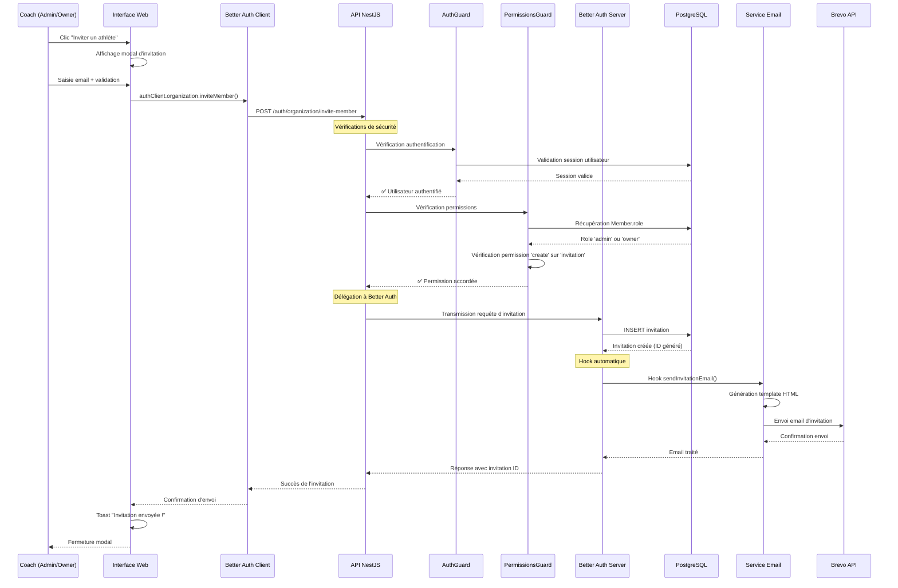
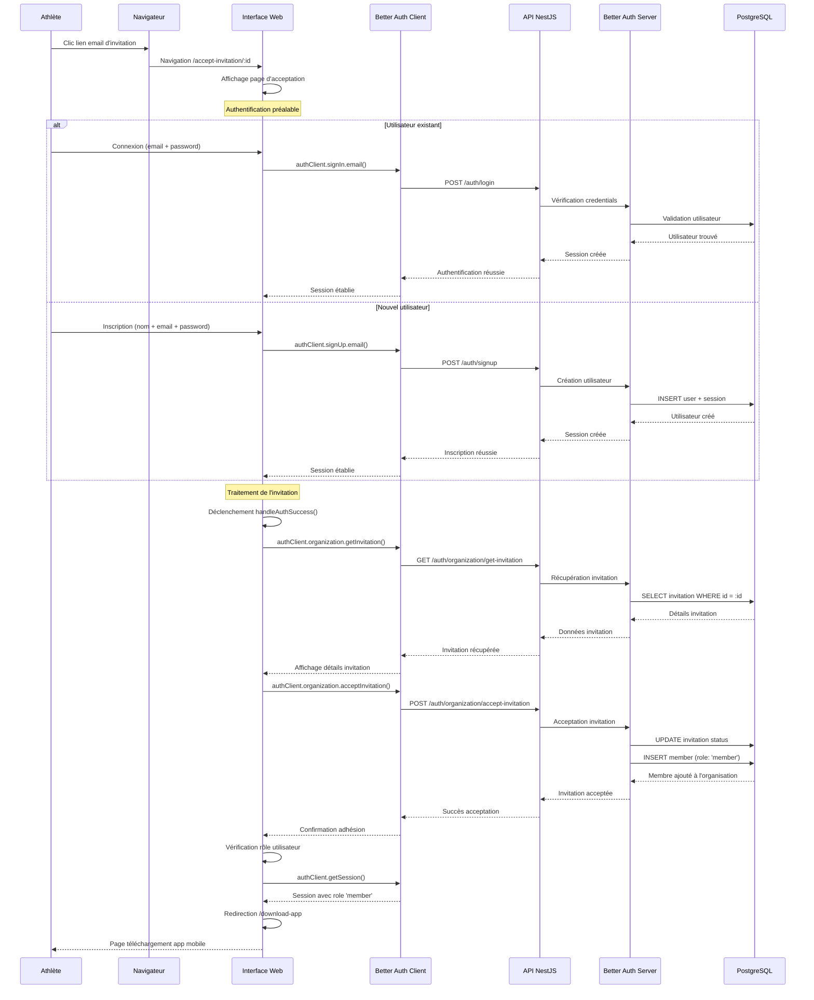

## Choix du modèle de permissions

### Évaluation des approches disponibles

Pour DropIt, j'ai opté pour un modèle RBAC (Role-Based Access Control) qui correspond aux besoins d'un contexte organisationnel structuré comme les clubs de sport. Ce choix s'est imposé après avoir évalué les différentes approches disponibles :

**RBAC (Role-Based Access Control)** : Permissions basées sur les rôles (owner, admin, member)
- ✅ Correspond à la hiérarchie naturelle des clubs
- ✅ Simple à comprendre et maintenir
- ✅ Nativement supporté par Better-Auth Organizations
- ✅ Évolutif avec l'organisation

**ACL (Access Control Lists)** : Permissions individuelles par ressource
- ❌ Trop granulaire pour le contexte club
- ❌ Complexité de gestion accrue
- ❌ Maintenance difficile avec de nombreux utilisateurs

**ABAC (Attribute-Based Access Control)** : Permissions basées sur des attributs contextuels
- ❌ Over-engineering pour les besoins actuels
- ❌ Complexité d'implémentation élevée
- ❌ Courbe d'apprentissage importante

**Scopes OAuth** : Permissions délimitées pour les applications tierces
- ❌ Non applicable dans ce contexte (pas d'intégration tierce)
- ❌ Conçu pour les APIs publiques

Le modèle RBAC s'aligne naturellement avec l'organisation hiérarchique des clubs de sport et bénéficie du support natif de Better-Auth, facilitant l'implémentation et la maintenance.

### Stratégies de contrôle d'accès

Pour implémenter le contrôle d'accès basé sur les rôles, plusieurs approches techniques étaient envisageables. J'ai évalué les options suivantes :

**Guards NestJS** (approche choisie)
- ✅ Intégration native avec l'architecture existante
- ✅ Composabilité avec l'AuthGuard déjà en place
- ✅ Support direct dans Better-Auth
- ✅ Debugging et maintenance simplifiés
- ✅ Granularité au niveau méthode

**Middleware Express**
- ❌ Moins granulaire (niveau route vs méthode)
- ❌ Difficulté d'accès aux métadonnées de route
- ❌ Logique partagée difficile

**API Gateway** (Kong, Traefik, Envoy)
- ❌ Complexité d'infrastructure supplémentaire
- ❌ Logique métier déportée hors de l'application
- ❌ Debugging plus complexe
- ❌ Coût d'exploitation

**Row Level Security (PostgreSQL)**
- ❌ Couplage fort avec la base de données
- ❌ Difficulté de test et de debug
- ❌ Logique business dans la DB
- ❌ Moins flexible pour l'évolution

**Moteurs dédiés** (OPA, Casbin)
- ❌ Over-engineering pour le contexte actuel
- ❌ Courbe d'apprentissage supplémentaire
- ❌ Infrastructure supplémentaire
- ❌ Complexité de déploiement

L'approche Guards s'intègre parfaitement avec l'infrastructure d'authentification déjà mise en place et offre la granularité nécessaire pour contrôler l'accès au niveau de chaque méthode de contrôleur.

## Configuration détaillée du package @dropit/permissions

### Structure complète des permissions

```typescript
import { createAccessControl } from "better-auth/plugins/access";
import { defaultStatements, ownerAc, adminAc, memberAc } from 'better-auth/plugins/organization/access';

/**
 * Définition complète des ressources et actions
 */
const statement = {
  // Ressources Better Auth par défaut
  ...defaultStatements,

  // Ressources métier DropIt
  workout: ["read", "create", "update", "delete"],
  workoutCategory: ["read", "create", "update", "delete"],
  exercise: ["read", "create", "update", "delete"],
  exerciseCategory: ["read", "create", "update", "delete"],
  complex: ["read", "create", "update", "delete"],
  complexCategory: ["read", "create", "update", "delete"],
  athlete: ["read", "create", "update", "delete"],
  session: ["read", "create", "update", "delete"],
  personalRecord: ["read", "create", "update", "delete"],
  trainingSession: ["read", "create", "update", "delete"],
  athleteTrainingSession: ["read", "update"],
  competitorStatus: ["read", "create", "update"],
  invitation: ["read", "create", "update", "delete"],
} as const;

export const ac = createAccessControl(statement);
```

### Définition détaillée des rôles

#### Rôle Member (Athlète)
```typescript
export const member = ac.newRole({
  // Hérite des permissions Better Auth pour les membres
  ...memberAc.statements,

  // Permissions métier spécifiques
  athlete: ["read", "create", "update", "delete"], // Gestion de son profil
  session: ["read"], // Consultation des sessions d'entraînement
  personalRecord: ["read", "create"], // Saisie de ses performances
  trainingSession: ["read"], // Consultation de ses entraînements
  athleteTrainingSession: ["read", "update"], // Interaction avec ses sessions
  competitorStatus: ["read"], // Consultation de son statut
  invitation: ["read"], // Consultation des invitations
});
```

#### Rôle Admin (Coach)
```typescript
export const admin = ac.newRole({
  // Hérite des permissions Better Auth pour les admins
  ...adminAc.statements,

  // Permissions complètes sur les ressources d'entraînement
  workout: ["read", "create", "update", "delete"],
  workoutCategory: ["read", "create", "update", "delete"],
  exercise: ["read", "create", "update", "delete"],
  exerciseCategory: ["read", "create", "update", "delete"],
  complex: ["read", "create", "update", "delete"],
  complexCategory: ["read", "create", "update", "delete"],
  athlete: ["read", "create", "update", "delete"],
  session: ["read", "create", "update", "delete"],
  personalRecord: ["read", "create", "update", "delete"],
  trainingSession: ["read", "create", "update", "delete"],
  athleteTrainingSession: ["read", "update"],
  competitorStatus: ["read", "create", "update"],
  invitation: ["read", "create", "update", "delete"],
});
```

#### Rôle Owner (Propriétaire)
```typescript
export const owner = ac.newRole({
  // Hérite de toutes les permissions admin Better Auth
  ...ownerAc.statements,

  // Permissions identiques à admin pour les ressources métier
  // Plus accès aux fonctionnalités de gestion d'organisation
  workout: ["read", "create", "update", "delete"],
  workoutCategory: ["read", "create", "update", "delete"],
  exercise: ["read", "create", "update", "delete"],
  exerciseCategory: ["read", "create", "update", "delete"],
  complex: ["read", "create", "update", "delete"],
  complexCategory: ["read", "create", "update", "delete"],
  athlete: ["read", "create", "update", "delete"],
  session: ["read", "create", "update", "delete"],
  personalRecord: ["read", "create", "update", "delete"],
  trainingSession: ["read", "create", "update", "delete"],
  athleteTrainingSession: ["read", "update"],
  competitorStatus: ["read", "create", "update"],
  invitation: ["read", "create", "update", "delete"],
});
```

## Implémentation complète du PermissionsGuard

```typescript
import { CanActivate, ExecutionContext, Injectable, ForbiddenException } from '@nestjs/common';
import { Reflector } from '@nestjs/core';
import { member, admin, owner } from '@dropit/permissions';
import { EntityManager } from '@mikro-orm/core';
import { Member } from '../../domain/organization/member.entity';
import { NO_ORGANIZATION } from '../decorators/permissions.decorator';

@Injectable()
export class PermissionsGuard implements CanActivate {
  constructor(
    private readonly reflector: Reflector,
    private readonly em: EntityManager
  ) {}

  async canActivate(context: ExecutionContext): Promise<boolean> {
    try {
      const request = context.switchToHttp().getRequest();
      const session = request.session;
      const user = session?.user;

      // 1. Vérifier que l'utilisateur existe dans la session
      if (!user) {
        throw new ForbiddenException('User not found in session');
      }

      // 2. Récupérer les permissions requises depuis le décorateur
      const requiredPermissions = this.reflector.get<string[]>(
        'REQUIRED_PERMISSIONS',
        context.getHandler()
      );

      // Si aucune permission requise, accès autorisé
      if (!requiredPermissions || requiredPermissions.length === 0) {
        return true;
      }

      // 3. Vérifier si c'est une action sans organisation
      const noOrganization = this.reflector.get<boolean>(
        NO_ORGANIZATION,
        context.getHandler()
      );

      if (noOrganization) {
        console.log('✅ [PermissionsGuard] No-org action granted');
        return true;
      }

      // 4. Déterminer la ressource depuis le nom du controller
      const controllerName = context.getClass().name;
      const resource = this.extractResourceFromController(controllerName);

      // 5. Vérifier que l'utilisateur appartient bien à une organisation
      const organizationId = session?.session?.activeOrganizationId;
      if (!organizationId) {
        throw new ForbiddenException('User does not belong to an organization');
      }

      // 6. Récupérer le rôle de l'utilisateur dans l'organisation
      const memberRecord = await this.em.findOne(Member, {
        user: { id: user.id },
        organization: { id: organizationId },
      });

      if (!memberRecord) {
        throw new ForbiddenException('User is not a member of this organization');
      }

      const organizationRole = memberRecord.role;

      // 7. Vérification des permissions basée sur le rôle d'organisation
      const hasPermission = this.checkUserRolePermissions(
        organizationRole,
        resource,
        requiredPermissions
      );

      if (hasPermission) {
        console.log('✅ [PermissionsGuard] Access granted for organization role:', organizationRole);
        return true;
      }

      // 8. Accès refusé
      console.log('❌ [PermissionsGuard] Access denied for organization role:', organizationRole);
      throw new ForbiddenException(
        `Access denied. Required permissions: ${requiredPermissions.join(', ')} for resource: ${resource}`
      );

    } catch (error) {
      console.error('❌ [PermissionsGuard] Error:', {
        error: error instanceof Error ? error.message : 'Unknown error',
        stack: error instanceof Error ? error.stack : 'No stack trace',
        timestamp: new Date().toISOString(),
      });

      throw new ForbiddenException('Permission check failed');
    }
  }

  /**
   * Extraction de la ressource depuis le nom du controller
   */
  private extractResourceFromController(controllerName: string): string {
    return controllerName
      .replace('Controller', '')
      .replace(/^([A-Z])/, (match) => match.toLowerCase())
      .replace(/([A-Z])/g, (match) => match);
  }

  /**
   * Vérification des permissions basée sur le rôle d'organisation
   */
  private checkUserRolePermissions(
    organizationRole: string,
    resource: string,
    requiredActions: string[]
  ): boolean {
    // Mapping des rôles vers les objets de permissions
    const rolePermissionsMap = {
      member: member.statements,
      admin: admin.statements,
      owner: owner.statements,
    };

    // Récupérer les permissions du rôle
    const userRolePermissions = rolePermissionsMap[
      organizationRole as keyof typeof rolePermissionsMap
    ];

    if (!userRolePermissions) {
      console.warn(`⚠️ [PermissionsGuard] Unknown organization role: ${organizationRole}`);
      return false;
    }

    // Récupérer les permissions pour la ressource spécifique
    const userResourcePermissions = (userRolePermissions[
      resource as keyof typeof userRolePermissions
    ] as string[]) || [];

    console.log('🔍 [PermissionsGuard] Permission check details:', {
      organizationRole,
      resource,
      userResourcePermissions,
      requiredActions,
    });

    // Vérifier si l'utilisateur a au moins une des permissions requises (mode OR)
    return requiredActions.some(action => userResourcePermissions.includes(action));
  }
}
```

## Intégration côté client React

### Hook usePermissions
```typescript
// @dropit/permissions/react
import { useSession } from '@better-auth/react';
import { member, admin, owner } from '@dropit/permissions';

export function usePermissions(resource: string) {
  const { data: session } = useSession();

  if (!session?.user) {
    return {
      canRead: false,
      canCreate: false,
      canUpdate: false,
      canDelete: false,
    };
  }

  // Récupérer le rôle d'organisation depuis la session
  const organizationRole = session.user.organizationRole; // À adapter selon votre implémentation

  const rolePermissionsMap = {
    member: member.statements,
    admin: admin.statements,
    owner: owner.statements,
  };

  const permissions = rolePermissionsMap[organizationRole]?.[resource] || [];

  return {
    canRead: permissions.includes('read'),
    canCreate: permissions.includes('create'),
    canUpdate: permissions.includes('update'),
    canDelete: permissions.includes('delete'),
  };
}
```

### Composant de protection
```typescript
import { usePermissions } from '@dropit/permissions/react';

interface ProtectedActionProps {
  resource: string;
  action: 'read' | 'create' | 'update' | 'delete';
  children: React.ReactNode;
  fallback?: React.ReactNode;
}

export function ProtectedAction({
  resource,
  action,
  children,
  fallback = null
}: ProtectedActionProps) {
  const permissions = usePermissions(resource);

  const canPerformAction = {
    read: permissions.canRead,
    create: permissions.canCreate,
    update: permissions.canUpdate,
    delete: permissions.canDelete,
  }[action];

  return canPerformAction ? <>{children}</> : <>{fallback}</>;
}

// Utilisation
function WorkoutList() {
  return (
    <div>
      <ProtectedAction resource="workout" action="create">
        <CreateWorkoutButton />
      </ProtectedAction>

      <ProtectedAction resource="workout" action="update">
        <EditWorkoutButton />
      </ProtectedAction>

      <ProtectedAction
        resource="workout"
        action="delete"
        fallback={<span>Accès restreint</span>}
      >
        <DeleteWorkoutButton />
      </ProtectedAction>
    </div>
  );
}
```

## Diagrammes de flux détaillés

### Flux d'invitation complète



### Flux d'acceptation d'invitation



## Détermination automatique des ressources

TOUTE CETTE PARTIE VA DANS LES ANNEXES

### Convention de nommage

J'ai implémenté une convention qui détermine automatiquement la ressource depuis le nom du contrôleur. Cette approche élimine la configuration manuelle et réduit les risques d'erreur :

```typescript
private extractResourceFromController(controllerName: string): string {
  return controllerName
    .replace('Controller', '')
    .replace(/^([A-Z])/, (match) => match.toLowerCase())
    .replace(/([A-Z])/g, (match) => match);
}
```

| Controller | Ressource extraite |
|------------|-------------------|
| `ExerciseController` | `exercise` |
| `WorkoutController` | `workout` |
| `PersonalRecordController` | `personalRecord` |

Cette convention me permet d'ajouter de nouveaux contrôleurs sans configuration supplémentaire, pourvu qu'ils respectent le pattern de nommage établi.

## Gestion des erreurs et monitoring

### Stratégie de gestion d'erreurs

Le PermissionsGuard implémente une gestion d'erreurs détaillée qui distingue les différents cas d'échec :

1. **User not found in session** : Problème d'authentification
2. **User does not belong to an organization** : Utilisateur non rattaché
3. **User is not a member of this organization** : Mauvaise organisation active
4. **Access denied** : Permissions insuffisantes

Chaque erreur génère une `ForbiddenException` avec un message spécifique, facilitant le diagnostic des problèmes d'accès.

## Flux d'invitation et gestion des membres

### Processus d'invitation sécurisé

L'ajout de nouveaux membres dans une organisation suit un processus contrôlé qui respecte les permissions établies. Seuls les utilisateurs ayant la permission `create` sur la ressource `invitation` peuvent inviter de nouveaux membres.

Le flux d'invitation implique plusieurs étapes : vérification des permissions du coach, création de l'invitation en base via Better-Auth, envoi automatique de l'email d'invitation, et gestion de l'acceptation avec attribution automatique du rôle approprié.

Cette implémentation garantit que seuls les responsables autorisés peuvent étendre l'organisation, tout en automatisant les aspects techniques du processus.