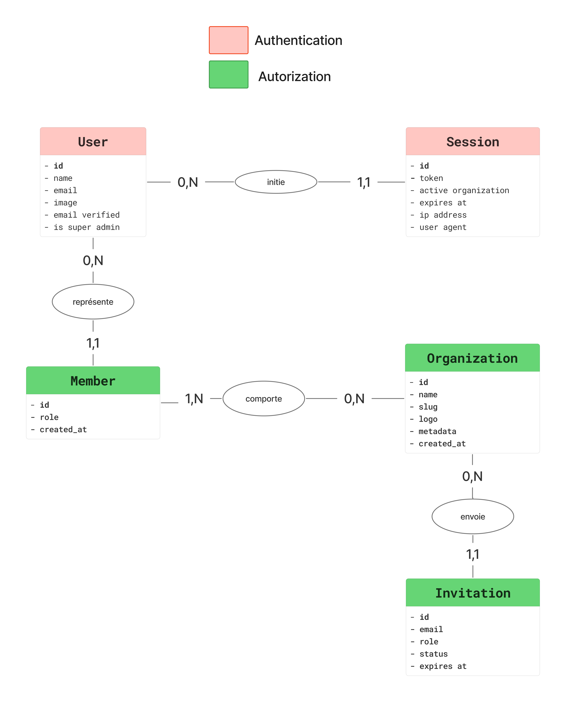
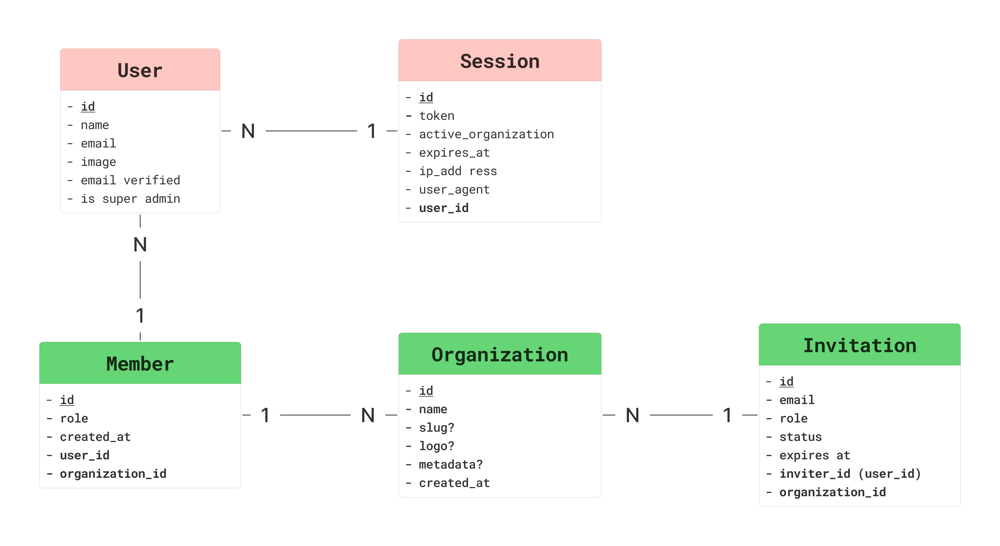
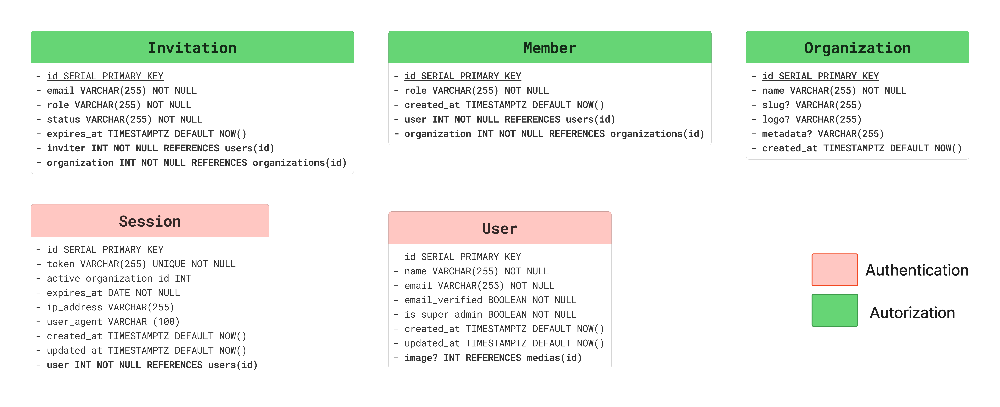

## Étude comparative des modèles de permissions

Cette section détaille la comparaison des différents modèles de contrôle d'accès évalués pour DropIt. Bien que le choix se soit porté sur RBAC avec Better-Auth Organizations, cette analyse démontre ma compréhension des approches modernes de gestion des permissions et justifie les décisions architecturales.

### ACL (Access Control Lists)

Le modèle ACL constitue une approche où chaque ressource maintient sa propre liste d'utilisateurs autorisés avec leurs permissions spécifiques. Cette méthode **granulaire** implique une gestion individuelle des droits pour chaque combinaison utilisateur-ressource.

**Analyse technique détaillée :**

**Avantages :**
- **Granularité maximale** : contrôle précis au niveau de chaque ressource
- **Flexibilité totale** : permissions personnalisées pour chaque utilisateur
- **Simplicité conceptuelle** : relation directe utilisateur-ressource-permission
- **Standard établi** : modèle bien documenté et maîtrisé

**Limitations pour DropIt :**

La gestion administrative devient rapidement complexe dans un contexte de club de sport. Avec des dizaines d'athlètes et plusieurs coachs, maintenir des listes individuelles pour chaque entraînement, exercice ou record personnel génère une charge administrative disproportionnée.

La scalabilité pose problème : l'ajout d'un nouvel athlète nécessite de configurer manuellement ses accès à chaque ressource existante. Cette approche ne reflète pas la réalité organisationnelle des clubs où les permissions suivent des patterns prévisibles selon le statut (athlète/coach).

L'absence de structure hiérarchique complexifie l'évolution des droits. Promouvoir un athlète expérimenté au rôle de coach assistant nécessite de modifier individuellement toutes ses permissions plutôt que de changer simplement son rôle.

### RBAC (Role-Based Access Control)

Le modèle RBAC structure les permissions autour de rôles organisationnels qui regroupent des ensembles cohérents de droits d'accès. Cette approche **hiérarchique** aligne les autorisations techniques sur l'organisation métier réelle.

**Structure technique d'un système RBAC :**
Les composants principaux incluent :
- **Utilisateurs** : personnes physiques (athlètes, coachs)
- **Rôles** : fonctions organisationnelles (member, admin, owner)
- **Permissions** : actions autorisées (read, create, update, delete)
- **Ressources** : entités métier (workout, exercise, athlete)


**Avantages :**
- **Alignement organisationnel** : reflète naturellement la hiérarchie des clubs
- **Simplicité de gestion** : attribution de rôles plutôt que de permissions individuelles
- **Évolutivité** : ajout de nouveaux utilisateurs par simple assignation de rôle
- **Maintenance réduite** : modification des permissions au niveau du rôle
- **Support natif** : intégration directe avec Better-Auth Organizations

**Structure des rôles :**
- **Member** : Lecture des programmes et création de ses performances personnelles
- **Admin** : Gestion complète des ressources d'entraînement et lecture des athlètes  
- **Owner** : Hérite des permissions admin plus gestion organisationnelle

**Évaluation pour DropIt :**
- ✅ **Correspondance métier** : les rôles athlète/coach/propriétaire existent naturellement
- ✅ **Simplicité administrative** : gestion par rôles plutôt que permissions individuelles
- ✅ **Évolutivité** : nouveaux membres par assignation de rôle
- ✅ **Support technique** : Better-Auth Organizations implémente nativement ce modèle
- ⚠️ **Granularité limitée** : moins flexible que ACL pour des cas spécifiques

### ABAC (Attribute-Based Access Control)

Le modèle ABAC représente l'évolution moderne des systèmes d'autorisation en évaluant les permissions selon des attributs contextuels dynamiques. Cette approche **contextuelle** permet des décisions d'accès basées sur des critères multiples et variables.

**Analyse technique détaillée :**

**Avantages :**
- **Flexibilité maximale** : règles dynamiques basées sur le contexte
- **Précision fine** : prise en compte de multiples facteurs simultanés
- **Évolutivité conceptuelle** : adaptation aux besoins métier complexes
- **Standards modernes** : alignement avec les pratiques enterprise

**Exemple de règle ABAC :**
```javascript
// Règle contextuelle complexe
permit if (
  user.role === 'coach' AND
  resource.type === 'workout' AND
  user.organization === resource.organization AND
  current_time within user.work_hours AND
  resource.level <= user.certification_level
);
```

**Limitations pour DropIt :**

La complexité d'implémentation dépasse largement les besoins actuels d'un club de sport. La définition et maintenance de règles contextuelles nécessitent une expertise spécialisée et des outils dédiés qui constituent un over-engineering pour le contexte actuel.

Les performances sont impactées par l'évaluation dynamique de multiples attributs à chaque requête, contrairement aux permissions statiques du RBAC. Le debugging et la traçabilité des décisions d'accès deviennent complexes avec des règles interdépendantes.

L'absence de support natif dans Better-Auth nécessiterait une implémentation custom coûteuse en développement et maintenance, incompatible avec les contraintes de temps et de ressources du projet.

### RBAC avec Better-Auth Organizations

L'implémentation RBAC de Better-Auth constitue une évolution optimisée qui combine la simplicité du modèle avec les fonctionnalités modernes d'un système multi-organisations. Cette solution **hybride** répond précisément aux besoins de DropIt.

Better-Auth Organizations implémente nativement :
1. **Gestion multi-organisations** : isolation des données par club
2. **Rôles hiérarchiques** : member, admin, owner avec permissions héritées
3. **APIs automatiques** : endpoints de gestion des invitations et rôles
4. **Intégration TypeScript** : types générés automatiquement

**Implémentation dans DropIt :**

```typescript
// Configuration automatique des permissions
const organizationConfig = {
  roles: ['member', 'admin', 'owner'],
  permissions: {
    member: ['read:own', 'create:personal'],
    admin: ['read:all', 'create:all', 'update:all'],
    owner: ['*']
  }
};
```

Cette approche combine la simplicité administrative du RBAC avec les fonctionnalités techniques nécessaires à une application multi-organisations moderne, évitant la complexité excessive de l'ABAC tout en dépassant les limitations de granularité de l'ACL traditionnel.

---

## Schémas de base de données détaillés

Cette section présente les schémas détaillés des entités d'autorisation du plugin Organization mentionnés dans la page d'implémentation. Bien que Better-Auth génère automatiquement ces structures RBAC, cette modélisation selon la méthode Merise démontre ma compréhension des patterns d'autorisation complexes et ma capacité à concevoir des systèmes de permissions cohérents.

#### Modèle Conceptuel de Données (MCD)

Modélisation Merise du système RBAC si j'avais dû le concevoir manuellement :



**Analyse des relations RBAC :**
- **User** appartient à une **Organization** (1,n)
- **User** peut avoir plusieurs **Roles** via l'association **Member** (n,n)
- **Role** dispose de plusieurs **Permissions** (n,n)
- Relations many-to-many nécessitant des tables d'association pour la normalisation

#### Modèle Logique de Données (MLD)

Résolution des associations many-to-many par des tables intermédiaires :



Les tables `Member` et `RolePermission` matérialisent les associations many-to-many, respectant les règles de normalisation pour éviter les redondances.

#### Modèle Physique de Données (MPD)

Implémentation optimisée avec contraintes et index pour les performances des requêtes d'autorisation :



Index composites sur (`userId`, `organizationId`) et (`roleId`, `permissionId`) pour optimiser les vérifications de permissions fréquentes dans l'application.
