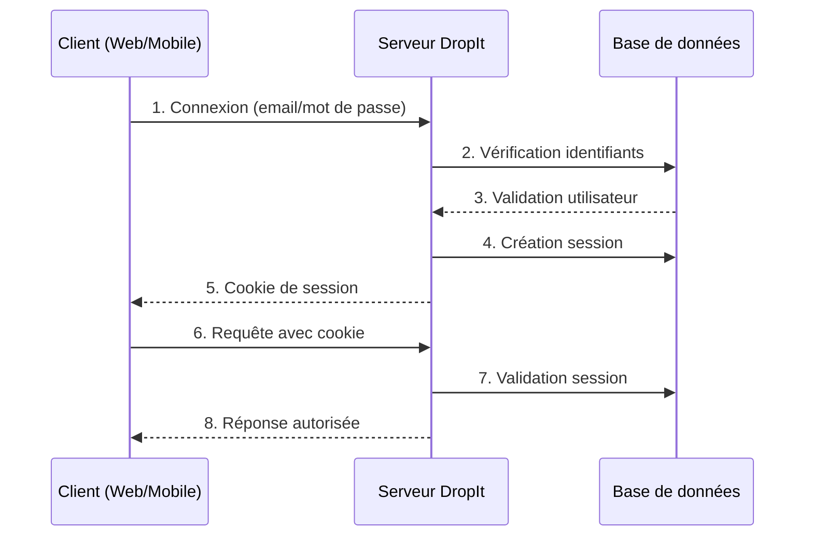
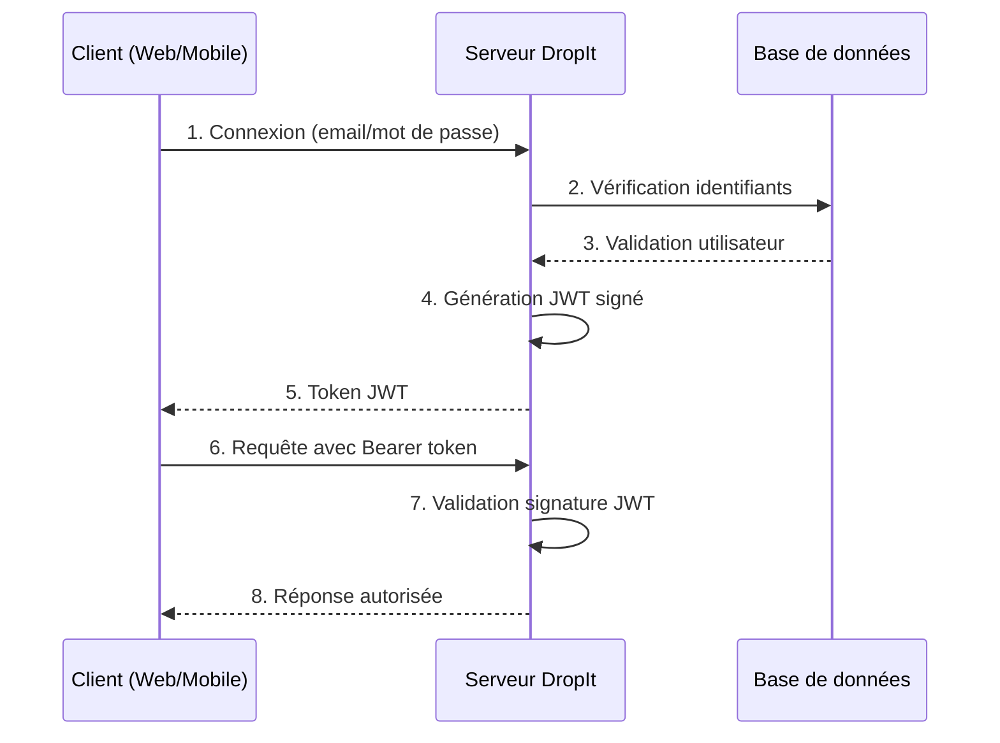

## Étude comparative des solutions d'authentification

### Sessions traditionnelles : analyse dans le contexte DropIt

Ma première réflexion s'est portée sur l'authentification par sessions, méthode traditionnelle que j'ai déjà implémentée dans des projets précédents. Cette approche présente des avantages indéniables pour le contrôle serveur et la révocation des accès, aspects particulièrement importants dans un contexte où les coachs peuvent avoir besoin de gérer les connexions de leurs athlètes.

Cependant, l'analyse approfondie révèle des limitations importantes pour DropIt. La compatibilité avec l'application mobile pose des défis, notamment pour la gestion des cookies dans un environnement natif. De plus, la nécessité de stocker les sessions côté serveur introduit une complexité de gestion qui pourrait impacter les performances lors de la montée en charge.

### JWT : évaluation pour une architecture moderne

L'exploration des JSON Web Tokens m'a séduit par leur approche stateless et leur excellente compatibilité multi-plateforme. Cette technologie répond directement aux contraintes identifiées pour DropIt, particulièrement la nécessité de servir à la fois le web et le mobile avec une API unifiée.

L'avantage principal des JWT pour DropIt réside dans leur capacité à transporter des informations utilisateur (rôle, club d'appartenance) directement dans le token, réduisant ainsi le nombre d'appels en base de données. Cette caractéristique s'avère particulièrement intéressante pour optimiser les performances de l'application mobile où la latence réseau peut impacter l'expérience utilisateur.

Néanmoins, mon analyse a révélé une limitation majeure : la difficulté de révocation des tokens avant leur expiration naturelle. Dans le contexte de DropIt, où un coach pourrait avoir besoin de suspendre immédiatement l'accès d'un athlète, cette contrainte constitue un frein significatif à l'adoption pure des JWT.