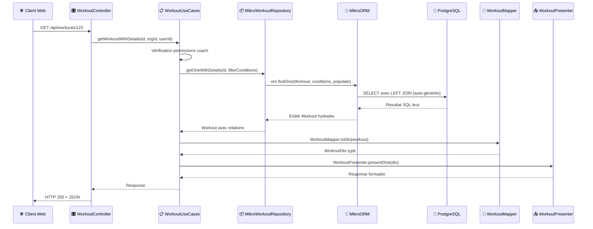

## Approches d'implémentation de la couche de données

Après avoir établi le modèle conceptuel avec la méthode Merise, plusieurs approches s'offraient à moi pour implémenter la couche d'accès aux données dans DropIt. Chacune présente des avantages selon le contexte de développement et les contraintes techniques du projet.

### Database First

Cette approche aurait consisté à créer directement les tables PostgreSQL via des scripts SQL, puis générer les entités TypeScript à partir du schéma existant. Pour illustrer cette méthode, voici comment j'aurais pu créer la table `workout` :

```sql
CREATE TABLE workout (
    id UUID PRIMARY KEY DEFAULT gen_random_uuid(),
    title VARCHAR(255) NOT NULL,
    description TEXT NOT NULL,
    category_id UUID NOT NULL,
    created_by UUID,
    created_at TIMESTAMP DEFAULT NOW(),
    updated_at TIMESTAMP DEFAULT NOW(),
    FOREIGN KEY (category_id) REFERENCES workout_category(id),
    FOREIGN KEY (created_by) REFERENCES users(id)
);

-- Table de jointure polymorphe pour les éléments de workout
CREATE TABLE workout_element (
    id UUID PRIMARY KEY DEFAULT gen_random_uuid(),
    workout_id UUID NOT NULL,
    type VARCHAR(20) NOT NULL CHECK (type IN ('exercise', 'complex')),
    exercise_id UUID,
    complex_id UUID,
    order_position INTEGER NOT NULL,
    sets INTEGER DEFAULT 1,
    reps INTEGER DEFAULT 1,
    rest INTEGER,
    start_weight_percent DECIMAL(5,2),
    FOREIGN KEY (workout_id) REFERENCES workout(id) ON DELETE CASCADE,
    FOREIGN KEY (exercise_id) REFERENCES exercise(id),
    FOREIGN KEY (complex_id) REFERENCES complex(id),
    CONSTRAINT check_one_element_type CHECK (
        (type = 'exercise' AND exercise_id IS NOT NULL AND complex_id IS NULL) OR
        (type = 'complex' AND complex_id IS NOT NULL AND exercise_id IS NULL)
    )
);
```

Cette méthode traditionnelle offre un contrôle total sur la structure de la base de données et garantit des performances optimales grâce à la maîtrise fine des index et contraintes. Cependant, elle présente plusieurs inconvénients.

La synchronisation entre le schéma de base de données et le code applicatif devient rapidement problématique. Chaque modification de table nécessite une mise à jour manuelle de l'interface TypeScript correspondante. Si j'ajoute une colonne `difficulty_level` à la table `workout`, je dois manuellement créer la propriété dans l'interface `WorkoutEntity`, avec le risque d'oublier cette étape ou de mal typer la propriété.

La maintenance des migrations peut représenter également un défi considérable. Les évolutions de schéma doivent être gérées via des scripts SQL écrits à la main, avec toute la complexité que cela implique. Par exemple, l'ajout d'une contrainte NOT NULL sur une colonne existante nécessite de vérifier que toutes les données respectent cette contrainte, nettoyer les valeurs nulles existantes, puis appliquer la contrainte - le tout en préservant la cohérence des données pendant la migration.

Sans outil d'orchestration approprié, les différents environnements peuvent facilement diverger. Un développeur qui applique manuellement un script SQL sur sa base locale mais oublie de le commiter dans le système de versioning crée une divergence silencieuse qui ne se révèle qu'au moment du déploiement en production.

### Schema First

Une approche intermédiaire utilise un fichier de définition de schéma central pour générer à la fois la base de données et les entités TypeScript. Cette méthode définit la structure des données dans un format déclaratif neutre, puis génère automatiquement les scripts SQL et les classes d'entités correspondantes.

Le principe consiste à maintenir une source de vérité unique qui décrit les tables, relations et contraintes, évitant ainsi les désynchronisations entre la base de données et le code applicatif. Cette solution résout effectivement les problèmes de cohérence de l'approche Database First.

Cependant, cette approche ne s'harmonise pas idéalement avec l'architecture monorepo que j'ai mise en place. Les packages partagés comme @dropit/schemas définissent déjà des schémas Zod réutilisés à travers toutes les applications. Ajouter un fichier de schéma supplémentaire créerait une redondance : j'aurais les schémas Zod pour la validation côté client et serveur, plus un schéma séparé pour la génération de base de données. Cette duplication augmente le risque d'incohérences et complique la maintenance.

De plus, l'intégration native avec l'écosystème TypeScript se trouve compromise. Les types générés depuis un schéma externe ne bénéficient pas de l'auto-complétion et de la vérification de types aussi efficacement que les entités définies directement en TypeScript, et le partage de ces types avec les packages communs du monorepo devient plus complexe.

### Code First

J'ai donc finalement retenu l'approche Code First qui définit les entités directement en TypeScript avec les décorateurs MikroORM. Cette méthode résout les inconvénients des deux approches précédentes en s'intégrant nativement dans l'écosystème du monorepo. Les entités MikroORM peuvent directement réutiliser et référencer les types définis dans les packages partagés (@dropit/schemas, @dropit/contract), créant une cohérence technique complète.

La génération automatique des migrations à partir des modifications d'entités élimine les risques de désynchronisation tout en préservant un contrôle précis sur la structure de données. Cette approche tire également parti de l'auto-complétion et de la vérification de types native de TypeScript, facilitant le développement et réduisant les erreurs de compilation.

## Définition des entités MikroORM

Après avoir justifié le choix de l'approche Code First, il convient maintenant d'examiner concrètement comment les entités MikroORM traduisent le modèle conceptuel en implémentation TypeScript.

Les entités constituent la traduction directe du modèle logique de données en classes TypeScript annotées. Chaque entité encapsule à la fois la structure des données et les relations métier.

### Structure type d'une entité

```typescript
@Entity()
export class Workout {
  @PrimaryKey({ type: 'uuid', defaultRaw: 'gen_random_uuid()' })
  id!: string;

  @Property()
  title!: string;

  @Property()
  description!: string;

  @ManyToOne(() => WorkoutCategory)
  category!: WorkoutCategory;

  @ManyToOne(() => User, { nullable: true })
  createdBy!: User | null;

  @OneToMany(() => WorkoutElement, (element) => element.workout)
  elements = new Collection<WorkoutElement>(this);

  @Property({ onCreate: () => new Date() })
  createdAt: Date = new Date();

  @Property({ onUpdate: () => new Date() })
  updatedAt: Date = new Date();
}
```

Cette entité `Workout` illustre plusieurs patterns que j'ai adoptés systématiquement :

**Identifiants UUID** : L'utilisation de `gen_random_uuid()` évite les conflits lors des synchronisations entre environnements et facilite les opérations de fusion de données.

**Relations typées** : Les décorateurs `@ManyToOne` et `@OneToMany` établissent les relations avec typage strict, permettant à TypeScript de détecter les erreurs de navigation d'objets à la compilation.

**Collections MikroORM** : Les relations one-to-many utilisent le type `Collection<T>` qui encapsule la logique de chargement paresseux et de gestion des relations bidirectionnelles.

**Timestamps automatiques** : Les propriétés `createdAt` et `updatedAt` s'actualisent automatiquement via les callbacks `onCreate` et `onUpdate`.

### Gestion des relations polymorphes

L'entité `WorkoutElement` illustre la résolution du pattern polymorphe identifié dans le modèle logique :

```typescript
@Entity()
@Check({
  name: 'check_one_element_type',
  expression: `
    (type = 'exercise' AND exercise_id IS NOT NULL AND complex_id IS NULL) OR
    (type = 'complex' AND complex_id IS NOT NULL AND exercise_id IS NULL)
  `,
})
export class WorkoutElement {
  @Enum({ items: () => Object.values(WORKOUT_ELEMENT_TYPES) })
  type!: WorkoutElementType;

  @ManyToOne(() => Exercise, { nullable: true })
  exercise?: Exercise;

  @ManyToOne(() => Complex, { nullable: true })
  complex?: Complex;

  @Property()
  sets!: number;

  @Property()
  reps!: number;
  
  // Autres propriétés communes...
}
```

Le décorateur `@Check` traduit la contrainte logique en contrainte PostgreSQL, garantissant l'intégrité des données même en cas d'accès direct à la base. Cette approche combine la flexibilité du polymorphisme avec la rigueur des contraintes relationnelles.

Pour optimiser les performances futures des requêtes sur cette table polymorphe, un index composite sur `(type, exercise_id, complex_id)` pourrait s'avérer nécessaire selon l'évolution des volumes. Actuellement, PostgreSQL utilise les index automatiques des clés étrangères, mais si les requêtes de filtrage par type deviennent fréquentes, cet index spécialisé accélérerait significativement les recherches d'éléments par discriminant.

## Architecture en couches et pattern Repository

Les entités MikroORM définissent la structure des données, mais leur utilisation dans l'application nécessite une architecture bien organisée pour séparer les responsabilités et faciliter la maintenance. L'accès aux données dans DropIt respecte une séparation stricte des responsabilités via le pattern Repository et l'architecture hexagonale adoptée dans l'API NestJS.

### Séparation des responsabilités

L'architecture que j'ai mise en place respecte une séparation stricte des responsabilités à travers plusieurs couches distinctes. Chaque composant a un rôle précis que je vais détailler avec des exemples concrets de l'implémentation DropIt.

#### Interface Layer : exposition HTTP

**Controllers** gèrent uniquement le protocole HTTP et orchestrent les vérifications de sécurité avant de déléguer la logique métier. Ils remplissent plusieurs rôles cruciaux :

```typescript
@UseGuards(PermissionsGuard) // 1. Garde globale sur toutes les méthodes
@Controller()
export class WorkoutController {
  
  @TsRestHandler(c.getWorkout) // 2. Respect du contrat ts-rest
  @RequirePermissions('read')  // 3. Permission spécifique requise
  getWorkout(
    @CurrentOrganization() organizationId: string, // 4. Extraction contexte organisation
    @CurrentUser() user: AuthenticatedUser         // 5. Extraction utilisateur authentifié
  ): ReturnType<typeof tsRestHandler<typeof c.getWorkout>> {
    return tsRestHandler(c.getWorkout, async ({ params }) => {
      // 6. Délégation immédiate vers la logique métier
      return await this.workoutUseCases.getWorkoutWithDetails(params.id, organizationId, user.id);
    });
  }

  @TsRestHandler(c.createWorkout)
  @RequirePermissions('create') // Permission différente pour la création
  createWorkout(
    @CurrentOrganization() organizationId: string,
    @CurrentUser() user: AuthenticatedUser
  ): ReturnType<typeof tsRestHandler<typeof c.createWorkout>> {
    return tsRestHandler(c.createWorkout, async ({ body }) => {
      return await this.workoutUseCases.createWorkout(body, organizationId, user.id);
    });
  }
}
```

Le controller orchestre plusieurs mécanismes de sécurité en cascade :

**Niveau 1 - Authentification** : Le `PermissionsGuard` vérifie que l'utilisateur possède un token valide et extrait ses informations via `@CurrentUser()`.

**Niveau 2 - Isolation organisationnelle** : Le décorateur `@CurrentOrganization()` garantit que l'utilisateur ne peut accéder qu'aux ressources de son organisation, empêchant tout accès transversal entre clubs.

**Niveau 3 - Permissions granulaires** : `@RequirePermissions('read')` vérifie que l'utilisateur dispose du droit spécifique requis pour cette action. Un membre simple peut avoir le droit 'read' mais pas 'create' ou 'delete'.

**Niveau 4 - Contrat d'API** : `@TsRestHandler(c.getWorkout)` assure que les paramètres d'entrée et les réponses correspondent exactement au contrat défini dans `@dropit/contract`, garantissant la type safety entre l'API et les clients.

Cette approche multicouche me permet d'appliquer le principe de défense en profondeur : même si une vérification échoue, les autres barrières protègent l'accès aux données. Le controller reste simple et focalisé sur son rôle d'orchestration HTTP, sans jamais contenir de logique métier.

**Mappers** transforment les entités de base de données en objets de transfert (DTO) pour l'API. Ils remplissent deux rôles essentiels :

```typescript
export const WorkoutMapper = {
  toDto(workout: Workout): WorkoutDto {
    return {
      id: workout.id,
      title: workout.title,
      workoutCategory: workout.category.name, // Simplification : juste le nom au lieu de l'objet complet
      description: workout.description,
      elements: workout.elements.getItems().map(/* transformation des éléments */),
    };
  }
}
```

D'une part, ils **respectent le contrat d'API ts-rest** défini dans `@dropit/contract`. Le type de retour `WorkoutDto` correspond exactement au schéma attendu par les clients, garantissant la cohérence entre l'API et les applications web/mobile qui l'utilisent.

D'autre part, ils **protègent le schéma de base de données** en ne exposant pas directement les structures internes. Par exemple, l'entité `Workout` contient une relation complète vers `WorkoutCategory` avec tous ses champs (id, description, createdBy, timestamps), mais le mapper ne expose que le nom de la catégorie. Cette approche évite de révéler des détails d'implémentation comme les clés étrangères, les champs techniques ou les relations qui ne concernent pas le client.

**Presenters** standardisent le formatage des réponses et gèrent la logique de présentation des données. Ils remplissent plusieurs responsabilités importantes :

```typescript
export const WorkoutPresenter = {
  // Succès avec données
  presentOne(workout: WorkoutDto) {
    return { status: 200 as const, body: workout };
  },
  
  // Succès avec liste
  presentList(workouts: WorkoutDto[]) {
    return { 
      status: 200 as const, 
      body: workouts 
    };
  },

  // Succès de création (code différent)
  presentCreationSuccess(message: string) {
    return { 
      status: 201 as const, 
      body: { message } 
    };
  },

  // Gestion centralisée des erreurs
  presentError(error: Error) {
    if (error instanceof BadRequestException) {
      return { status: 400 as const, body: { message: error.message } };
    }
    if (error instanceof ForbiddenException) {
      return { status: 403 as const, body: { message: error.message } };
    }
    if (error instanceof NotFoundException) {
      return { status: 404 as const, body: { message: error.message } };
    }
    
    // Masquage des erreurs internes en production
    console.error('Workout error:', error);
    return {
      status: 500 as const,
      body: { message: 'An error occurred while processing the request' }
    };
  }
}
```

Le Presenter joue un rôle crucial dans plusieurs aspects :

**Normalisation des codes de statut** : Il garantit que chaque type d'opération retourne le code HTTP approprié (200 pour lecture, 201 pour création, 404 pour non trouvé). Cette cohérence facilite la gestion côté client.

**Sécurisation des messages d'erreur** : Le Presenter filtre les erreurs techniques internes pour ne pas exposer de détails d'implémentation au client. Une erreur de base de données devient un message générique, protégeant la sécurité de l'application.

**Centralisation du formatage** : Tous les Use Cases utilisent le même Presenter, garantissant un format de réponse cohérent pour l'ensemble de l'API. Si je décide de changer la structure des réponses (ajouter des métadonnées, modifier l'enveloppe JSON), un seul point de modification suffit.

**Évolutivité du format de sortie** : Le Presenter pourrait facilement être adapté pour produire d'autres formats que JSON : XML, CSV, ou même des templates HTML pour une interface web. Cette flexibilité ne nécessiterait aucune modification des Use Cases.


#### Application Layer : orchestration métier

**Use Cases** concentrent la logique applicative et les règles métier spécifiques au domaine de l'haltérophilie. Ils orchestrent les différents repositories tout en appliquant des vérifications métier critiques pour la sécurité des utilisateurs :

```typescript
async createWorkout(workout: CreateWorkout, organizationId: string, userId: string) {
  // 1. Vérifications d'autorisation métier
  const isCoach = await this.memberUseCases.isUserCoachInOrganization(userId, organizationId);
  if (!isCoach) throw new ForbiddenException('User is not coach of this organization');

  // 2. Vérification de l'existence de la catégorie avec filtres organisationnels
  const coachFilterConditions = await this.memberUseCases.getCoachFilterConditions(organizationId);
  const category = await this.workoutCategoryRepository.getOne(workout.workoutCategory, coachFilterConditions);

  if (!category) {
    throw new NotFoundException(
      `Workout category with ID ${workout.workoutCategory} not found or access denied`
    );
  }

  // 3. Vérification de l'existence et de l'accès aux exercices/complexes
  for (const element of workout.elements) {
    if (element.type === WORKOUT_ELEMENT_TYPES.EXERCISE) {
      const exercise = await this.exerciseRepository.getOne(element.id, coachFilterConditions);
      if (!exercise) {
        throw new NotFoundException(`Exercise with ID ${element.id} not found or access denied`);
      }
    } else {
      const complex = await this.complexRepository.getOne(element.id, coachFilterConditions);
      if (!complex) {
        throw new NotFoundException(`Complex with ID ${element.id} not found or access denied`);
      }
    }
  }

  // 4. Si une session d'entraînement est demandée, vérifier l'existence des athlètes
  if (workout.trainingSession) {
    for (const athleteId of workout.trainingSession.athleteIds) {
      const athlete = await this.athleteRepository.getOne(athleteId);
      if (!athlete) {
        throw new NotFoundException(`Athlete with ID ${athleteId} not found`);
      }
    }
  }

  // 4. Création avec logique d'orchestration
  const createdWorkout = await this.workoutRepository.save(workoutToCreate);
  
  // 5. Transformation pour l'exposition
  const workoutDto = WorkoutMapper.toDto(createdWorkout);
  return WorkoutPresenter.presentOne(workoutDto);
}
```

Les Use Cases appliquent des vérifications métier qui nécessitent l'accès aux données. 

Avant de créer un workout, le Use Case vérifie systématiquement que la catégorie, les exercices et les complexes référencés existent ET sont accessibles par le coach via les `coachFilterConditions`. Cette double vérification empêche un coach de créer un workout utilisant des ressources d'un autre club, garantissant l'isolation des données entre organisations.

Lorsque le workout inclut une session d'entraînement avec des athlètes assignés, le Use Case vérifie que chaque `athleteId` correspond à un athlète existant en base de données. Cette validation d'intégrité référentielle ne peut être faite qu'au moment de l'exécution avec un accès effectif aux données, contrairement aux validations de structure que Zod peut effectuer.

Le Use Case orchestre également plusieurs règles d'autorisation en combinant différentes vérifications (coach de l'organisation + accès aux ressources spécifiques) qui nécessitent des appels à plusieurs repositories. Cette logique d'orchestration dépasse largement le cadre de la validation de schéma et constitue le cœur de la logique applicative.

Cette approche centralise la logique métier critique tout en la gardant indépendante de l'infrastructure technique. Les règles d'autorisation et de cohérence restent les mêmes même si je change de base de données ou d'interface d'exposition.

#### Domain Layer : modèle métier

Les entités représentent les concepts métier du domaine de l'haltérophilie avec leurs règles et contraintes. Dans l'implémentation actuelle, elles utilisent des décorateurs MikroORM pour définir leur mapping vers la base de données :

```typescript
@Entity() // Décorateur qui marque cette classe comme une entité de base de données
@Check({
  name: 'check_one_element_type',
  expression: `(type = 'exercise' AND exercise_id IS NOT NULL) OR (type = 'complex' AND complex_id IS NOT NULL)`
})
export class WorkoutElement {
  @PrimaryKey({ type: 'uuid', defaultRaw: 'gen_random_uuid()' })
  id!: string;

  @Enum({ items: () => Object.values(WORKOUT_ELEMENT_TYPES) })
  type!: WorkoutElementType; // Enum contraint à 'exercise' ou 'complex'
  
  @ManyToOne(() => Exercise, { nullable: true })
  exercise?: Exercise; // Relation optionnelle vers un exercice
  
  @ManyToOne(() => Complex, { nullable: true })
  complex?: Complex; // Relation optionnelle vers un complexe
  
  @Property()
  sets!: number; // Nombre de séries
  
  @Property()
  reps!: number; // Nombre de répétitions
  
  @Property({ onCreate: () => new Date() })
  createdAt: Date = new Date(); // Timestamp automatique
}
```

Chaque décorateur MikroORM a un rôle spécifique dans le mapping objet-relationnel :

Le décorateur `@Entity()` indique à MikroORM que cette classe TypeScript correspond à une table en base de données. La façon dont le schéma sera généré sera détaillée dans la partie configuration MikroORM et Migration.

Les décorateurs `@Property()` mappent les propriétés simples vers des colonnes de base de données. MikroORM infère automatiquement le type SQL approprié (VARCHAR, INTEGER, TIMESTAMP) selon le type TypeScript déclaré.

Les décorateurs de relation comme `@ManyToOne()` établissent les associations entre entités et génèrent automatiquement les clés étrangères correspondantes. L'option `nullable: true` permet d'avoir une relation optionnelle, essentielle pour le pattern polymorphe de `WorkoutElement`.

Le décorateur `@Check()` traduit une règle métier en contrainte PostgreSQL. Dans cet exemple, il garantit qu'un élément de workout référence soit un exercice, soit un complexe, mais jamais les deux simultanément. Cette contrainte de base de données renforce l'intégrité même en cas d'accès direct aux données.

Les décorateurs automatiques comme `@Property({ onCreate: () => new Date() })` configurent des comportements de lifecycle. MikroORM mettra automatiquement à jour la date de création lors de l'insertion en base.

Cette approche présente cependant une limitation par rapport à l'architecture hexagonale pure. Idéalement, les entités du domaine ne devraient contenir aucune dépendance vers l'infrastructure technique. Une implémentation strictement hexagonale nécessiterait la création d'entités "pures" sans décorateurs MikroORM, accompagnées de mappers séparés pour la transformation vers les entités de persistence.

Cette séparation permettrait une indépendance complète vis-à-vis de l'ORM choisi. Les entités métier pourraient évoluer selon les besoins business sans être contraintes par les limitations techniques de MikroORM. Un changement vers Prisma, TypeORM ou même une approche sans ORM ne nécessiterait que la réécriture des mappers, laissant intact le cœur métier de l'application.

#### Infrastructure Layer : accès aux données

L'Infrastructure Layer contient les **Repositories** qui assurent la persistance des données. MikroORM propose nativement des repositories automatiques pour chaque entité annotée `@Entity()`, accessibles directement via l'injection de dépendance. Ces repositories par défaut offrent les opérations CRUD basiques (`findOne`, `find`, `save`, `remove`) sans configuration supplémentaire.

Pour certains cas spécifiques, il peut être intéressant d'étendre ces repositories automatiques. Par exemple, la méthode `getOneWithDetails` nécessite un populate profond sur plusieurs niveaux de relations (workout → elements → exercise/complex → categories) avec des conditions de filtrage organisationnel. Cette requête spécialisée justifie la création d'un repository personnalisé qui respecte les contrats définis par l'Application Layer :

```typescript
@Injectable()
export class MikroWorkoutRepository extends EntityRepository<Workout> implements IWorkoutRepository {
  constructor(public readonly em: EntityManager) {
    super(em, Workout);
  }

  // Méthode spécialisée avec populate profond et filtrage organisationnel
  async getOneWithDetails(id: string, coachFilterConditions: CoachFilterConditions): Promise<Workout | null> {
    return await this.em.findOne(
      Workout,
      { id, $or: coachFilterConditions.$or },
      {
        populate: [
          'category',
          'elements',
          'elements.exercise',
          'elements.exercise.exerciseCategory',
          'elements.complex',
          'elements.complex.complexCategory',
          'elements.complex.exercises',
          'elements.complex.exercises.exercise',
          'elements.complex.exercises.exercise.exerciseCategory',
          'createdBy'
        ],
      }
    );
  }
}
```

Cette approche hybride me donne le meilleur des deux mondes. L'héritage d'`EntityRepository<Workout>` conserve l'accès aux méthodes MikroORM optimisées (comme `findOne`, `save`), tandis que l'implémentation de `IWorkoutRepository` garantit le respect du contrat métier défini dans l'Application Layer. L'`EntityManager` injecté donne accès à toutes les opérations de persistence avancées, mais le Repository n'expose aux Use Cases que les méthodes strictement nécessaires comme cette requête spécialisée `getOneWithDetails` impossible à réaliser avec les repositories automatiques.

#### Gestion du multi-tenancy

La gestion du multi-tenancy au sein de DropIt présente une particularité importante : chaque coach possède son propre catalogue d'exercices personnalisés qu'il développe au fil du temps. Cette approche répond à un besoin métier spécifique de l'haltérophilie où les coachs construisent leur méthode et leurs variantes d'exercices sur le long terme. Si un coach change de club, il doit pouvoir conserver son catalogue personnel sans emporter les athlètes de l'ancien club.

Cette logique d'appartenance crée une double isolation : les données d'organisation (athlètes) et les données personnelles de coach (catalogue d'exercices, complexes, programmes). Cette exigence fondamentale impacte chaque requête de base de données.

La solution traditionnelle consisterait à créer une base de données séparée par organisation, mais cette approche pose plusieurs problèmes concrets. D'abord, la **scalabilité** devient problématique : créer 100 clubs nécessiterait 100 bases de données identiques avec 100 connexions séparées à gérer. Ensuite, la **maintenance** se complique énormément : chaque migration de schéma doit être appliquée sur toutes les bases, chaque backup doit être géré individuellement, et la supervision technique devient un cauchemar administratif.

J'ai opté pour une approche de "row-level security" logicielle : plutôt que d'isoler physiquement les données, j'applique des filtres automatiques à chaque requête pour n'afficher que les lignes (rows) auxquelles l'utilisateur a accès. Cette sécurité au niveau des enregistrements s'intègre directement dans les requêtes via les `CoachFilterConditions`.

PostgreSQL propose nativement des politiques RLS (Row Level Security) qui pourraient automatiser ce filtrage directement au niveau de la base de données. Cependant, cette approche aurait nécessité une gestion complexe des contextes utilisateur au niveau SQL et une coordination délicate avec l'architecture NestJS. L'implémentation logicielle me donne plus de flexibilité pour adapter les règles d'accès selon l'évolution des besoins métier, tout en conservant une logique centralisée dans les Use Cases.

Chaque entité possède un champ `createdBy` qui référence l'utilisateur créateur. Les conditions de filtrage appliquent automatiquement les règles d'isolation organisationnelle :

```typescript
export type CoachFilterConditions = {
  $or: [
    { createdBy: null }, // Entités publiques (exercices de base, seedings)
    { createdBy: { id: { $in: string[] } } }, // Entités créées par les coachs de l'organisation
  ];
};
```

Cette structure permet deux niveaux d'accès. Les entités publiques (`createdBy: null`) correspondent aux données de base injectées par les seeders : exercices officiels d'haltérophilie, catégories standard, etc. Ces ressources sont accessibles à tous les clubs. Les entités privées appartiennent à des coachs spécifiques et ne sont accessibles qu'aux membres de la même organisation.

La vérification d'appartenance organisationnelle s'effectue dans l'Application Layer via `MemberUseCases.getCoachFilterConditions(organizationId)`, qui récupère la liste des IDs de tous les coachs de l'organisation courante. Cette liste alimente ensuite le filtre `{ createdBy: { id: { $in: string[] } } }` appliqué systématiquement à chaque opération de Repository.

Cette approche défensive garantit qu'même si un utilisateur tente d'accéder à un workout qui ne lui appartient pas (que ce soit par erreur de requête, bug dans l'interface, ou tentative malveillante), la requête retournera `null` car les conditions de filtrage l'excluront automatiquement. La sécurité est ainsi assurée même en cas de faille potentielle dans la couche de présentation ou d'authentification, créant une défense en profondeur au niveau de la persistance des données.

#### Génération automatique des requêtes

MikroORM s'appuie sur Knex.js, une bibliothèque JavaScript de construction de requêtes SQL (query builder), pour transformer les opérations TypeScript en requêtes PostgreSQL. Cette couche d'abstraction permet à MikroORM de générer automatiquement les requêtes optimisées sans que je doive les écrire manuellement.

Lorsque j'utilise l'option `populate` pour charger les relations d'une entité, MikroORM génère automatiquement toutes les jointures nécessaires en une seule requête plutôt que d'exécuter une requête par relation. Cette optimisation évite le "problème N+1" : au lieu de faire 1 requête pour récupérer un workout puis N requêtes supplémentaires pour récupérer chacun de ses éléments, MikroORM génère une seule requête avec toutes les jointures LEFT nécessaires.

Par exemple, pour récupérer un workout avec tous ses éléments et leurs relations, une approche naïve nécessiterait potentiellement des dizaines de requêtes séparées. Avec le populate, MikroORM génère une seule requête avec toutes les jointures, réduisant drastiquement les aller-retours avec la base de données et améliorant les performances.

Cette couche Infrastructure isole complètement la logique métier des détails techniques de persistence. Je peux changer d'ORM (vers Prisma, TypeORM) ou de base de données (vers MySQL, SQLite) sans impacter les Use Cases, seuls les Repositories devront être réimplémentés en respectant les mêmes interfaces.

#### Bénéfices de l'architecture en couches

Cette séparation en couches résout plusieurs problèmes que j'ai identifiés dans des architectures plus simples. La testabilité s'améliore considérablement car chaque couche peut être testée indépendamment en simulant ses dépendances : les Use Cases se testent sans connexion à la base de données, les Controllers sans logique métier complexe. 

L'évolutivité devient naturelle puisque la modification d'une couche n'impacte pas les autres. Je peux faire évoluer le modèle de données sans toucher à l'API REST, ou changer l'interface d'exposition sans modifier la logique métier. Cette indépendance facilite grandement la maintenance et l'ajout de nouvelles fonctionnalités.

La réutilisabilité constitue également un avantage important. Les Use Cases peuvent être réutilisés par différentes interfaces d'exposition (API REST, GraphQL, interface en ligne de commande) sans duplication de code. Cette architecture modulaire me permet d'envisager sereinement l'évolution technique de DropIt selon les besoins futurs.

### Flux de données

Pour illustrer concrètement cette architecture, voici le trajet d'une requête simple de récupération d'un workout :



Ce diagramme illustre comment chaque couche a sa responsabilité spécifique : le Controller gère le protocole HTTP, le UseCase orchestre la logique métier et les permissions, le Repository abstrait l'accès aux données, et le Mapper/Presenter formatent les données pour le client.

Cette approche technique avec MikroORM représente un choix délibéré face aux alternatives que je maîtrise. L'écriture manuelle de requêtes SQL m'aurait permis un contrôle fin sur les performances et l'optimisation, mais au prix d'une complexité de maintenance importante. Les requêtes avec jointures multiples nécessitent une gestion minutieuse du mapping vers les objets TypeScript et une logique de regroupement complexe pour reconstruire les hiérarchies relationnelles.

En optant pour MikroORM, j'ai privilégié la productivité de développement et la sécurité du typage strict. L'ORM élimine le mapping manuel, détecte les erreurs de relations à la compilation, et génère automatiquement les jointures optimisées. Cette approche reste flexible : pour des cas particuliers nécessitant des optimisations spécifiques, l'EntityManager permet toujours d'écrire des requêtes SQL manuelles quand le populate atteint ses limites.

## Pattern Unit of Work et gestion transactionnelle

### Le pattern Unit of Work

Le pattern Unit of Work consiste à maintenir une liste de tous les objets modifiés pendant une transaction et à coordonner leur écriture en base de données en une seule fois. Plutôt que de sauvegarder chaque modification immédiatement, ce pattern accumule les changements en mémoire puis les applique tous ensemble lors d'un "flush".

MikroORM implémente nativement ce pattern : lorsque je modifie une entité chargée, elle est automatiquement marquée comme "dirty" sans déclencher immédiatement une requête SQL. C'est seulement lors de l'appel à `flush()` que toutes les modifications sont synchronisées avec la base de données dans l'ordre approprié.

### Transactions et propriétés ACID

Les transactions garantissent les propriétés ACID (Atomicity, Consistency, Isolation, Durability) essentielles pour l'intégrité des données :

- **Atomicité** : Soit toutes les opérations réussissent, soit aucune n'est appliquée
- **Cohérence** : Les contraintes de base de données sont respectées à la fin de la transaction
- **Isolation** : Les transactions concurrentes n'interfèrent pas entre elles
- **Durabilité** : Une fois validée, la transaction persiste même en cas de panne système

Dans le contexte de DropIt, cela signifie qu'un workout ne peut pas être créé avec des éléments orphelins, ou qu'un athlète ne peut pas être supprimé s'il participe encore à des sessions d'entraînement.

### Fonctionnement automatique avec NestJS

MikroORM s'intègre avec le système d'intercepteurs de NestJS pour fournir automatiquement une transaction par requête HTTP. Techniquement, l'intercepteur `RequestContext` de MikroORM encapsule chaque requête HTTP entrante dans un contexte transactionnel : il crée automatiquement un `EntityManager` avec une transaction ouverte, l'associe au thread de traitement de la requête, puis commit automatiquement si tout se passe bien ou rollback en cas d'erreur :

```typescript
async save(workout: Workout): Promise<Workout> {
  await this.em.persistAndFlush(workout); // Persiste et flush dans la transaction courante
  return workout;
}
```

L'`EntityManager` suit automatiquement les modifications apportées aux entités chargées et génère les requêtes SQL optimales lors du flush. Cette approche réduit le nombre d'aller-retours avec la base de données et garantit la cohérence transactionnelle.


### Gestion des suppressions en cascade

La suppression d'entités avec des relations nécessite une gestion particulière pour respecter l'intégrité référentielle. Dans DropIt, un workout possède des éléments liés via une clé étrangère : supprimer le workout sans gérer ces éléments violerait les contraintes de base de données.

MikroORM propose plusieurs stratégies pour gérer ces suppressions. J'ai opté pour une approche explicite qui me donne le contrôle total sur l'ordre des opérations :

```typescript
async remove(id: string, coachFilterConditions: CoachFilterConditions): Promise<void> {
  const workoutToDelete = await this.em.findOne(
    Workout,
    { id, $or: coachFilterConditions.$or },
    { populate: ['elements'] }
  );
  
  if (!workoutToDelete) {
    return;
  }

  // Suppression explicite des éléments pour respecter les contraintes
  const elements = workoutToDelete.elements.getItems();
  for (const element of elements) {
    this.em.remove(element);
  }

  await this.em.removeAndFlush(workoutToDelete);
}
```

Cette gestion manuelle me permet d'éviter les contraintes CASCADE au niveau SQL ou les décorateurs `onDelete: 'cascade'` de MikroORM. Sans cette approche, PostgreSQL rejetterait la suppression du workout avec une erreur de contrainte de clé étrangère, puisque des éléments y font encore référence.

L'alternative serait de définir `onDelete: 'cascade'` sur la relation `@OneToMany`, ce qui déléguerait la suppression en cascade à MikroORM. Cependant, la suppression manuelle me donne plus de contrôle sur le processus : je peux facilement ajouter des logs pour tracer les suppressions, valider des règles métier avant chaque suppression, ou même implémenter une suppression "soft" en marquant les entités comme supprimées sans les effacer physiquement.

Cette flexibilité s'avère particulièrement utile dans un contexte professionnel où les exigences de traçabilité et d'audit sont importantes pour la gestion des données sportives.

## Configuration et optimisations

### Configuration MikroORM adaptée aux environnements

La configuration centralisée dans `mikro-orm.config.ts` s'adapte selon l'environnement d'exécution :

```typescript
export function createMikroOrmOptions(options?: CreateMikroOrmOptions) {
  const { isTest, ...restOptions } = options ?? {};
  const isTestEnvironment = isTest || config.env === 'test';

  return defineConfig({
    entities: ['./dist/**/*.entity.js'],
    entitiesTs: ['./src/**/*.entity.ts'],
    dbName: config.database.name,
    host: config.database.host,
    port: config.database.port,
    user: config.database.user,
    password: config.database.password,
    metadataProvider: TsMorphMetadataProvider,
    forceUtcTimezone: true,
    extensions: [SeedManager, Migrator],
    debug: config.env === 'development', // Logs SQL uniquement en développement
    allowGlobalContext: isTestEnvironment,
  });
}
```

Cette configuration révèle plusieurs optimisations importantes selon l'environnement :

**Découverte automatique des entités** : La configuration `entities` et `entitiesTs` permet à MikroORM de découvrir automatiquement toutes les classes annotées `@Entity()` via l'analyse des patterns de fichiers. En développement, MikroORM utilise `entitiesTs` pour analyser directement les fichiers TypeScript, tandis qu'en production, il se base sur `entities` pointant vers les fichiers JavaScript compilés.

**Analyse statique performante** : Le `TsMorphMetadataProvider` analyse le code TypeScript à la compilation plutôt qu'au runtime, éliminant le besoin de décorateurs reflect-metadata coûteux. Cette approche réduit significativement le temps de démarrage de l'application et son empreinte mémoire en production.

**Cohérence temporelle** : `forceUtcTimezone: true` garantit que toutes les dates sont stockées et manipulées en UTC, évitant les problèmes de fuseaux horaires lors des déploiements multi-régions ou des changements d'heure saisonniers.

### Gestion des migrations en production

La stratégie de migration adoptée privilégie la sécurité et la traçabilité en environnement de production :

```typescript
migrations: {
  path: './dist/modules/db/migrations',
  pathTs: './src/modules/db/migrations',
  allOrNothing: true, // Transactions atomiques
  disableForeignKeys: false, // Préservation de l'intégrité
},
```

**Génération automatique en développement** : Le processus `npm run db:migration:create` génère automatiquement les fichiers de migration en analysant les différences entre les entités TypeScript et le schéma de base de données actuel. Cette automatisation élimine les erreurs humaines dans la création des scripts de migration.

**Application atomique** : Le paramètre `allOrNothing: true` encapsule l'application de toutes les migrations en attente dans une transaction unique. Si une migration échoue, toutes les modifications sont annulées, garantissant que la base de données ne reste jamais dans un état incohérent.

**Préservation des contraintes** : `disableForeignKeys: false` maintient l'intégrité référentielle pendant les migrations. Cette approche plus sûre peut nécessiter un ordre spécifique dans certaines migrations complexes, mais elle prévient toute corruption de données.

**Traçabilité complète** : Chaque migration appliquée est enregistrée dans une table système, permettant de connaître l'état exact du schéma à tout moment. Cette traçabilité s'avère cruciale lors des déploiements en production pour valider l'état de la base de données.

### Stratégie différenciée selon l'environnement

La gestion du schéma de base de données suit une stratégie adaptée aux contraintes de chaque environnement.

En développement, j'ai privilégié une approche de reconstruction complète via les seeders. Cette méthode permet de tester rapidement les modifications de schéma en supprimant et recréant toutes les tables avec des données cohérentes. Cette flexibilité s'avère particulièrement utile lors des phases d'itération rapide sur le modèle de données.

En production, cette approche n'est évidemment pas envisageable car elle détruirait toutes les données utilisateur. Le système de migrations devient alors indispensable pour faire évoluer le schéma tout en préservant l'intégrité et la continuité des données des clubs et de leurs athlètes. 

Les migrations générées automatiquement par MikroORM peuvent être vérifiées avant application, conservant ainsi le contrôle sur les modifications appliquées :

```typescript
import { Migration } from '@mikro-orm/migrations';

export class Migration20240115000000 extends Migration {

  async up(): Promise<void> {
    this.addSql('alter table "workout" add column "difficulty_level" int null;');
    this.addSql('alter table "workout" add constraint "workout_difficulty_level_check" check ("difficulty_level" >= 1 and "difficulty_level" <= 5);');
  }

  async down(): Promise<void> {
    this.addSql('alter table "workout" drop constraint "workout_difficulty_level_check";');
    this.addSql('alter table "workout" drop column "difficulty_level";');
  }

}
```

Ce script généré automatiquement révèle plusieurs aspects importants : la méthode `up()` applique les modifications (ajout de colonne et contrainte), tandis que `down()` permet un rollback propre si nécessaire. Cette transparence me permet de valider chaque modification SQL avant de l'appliquer en production, combinant l'automatisation avec le contrôle manuel.

## Seeders et données de test

Pour faciliter le développement et les tests, j'ai implémenté un système de seeders qui peuple la base avec des données cohérentes. Ces seeders servent un double objectif : fournir un environnement de développement reproductible et créer un catalogue commun d'exercices et de techniques d'haltérophilie accessible à tous les clubs :

```typescript
export async function seedComplexes(em: EntityManager): Promise<Complex[]> {
  const exercisesMap = await seedExercises(em); // Dépendance des exercices

  const complexCategories = [
    { name: 'Arraché', description: "Exercices focalisés sur la technique de l'arraché" },
    { name: 'Épaulé', description: "Exercices focalisés sur la technique de l'épaulé-jeté" },
    { name: 'Renforcement', description: 'Exercices de musculation spécifiques' },
  ];

  // Création des catégories
  const complexCategoriesMap: Record<string, ComplexCategory> = {};
  for (const complexCategory of complexCategories) {
    const categoryToCreate = new ComplexCategory();
    categoryToCreate.name = complexCategory.name;
    categoryToCreate.createdBy = null;
    await em.persistAndFlush(categoryToCreate);
    complexCategoriesMap[complexCategory.name] = categoryToCreate;
  }

  // Création des complexes avec leurs exercices
  const complexesToCreate = [
    {
      category: 'Arraché',
      description: "Focus sur la technique de l'arraché",
      exercises: [
        { name: 'Arraché Debout', reps: 3 },
        { name: 'Tirage Nuque', reps: 5 },
        { name: 'Squat Clavicule', reps: 2 },
      ],
    },
    // Autres complexes...
  ];

  const complexesCreated: Complex[] = [];
  for (const complexData of complexesToCreate) {
    const complex = new Complex();
    complex.description = complexData.description;
    complex.complexCategory = complexCategoriesMap[complexData.category];
    
    await em.persistAndFlush(complex);

    // Création des relations exercice-complexe avec ordre
    for (let i = 0; i < complexData.exercises.length; i++) {
      const exerciseData = complexData.exercises[i];
      const exerciseComplex = new ExerciseComplex();
      exerciseComplex.complex = complex;
      exerciseComplex.exercise = exercisesMap[exerciseData.name];
      exerciseComplex.order = i;
      exerciseComplex.reps = exerciseData.reps;
      
      await em.persistAndFlush(exerciseComplex);
    }
    
    complexesCreated.push(complex);
  }

  return complexesCreated;
}
```

Ce système de seeders respecte les contraintes d'intégrité référentielle et garantit un environnement de développement reproductible. La structure modulaire permet de réutiliser les données entre différents seeders tout en maintenant la cohérence des relations.

L'aspect particulièrement intéressant de ces seeders est leur rôle dans la création de ressources partagées via `createdBy = null`. Ces entités publiques constituent un socle commun d'exercices officiels d'haltérophilie (Arraché, Épaulé-Jeté, Squat) et de complexes techniques que tous les clubs peuvent utiliser. Cette approche évite la duplication des données de base tout en permettant à chaque coach de créer ses propres variantes personnalisées qui lui appartiennent exclusivement.

## Conclusion

Cette implémentation de la couche d'accès aux données avec Nest.js et MikroORM m'a permis de résoudre les défis spécifiques de DropIt tout en posant les bases d'une architecture évolutive. 

Le choix de l'approche Code First s'est avéré particulièrement adapté au contexte du monorepo, permettant une cohérence complète avec les packages partagés et une productivité optimale en développement.

Cette architecture en couches, inspirée des principes hexagonaux, me donne aujourd'hui la flexibilité nécessaire pour faire évoluer DropIt selon les besoins futurs des clubs d'haltérophilie. Que ce soit pour intégrer de nouveaux types de données sportives, étendre les fonctionnalités de planification d'entraînement, ou migrer vers d'autres technologies, les fondations posées résisteront aux évolutions à venir.

La section suivante sur les [couches de présentation](/conception/presentations) explore maintenant comment ces données sont consommées et présentées aux utilisateurs via les clients web et mobile, complétant ainsi l'architecture distribuée de l'application.

