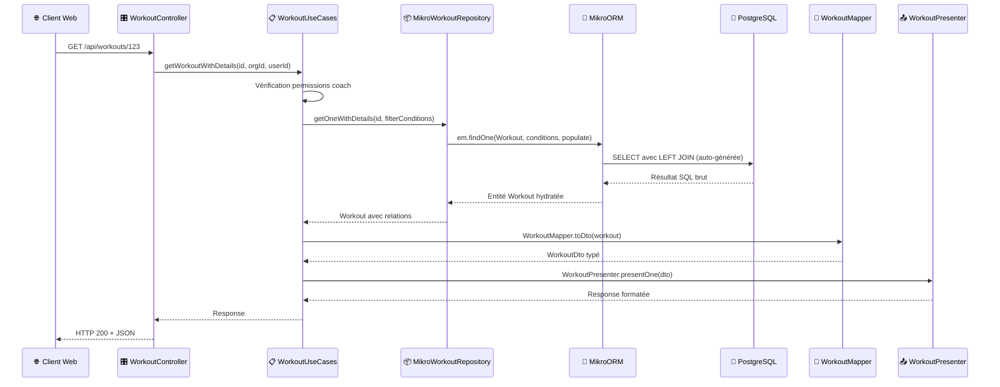

## Approches d'implémentation de la couche de données

Après avoir établi le modèle conceptuel avec la méthode Merise, plusieurs approches s'offraient à moi pour implémenter la couche d'accès aux données dans DropIt. Chacune présente des avantages selon le contexte de développement et les contraintes techniques du projet.

### Database First

Cette approche aurait consisté à créer directement les tables PostgreSQL via des scripts SQL, puis générer les entités TypeScript à partir du schéma existant. Pour illustrer cette méthode, voici comment j'aurais pu créer la table `workout` :

```sql
CREATE TABLE workout (
    id UUID PRIMARY KEY DEFAULT gen_random_uuid(),
    title VARCHAR(255) NOT NULL,
    description TEXT NOT NULL,
    category_id UUID NOT NULL,
    created_by UUID,
    created_at TIMESTAMP DEFAULT NOW(),
    updated_at TIMESTAMP DEFAULT NOW(),
    FOREIGN KEY (category_id) REFERENCES workout_category(id),
    FOREIGN KEY (created_by) REFERENCES users(id)
);

-- Table de jointure polymorphe pour les éléments de workout
CREATE TABLE workout_element (
    id UUID PRIMARY KEY DEFAULT gen_random_uuid(),
    workout_id UUID NOT NULL,
    type VARCHAR(20) NOT NULL CHECK (type IN ('exercise', 'complex')),
    exercise_id UUID,
    complex_id UUID,
    order_position INTEGER NOT NULL,
    sets INTEGER DEFAULT 1,
    reps INTEGER DEFAULT 1,
    rest INTEGER,
    start_weight_percent DECIMAL(5,2),
    FOREIGN KEY (workout_id) REFERENCES workout(id) ON DELETE CASCADE,
    FOREIGN KEY (exercise_id) REFERENCES exercise(id),
    FOREIGN KEY (complex_id) REFERENCES complex(id),
    CONSTRAINT check_one_element_type CHECK (
        (type = 'exercise' AND exercise_id IS NOT NULL AND complex_id IS NULL) OR
        (type = 'complex' AND complex_id IS NOT NULL AND exercise_id IS NULL)
    )
);
```

Cette méthode traditionnelle offre un contrôle total sur la structure de la base de données et garantit des performances optimales grâce à la maîtrise fine des index et contraintes. Cependant, elle présente plusieurs inconvénients.

La synchronisation entre le schéma de base de données et le code applicatif devient rapidement problématique. Chaque modification de table nécessite une mise à jour manuelle de l'interface TypeScript correspondante. Si j'ajoute une colonne `difficulty_level` à la table `workout`, je dois manuellement créer la propriété dans l'interface `WorkoutEntity`, avec le risque d'oublier cette étape ou de mal typer la propriété.

La maintenance des migrations peuvent représenter également un défi considérable. Les évolutions de schéma doivent être gérées via des scripts SQL écrits à la main, avec toute la complexité que cela implique. Par exemple, l'ajout d'une contrainte NOT NULL sur une colonne existante nécessite de vérifier que toutes les données respectent cette contrainte, nettoyer les valeurs nulles existantes, puis appliquer la contrainte - le tout en préservant la cohérence des données pendant la migration.

Sans outil d'orchestration approprié, les différents environnements peuvent facilement diverger. Un développeur qui applique manuellement un script SQL sur sa base locale mais oublie de le commiter dans le système de versioning créé une divergence silencieuse qui ne se révèle qu'au moment du déploiement en production.

### Schema First

Une approche intermédiaire utilise un fichier de définition de schéma central pour générer à la fois la base de données et les entités TypeScript. Cette méthode définit la structure des données dans un format déclaratif neutre, puis génère automatiquement les scripts SQL et les classes d'entités correspondantes.

Le principe consiste à maintenir une source de vérité unique qui décrit les tables, relations et contraintes, évitant ainsi les désynchronisations entre la base de données et le code applicatif. Cette solution résout effectivement les problèmes de cohérence de l'approche Database First.

Cependant, cette approche ne s'harmonise pas idéalement avec l'architecture monorepo que j'ai mise en place. Les packages partagés comme @dropit/schemas définissent déjà des schémas Zod réutilisés à travers toutes les applications. Ajouter un fichier de schéma supplémentaire créerait une redondance : j'aurais les schémas Zod pour la validation côté client et serveur, plus un schéma séparé pour la génération de base de données. Cette duplication augmente le risque d'incohérences et complique la maintenance.

De plus, l'intégration native avec l'écosystème TypeScript se trouve compromise. Les types générés depuis un schéma externe ne bénéficient pas de l'auto-complétion et de la vérification de types aussi efficacement que les entités définies directement en TypeScript, et le partage de ces types avec les packages communs du monorepo devient plus complexe.

### Code First

J'ai donc finalement retenu l'approche Code First qui définit les entités directement en TypeScript avec les décorateurs MikroORM. Cette méthode résout les inconvénients des deux approches précédentes en s'intégrant nativement dans l'écosystème du monorepo. Les entités MikroORM peuvent directement réutiliser et référencer les types définis dans les packages partagés (@dropit/schemas, @dropit/contract), créant une cohérence technique complète.

La génération automatique des migrations à partir des modifications d'entités élimine les risques de désynchronisation tout en préservant un contrôle précis sur la structure de données. Cette approche tire également parti de l'auto-complétion et de la vérification de types native de TypeScript, facilitant le développement et réduisant les erreurs de compilation.


## Définition des entités MikroORM

Les entités constituent la traduction directe du modèle logique de données en classes TypeScript annotées. Chaque entité encapsule à la fois la structure des données et les relations métier.

### Structure type d'une entité

```typescript
@Entity()
export class Workout {
  @PrimaryKey({ type: 'uuid', defaultRaw: 'gen_random_uuid()' })
  id!: string;

  @Property()
  title!: string;

  @Property()
  description!: string;

  @ManyToOne(() => WorkoutCategory)
  category!: WorkoutCategory;

  @ManyToOne(() => User, { nullable: true })
  createdBy!: User | null;

  @OneToMany(() => WorkoutElement, (element) => element.workout)
  elements = new Collection<WorkoutElement>(this);

  @Property({ onCreate: () => new Date() })
  createdAt: Date = new Date();

  @Property({ onUpdate: () => new Date() })
  updatedAt: Date = new Date();
}
```

Cette entité `Workout` illustre plusieurs patterns que j'ai adoptés systématiquement :

**Identifiants UUID** : L'utilisation de `gen_random_uuid()` évite les conflits lors des synchronisations entre environnements et facilite les opérations de fusion de données.

**Relations typées** : Les décorateurs `@ManyToOne` et `@OneToMany` établissent les relations avec typage strict, permettant à TypeScript de détecter les erreurs de navigation d'objets à la compilation.

**Collections MikroORM** : Les relations one-to-many utilisent le type `Collection<T>` qui encapsule la logique de chargement paresseux et de gestion des relations bidirectionnelles.

**Timestamps automatiques** : Les propriétés `createdAt` et `updatedAt` s'actualisent automatiquement via les callbacks `onCreate` et `onUpdate`.

### Gestion des relations polymorphes

L'entité `WorkoutElement` illustre la résolution du pattern polymorphe identifié dans le modèle logique :

```typescript
@Entity()
@Check({
  name: 'check_one_element_type',
  expression: `
    (type = 'exercise' AND exercise_id IS NOT NULL AND complex_id IS NULL) OR
    (type = 'complex' AND complex_id IS NOT NULL AND exercise_id IS NULL)
  `,
})
export class WorkoutElement {
  @Enum({ items: () => Object.values(WORKOUT_ELEMENT_TYPES) })
  type!: WorkoutElementType;

  @ManyToOne(() => Exercise, { nullable: true })
  exercise?: Exercise;

  @ManyToOne(() => Complex, { nullable: true })
  complex?: Complex;

  @Property()
  sets!: number;

  @Property()
  reps!: number;
  
  // Autres propriétés communes...
}
```

Le décorateur `@Check` traduit la contrainte logique en contrainte PostgreSQL, garantissant l'intégrité des données même en cas d'accès direct à la base. Cette approche combine la flexibilité du polymorphisme avec la rigueur des contraintes relationnelles.


## Architecture en couches et pattern Repository

L'accès aux données dans DropIt respecte une séparation stricte des responsabilités via le pattern Repository et l'architecture hexagonale adoptée dans l'API NestJS.

### Séparation des responsabilités

L'architecture que j'ai mise en place respecte une séparation stricte des responsabilités à travers plusieurs couches distinctes. Chaque composant a un rôle précis que je vais détailler avec des exemples concrets de l'implémentation DropIt.

#### Interface Layer : exposition HTTP

**Controllers** gèrent uniquement le protocole HTTP et orchestrent les vérifications de sécurité avant de déléguer la logique métier. Ils remplissent plusieurs rôles cruciaux :

```typescript
@UseGuards(PermissionsGuard) // 1. Garde globale sur toutes les méthodes
@Controller()
export class WorkoutController {
  
  @TsRestHandler(c.getWorkout) // 2. Respect du contrat ts-rest
  @RequirePermissions('read')  // 3. Permission spécifique requise
  getWorkout(
    @CurrentOrganization() organizationId: string, // 4. Extraction contexte organisation
    @CurrentUser() user: AuthenticatedUser         // 5. Extraction utilisateur authentifié
  ): ReturnType<typeof tsRestHandler<typeof c.getWorkout>> {
    return tsRestHandler(c.getWorkout, async ({ params }) => {
      // 6. Délégation immédiate vers la logique métier
      return await this.workoutUseCases.getWorkoutWithDetails(params.id, organizationId, user.id);
    });
  }

  @TsRestHandler(c.createWorkout)
  @RequirePermissions('create') // Permission différente pour la création
  createWorkout(
    @CurrentOrganization() organizationId: string,
    @CurrentUser() user: AuthenticatedUser
  ): ReturnType<typeof tsRestHandler<typeof c.createWorkout>> {
    return tsRestHandler(c.createWorkout, async ({ body }) => {
      return await this.workoutUseCases.createWorkout(body, organizationId, user.id);
    });
  }
}
```

Le controller orchestre plusieurs mécanismes de sécurité en cascade :

**Niveau 1 - Authentification** : Le `PermissionsGuard` vérifie que l'utilisateur possède un token valide et extrait ses informations via `@CurrentUser()`.

**Niveau 2 - Isolation organisationnelle** : Le décorateur `@CurrentOrganization()` garantit que l'utilisateur ne peut accéder qu'aux ressources de son organisation, empêchant tout accès transversal entre clubs.

**Niveau 3 - Permissions granulaires** : `@RequirePermissions('read')` vérifie que l'utilisateur dispose du droit spécifique requis pour cette action. Un membre simple peut avoir le droit 'read' mais pas 'create' ou 'delete'.

**Niveau 4 - Contrat d'API** : `@TsRestHandler(c.getWorkout)` assure que les paramètres d'entrée et les réponses correspondent exactement au contrat défini dans `@dropit/contract`, garantissant la type safety entre l'API et les clients.

Cette approche multicouche me permet d'appliquer le principe de défense en profondeur : même si une vérification échoue, les autres barrières protègent l'accès aux données. Le controller reste simple et focalisé sur son rôle d'orchestration HTTP, sans jamais contenir de logique métier.

**Mappers** transforment les entités de base de données en objets de transfert (DTO) pour l'API. Ils remplissent deux rôles essentiels :

```typescript
export const WorkoutMapper = {
  toDto(workout: Workout): WorkoutDto {
    return {
      id: workout.id,
      title: workout.title,
      workoutCategory: workout.category.name, // Simplification : juste le nom au lieu de l'objet complet
      description: workout.description,
      elements: workout.elements.getItems().map(/* transformation des éléments */),
    };
  }
}
```

D'une part, ils **respectent le contrat d'API ts-rest** défini dans `@dropit/contract`. Le type de retour `WorkoutDto` correspond exactement au schéma attendu par les clients, garantissant la cohérence entre l'API et les applications web/mobile qui l'utilisent.

D'autre part, ils **protègent le schéma de base de données** en ne exposant pas directement les structures internes. Par exemple, l'entité `Workout` contient une relation complète vers `WorkoutCategory` avec tous ses champs (id, description, createdBy, timestamps), mais le mapper ne expose que le nom de la catégorie. Cette approche évite de révéler des détails d'implémentation comme les clés étrangères, les champs techniques ou les relations qui ne concernent pas le client.

**Presenters** standardisent le formatage des réponses et gèrent la logique de présentation des données. Ils remplissent plusieurs responsabilités importantes :

```typescript
export const WorkoutPresenter = {
  // Succès avec données
  presentOne(workout: WorkoutDto) {
    return { status: 200 as const, body: workout };
  },
  
  // Succès avec liste
  presentList(workouts: WorkoutDto[]) {
    return { 
      status: 200 as const, 
      body: workouts 
    };
  },

  // Succès de création (code différent)
  presentCreationSuccess(message: string) {
    return { 
      status: 201 as const, 
      body: { message } 
    };
  },

  // Gestion centralisée des erreurs
  presentError(error: Error) {
    if (error instanceof BadRequestException) {
      return { status: 400 as const, body: { message: error.message } };
    }
    if (error instanceof ForbiddenException) {
      return { status: 403 as const, body: { message: error.message } };
    }
    if (error instanceof NotFoundException) {
      return { status: 404 as const, body: { message: error.message } };
    }
    
    // Masquage des erreurs internes en production
    console.error('Workout error:', error);
    return {
      status: 500 as const,
      body: { message: 'An error occurred while processing the request' }
    };
  }
}
```

Le Presenter joue un rôle crucial dans plusieurs aspects :

**Normalisation des codes de statut** : Il garantit que chaque type d'opération retourne le code HTTP approprié (200 pour lecture, 201 pour création, 404 pour non trouvé). Cette cohérence facilite la gestion côté client.

**Sécurisation des messages d'erreur** : Le Presenter filtre les erreurs techniques internes pour ne pas exposer de détails d'implémentation au client. Une erreur de base de données devient un message générique, protégeant la sécurité de l'application.

**Centralisation du formatage** : Tous les Use Cases utilisent le même Presenter, garantissant un format de réponse cohérent pour l'ensemble de l'API. Si je décide de changer la structure des réponses (ajouter des métadonnées, modifier l'enveloppe JSON), un seul point de modification suffit.

**Évolutivité du format de sortie** : Le Presenter pourrait facilement être adapté pour produire d'autres formats que JSON : XML, CSV, ou même des templates HTML pour une interface web. Cette flexibilité ne nécessiterait aucune modification des Use Cases.


#### Application Layer : orchestration métier

**Use Cases** concentrent la logique applicative et les règles métier spécifiques au domaine de l'haltérophilie. Ils orchestrent les différents repositories tout en appliquant des vérifications métier critiques pour la sécurité des utilisateurs :

```typescript
async createWorkout(workout: CreateWorkout, organizationId: string, userId: string) {
  // 1. Vérifications d'autorisation métier
  const isCoach = await this.memberUseCases.isUserCoachInOrganization(userId, organizationId);
  if (!isCoach) throw new ForbiddenException('User is not coach of this organization');

  // 2. Vérification de l'existence de la catégorie avec filtres organisationnels
  const coachFilterConditions = await this.memberUseCases.getCoachFilterConditions(organizationId);
  const category = await this.workoutCategoryRepository.getOne(workout.workoutCategory, coachFilterConditions);

  if (!category) {
    throw new NotFoundException(
      `Workout category with ID ${workout.workoutCategory} not found or access denied`
    );
  }

  // 3. Vérification de l'existence et de l'accès aux exercices/complexes
  for (const element of workout.elements) {
    if (element.type === WORKOUT_ELEMENT_TYPES.EXERCISE) {
      const exercise = await this.exerciseRepository.getOne(element.id, coachFilterConditions);
      if (!exercise) {
        throw new NotFoundException(`Exercise with ID ${element.id} not found or access denied`);
      }
    } else {
      const complex = await this.complexRepository.getOne(element.id, coachFilterConditions);
      if (!complex) {
        throw new NotFoundException(`Complex with ID ${element.id} not found or access denied`);
      }
    }
  }

  // 4. Si une session d'entraînement est demandée, vérifier l'existence des athlètes
  if (workout.trainingSession) {
    for (const athleteId of workout.trainingSession.athleteIds) {
      const athlete = await this.athleteRepository.getOne(athleteId);
      if (!athlete) {
        throw new NotFoundException(`Athlete with ID ${athleteId} not found`);
      }
    }
  }

  // 4. Création avec logique d'orchestration
  const createdWorkout = await this.workoutRepository.save(workoutToCreate);
  
  // 5. Transformation pour l'exposition
  const workoutDto = WorkoutMapper.toDto(createdWorkout);
  return WorkoutPresenter.presentOne(workoutDto);
}
```

Les Use Cases appliquent des vérifications métier qui nécessitent l'accès aux données. 

Avant de créer un workout, le Use Case vérifie systématiquement que la catégorie, les exercices et les complexes référencés existent ET sont accessibles par le coach via les `coachFilterConditions`. Cette double vérification empêche un coach de créer un workout utilisant des ressources d'un autre club, garantissant l'isolation des données entre organisations.

Lorsque le workout inclut une session d'entraînement avec des athlètes assignés, le Use Case vérifie que chaque `athleteId` correspond à un athlète existant en base de données. Cette validation d'intégrité référentielle ne peut être faite qu'au moment de l'exécution avec un accès effectif aux données, contrairement aux validations de structure que Zod peut effectuer.

Le Use Case orchestre également plusieurs règles d'autorisation en combinant différentes vérifications (coach de l'organisation + accès aux ressources spécifiques) qui nécessitent des appels à plusieurs repositories. Cette logique d'orchestration dépasse largement le cadre de la validation de schéma et constitue le cœur de la logique applicative.

Cette approche centralise la logique métier critique tout en la gardant indépendante de l'infrastructure technique. Les règles d'autorisation et de cohérence restent les mêmes même si je change de base de données ou d'interface d'exposition.

#### Domain Layer : modèle métier

Les entités représentent les concepts métier du domaine de l'haltérophilie avec leurs règles et contraintes. Dans l'implémentation actuelle, elles utilisent des décorateurs MikroORM pour définir leur mapping vers la base de données :

```typescript
@Entity() // Décorateur qui marque cette classe comme une entité de base de données
@Check({
  name: 'check_one_element_type',
  expression: `(type = 'exercise' AND exercise_id IS NOT NULL) OR (type = 'complex' AND complex_id IS NOT NULL)`
})
export class WorkoutElement {
  @PrimaryKey({ type: 'uuid', defaultRaw: 'gen_random_uuid()' })
  id!: string;

  @Enum({ items: () => Object.values(WORKOUT_ELEMENT_TYPES) })
  type!: WorkoutElementType; // Enum contraint à 'exercise' ou 'complex'
  
  @ManyToOne(() => Exercise, { nullable: true })
  exercise?: Exercise; // Relation optionnelle vers un exercice
  
  @ManyToOne(() => Complex, { nullable: true })
  complex?: Complex; // Relation optionnelle vers un complexe
  
  @Property()
  sets!: number; // Nombre de séries
  
  @Property()
  reps!: number; // Nombre de répétitions
  
  @Property({ onCreate: () => new Date() })
  createdAt: Date = new Date(); // Timestamp automatique
}
```

Chaque décorateur MikroORM a un rôle spécifique dans le mapping objet-relationnel :

Le décorateur `@Entity()` indique à MikroORM que cette classe TypeScript correspond à une table en base de données. Il déclenche la génération automatique du schéma et la gestion des migrations.

Les décorateurs `@Property()` mappent les propriétés simples vers des colonnes de base de données. MikroORM infère automatiquement le type SQL approprié (VARCHAR, INTEGER, TIMESTAMP) selon le type TypeScript déclaré.

Les décorateurs de relation comme `@ManyToOne()` établissent les associations entre entités et génèrent automatiquement les clés étrangères correspondantes. L'option `nullable: true` permet d'avoir une relation optionnelle, essentielle pour le pattern polymorphe de `WorkoutElement`.

Le décorateur `@Check()` traduit une règle métier en contrainte PostgreSQL. Dans cet exemple, il garantit qu'un élément de workout référence soit un exercice, soit un complexe, mais jamais les deux simultanément. Cette contrainte de base de données renforce l'intégrité même en cas d'accès direct aux données.

Les décorateurs automatiques comme `@Property({ onCreate: () => new Date() })` configurent des comportements de lifecycle. MikroORM mettra automatiquement à jour la date de création lors de l'insertion en base.

Cette approche présente cependant une limitation par rapport à l'architecture hexagonale pure. Idéalement, les entités du domaine ne devraient contenir aucune dépendance vers l'infrastructure technique. Une implémentation strictement hexagonale nécessiterait la création d'entités "pures" sans décorateurs MikroORM, accompagnées de mappers séparés pour la transformation vers les entités de persistence.

Cette séparation permettrait une indépendance complète vis-à-vis de l'ORM choisi. Les entités métier pourraient évoluer selon les besoins business sans être contraintes par les limitations techniques de MikroORM. Un changement vers Prisma, TypeORM ou même une approche sans ORM ne nécessiterait que la réécriture des mappers, laissant intact le cœur métier de l'application.

#### Infrastructure Layer : accès aux données

**Repositories** abstraient l'accès aux données et implémentent les contrats définis par les ports :

```typescript
async getOneWithDetails(id: string, coachFilterConditions: CoachFilterConditions): Promise<Workout | null> {
  return await this.em.findOne(Workout, { id, $or: coachFilterConditions.$or }, {
    populate: [
      'category', 'elements', 'elements.exercise', 'elements.complex',
      'elements.complex.exercises', 'createdBy'
    ],
  });
}
```

Cette couche isole complètement la logique métier des détails techniques de persistence. Je peux changer d'ORM ou de base de données sans impacter les Use Cases.

#### Justification de cette architecture

Cette séparation en couches résout plusieurs problèmes que j'ai identifiés dans des architectures plus simples :

**Testabilité** : Chaque couche peut être testée indépendamment en mockant ses dépendances. Les Use Cases se testent sans base de données, les Controllers sans logique métier.

**Évolutivité** : La modification d'une couche n'impacte pas les autres. Je peux faire évoluer le modèle de données sans toucher à l'API REST, ou changer l'interface d'exposition sans modifier la logique métier.

**Réutilisabilité** : Les Use Cases peuvent être réutilisés par différentes interfaces (API REST, GraphQL, CLI) sans duplication de code.

### Flux de données : de la requête HTTP à la base de données

Pour illustrer concrètement cette architecture, voici le trajet d'une requête simple de récupération d'un workout :



Ce diagramme illustre comment chaque couche a sa responsabilité spécifique : le Controller gère le protocole HTTP, le UseCase orchestre la logique métier et les permissions, le Repository abstrait l'accès aux données, et le Mapper/Presenter formatent les données pour le client.

### SQL brut vs MikroORM : comparaison pratique

Commençons par un exemple simple pour illustrer la différence d'approche. Voici comment récupérer la liste des workouts avec leur catégorie en SQL brut :

```sql
-- Requête SQL simple avec jointure
SELECT 
    w.id, w.title, w.description, w.created_at,
    wc.name as category_name
FROM workout w
LEFT JOIN workout_category wc ON w.category_id = wc.id
WHERE (w.created_by = $1 OR wc.created_by = $1 OR wc.created_by IS NULL)
ORDER BY w.created_at DESC;
```

Cette requête nécessite un mapping manuel vers les objets TypeScript et une gestion explicite des relations. Avec MikroORM, l'équivalent devient :

```typescript
// Requête simple avec populate
async getAll(coachFilterConditions: CoachFilterConditions): Promise<Workout[]> {
  return await this.em.find(Workout, coachFilterConditions, {
    populate: ['category', 'createdBy'],
  });
}
```

Le mécanisme de `populate` de MikroORM génère automatiquement les jointures LEFT nécessaires et mappe les résultats vers les entités typées. Cette approche élimine le mapping manuel tout en préservant le typage strict.

La situation se corse rapidement quand les besoins deviennent plus ambitieux. Pour récupérer un workout avec tous ses éléments, exercices et catégories associées, la requête SQL devient :

```sql
-- Requête SQL avec jointures multiples
SELECT 
    w.id, w.title, w.description, w.created_at,
    wc.id as category_id, wc.name as category_name,
    u.id as created_by_id, u.email as created_by_email,
    we.id as element_id, we.type as element_type, we.order_position, we.sets, we.reps,
    e.id as exercise_id, e.name as exercise_name,
    ec.id as exercise_category_id, ec.name as exercise_category_name,
    c.id as complex_id, c.description as complex_description,
    cc.id as complex_category_id, cc.name as complex_category_name
FROM workout w
LEFT JOIN workout_category wc ON w.category_id = wc.id
LEFT JOIN users u ON w.created_by = u.id
LEFT JOIN workout_element we ON w.id = we.workout_id
LEFT JOIN exercise e ON we.exercise_id = e.id
LEFT JOIN exercise_category ec ON e.category_id = ec.id
LEFT JOIN complex c ON we.complex_id = c.id
LEFT JOIN complex_category cc ON c.category_id = cc.id
WHERE w.id = $1
  AND (w.created_by = $2 OR wc.created_by = $2 OR wc.created_by IS NULL)
ORDER BY we.order_position;
```

Cette requête manuelle nécessite une gestion minutieuse des jointures LEFT pour éviter de perdre des données, un mapping manuel vers les objets TypeScript, et une logique de regroupement pour reconstruire la hiérarchie des relations.

Avec MikroORM, cette même opération s'écrit simplement :

```typescript
// Requête avec populate étendu
async getOneWithDetails(id: string, coachFilterConditions: CoachFilterConditions): Promise<Workout | null> {
  return await this.em.findOne(Workout, { id, $or: coachFilterConditions.$or }, {
    populate: [
      'category',
      'elements',
      'elements.exercise',
      'elements.exercise.exerciseCategory', 
      'elements.complex',
      'elements.complex.complexCategory',
      'elements.complex.exercises',
      'elements.complex.exercises.exercise',
      'createdBy'
    ],
  });
}
```

Cependant, cette approche populate atteint ses limites sur des relations très profondes ou des cas particuliers. Dans certaines situations, il reste préférable d'écrire des requêtes SQL manuelles via l'EntityManager pour optimiser les performances ou implémenter une logique spécifique.

```typescript
// Port - Interface du contrat métier
export const WORKOUT_REPO = 'WORKOUT_REPO';

export interface IWorkoutRepository {
  getAll(coachFilterConditions: CoachFilterConditions): Promise<Workout[]>;
  getOne(id: string, coachFilterConditions: CoachFilterConditions): Promise<Workout | null>;
  getOneWithDetails(id: string, coachFilterConditions: CoachFilterConditions): Promise<Workout | null>;
  save(workout: Workout): Promise<Workout>;
  remove(id: string, coachFilterConditions: CoachFilterConditions): Promise<void>;
}

// Adaptateur - Implémentation MikroORM
@Injectable()
export class MikroWorkoutRepository extends EntityRepository<Workout> implements IWorkoutRepository {
  constructor(public readonly em: EntityManager) {
    super(em, Workout);
  }

  // Requête simple pour les listes
  async getAll(coachFilterConditions: CoachFilterConditions): Promise<Workout[]> {
    return await this.em.find(Workout, coachFilterConditions, {
      populate: ['category', 'createdBy'], // Relations légères uniquement
    });
  }

  // Requête complexe avec toutes les jointures
  async getOneWithDetails(id: string, coachFilterConditions: CoachFilterConditions): Promise<Workout | null> {
    return await this.em.findOne(
      Workout, 
      { id, $or: coachFilterConditions.$or },
      {
        populate: [
          'category',
          'elements',
          'elements.exercise',
          'elements.exercise.exerciseCategory',
          'elements.complex',
          'elements.complex.complexCategory',
          'elements.complex.exercises', // Relations imbriquées pour les complexes
          'elements.complex.exercises.exercise',
          'elements.complex.exercises.exercise.exerciseCategory',
          'createdBy'
        ],
      }
    );
  }
}
```

Cette approche MikroORM présente plusieurs avantages décisifs :

- **Typage strict** : TypeScript détecte les erreurs de relations à la compilation
- **Abstraction des jointures** : MikroORM génère automatiquement les LEFT JOIN nécessaires
- **Mapping automatique** : Les résultats SQL sont automatiquement transformés en objets typés
- **Optimisation des requêtes** : L'ORM évite les requêtes N+1 grâce au populate intelligent
- **Maintenabilité** : Modification d'une relation = mise à jour automatique des requêtes

Cette comparaison illustre pourquoi j'ai privilégié MikroORM malgré ma maîtrise du SQL : la productivité et la sécurité apportées par l'ORM compensent largement la perte de contrôle fin sur les requêtes générées.

## Pattern Unit of Work et gestion transactionnelle

MikroORM implémente nativement le pattern Unit of Work qui centralise le suivi des modifications d'entités et optimise leur persistance.

### Fonctionnement automatique

Dans le contexte de NestJS, chaque requête HTTP bénéficie automatiquement d'une transaction implicite :

```typescript
async save(workout: Workout): Promise<Workout> {
  await this.em.persistAndFlush(workout); // Persiste et flush automatique
  return workout;
}
```

L'`EntityManager` suit automatiquement les modifications apportées aux entités chargées et génère les requêtes SQL optimales lors du flush. Cette approche réduit le nombre de requêtes et garantit la cohérence transactionnelle.

### Transactions explicites pour les opérations complexes

Pour les use cases impliquant plusieurs entités, j'utilise des transactions explicites :

```typescript
async createWorkout(workout: CreateWorkout, organizationId: string, userId: string) {
  try {
    // Transaction implicite via les use cases NestJS
    const workoutToCreate = new Workout();
    workoutToCreate.title = workout.title;
    workoutToCreate.description = workout.description;
    
    // Création des éléments associés
    for (const element of workout.elements) {
      const workoutElement = new WorkoutElement();
      workoutElement.type = element.type;
      workoutElement.workout = workoutToCreate;
      
      if (element.type === WORKOUT_ELEMENT_TYPES.EXERCISE) {
        const exercise = await this.exerciseRepository.getOne(element.id, coachFilterConditions);
        workoutElement.exercise = exercise;
      } else {
        const complex = await this.complexRepository.getOne(element.id, coachFilterConditions);
        workoutElement.complex = complex;
      }
      
      await this.workoutElementRepository.save(workoutElement);
    }
    
    // Sauvegarde finale
    const createdWorkout = await this.workoutRepository.save(workoutToCreate);
    
  } catch (error) {
    // Le rollback automatique préserve la cohérence
    throw error;
  }
}
```

Le pattern Unit of Work garantit que toutes ces opérations s'exécutent dans une même transaction, avec rollback automatique en cas d'erreur.

### Gestion des relations bidirectionnelles

MikroORM simplifie la gestion des relations bidirectionnelles complexes. Lors de la suppression d'un workout, les éléments associés sont gérés automatiquement :

```typescript
async remove(id: string, coachFilterConditions: CoachFilterConditions): Promise<void> {
  const workoutToDelete = await this.em.findOne(
    Workout,
    { id, $or: coachFilterConditions.$or },
    { populate: ['elements'] }
  );
  
  if (!workoutToDelete) {
    return;
  }

  // Suppression explicite des éléments pour respecter les contraintes
  const elements = workoutToDelete.elements.getItems();
  for (const element of elements) {
    this.em.remove(element);
  }

  await this.em.removeAndFlush(workoutToDelete);
}
```

Cette approche respecte les contraintes d'intégrité référentielle tout en optimisant l'ordre des suppressions.

## Configuration et optimisations

### Configuration MikroORM

La configuration centralisée dans `mikro-orm.config.ts` optimise les performances et facilite les environnements multiples :

```typescript
export function createMikroOrmOptions(options?: CreateMikroOrmOptions) {
  const { isTest, ...restOptions } = options ?? {};
  const isTestEnvironment = isTest || config.env === 'test';

  return defineConfig({
    entities: ['./dist/**/*.entity.js'],
    entitiesTs: ['./src/**/*.entity.ts'],
    dbName: config.database.name,
    host: config.database.host,
    port: config.database.port,
    user: config.database.user,
    password: config.database.password,
    metadataProvider: TsMorphMetadataProvider, // Analyse statique du code TypeScript
    forceUtcTimezone: true, // Cohérence temporelle
    extensions: [SeedManager, Migrator], // Extensions activées
    debug: true, // Logs SQL en développement
    allowGlobalContext: isTestEnvironment, // Contexte global pour les tests
  });
}
```

Cette configuration unifie les environnements de développement, test et production tout en adaptant les optimisations selon le contexte.

### TsMorphMetadataProvider et performances

Le `TsMorphMetadataProvider` analyse statiquement le code TypeScript pour générer les métadonnées, éliminant le besoin de décorateurs runtime coûteux. Cette approche accélère le démarrage de l'application et réduit l'empreinte mémoire.

## Seeders et données de test

Pour faciliter le développement et les tests, j'ai implémenté un système de seeders qui peuple la base avec des données cohérentes :

```typescript
export async function seedComplexes(em: EntityManager): Promise<Complex[]> {
  const exercisesMap = await seedExercises(em); // Dépendance des exercices

  const complexCategories = [
    { name: 'Arraché', description: "Exercices focalisés sur la technique de l'arraché" },
    { name: 'Épaulé', description: "Exercices focalisés sur la technique de l'épaulé-jeté" },
    { name: 'Renforcement', description: 'Exercices de musculation spécifiques' },
  ];

  // Création des catégories
  const complexCategoriesMap: Record<string, ComplexCategory> = {};
  for (const complexCategory of complexCategories) {
    const categoryToCreate = new ComplexCategory();
    categoryToCreate.name = complexCategory.name;
    categoryToCreate.createdBy = null;
    await em.persistAndFlush(categoryToCreate);
    complexCategoriesMap[complexCategory.name] = categoryToCreate;
  }

  // Création des complexes avec leurs exercices
  const complexesToCreate = [
    {
      category: 'Arraché',
      description: "Focus sur la technique de l'arraché",
      exercises: [
        { name: 'Arraché Debout', reps: 3 },
        { name: 'Tirage Nuque', reps: 5 },
        { name: 'Squat Clavicule', reps: 2 },
      ],
    },
    // Autres complexes...
  ];

  const complexesCreated: Complex[] = [];
  for (const complexData of complexesToCreate) {
    const complex = new Complex();
    complex.description = complexData.description;
    complex.complexCategory = complexCategoriesMap[complexData.category];
    
    await em.persistAndFlush(complex);

    // Création des relations exercice-complexe avec ordre
    for (let i = 0; i < complexData.exercises.length; i++) {
      const exerciseData = complexData.exercises[i];
      const exerciseComplex = new ExerciseComplex();
      exerciseComplex.complex = complex;
      exerciseComplex.exercise = exercisesMap[exerciseData.name];
      exerciseComplex.order = i;
      exerciseComplex.reps = exerciseData.reps;
      
      await em.persistAndFlush(exerciseComplex);
    }
    
    complexesCreated.push(complex);
  }

  return complexesCreated;
}
```

Ce système de seeders respecte les contraintes d'intégrité référentielle et garantit un environnement de développement reproductible. La structure modulaire permet de réutiliser les données entre différents seeders tout en maintenant la cohérence des relations.

## Stratégies d'optimisation et de mise en cache

### Optimisations au niveau requêtes

J'ai identifié plusieurs optimisations spécifiques aux besoins métier de l'haltérophilie :

**Requêtes avec filtres métier** : Les `CoachFilterConditions` appliquent systématiquement les restrictions d'accès par organisation, évitant les fuites de données entre clubs :

```typescript
async getAll(coachFilterConditions: CoachFilterConditions): Promise<Workout[]> {
  return await this.em.find(Workout, coachFilterConditions, {
    populate: ['category', 'createdBy'],
  });
}
```

**Populate sélectif** : Les requêtes n'chargent que les relations nécessaires selon le contexte d'affichage, réduisant la bande passante et la mémoire utilisée.

### Préparation pour la mise en cache avec Redis

L'architecture actuelle anticipe l'intégration de Redis sans modification des repositories. J'ai identifié les données candidates au cache :

- **Catalogues d'exercices** : Données qui évoluent rarement, consultées fréquemment lors de la création de programmes
- **Records personnels récents** : Utilisés pour calculer les charges d'entraînement, critiques pour les performances
- **Compositions de complexes populaires** : Réutilisées souvent par les coachs

Cette stratégie évolutive me permet de commencer avec PostgreSQL seul, puis d'ajouter Redis quand les métriques de performance le justifieront.

## Migration et évolution du schéma

### Stratégie Code First et migrations

L'approche Code First de MikroORM génère automatiquement les migrations à partir des modifications d'entités :

```typescript
// Configuration des migrations
migrations: {
  path: './dist/modules/db/migrations',
  pathTs: './src/modules/db/migrations',
  allOrNothing: true, // Transactions atomiques pour les migrations
  disableForeignKeys: false, // Préservation de l'intégrité référentielle
},
```

Cette configuration garantit que les migrations s'appliquent de manière atomique et préservent l'intégrité des données existantes.

### Évolution progressive du modèle

La structure modulaire facilite l'ajout de nouvelles fonctionnalités sans impact sur l'existant. Par exemple, l'ajout futur d'un système de notifications nécessiterait uniquement :

1. Création de l'entité `Notification`
2. Définition des relations avec `User` et `Organization`
3. Génération automatique de la migration
4. Implémentation du repository correspondant

Cette approche évolutive respecte les principes SOLID et facilite la maintenance à long terme.

## Conclusion

L'implémentation de la couche d'accès aux données avec MikroORM dans DropIt combine les avantages du typage TypeScript, de l'architecture hexagonale, et des patterns éprouvés comme Unit of Work et Repository.

Cette approche Code First m'a permis de rester dans l'écosystème TypeScript du monorepo tout en bénéficiant d'une génération automatique des migrations et d'un typage strict des relations. Le pattern Repository facilite les tests unitaires et l'évolution technique future, tandis que la configuration optimisée de MikroORM garantit des performances adaptées aux besoins d'un club d'haltérophilie.

La séparation stricte entre ports et adaptateurs, inspirée de l'architecture hexagonale, isole la logique métier des détails d'implémentation, facilitant la maintenance et l'évolution du code. Cette architecture constitue une base solide pour les développements futurs tout en respectant les bonnes pratiques du développement moderne.

