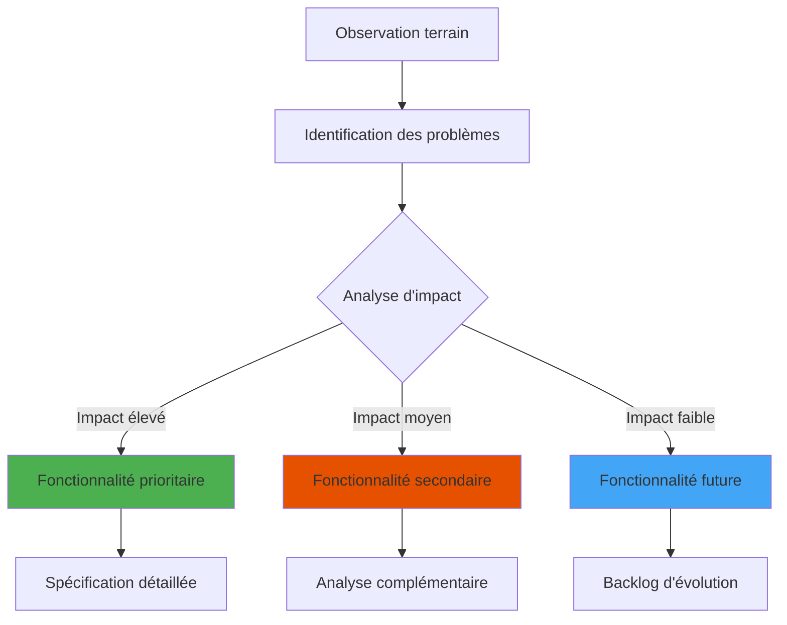
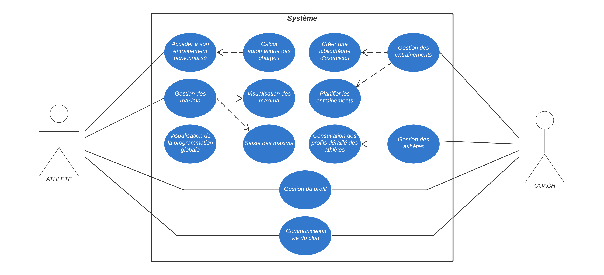
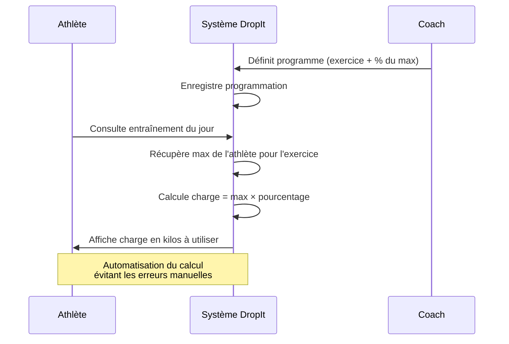

## Méthodologie d'analyse

Ma démarche s'articule autour d'une approche centrée utilisateur adaptée aux contraintes de mon projet de formation. Les échanges informels avec les membres du club lors des entraînements m'ont permis de recueillir des retours spontanés sur leurs difficultés actuelles et leurs attentes concernant un outil numérique.

Cette segmentation en deux profils principaux (athlètes et coachs) m'aide à prioriser les fonctionnalités selon leur impact sur l'expérience utilisateur de chaque groupe.

## Identification des fonctionnalités

L'analyse des dysfonctionnements actuels m'a conduit à identifier les fonctionnalités qui constituent le socle minimal viable de l'application. Ces fonctionnalités répondent directement aux problèmes les plus critiques observés : accès difficile aux programmes, dispersion de l'information, absence de suivi structuré des progressions.

## Diagramme des cas d'usage

Le diagramme ci-dessous présente une vue synthétique des principales interactions entre les utilisateurs (athlètes et coachs) et le système. Il met en évidence les différentes fonctionnalités accessibles selon le rôle de l'utilisateur.

Ce diagramme illustre la séparation claire entre les fonctionnalités destinées aux athlètes (consultation des entraînements, gestion des maxima) et celles réservées aux coachs (gestion des entraînements, gestion des athlètes). Certaines fonctionnalités, comme la gestion du profil et la communication, sont communes aux deux types d'utilisateurs.

## Système de calcul automatique des charges

Le système de calcul automatique des charges basé sur les pourcentages des maximums illustre l'intégration des spécificités techniques de l'haltérophilie. Plutôt que de laisser les athlètes calculer manuellement leurs charges d'entraînement, l'application automatise cette tâche en s'appuyant sur les données de leurs maximums et les pourcentages définis par le coach.

## Résumé des parcours utilisateur

Les fonctionnalités de l'application sont adaptées aux méthodes d'entraînement de l'haltérophilie. Voici un résumé des principaux parcours :

### Athlètes
- **Accès à l'entraînement personnalisé** : Consultation du programme du jour avec calcul automatique des charges
- **Gestion des maximums** : Enregistrement et mise à jour des records personnels
- **Visualisation du calendrier** : Vue d'ensemble de la programmation globale
- **Gestion du profil** : Informations personnelles et catégories de compétition

### Coachs  
- **Gestion des entraînements** : Création d'exercices, blocs et programmes complets
- **Planification** : Assignation des programmes aux athlètes via interface calendaire
- **Gestion des athlètes** : Suivi individualisé et consultation des profils

### Commun
- **Gestion du profil** : Informations personnelles et paramètres de compte
- **Communication vie du club** : Actualités et informations importantes

> **Détail complet des flux d'interactions** : Voir l'annexe [Analyses des besoins](/annexes/analyses-besoins/)

## MVP

Cette analyse révèle un périmètre fonctionnel conséquent. J'ai choisi d'adopter une approche MVP (Minimum Viable Product) pour tester rapidement les fonctionnalités essentielles auprès des utilisateurs de mon club avant de développer des fonctionnalités plus avancées.

### Périmètre retenu

Les retours des utilisateurs de mon club m'ont permis d'identifier les fonctionnalités qui résolvent 80% des problèmes quotidiens observés :

**Pour les coachs** :
- Création et gestion du catalogue d'exercices personnalisé
- Composition de programmes d'entraînement avec paramètres (séries, répétitions, charges)
- Planification basique des séances via interface calendaire
- Assignation des programmes aux athlètes

**Pour les athlètes** :
- Consultation des programmes du jour avec calcul automatique des charges
- Enregistrement et historique des records personnels

### Fonctionnalités reportées en versions ultérieures

Plusieurs fonctionnalités identifiées lors de l'analyse restent pertinentes mais ne constituent pas des éléments bloquants pour l'usage quotidien :

**Communication vie du club** : Bien que la dispersion des informations dans les messageries soit problématique, cette fonctionnalité peut être temporairement compensée par les outils existants du club.

**Gestion fine des profils** : Les informations détaillées (catégories de compétition, mesures physiques) enrichiraient l'expérience mais ne conditionnent pas l'utilisation de base de l'application.

**Analytics avancées** : Les analyses statistiques de progression et comparaisons entre athlètes apporteraient une valeur ajoutée significative mais peuvent être développées une fois l'usage établi.

Cette approche me permet de concentrer mes efforts sur un cœur fonctionnel robuste qui démontre la valeur métier de DropIt. L'architecture technique décrite dans la suite de projet reste conçue pour supporter des évolutions futures.
