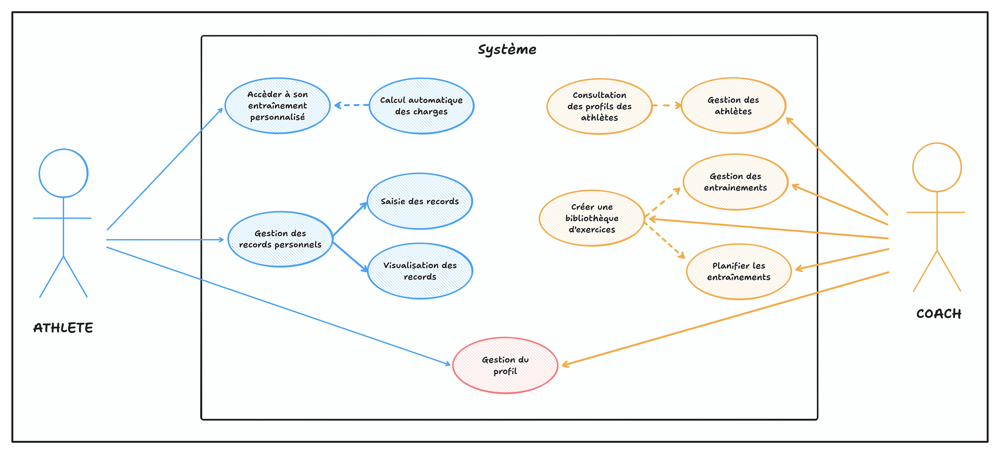

## Méthodologie d'analyse

Ma démarche s'articule autour d'une approche centrée utilisateur : les échanges informels avec les membres du club lors des entraînements m'ont permis de recueillir des retours spontanés sur leurs difficultés actuelles et leurs attentes concernant un outil numérique.

Ces retours ont révélé deux profils d'utilisateurs distincts au sein du club : les athlètes et les coachs.

## Besoins utilisateurs et parcours

### Les athlètes

Les échanges avec les athlètes ont fait émerger plusieurs besoins récurrents : accéder facilement à leurs programmes d'entraînement personnalisés, suivre leurs progressions et rester informés des actualités importantes du club.

L'accès au programme du jour constitue leur besoin prioritaire. Entre chaque série, l'athlète doit pouvoir visualiser immédiatement l'exercice suivant et la charge à utiliser sur sa barre. Le support mobile s'impose naturellement par sa praticité dans l'environnement de la salle de sport.

**Principaux parcours identifiés** :
- **Accès à l'entraînement personnalisé** : Consultation du programme du jour avec calcul automatique des charges
- **Gestion des maximums** : Enregistrement et mise à jour des records personnels
- **Visualisation du calendrier** : Vue d'ensemble de la programmation globale

### Les coachs

Les entraîneurs expriment des besoins différents, centrés sur l'efficacité de leur travail de programmation et de suivi.

La création et la gestion efficaces des programmes d'entraînement constituent leur besoin principal. L'outil doit leur faire gagner du temps dans ces tâches administratives pour qu'ils puissent se concentrer sur l'accompagnement technique des athlètes.

Le suivi des performances de leurs athlètes nécessite des outils de visualisation et d'analyse adaptés à la planification des cycles d'entraînement.

La communication avec l'ensemble du groupe doit être simplifiée et ciblée, évitant la dispersion actuelle de l'information.

**Principaux parcours identifiés** :
- **Gestion des entraînements** : Création d'exercices, blocs et programmes complets
- **Planification** : Assignation des programmes aux athlètes
- **Gestion des athlètes** : Suivi individualisé des performances et évolutions des athlètes

### Besoins communs

Certaines fonctionnalités concernent les deux profils d'utilisateurs :
- **Gestion du profil** : Informations personnelles et paramètres de compte
- **Communication vie du club** : Actualités et informations importantes

> **Détail complet des flux d'interactions** : Voir l'annexe [Analyses des besoins](/annexes/analyses-besoins/)

## Identification et priorisation des fonctionnalités

L'analyse des dysfonctionnements actuels a révélé un périmètre fonctionnel conséquent pour répondre aux problèmes les plus critiques : accès difficile aux programmes, dispersion de l'information, absence de suivi structuré des progressions.

Face à cette ampleur et aux contraintes de mon projet de formation, j'ai choisi d'adopter une approche MVP (Minimum Viable Product). Cette stratégie me permet de valider rapidement la pertinence des fonctionnalités essentielles auprès des utilisateurs de mon club, tout en créant une alternative fonctionnelle immédiate à la messagerie instantanée actuelle. Dans un second temps, l'application évoluera selon les retours d'usage réels pour intégrer progressivement les fonctionnalités complémentaires.

### Périmètre retenu pour le MVP

Les retours des utilisateurs de mon club m'ont permis d'identifier les fonctionnalités qui résolvent les problèmes prioritaires observés :

**Pour les coachs** :
- Création et gestion du catalogue d'exercices personnalisé
- Composition de programmes d'entraînement
- Planification des séances et assignation aux athlètes
- Consultation des profils des athlètes

**Pour les athlètes** :
- Consultation des entraînements du jour avec calcul automatique des charges
- Enregistrement et visualisation des records personnels

### Fonctionnalités reportées en versions ultérieures

Plusieurs fonctionnalités identifiées restent pertinentes mais ne constituent pas des éléments bloquants pour l'usage quotidien :

**Visualisation de la programmation globale** : Cela permettrait aux athlètes de consulter l'ensemble de leur programmation sur plusieurs semaines mais n'est pas essentiel dans un premier temps.

**Communication vie du club** : Bien que la dispersion des informations dans les messageries soit problématique, cette fonctionnalité peut être temporairement compensée par les outils existants du club.

**Analytics avancées** : Les analyses statistiques de progression et comparaisons entre athlètes apporteraient une valeur ajoutée significative mais peuvent être développées dans un second temps.

Cette approche me permet de concentrer mes efforts sur un cœur fonctionnel robuste qui démontre la valeur métier de DropIt. L'architecture technique décrite dans la suite du projet reste conçue pour supporter ces évolutions futures.

## Diagramme des cas d'usage du MVP

Le diagramme ci-dessous présente une vue synthétique des interactions retenues pour le MVP entre les utilisateurs et le système.

Ce diagramme illustre la séparation claire entre les fonctionnalités destinées aux athlètes et celles réservées aux coachs. La gestion du profil est commune aux deux types d'utilisateurs.

> Voir le détail du [système de calcul automatique des charges](/annexes/analyses-besoins/#système-de-calcul-automatique-des-charges) en annexe.
