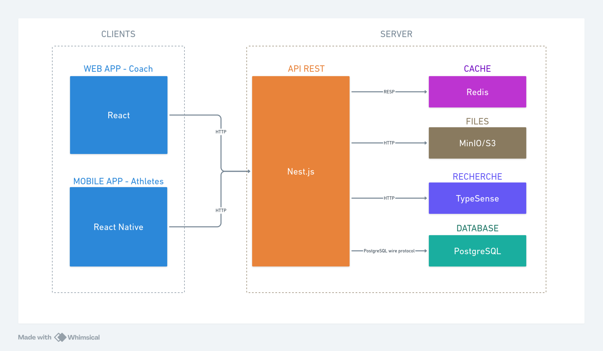
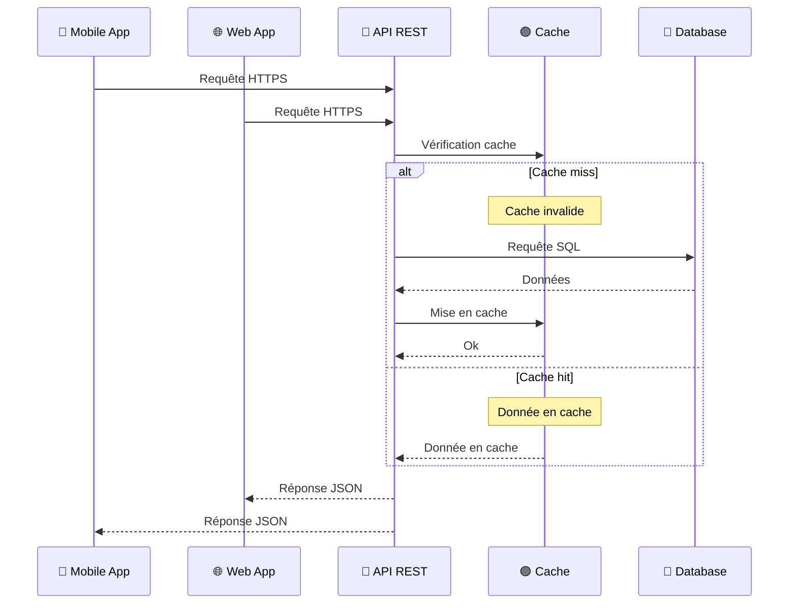

## Introduction

Ma stratégie architecturale de l'application s'appuie sur un équilibre entre familiarité technique et découverte de nouveaux outils. J'ai privilégié des technologies que je maîtrise déjà pour les composants critiques, tout en intégrant des solutions nouvelles pour enrichir mon apprentissage sans compromettre la viabilité du projet.

## Vue d'ensemble architecturale

Suite à l'analyse des besoins, j'ai choisi de structurer l'application selon une architecture distribuée séparant clairement les différentes parties : une interface web pour les coachs, une application mobile pour les athlètes, et un backend centralisé. Cette séparation permet de développer et maintenir chaque partie indépendamment, facilitant ainsi l'évolution future de l'application.

Le schéma ci-dessous présente les différents composants de l'application et leurs interactions :



Cette architecture répond aux contraintes identifiées lors de l'analyse des besoins : séparation des contextes d'usage (mobile pour les athlètes, web pour les coachs), centralisation des données pour assurer la cohérence, et modularité pour faciliter la maintenance et l'évolution.

## Organisation en monorepo

Pour structurer ce projet multi-plateformes, j'ai choisi une architecture monorepo utilisant pnpm workspaces.

### Structure des workspaces

Le monorepo est organisé en deux catégories principales :

**Applications (`apps/`)** : Chaque application (web, mobile, api) dispose de son environnement de développement spécifique tout en partageant les packages communs.

**Packages partagés (`packages/`)** : Ces modules centralisent la logique réutilisable entre toutes les applications, garantissant la cohérence et facilitant la maintenance.

### Justification du choix monorepo

L'organisation en monorepo assure une cohérence technique entre l'application web, mobile et l'API grâce au partage des packages communs entre les différentes applications.

Cette approche élimine les divergences potentielles entre les différents clients et garantit une homogénéité architecturale sur l'ensemble du projet. Par exemple, toute modification d'API impacte immédiatement tous les clients grâce aux types partagés. Cette synchronisation automatique réduit significativement les erreurs d'intégration et accélère les cycles de développement.

La gestion des dépendances s'avère également optimisée grâce à pnpm workspaces qui permet une installation unique des dépendances communes, réduisant l'espace disque et accélérant les installations. Les packages internes sont liés symboliquement, facilitant le développement en temps réel et permettant de voir immédiatement l'impact des modifications sur l'ensemble des applications.

## Packages partagés

Les **packages partagés** sont les suivants:

- **`@dropit/contract`** : Centralise les contrats d'API typés avec ts-rest pour garantir la cohérence entre frontend et backend
- **`@dropit/schemas`** : Regroupe les schémas de validation Zod réutilisés sur toutes les plateformes
- **`@dropit/permissions`** : Définit le système d'autorisation centralisé avec des rôles granulaires
- **`@dropit/i18n`** : Mutualise les traductions multilingues et centralise les contenus textuels
- **`@dropit/tsconfig`** : Fournit la configuration TypeScript de base partagée par toutes les applications

Les détails techniques d'implémentation et des explications plus détaillées de chaque package sont documentés dans la section [Architecture technique](/annexes/architecture-technique).

## Client Web (Back Office) : React et TypeScript

Pour le back office destiné aux coachs, j'ai choisi **React** associé à **TypeScript**. Cette technologie offre une architecture basée sur des composants réutilisables particulièrement adaptée aux interfaces de gestion nécessaires pour organiser les entraînements, suivre les performances et gérer les athlètes.

L'ajout de **TypeScript** apporte une sécurité de typage dans un contexte où la manipulation des données d'entraînement doit être fiable. Les **types stricts** permettent de **détecter les erreurs potentielles dès la phase de compilation**, réduisant significativement les risques de bugs en production. Cette approche se révèle particulièrement critique pour les calculs de charges et la gestion des progressions d'athlètes, domaines où la précision des données conditionne la sécurité des utilisateurs.

### Écosystème technique et bibliothèques

Mon architecture frontend s'appuie sur un ensemble de bibliothèques sélectionnées pour leurs avantages spécifiques : **Tanstack Router** pour le routage typé, **Tanstack Query** pour la synchronisation des données, **React Hook Form** intégré aux schémas **Zod** partagés, **Shadcn/ui** avec **Tailwind CSS** pour l'interface, et des solutions spécialisées pour le planning (FullCalendar) et le drag-and-drop (dnd-kit).

La justification de ces choix, l'implémentation détaillée et leur intégration concrète dans les composants React est présentée dans la section [couches de présentation](/conception/presentations).

### Structure du projet frontend

```
apps/web/src/
├── features/              # Modules métier organisés par domaine
│   ├── athletes/          # Gestion des athlètes
│   ├── exercises/         # Catalogue d'exercices
│   ├── workout/           # Création et gestion des programmes
│   └── planning/          # Interface calendaire de planification
├── shared/                # Composants et utilitaires partagés
│   ├── components/
│   │   ├── ui/            # Composants Radix UI personnalisés
│   │   ├── layout/        # Layouts, navigation, headers
│   │   └── auth/          # Composants d'authentification
│   ├── hooks/             # Hooks React réutilisables
│   └── utils.ts           # Fonctions utilitaires communes
├── lib/                   # Configuration et clients externes
│   ├── api.ts            # Client HTTP configuré
│   ├── auth-client.ts    # Configuration Better Auth
│   └── utils.ts          # Utilitaires de configuration
└── routes/               # Structure de routage Tanstack Router
    ├── __root.tsx        # Layout racine de l'application
    ├── _authenticated/   # Routes protégées par authentification
    └── index.tsx         # Page d'accueil publique
```

Le dossier `features/` regroupe les modules métier (athletes, exercises, workout, planning) avec leurs composants, hooks et logiques spécifiques.

Le dossier `shared/` centralise les éléments réutilisables : composants UI Shadcn, layouts de l'application, hooks personnalisés, et utilitaires communs.

Le dossier `lib/` contient les clients configurés (authentification, API) et les utilitaires de configuration.

Cette architecture frontend me permet de développer efficacement une interface tout en maintenant une base de code maintenable et évolutive. L'utilisation d'outils que je maîtrise, combinée à l'exploration de nouvelles bibliothèques comme Tanstack Router, constitue un équilibre raisonable entre productivité, apprentissage et besoins métier dans le cadre de ma formation.

## Application Mobile (Front Office) : React Native

L'application mobile, développée avec **React Native**, constitue le point d'accès principal pour les athlètes. N'ayant aucune expérience en développement mobile natif, cette technologie permet de valoriser mes compétences React existantes tout en réduisant la courbe d'apprentissage.

Cette approche multiplateforme répond au besoin d'atteindre les utilisateurs iOS et Android avec une base de code partagée.

L'architecture monorepo permet le partage de logique métier entre les applications web et mobile via les packages communs (`@dropit/schemas`, `@dropit/contract`, `@dropit/permissions`). Cette mutualisation garantit la cohérence des règles de calcul et de validation des données entre les plateformes.

### Écosystème technique mobile

L'architecture mobile s'appuie sur des bibliothèques adaptées aux contraintes du développement mobile notamment **Expo** qui facilite l'écosystème de développement mobile en automatisant la gestion des certificats, les builds natifs et le déploiement. Cette plateforme me permet de me concentrer sur l'implémentation des fonctionnalités métier plutôt que sur la configuration d'environnements de développement mobile.

### Structure du projet mobile

```
apps/mobile/
├── src/
│   ├── components/          # Composants React Native
│   │   ├── AuthProvider.tsx # Gestion authentification globale
│   │   ├── LoginScreen.tsx  # Écran de connexion
│   │   └── DashboardScreen.tsx # Interface principale athlète
│   └── lib/                 # Configuration et clients
│       ├── auth-client.ts   # Client Better Auth pour mobile
│       └── api.ts          # Client HTTP configuré
├── assets/                  # Images et ressources natives
│   ├── icon.png            # Icône application
│   ├── splash-icon.png     # Écran de démarrage
│   └── adaptive-icon.png   # Icône adaptative Android
├── app.json                 # Configuration Expo
└── App.tsx                 # Point d'entrée de l'application
```

La structure mobile reste volontairement simple avec une séparation entre les composants d'interface et la configuration des services externes. Cette simplicité architecturale facilite la maintenance et réduit la complexité cognitive, aspect important dans un contexte d'apprentissage du développement mobile.

Les assets sont organisés selon les conventions Expo pour permettre une génération automatique des icônes et écrans de démarrage adaptés à chaque plateforme. Cette approche me fait économiser un temps précieux en automatisant les tâches répétitives de création d'assets spécifiques à chaque plateforme.

Cette architecture répond aux contraintes spécifiques du mobile (offline-first, interface tactile) tout en maintenant la cohérence avec l'écosystème monorepo.

## API REST : NestJS

Le backend repose sur NestJS, un framework Node.js que j'ai déjà eu l'occasion d'utiliser dans des projets précédents ainsi qu'en entreprise.

NestJS me fournit des patterns d'architecture éprouvés tels que les modules, services, guards et interceptors, évitant ainsi de réinventer la roue architecturale. Cette approche me permet de me concentrer directement sur la logique métier et d'utiliser leur architecture de base solide et éprouvée.

Le framework bénéficie d'une maintenance active avec des mises à jour régulières et dispose d'une forte communauté. Cette stabilité s'avère essentielle pour un projet qui doit rester fonctionnel sur la durée. L'écosystème mature de NestJS propose des modules officiels pour la plupart des besoins courants, qu'il s'agisse d'authentification, de validation ou d'intégration ORM.

Le système d'injection de dépendances natif facilite considérablement les tests unitaires en favorisant le principe d'inversion de contrôle me permettant d'isoler facilement la logique métier des préoccupations techniques.

### Architecture hexagonale et Domain-Driven Design

J'ai structuré l'application backend selon deux principes complémentaires : l'**architecture hexagonale** pour l'organisation technique en couches, et les principes **Domain-Driven Design** pour l'organisation en modules métier.

Initialement, j'avais opté pour une architecture n-tiers classique, pattern de base de NestJS. Au fur et à mesure du développement, j'ai évolué vers une architecture hexagonale pour faciliter les tests unitaires de la logique métier (calculs de charges, progressions d'athlètes) en l'isolant des dépendances externes, tout en me permettant d'acquérir des patterns architecturaux répandus en entreprise et d'anticiper les évolutions futures du projet.

**Organisation métier (DDD)** : J'ai structuré l'application autour de modules correspondant aux domaines métier identifiés : le module `identity` gère les utilisateurs, organisations et permissions, le module `training` centralise la logique d'entraînement avec les exercices, programmes et séances, tandis que le module `athletes` se concentre sur la gestion des athlètes et de leurs performances.

**Organisation technique (Hexagonale)** : Chaque module respecte une séparation stricte en quatre couches distinctes qui isolent la logique métier des préoccupations techniques.

Les détails de chacune des couches sont décrits dans la section [Architecture en couches et pattern Repository](/conception/acces-donnees/#architecture-en-couches-et-pattern-repository).

### ORM : MikroORM vs alternatives

Dans le contexte de ma formation et face à un projet comportant des relations entre athlètes, programmes, exercices et séances, l'utilisation d'un ORM apporte une productivité significative en gérant automatiquement les jointures et relations. Le recours au SQL brut aurait nécessité un temps de développement considérable pour gérer manuellement les migrations, les relations et tout le mapping objet-relationnel.

J'ai opté pour MikroORM après avoir identifié des différences techniques avec TypeORM, pourtant plus répandu avec NestJS. MikroORM force à être explicite sur la définition des relations bidirectionnelles, ce qui évite des erreurs potentielles détectées seulement au runtime avec d'autres ORMs. Cette rigueur dans la déclaration des relations s'avère utile dans mon contexte d'apprentissage et pour les relations entre athlètes, programmes et séances d'entraînement.

### Structure du projet backend

```
apps/api/src/
├── modules/                   # Modules métier organisés par domaine
│   ├── identity/              # Authentification, autorisation, organisations
│   │   ├── domain/            # Entités métier et règles business
│   │   ├── application/       # Use cases et services applicatifs
│   │   ├── infrastructure/    # Implémentations (repositories, services)
│   │   └── interface/         # Controllers, DTOs, guards
│   ├── training/              # Gestion des entraînements et exercices
│   │   ├── domain/            # Modèle métier de l'entraînement
│   │   ├── application/
│   │   │   ├── use-cases/     # Logique applicative
│   │   │   └── ports/         # Interfaces des repositories
│   │   ├── infrastructure/    # Implémentations MikroORM
│   │   └── interface/         # API REST et validation
│   └── athletes/              # Gestion des athlètes
├── config/                    # Configuration centralisée
├── seeders/                   # Données de test et d'initialisation
└── main.ts                    # Point d'entrée de l'application
```

Cette architecture backend constitue un bon terrain pour les principes du Domain-Driven Design et de l'architecture hexagonale dans un contexte concret. L'approche par ports et adaptateurs que j'ai adoptée garantit une flexibilité future non négligeable : si demain je souhaite migrer vers un autre ORM ou une base de données différente, cette transition pourra s'effectuer sans remettre en cause la logique métier, aspect crucial pour la maintenabilité à long terme d'un projet qui évoluera au-delà de ma formation.

## Structure complète du projet monorepo

La structure détaillée du monorepo (applications, packages, configuration) est documentée dans la section [Architecture technique](/annexes/architecture-technique/#structure-complète-du-monorepo).

## Base de données : PostgreSQL

Le choix d'une base de données relationnelle s'impose naturellement au regard de la nature des données manipulées dans DropIt. L'application gère des entités fortement structurées (utilisateurs, organisations, exercices, programmes, séances) avec des relations et des contraintes d'intégrité strictes. Les relations many-to-many entre exercices et programmes, ainsi que les associations entre athlètes et séances d'entraînement, nécessitent des jointures fréquentes et des requêtes que SQL maîtrise parfaitement.

Les alternatives NoSQL comme MongoDB auraient pu être envisagées, mais la dénormalisation des données aurait créé des problèmes de cohérence. Dans le contexte de l'haltérophilie, où la précision des données conditionne la sécurité des utilisateurs, maintenir l'intégrité référentielle via les contraintes de clés étrangères devient indispensable. Les propriétés ACID garantissent que les modifications de programmes d'entraînement restent cohérentes même en cas de modifications simultanées par plusieurs coachs. Pour optimiser les performances, j'ai prévu l'ajout d'index sur les colonnes fréquemment interrogées (user_id, organization_id, created_at) afin d'accélérer les requêtes de consultation des programmes et historiques d'entraînement si l'usage le necessite.

Mon choix s'est porté vers PostgreSQL pour son caractère open-source et sa maturité dans l'écosystème Node.js.

## Stratégie de cache : Redis

Redis, bien que non implémenté dans le MVP, constitue une solution de cache côté serveur envisagée pour optimiser les performances de l'API.

Les catalogues d'exercices et programmes récurrents sont fréquemment consultés par l'API lors des requêtes des clients web et mobile. Redis permettrait de mettre en cache ces données côté serveur, réduisant les accès à PostgreSQL et améliorant les temps de réponse de l'API. Cette stratégie de cache multi-niveaux (AsyncStorage mobile → API → Redis → PostgreSQL) optimiserait le parcours complet des données.

Le choix de Redis répond à des contraintes techniques spécifiques. Contrairement aux bases de données relationnelles optimisées pour la persistance, Redis privilégie la performance avec son stockage en mémoire et ses structures de données natives (strings, hashes, sets, lists). Cette architecture NoSQL clé-valeur s'avère particulièrement adaptée aux besoins de cache où la rapidité d'accès prime sur la complexité relationnelle.

## Stockage de médias : MinIO

Pour le stockage des médias (vidéos de démonstration d'exercices, images), plusieurs approches techniques étaient envisageables, chacune présentant des avantages et inconvénients spécifiques.

Le stockage en base de données via des champs BLOB aurait permis une cohérence transactionnelle totale, mais cette approche présente des limitations importantes : dégradation des performances de PostgreSQL avec l'augmentation du volume de médias, complexité de la gestion des backups, et saturation de l'espace disque principal. Cette solution convient uniquement pour des fichiers de petite taille et en faible volume.

Le stockage sur le système de fichiers local représente une alternative simple à implémenter, mais pose des problèmes de scalabilité et de résilience. Cette approche complique la sauvegarde des données, limite la montée en charge horizontale de l'API, et ne facilite pas la distribution de contenu via des CDN.

MinIO résout ces limitations en proposant un stockage objet distribué compatible avec l'API S3 d'Amazon. Cette architecture sépare le stockage des médias de la base de données transactionnelle, optimisant les performances de chaque composant selon leur usage spécifique. L'API S3 standardisée garantit la portabilité vers des solutions cloud managées (AWS S3, Google Cloud Storage, Azure Blob Storage) sans modification du code applicatif.

## Recherche : Typesense

Pour la fonctionnalité de recherche dans les catalogues d'exercices et programmes d'entraînement, plusieurs approches techniques s'offrent selon l'évolution du volume de données.

La recherche via requêtes SQL PostgreSQL avec LIKE ou ILIKE représente la solution la plus directe pour des catalogues de taille modeste. PostgreSQL propose également des fonctionnalités de recherche textuelle intégrées (Full Text Search) avec les types tsvector et tsquery, suffisantes pour des besoins basiques. Cette approche présente néanmoins des limitations : performances dégradées sur de gros volumes, absence de recherche floue (typos), et fonctionnalités limitées pour le ranking et la pertinence des résultats.

Les solutions Elasticsearch ou Solr auraient pu être envisagées, mais leur complexité d'infrastructure et de configuration dépasse les besoins de DropIt. Ces outils requièrent une expertise approfondie et des ressources importantes pour une fonctionnalité non critique dans la phase initiale du projet.

Typesense, bien que non implémenté dans le MVP, constitue une alternative moderne adaptée aux besoins futurs de DropIt. Cette solution open-source privilégie la simplicité de déploiement tout en offrant des fonctionnalités avancées : recherche typo-tolerante, faceting, auto-complétion et géolocalisation. Contrairement à Elasticsearch, Typesense se configure rapidement et consomme moins de ressources, caractéristiques appropriées pour un projet en phase d'apprentissage.

L'architecture de Typesense permettrait une recherche instantanée dans les catalogues d'exercices enrichis (nom, groupe musculaire, équipement requis, niveau de difficulté) et faciliterait la découverte de programmes d'entraînement par les coachs. Cette solution anticipera l'évolution des besoins lorsque les clubs accumuleront des bibliothèques d'exercices conséquentes nécessitant une recherche performante et intuitive.

## Stratégie de déploiement : Dokploy

Pour le déploiement de l'application, plusieurs approches techniques étaient envisageables selon les contraintes budgétaires et les objectifs d'apprentissage du projet.

Le déploiement manuel sur VPS avec orchestration via PM2 représentait l'option la plus économique et directe. Cette approche aurait consisté à installer directement Node.js, PostgreSQL et les dépendances système, puis utiliser PM2 pour la gestion des processus et le restart automatique. Cependant, cette méthode présente des risques significatifs : configuration non reproductible entre les environnements, gestion complexe des dépendances système, absence d'isolation des services, et difficulté de rollback en cas de problème.

Les solutions cloud managées (Vercel, Railway, Render) auraient simplifié le déploiement mais introduisent des coûts récurrents incompatibles avec le budget étudiant. Ces plateformes masquent également les mécanismes de déploiement, limitant l'apprentissage des concepts d'infrastructure et d'orchestration.

Dokploy sur VPS personnel résout ces contraintes en proposant une interface de gestion moderne s'appuyant sur Docker. Cette solution combine les avantages économiques du VPS avec les bonnes pratiques de containerisation, garantissant la reproductibilité des déploiements entre développement et production. L'isolation des services via conteneurs élimine les conflits de dépendances et facilite la maintenance.

Cette plateforme offre un équilibre optimal pour l'apprentissage : elle expose suffisamment les mécanismes sous-jacents pour comprendre les enjeux d'infrastructure tout en automatisant les tâches répétitives. L'expérience acquise avec cette stack (Docker, reverse proxy, gestion des volumes) facilitera l'évolution future vers des solutions d'orchestration plus avancées comme Kubernetes si les besoins de scalabilité l'exigent.

## Monitoring et observabilité

Pour assurer la visibilité sur le comportement de l'application en production, plusieurs approches d'observabilité sont envisageables selon les besoins de maturité du projet.

Les logs natifs de Dokploy constituent la base de l'observabilité actuelle, capturant les sorties stdout/stderr des conteneurs Docker. Cette solution basique permet un premier niveau de débogage mais reste limitée pour une analyse approfondie : absence de structuration des logs, recherche difficile, pas de corrélation entre les événements, et visualisation rudimentaire.

L'implémentation d'une solution de logging structuré via Pino dans NestJS améliorerait significativement la qualité des traces. Pino génère des logs JSON performants avec des niveaux appropriés, facilitant l'analyse et la recherche. Cette approche nécessiterait cependant l'ajout d'une stack ELK (Elasticsearch, Logstash, Kibana) ou similaire pour l'agrégation et la visualisation, complexifiant l'infrastructure.

SignOz constitue une alternative open-source complète implémentant la triade observabilité (logs, métriques, traces) avec support d'OpenTelemetry. Cette solution moderne permettrait une observabilité exhaustive mais introduit une complexité d'infrastructure significative pour un MVP, nécessitant des ressources serveur additionnelles.

J'ai donc opté pour le monitoring d'erreurs immédiat avec Dokploy tout en me laissant la possibilité d'évoluer vers une solution complète (SignOz déployé via Dokploy ou stack ELK) selon les retours d'usage et la maturité du projet.

## Stratégie de sauvegarde et plan de continuité

Dans le contexte d'une application gérant des données critiques pour la sécurité des athlètes, j'ai conçu une stratégie de sauvegarde robuste et un plan de continuité d'activité pour minimiser les risques de perte de données et assurer la disponibilité du service.

### Sauvegarde des données critiques

La base de données PostgreSQL bénéficie d'une stratégie de sauvegarde automatisée à plusieurs niveaux. J'ai mis en place des dumps quotidiens complets via pg_dump, stockés avec rétention de 30 jours pour permettre la restauration à différents points dans le temps. Ces sauvegardes sont chiffrées et stockées sur un support séparé du serveur principal pour éviter la perte simultanée des données de production et des sauvegardes.

Pour une granularité plus fine, j'ai configuré l'archivage des WAL (Write-Ahead Logs) de PostgreSQL, permettant une restauration point-in-time (PITR) avec une précision à la seconde. Cette fonctionnalité s'avère cruciale si une corruption de données est détectée après plusieurs heures d'activité, permettant de restaurer la base exactement avant l'incident.

Les médias stockés dans MinIO font l'objet d'une réplication sur un second bucket avec politique de versioning. Cette approche protège contre les suppressions accidentelles de vidéos d'exercices et permet de récupérer des versions antérieures de contenus modifiés.

### Plan de continuité et procédures d'urgence

En cas de panne majeure du serveur principal, j'ai documenté une procédure de restauration complète qui comprend la réinstallation de l'environnement Docker, la restauration de la base de données depuis la sauvegarde la plus récente, et la resynchronisation des médias depuis le stockage de réplication.

Les objectifs de continuité que je me suis fixés sont un RTO (Recovery Time Objective) de 4 heures maximum pour la remise en service complète, et un RPO (Recovery Point Objective) de 1 heure maximum pour la perte de données acceptable. Ces seuils correspondent aux contraintes opérationnelles d'un club sportif où l'indisponibilité prolongée impacterait directement les séances d'entraînement.

Pour valider l'efficacité de cette stratégie, j'ai planifié des tests de restauration trimestriels sur un environnement de staging. Ces exercices pratiques permettent de vérifier l'intégrité des sauvegardes et d'ajuster les procédures selon les retours d'expérience.

La documentation des procédures d'urgence est centralisée et accessible depuis différents supports (serveur principal, documentation externe, support mobile) pour garantir sa disponibilité même en cas de panne complète de l'infrastructure.

## Communication inter-composants et protocoles

L'architecture distribuée que j'ai mise en place nécessite une communication fiable entre les différents composants de l'application. Cette section détaille les protocoles et mécanismes d'échange que j'ai choisis pour assurer la cohésion de l'ensemble du système.

Le diagramme suivant illustre les interactions entre les clients (mobile et web), l'API REST, et les couches de cache et de persistance :



L'ensemble des communications repose sur HTTP/HTTPS pour garantir la sécurité des échanges entre les applications frontend et l'API. Cette approche standardisée facilite l'intégration et assure la compatibilité avec l'écosystème web existant. Le chiffrement HTTPS que j'ai mis en place protège la confidentialité des données sensibles échangées, particulièrement critiques dans un contexte de gestion d'entraînements où les informations personnelles des athlètes transitent régulièrement.

Au niveau des couches de persistance, PostgreSQL et Redis utilisent leurs protocoles natifs optimisés, tous deux construits sur TCP/IP. Cette approche me permet de bénéficier des optimisations spécifiques à chaque système sans compromettre les performances par des couches d'abstraction supplémentaires.

Le format JSON structure l'ensemble des échanges de données, offrant un équilibre optimal entre lisibilité humaine et performance machine. Cette standardisation facilite considérablement le débogage pendant le développement et simplifie l'intégration de nouveaux clients dans l'écosystème.

## Sécurité architecturale

Dans ma démarche de conception, j'ai privilégié une approche "security by design" en intégrant les considérations de sécurité dès la phase d'architecture plutôt que de les traiter comme des ajouts a posteriori. Cette philosophie m'a amené à structurer l'application autour de principes de sécurité fondamentaux qui se traduisent concrètement à travers plusieurs mécanismes.

L'authentification que j'ai mise en place repose sur une architecture hybride qui combine les avantages des tokens JWT pour la performance avec la sécurité des sessions révocables pour le contrôle d'accès. Cette approche me permet de maintenir une expérience utilisateur fluide tout en conservant la possibilité de révoquer immédiatement les accès en cas de compromission.

L'ensemble des communications bénéficie d'un chiffrement bout en bout via HTTPS, complété par un système d'autorisation granulaire qui contrôle précisément l'accès aux différentes fonctionnalités selon le rôle utilisateur. Cette stratification des permissions évite les accès privilégiés non nécessaires et limite les risques d'escalade de privilèges.

La séparation des responsabilités entre les différents services (authentification, cache, stockage) constitue une approche défensive qui limite la surface d'attaque et facilite l'application de mesures de sécurité spécifiques à chaque composant. Cette isolation me permet également d'appliquer des politiques de sécurité différenciées selon la sensibilité des données manipulées.

Une description détaillée des mécanismes de sécurité mis en place est disponible dans la section [Conception sécurisée](/securite/conception).

## Stratégie de gestion d'erreurs

L'architecture distribuée de DropIt nécessite une approche cohérente de gestion d'erreurs pour maintenir une expérience utilisateur stable et faciliter la maintenance. Ma stratégie repose sur plusieurs niveaux de traitement des erreurs selon leur contexte d'occurrence.

Au niveau frontend, j'ai mis en place des Error Boundaries React qui isolent les pannes d'interface et empêchent qu'une erreur dans un composant provoque le crash complet de l'application. Cette approche défensive permet aux coachs de continuer à utiliser les autres fonctionnalités même en cas de problème sur un module spécifique, comme la visualisation d'un exercice ou l'édition d'un programme.

Pour l'application mobile, la stratégie offline-first que j'ai adoptée constitue un mécanisme de fallback naturel. Lorsque les requêtes réseau échouent, l'application bascule automatiquement sur les données mises en cache localement, permettant aux athlètes de consulter leurs programmes même en cas de panne serveur ou de connexion instable. Les erreurs de synchronisation sont stockées localement et traitées automatiquement lors du retour de la connectivité.

Au niveau de l'API, NestJS propose un système d'exception filters qui standardise la propagation d'erreurs vers les clients. J'ai configuré ces filters pour transformer les erreurs techniques internes en messages compréhensibles côté frontend, tout en préservant les détails techniques dans les logs pour le débogage. Cette approche évite l'exposition d'informations sensibles sur l'infrastructure tout en facilitant le diagnostic des problèmes.

L'architecture hexagonale facilite également l'implémentation de patterns de résilience comme le circuit breaker au niveau des services externes. Si MinIO devient indisponible, l'application peut continuer à fonctionner en mode dégradé sans affichage de médias plutôt que de planter complètement.

## Perspectives d'évolution et scalabilité

### Architecture évolutive

L'une des préoccupations constantes lors de la conception de cette architecture a été d'anticiper les évolutions futures sans pour autant tomber dans la sur-ingénierie. Cette réflexion m'a conduit à structurer l'application de manière à faciliter son évolution selon plusieurs axes que j'ai identifiés comme critiques.

La séparation franche entre les différentes parties de l'application constitue un atout majeur pour l'évolution fonctionnelle. Cette approche me permet d'enrichir l'application mobile avec de nouvelles fonctionnalités spécifiques aux athlètes sans impacter le back office des coachs, et inversement. Cette indépendance des clients facilite l'innovation sur chaque plateforme en répondant aux besoins spécifiques de chaque contexte d'usage.

Du point de vue de la scalabilité horizontale, l'architecture stateless de l'API facilite grandement la réplication et le déploiement de nouvelles instances selon l'évolution des besoins de charge. Cette flexibilité opérationnelle s'avère particulièrement précieuse dans un contexte où la croissance de l'application reste imprévisible.

Les choix technologiques que j'ai privilégiés (protocoles standardisés, API S3-compatible, containerisation) anticipent également une migration progressive vers des solutions cloud managées. Cette approche me donne la flexibilité d'évoluer vers des services AWS, Google Cloud ou Azure selon les besoins futurs, sans remettre en cause l'architecture fondamentale.

### Intégration de nouvelles technologies

Cette flexibilité architecturale ouvre la voie à plusieurs enrichissements fonctionnels que j'envisage selon l'évolution des besoins utilisateurs.

L'intégration d'outils d'extraction de documents PDF et Excel constitue une évolution naturelle particulièrement intéressante. Dans mon observation du fonctionnement de mon club, j'ai remarqué que beaucoup de coachs disposent déjà de programmes d'entraînement sous ces formats. Un module d'import automatique pourrait considérablement accélérer leur adoption de DropIt en évitant la ressaisie manuelle de programmes existants.

Le développement d'un module chronomètre intégré représente également une perspective attrayante. Ayant déjà expérimenté cette fonctionnalité lors d'un projet précédent, je dispose d'une base technique que je pourrais adapter aux besoins spécifiques de l'haltérophilie. Cette intégration directe dans l'interface de visualisation d'exercices améliorerait significativement l'expérience des athlètes en évitant le recours à des applications tierces.

L'implémentation de dashboards de statistiques avancées pour les coachs constitue une évolution ambitieuse qui tirerait parti de l'accumulation progressive des données d'entraînement. Ces outils d'analyse permettraient d'optimiser les performances des athlètes grâce à des insights basés sur l'historique des séances et l'évolution des charges de travail.

## Gestion des dépendances et sécurité

L'utilisation de bibliothèques externes à travers le monorepo (frontend, backend, packages partagés) nécessite une surveillance des mises à jour et vulnérabilités de sécurité.

### Audit automatisé des vulnérabilités

J'ai mis en place un système d'audit automatique via GitHub Actions qui exécute `pnpm audit` à chaque push et de manière hebdomadaire. Cette vérification détecte les vulnérabilités connues dans l'arbre de dépendances et génère des alertes par email en cas de faille critique. GitHub Security Advisories complète ce dispositif en surveillant automatiquement le repository et en proposant des pull requests de correction pour les vulnérabilités détectées.

### Surveillance des mises à jour

Pour rester informé des évolutions importantes, j'ai configuré Dependabot sur le repository GitHub qui propose automatiquement des pull requests pour les mises à jour de dépendances. Cette approche me permet de tester et valider chaque mise à jour dans un environnement contrôlé avant déploiement.

Pour les bibliothèques critiques (React, NestJS, MikroORM, PostgreSQL driver), je surveille également les annonces de sécurité via leurs canaux officiels (Twitter, newsletters, GitHub releases). Cette veille proactive me permet d'anticiper les migrations importantes et de planifier les mises à jour selon leur criticité.

### Stratégie de mise à jour

Dans le contexte d'un monorepo, une vulnérabilité dans un package partagé impacte potentiellement toutes les applications. Cette centralisation présente l'avantage de pouvoir corriger une faille en un seul endroit, mais nécessite une coordination des tests sur l'ensemble de l'écosystème avant déploiement.

Cette approche préventive de la sécurité des dépendances s'inscrit dans une démarche de développement responsable, particulièrement importante dans un contexte applicatif gérant des données personnelles d'athlètes.

## Conclusion

Cette démarche architecturale reflète ma stratégie d'équilibre entre pragmatisme et apprentissage dans le contexte de ma formation. En m'appuyant sur des technologies que je maîtrise déjà (React, NestJS, PostgreSQL) pour les composants critiques, j'ai pu garantir la viabilité technique du projet tout en me laissant l'opportunité d'explorer de nouveaux outils (MikroORM, React Native) qui enrichissent mes compétences.

L'approche monorepo et l'architecture hexagonale que j'ai progressivement adoptées constituent des apprentissages significatifs qui dépassent le cadre de ce projet. Ces patterns architecturaux me donnent une compréhension plus fine des enjeux de scalabilité et de maintenabilité qui caractérisent les applications modernes.

La séparation claire des responsabilités entre les différentes couches facilite non seulement la maintenance actuelle, mais anticipe également l'évolution future de l'application selon les retours d'usage de mon club et l'évolution de mes compétences techniques.

