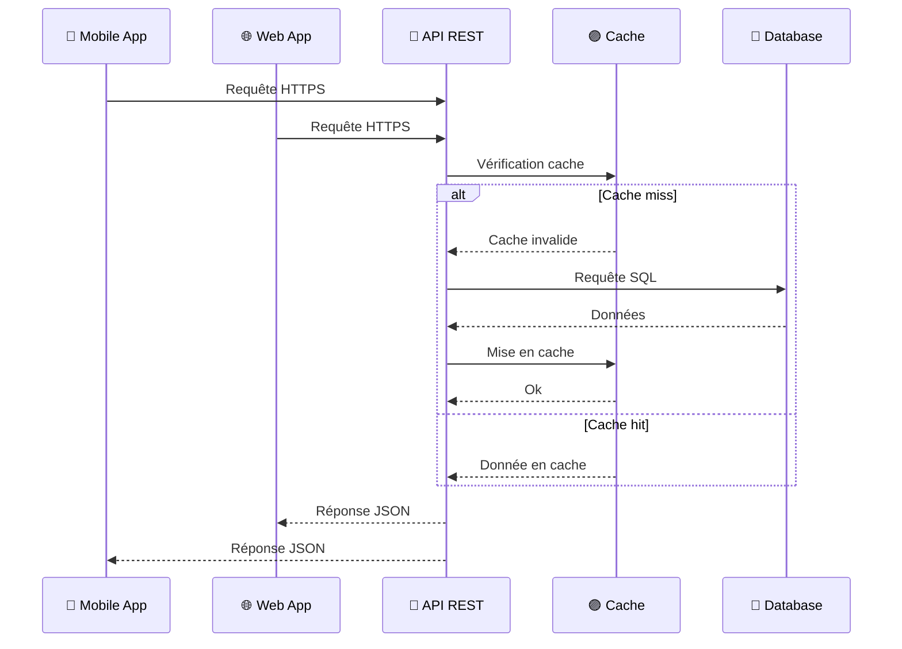

## Vue d'ensemble architecturale

Suite à l'analyse des besoins, j'ai choisi de structurer l'application selon une architecture distribuée séparant clairement les différentes parties : une interface web pour les coachs, une application mobile pour les athlètes, et un backend centralisé. Cette séparation permet de développer et maintenir chaque partie indépendamment, facilitant ainsi l'évolution future de l'application.

Le schéma ci-dessous présente les différents composants de l'application et leurs interactions :

Cette architecture répond aux contraintes identifiées lors de l'analyse des besoins : séparation des contextes d'usage (mobile pour les athlètes, web pour les coachs), centralisation des données pour assurer la cohérence, et modularité pour faciliter la maintenance et l'évolution.

## Organisation en monorepo

Pour structurer ce projet, j'ai choisi une architecture monorepo utilisant pnpm workspaces.

Le monorepo est organisé en deux catégories principales :

**Applications (`apps/`)** : Chaque application (web, mobile, api) dispose de son environnement de développement spécifique tout en partageant les packages communs.

**Packages partagés (`packages/`)** : Ces modules centralisent la logique réutilisable entre toutes les applications, garantissant la cohérence et facilitant la maintenance.

L'organisation en monorepo assure une cohérence technique entre l'application web, mobile et l'API grâce au partage des packages communs entre les différentes applications.

Cette approche élimine les divergences entre clients et garantit une homogénéité architecturale. Les modifications d'API impactent immédiatement tous les clients grâce aux types partagés, réduisant les erreurs d'intégration. Pnpm workspaces optimise la gestion des dépendances avec une installation unique des dépendances communes et des packages internes liés symboliquement.

## Packages partagés

Les **packages partagés** sont les suivants:

- **`@dropit/contract`** : Centralise les contrats d'API typés avec ts-rest pour garantir la cohérence entre frontend et backend
- **`@dropit/schemas`** : Regroupe les schémas de validation Zod réutilisés sur toutes les plateformes
- **`@dropit/permissions`** : Définit le système d'autorisation centralisé avec des rôles granulaires
- **`@dropit/i18n`** : Mutualise les traductions multilingues et centralise les contenus textuels

Les détails techniques d'implémentation et des explications plus détaillées de chaque package sont documentés dans la section [Architecture technique](/annexes/architecture-technique).

## Client Web (Back Office) : React et TypeScript

Pour le back office destiné aux coachs, j'ai choisi **React** associé à **TypeScript**. Cette technologie offre une architecture basée sur des composants réutilisables adaptée aux interfaces de gestion. TypeScript apporte une sécurité de typage pour la manipulation des données d'entraînement, détectant les erreurs dès la compilation.

### Écosystème technique et bibliothèques

Mon architecture frontend s'appuie sur un ensemble de bibliothèques sélectionnées pour leurs avantages spécifiques : **Tanstack Router** pour le routage typé, **Tanstack Query** pour la synchronisation des données, **React Hook Form** intégré aux schémas **Zod** partagés et **Shadcn/ui** avec **Tailwind CSS** pour l'interface.

La justification de ces choix, l'implémentation détaillée et leur intégration concrète dans les composants React est présentée dans la section [couches de présentation](/conception/presentations).

## Application Mobile (Front Office) : React Native

L'application mobile, développée avec **React Native**, constitue le point d'accès principal pour les athlètes. N'ayant aucune expérience en développement mobile natif, cette technologie permet de valoriser mes compétences React existantes tout en réduisant la courbe d'apprentissage.

Cette approche multiplateforme répond au besoin d'atteindre les utilisateurs iOS et Android avec une base de code partagée.

L'architecture monorepo permet le partage de logique métier entre les applications web et mobile via les packages communs (`@dropit/schemas`, `@dropit/contract`, `@dropit/permissions`). Cette mutualisation garantit la cohérence des règles de calcul et de validation des données entre les plateformes.

### Écosystème technique mobile

L'architecture mobile s'appuie sur des bibliothèques adaptées aux contraintes du développement mobile notamment **Expo** qui facilite l'écosystème de développement mobile en automatisant la gestion des certificats, les builds natifs et le déploiement. Cette plateforme me permet de me concentrer sur l'implémentation des fonctionnalités métier plutôt que sur la configuration d'environnements de développement mobile.

Pour en savoir plus sur l'implémentation spécifique à l'application mobile rendez vous dans la page [couches de présentation](/conception/presentations#architecture-mobile-app).

## API REST : NestJS

Le backend repose sur **NestJS**, un framework **Node.js** que j'ai déjà utilisé en entreprise. NestJS fournit des patterns d'architecture éprouvés (modules, services, guards, interceptors) avec un écosystème mature et une maintenance active. Son système d'injection de dépendances facilite les tests unitaires en favorisant l'inversion de contrôle, permettant d'isoler la logique métier des préoccupations techniques.

### Architecture hexagonale et Domain-Driven Design

**Organisation technique (Hexagonale)** : Initialement, j'avais opté pour une architecture n-tiers classique, pattern de base de NestJS. Au fur et à mesure du développement, j'ai progressivement fait évoluer certaines parties vers une approche inspirée de l'architecture hexagonale. Cette évolution répond à plusieurs motivations. D'une part, une volonté d'apprentissage de patterns architecturaux que je rencontre régulièrement dans les discussions techniques professionnelles. D'autre part, une anticipation des évolutions futures du projet où l'isolation de la logique métier pourrait faciliter des changements d'infrastructure (intégration matériel externe, sources de données tierces).

Je reconnais que cette architecture n'est pas encore complètement aboutie. Mes entités domaine restent par exemple couplées à MikroORM plutôt que d'être des objets métier purs. Cette implémentation partielle reflète le compromis que j'ai dû faire entre exploration de nouveaux patterns et pragmatisme pour livrer un MVP fonctionnel dans les délais impartis. Cette expérience m'a néanmoins permis de comprendre concrètement les bénéfices et la complexité de mise en œuvre de l'architecture hexagonale, au-delà de la théorie.

**Organisation métier (DDD)** : J'ai structuré l'application autour de modules correspondant aux domaines métier identifiés. Le module `identity` gère les utilisateurs, organisations et permissions, le module `training` centralise la logique d'entraînement avec les exercices, programmes et séances, tandis que le module `athletes` se concentre sur la gestion des athlètes et de leurs performances.

Les détails de chacune des couches implémentées sont décrits dans la section [Architecture en couches et pattern Repository](/conception/acces-donnees/#architecture-en-couches-et-pattern-repository).

### ORM : MikroORM vs alternatives

Dans le contexte de ma formation et face à un projet comportant des relations entre athlètes, programmes, exercices et séances, l'utilisation d'un ORM apporte une productivité significative en gérant automatiquement les jointures et relations. Le recours au SQL brut aurait nécessité un temps de développement considérable pour gérer manuellement les migrations, les relations et tout le mapping objet-relationnel.

J'ai opté pour MikroORM après avoir identifié des différences techniques avec TypeORM, pourtant plus répandu avec NestJS. MikroORM force à être explicite sur la définition des relations bidirectionnelles, ce qui évite des erreurs potentielles détectées seulement au runtime avec d'autres ORMs. Cette rigueur dans la déclaration des relations s'avère utile dans mon contexte d'apprentissage et pour les relations entre athlètes, programmes et séances d'entraînement.

## Base de données : PostgreSQL

Le choix d'une base de données relationnelle s'impose naturellement au regard de la nature des données manipulées dans DropIt. L'application gère des entités fortement structurées (utilisateurs, organisations, exercices, programmes, séances) avec des relations et des contraintes d'intégrité strictes. Les relations many-to-many entre exercices et programmes, ainsi que les associations entre athlètes et séances d'entraînement, nécessitent des jointures fréquentes et des requêtes que SQL maîtrise parfaitement.

Les alternatives NoSQL comme MongoDB auraient pu être envisagées, mais la dénormalisation des données aurait créé des problèmes de cohérence. De plus, la précision des données conditionne la sécurité des utilisateurs, maintenir l'intégrité référentielle via les contraintes de clés étrangères devient indispensable. 

Les propriétés ACID garantissent que les modifications de programmes d'entraînement restent cohérentes même en cas de modifications simultanées par plusieurs coachs. Pour optimiser les performances, j'ai prévu l'ajout d'index sur les colonnes fréquemment interrogées (user_id, organization_id, created_at) afin d'accélérer les requêtes de consultation des programmes et historiques d'entraînement si l'usage le necessite.

Mon choix s'est porté vers PostgreSQL pour son caractère open-source et sa maturité dans l'écosystème Node.js.

## Stratégie de cache : Redis

Redis, bien que non implémenté dans le MVP, constitue une solution de cache côté serveur envisagée pour optimiser les performances de l'API.

Les catalogues d'exercices et programmes récurrents sont fréquemment consultés par l'API lors des requêtes des clients web et mobile. Redis permettrait de mettre en cache ces données côté serveur, réduisant les accès à PostgreSQL et améliorant les temps de réponse de l'API.

Redis stocke les données en mémoire (RAM) plutôt que sur disque, ce qui le rend particulièrement rapide. Cette architecture **clé-valeur** s'avère adaptée aux besoins de cache où la rapidité d'accès prime sur la complexité des relations.

## Stockage de médias : MinIO

Pour le stockage des médias (vidéos de démonstration d'exercices, images), plusieurs approches techniques étaient envisageables, chacune présentant des avantages et inconvénients spécifiques.

Le stockage en base de données via des champs BLOB aurait permis une cohérence transactionnelle totale, mais cette approche présente des limitations importantes : dégradation des performances de PostgreSQL avec l'augmentation du volume de médias, complexité de la gestion des backups, et saturation de l'espace disque principal. Cette solution convient uniquement pour des fichiers de petite taille et en faible volume.

Le stockage sur le système de fichiers local représente une alternative simple à implémenter, mais pose des problèmes de scalabilité et de résilience. Cette approche complique la sauvegarde des données, limite la montée en charge horizontale de l'API, et ne facilite pas la distribution de contenu via des CDN.

MinIO résout ces limitations en proposant un stockage objet distribué compatible avec l'API S3 d'Amazon. Cette architecture sépare le stockage des médias de la base de données transactionnelle, optimisant les performances de chaque composant selon leur usage spécifique. L'API S3 standardisée garantit la portabilité vers des solutions cloud managées (AWS S3, Google Cloud Storage, Azure Blob Storage) sans modification du code applicatif.

## Recherche : SQL et Typesence

Pour la fonctionnalité de recherche dans les catalogues d'exercices, j'ai privilégié une approche simple : recherche SQL basique via PostgreSQL pour le MVP.

La recherche avec LIKE ou ILIKE permet de rechercher des exercices par correspondance de texte (exemple : `WHERE name ILIKE '%squat%'` trouve "Back Squat", "Front Squat", etc.). Cette solution suffit pour des catalogues de taille modeste, mais pourrait nécessiter une évolution si les clubs accumulent de nombreux exercices personnalisés.

Dans ce cas, l'ajout d'un moteur de recherche dédié comme Typesense (solution open-source spécialisée dans la recherche rapide) pourrait améliorer l'expérience utilisateur avec une recherche plus fluide, tolérante aux erreurs de frappe et capable de rechercher simultanément sur plusieurs critères (nom, groupe musculaire, équipement requis).

## Communication inter-composants et protocoles

Le diagramme suivant illustre les interactions entre les clients (mobile et web), l'API REST, et les couches de cache et de persistance :

L'ensemble des communications repose sur le **protocole HTTP** pour les échanges entre les applications frontend et l'API. Le **chiffrement HTTPS** protège la confidentialité des données sensibles échangées.

Au niveau des couches de persistance, PostgreSQL et Redis utilisent leurs protocoles natifs optimisés, tous deux construits sur **TCP/IP**.

Le **format JSON** structure l'ensemble des échanges de données, offrant un équilibre optimal entre lisibilité humaine et performance machine.

## Sécurité architecturale

L'architecture intégre les considérations de sécurité dès la phase d'architecture plutôt que de les traiter comme des ajouts a posteriori. Cette approche se concrétise par un chiffrement HTTPS, une authentification centralisée, une autorisation granulaire par rôles, et une séparation des responsabilités entre services.

Les détails d'implémentation sont présentés dans la section [Conception sécurisée](/securite/conception).

## Stratégie de gestion d'erreurs

Les erreurs peuvent survenir à plusieurs niveaux : problème de connexion réseau, données invalides envoyées par un utilisateur, panne d'un service externe. Plutôt que de laisser ces erreurs remonter brusquement vers l'utilisateur, l'application doit les gérer de manière gracieuse.

Au niveau de l'API, le backend NestJS transforme les erreurs techniques en messages d'erreur standardisés et exploitables par les clients. Sur le frontend React, les erreurs réseau sont capturées et affichées sous forme de messages utilisateur compréhensibles plutôt qu'en codes d'erreur techniques.

## Perspectives d'évolution et scalabilité

L'une des préoccupations constantes lors de la conception de cette architecture a été d'anticiper les évolutions futures sans pour autant tomber dans la sur-ingénierie. La séparation entre les clients applicatifs constitue un atout majeur pour l'évolution fonctionnelle. Cette approche me permet d'enrichir l'application mobile avec de nouvelles fonctionnalités spécifiques aux athlètes sans impacter le back office des coachs, et inversement.

Du point de vue de la scalabilité horizontale, l'architecture stateless de l'API facilite grandement la réplication et le déploiement de nouvelles instances selon l'évolution des besoins de charge. Les choix technologiques (protocoles standardisés, API S3-compatible, containerisation) anticipent une migration progressive vers des solutions cloud managées.

Cette flexibilité architecturale ouvre la voie à plusieurs enrichissements fonctionnels envisagés comme l'import automatique de programmes PDF/Excel, un module chronomètre intégré pour les athlètes, et des dashboards d'analyse des performances pour les coachs.

## Gestion des dépendances et sécurité

L'utilisation de bibliothèques externes nécessite une surveillance des mises à jour et vulnérabilités de sécurité. Pour l'instant, je gère cette veille manuellement en étant abonné par email aux repositories des bibliothèques critiques, ce qui me permet d'être notifié des nouvelles releases et d'effectuer les mises à jour nécessaires selon leur criticité. J'envisage prochainement d'automatiser cette surveillance en intégrant `pnpm audit` dans la CI, et en activant Dependabot ou GitHub Security Advisories pour détecter automatiquement les vulnérabilités.

