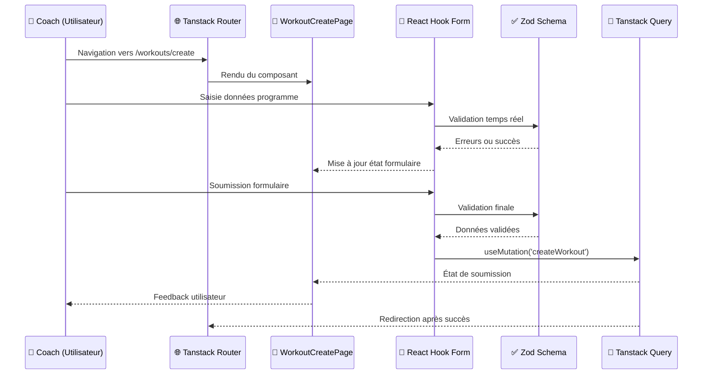
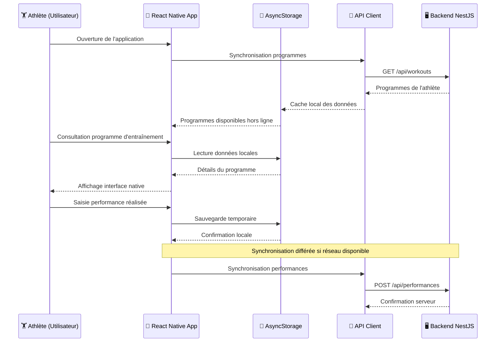
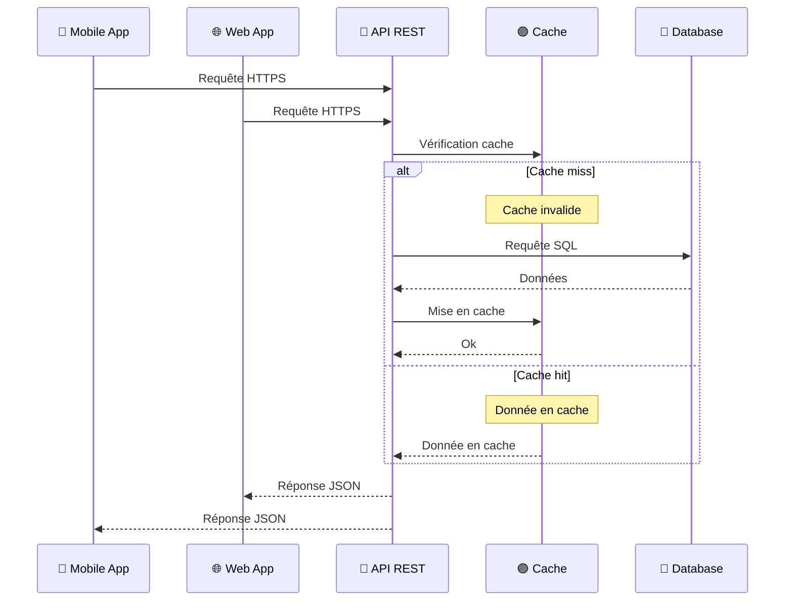

## Introduction

Ma stratégie architecturale de l'application s'appuie sur un équilibre entre familiarité technique et découverte de nouveaux outils. J'ai privilégié des technologies que je maîtrise déjà pour les composants critiques, tout en intégrant des solutions nouvelles pour enrichir mon apprentissage sans compromettre la viabilité du projet.

Cette approche me permet d'approfondir ma compréhension des enjeux d'architecture distribuée tout en maintenant un niveau de risque technique maîtrisable dans le cadre de ma formation.

## Vue d'ensemble architecturale

Suite à l'analyse des besoins, j'ai choisi de structurer l'application selon une architecture distribuée séparant clairement les différentes parties : une interface web pour les coachs, une application mobile pour les athlètes, et un backend centralisé. Cette séparation permet de développer et maintenir chaque partie indépendamment, facilitant ainsi l'évolution future de l'application.

Le schéma ci-dessous présente les différents composants de l'application et leurs interactions :


Cette architecture répond aux contraintes identifiées lors de l'analyse des besoins : séparation des contextes d'usage (mobile pour les athlètes, web pour les coachs), centralisation des données pour assurer la cohérence, et modularité pour faciliter la maintenance et l'évolution.

## Organisation en monorepo

Pour structurer ce projet multi-plateformes, j'ai choisi une architecture monorepo utilisant pnpm workspaces.

### Justification du choix monorepo

Le monorepo assure une cohérence technique entre l'application web, mobile et l'API grâce au partage des types TypeScript, schémas de validation et contrats d'API. Cette approche élimine les divergences potentielles entre les différents clients et garantit une homogénéité architecturale sur l'ensemble du projet.

Les packages partagés que j'ai mis en place (@dropit/schemas, @dropit/contract, @dropit/permissions) centralisent efficacement la logique métier commune. Cette mutualisation évite la duplication de code et garantit l'application des mêmes règles de validation sur toutes les plateformes, réduisant considérablement les risques d'incohérences fonctionnelles.

Le développement coordonné bénéficie grandement de cette architecture : toute modification d'API impacte immédiatement tous les clients grâce aux types partagés. Cette synchronisation automatique réduit significativement les erreurs d'intégration et accélère les cycles de développement, aspect particulièrement appréciable dans le contexte temporel contraint de ma formation.

La gestion des dépendances s'avère également optimisée grâce à pnpm workspaces qui permet une installation unique des dépendances communes, réduisant l'espace disque et accélérant les installations. Les packages internes sont liés symboliquement, facilitant le développement en temps réel et permettant de voir immédiatement l'impact des modifications sur l'ensemble des applications.


### Structure des workspaces

Le monorepo est organisé en deux catégories principales :

**Applications (`apps/`)** : Chaque application (web, mobile, api) dispose de son environnement de développement spécifique tout en partageant les packages communs.

**Packages partagés (`packages/`)** : Ces modules centralisent la logique réutilisable entre toutes les applications, garantissant la cohérence et facilitant la maintenance.

Cette organisation me permet de développer des fonctionnalités qui s'étendent sur plusieurs plateformes, tout en maintenant une base de code cohérente et facilement maintenable.

## Analyse détaillée des composants principaux

### Client Web (Back Office) : React et TypeScript

Pour le back office destiné aux coachs, j'ai choisi React associé à TypeScript. Ce choix s'appuie sur ma maîtrise de ces technologies acquise au cours de mes deux années d'expérience professionnelle, ainsi que sur la maturité de leur écosystème qui facilite le développement d'applications robustes.

#### Justification du choix React/TypeScript

Ma familiarité avec React me permet de me concentrer directement sur les enjeux métier spécifiques à l'haltérophilie plutôt que de consacrer du temps à l'apprentissage d'un nouveau framework. Cette technologie offre une architecture basée sur des composants réutilisables particulièrement adaptée aux interfaces de gestion nécessaires pour organiser les entraînements, suivre les performances et gérer les athlètes.

L'ajout de TypeScript apporte une sécurité de typage dans un contexte où la manipulation des données d'entraînement doit être fiable. Les types stricts permettent de détecter les erreurs potentielles dès la phase de compilation, réduisant significativement les risques de bugs en production. Cette approche se révèle particulièrement critique pour les calculs de charges et la gestion des progressions d'athlètes, domaines où la précision des données conditionne la sécurité des utilisateurs.

#### Écosystème technique et bibliothèques

Mon architecture frontend s'appuie sur un ensemble de bibliothèques sélectionnées pour répondre aux besoins spécifiques de l'application :

**Tanstack Router** : J'ai choisi Tanstack Router pour sa gestion typée des routes et ses capacités de preloading intelligent. Cette bibliothèque moderne offre une expérience utilisateur optimale en préchargeant les données des pages avant la navigation, aspect crucial pour une application utilisée en conditions réelles dans des clubs sportifs.

**Tanstack Query** : Cette bibliothèque gère efficacement la synchronisation des données entre le client et l'API, avec des fonctionnalités avancées de cache et de revalidation automatique. Dans le contexte de DropIt, cela garantit que les coachs travaillent toujours avec des données à jour concernant les programmes et performances de leurs athlètes. La mise en cache automatique des requêtes côté client réduit significativement les appels réseau redondants, particulièrement bénéfique pour l'affichage des listes d'athlètes et de programmes fréquemment consultées.

**React Hook Form** : Pour la gestion des formulaires (création d'exercices, programmation d'entraînements), React Hook Form minimise les re-rendus grâce à sa gestion d'état non contrôlée et son API déclarative. L'intégration avec la librairie `Zod` assure une validation cohérente entre le frontend et le backend grâce aux schémas partagés dans le monorepo.

**Shadcn et Tailwind CSS** : Shadcn fournit des composants accessibles et robustes (dialogs, dropdowns, forms) tandis que Tailwind CSS permet un développement rapide avec une cohérence visuelle maintenue. Cette combinaison me permet de construire une interface sans réinventer les composants de base tout en ayant la possibilité de les étendre selon mes besoins. L'utilisation du JIT (Just-In-Time) de Tailwind optimise automatiquement le bundle CSS final en ne gardant que les classes utilisées, réduisant la taille des assets.

**FullCalendar** : Spécifiquement intégrée pour la gestion du planning des séances, cette bibliothèque offre une interface calendaire permettant aux coachs de visualiser et organiser les entraînements de leurs athlètes.

**dnd-kit** : Cette bibliothèque permet d'implémenter des fonctionnalités de drag-and-drop pour réorganiser les exercices dans les programmes afin d'améliorer l'expérience utilisateur des coachs lors de la création d'entraînements.

#### Architecture frontend et flux de données



L'application suit un flux de données unidirectionnel où Tanstack Query centralise la gestion de l'état serveur, tandis que React se charge de l'état local des composants. Cette séparation facilite la maintenance et le débogage et me permet d'isoler les problèmes selon leur nature.

La structure respecte une séparation entre les différentes couches : présentation avec les composants UI, logique métier encapsulée dans des hooks personnalisés, et communication gérée par les clients API. Cette organisation facilite non seulement les tests unitaires en isolant chaque responsabilité, mais aussi l'évolution future du code en permettant de modifier une couche sans impacter les autres. Pour optimiser les performances de rendu, j'ai prévu d'implémenter une pagination progressive pour les longues listes d'athlètes et la technique de lazy loading pour les détails de programmes, évitant ainsi de charger l'intégralité des données au premier accès.

#### Structure du projet frontend

```
apps/web/src/
├── features/              # Modules métier organisés par domaine
│   ├── athletes/          # Gestion des athlètes
│   ├── exercises/         # Catalogue d'exercices
│   ├── workout/           # Création et gestion des programmes
│   └── planning/          # Interface calendaire de planification
├── shared/                # Composants et utilitaires partagés
│   ├── components/
│   │   ├── ui/            # Composants Radix UI personnalisés
│   │   ├── layout/        # Layouts, navigation, headers
│   │   └── auth/          # Composants d'authentification
│   ├── hooks/             # Hooks React réutilisables
│   └── utils.ts           # Fonctions utilitaires communes
├── lib/                   # Configuration et clients externes
│   ├── api.ts            # Client HTTP configuré
│   ├── auth-client.ts    # Configuration Better Auth
│   └── utils.ts          # Utilitaires de configuration
└── routes/               # Structure de routage Tanstack Router
    ├── __root.tsx        # Layout racine de l'application
    ├── _authenticated/   # Routes protégées par authentification
    └── index.tsx         # Page d'accueil publique
```

Le dossier `features/` regroupe les modules métier (athletes, exercises, workout, planning) avec leurs composants, hooks et logiques spécifiques.

Le dossier `shared/` centralise les éléments réutilisables : composants UI Shadcn, layouts de l'application, hooks personnalisés, et utilitaires communs.

Le dossier `lib/` contient les clients configurés (authentification, API) et les utilitaires de configuration.

Cette architecture frontend me permet de développer efficacement une interface tout en maintenant une base de code maintenable et évolutive. L'utilisation d'outils que je maîtrise, combinée à l'exploration de nouvelles bibliothèques comme Tanstack Router, constitue un équilibre raisonable entre productivité, apprentissage et besoins métier dans le cadre de ma formation.

### Application Mobile (Front Office) : React Native et Expo

L'application mobile, développée avec React Native et Expo, constitue le point d'accès principal pour les athlètes. N'ayant aucune expérience en développement mobile natif, cette technologie permet de valoriser mes compétences React existantes.

#### Justification du choix React Native/Expo

Ma familiarité avec React me permet de transposer mes compétences vers le développement mobile tout en réduisant la courbe d'apprentissage. Cette approche multiplateforme répond au besoin d'atteindre les utilisateurs iOS et Android avec une base de code partagée, ce qui s'avère adapté aux contraintes temporelles de ma formation.

Expo facilite l'écosystème de développement mobile en automatisant la gestion des certificats, les builds natifs et le déploiement. Cette plateforme me permet de me concentrer sur l'implémentation des fonctionnalités métier plutôt que sur la configuration d'environnements de développement mobile.

L'architecture monorepo permet le partage de logique métier entre les applications web et mobile via les packages communs (`@dropit/schemas`, `@dropit/contract`, `@dropit/permissions`). Cette mutualisation garantit la cohérence des règles de calcul et de validation des données entre les plateformes, aspect important dans un contexte où la précision des progressions impacte la sécurité des utilisateurs.

#### Écosystème technique mobile

L'architecture mobile s'appuie sur des bibliothèques adaptées aux contraintes du développement mobile :

**AsyncStorage pour la persistance locale** : Cette solution native stocke les données d'authentification et les informations de session.

**ts-rest pour la cohérence API** : L'utilisation du même contrat d'API typé (@dropit/contract) entre les applications web et mobile garantit une interface cohérente avec le backend et facilite la maintenance.

**React Native Web pour la portabilité** : Cette fonctionnalité permet de tester l'application mobile dans un navigateur pendant le développement, améliorant l'efficacité des cycles de test.

#### Architecture mobile et flux de données



L'approche offline-first privilégie le stockage local des données pour garantir une utilisation continue même sans connexion internet, contrainte fréquente en salle de sport. Les performances sont stockées localement puis synchronisées automatiquement avec le serveur.

#### Structure du projet mobile

```
apps/mobile/
├── src/
│   ├── components/          # Composants React Native
│   │   ├── AuthProvider.tsx # Gestion authentification globale
│   │   ├── LoginScreen.tsx  # Écran de connexion
│   │   └── DashboardScreen.tsx # Interface principale athlète
│   └── lib/                 # Configuration et clients
│       ├── auth-client.ts   # Client Better Auth pour mobile
│       └── api.ts          # Client HTTP configuré
├── assets/                  # Images et ressources natives
│   ├── icon.png            # Icône application
│   ├── splash-icon.png     # Écran de démarrage
│   └── adaptive-icon.png   # Icône adaptative Android
├── app.json                 # Configuration Expo
└── App.tsx                 # Point d'entrée de l'application
```

La structure mobile reste volontairement simple avec une séparation entre les composants d'interface et la configuration des services externes. Cette simplicité architecturale facilite la maintenance et réduit la complexité cognitive, aspect important dans un contexte d'apprentissage du développement mobile.

Le fichier `app.json` centralise l'ensemble des paramètres de build et de déploiement, facilitant la gestion des différentes plateformes cibles. Cette centralisation évite la dispersion de la configuration et simplifie les déploiements multi-plateformes.

Les assets sont organisés selon les conventions Expo pour permettre une génération automatique des icônes et écrans de démarrage adaptés à chaque plateforme. Cette approche me fait économiser un temps précieux en automatisant les tâches répétitives de création d'assets spécifiques à chaque plateforme.

Cette architecture répond aux contraintes spécifiques du mobile (offline-first, interface tactile) tout en maintenant la cohérence avec l'écosystème monorepo.

### API REST : NestJS

Le backend repose sur NestJS, un framework Node.js que j'ai déjà eu l'occasion d'utiliser dans des projets précédents ainsi qu'en entreprise. Cette familiarité avec l'outil permet un développement plus efficace tout en m'offrant l'opportunité d'explorer des fonctionnalités plus avancées que je n'avais pas encore maîtrisées.

#### Justification du choix NestJS

NestJS me fournit des patterns d'architecture éprouvés tels que les modules, services, guards et interceptors, évitant ainsi de réinventer la roue architecturale. Cette approche me permet de me concentrer directement sur la logique métier plutôt que sur la mise en place d'une architecture de base, aspect crucial dans le contexte temporel contraint de ma formation.

Le framework bénéficie d'une maintenance active avec des mises à jour régulières et dispose d'une communauté solide. Cette stabilité s'avère essentielle pour un projet d'apprentissage qui doit rester fonctionnel sur la durée. L'écosystème mature de NestJS propose des modules officiels pour la plupart des besoins courants, qu'il s'agisse d'authentification, de validation ou d'intégration ORM.

Le système d'injection de dépendances natif facilite considérablement les tests unitaires en favorisant le principe d'inversion de contrôle. Cette approche me permet d'isoler facilement la logique métier des préoccupations techniques, aspect essentiel pour implémenter correctement l'architecture hexagonale sans configuration complexe supplémentaire.

#### Architecture hexagonale et Domain-Driven Design

Le choix d'une architecture hexagonale (ports et adaptateurs) pour structurer l'application backend répond à un double objectif : répondre aux besoins du projet tout en saisissant l'opportunité d'apprentissage offerte par ce contexte de formation.

Initialement, j'avais opté pour une architecture n-tiers classique. Cependant, au fur et à mesure du développement, la complexité croissante des règles métier d'haltérophilie (calculs de charges, gestion des progressions, validation des performances) a révélé les limites de cette approche. L'évolution vers une architecture hexagonale s'est faite progressivement, motivée par le besoin concret d'isoler cette logique métier critique des préoccupations techniques.

L'application s'organise autour de modules correspondant aux domaines métier identifiés : le module `identity` gère les utilisateurs, organisations et permissions, le module `training` centralise la logique d'entraînement avec les exercices, programmes et séances, tandis que le module `athletes` se concentre sur la gestion des athlètes et de leurs performances.

Chaque module respecte une séparation stricte en quatre couches distinctes :

```
┌─────────────────────────────────────────────────────────────┐
│                    🌐 Interface Layer                        │
│                                                             │
│  ┌─────────────────┐ ┌─────────────────┐ ┌─────────────────┐│
│  │ Controllers REST│ │ Guards &        │ │ DTOs &          ││
│  │                 │ │ Middlewares     │ │ Validators      ││
│  └─────────────────┘ └─────────────────┘ └─────────────────┘│
└─────────────────────────────────────────────────────────────┘
                                │
                                ▼
┌─────────────────────────────────────────────────────────────┐
│                   📋 Application Layer                      │
│                                                             │
│  ┌─────────────────┐           ┌─────────────────┐          │
│  │ Use Cases       │           │ Services        │          │
│  │                 │           │ Applicatifs     │          │
│  └─────────────────┘           └─────────────────┘          │
└─────────────────────────────────────────────────────────────┘
                                │
                                ▼
┌─────────────────────────────────────────────────────────────┐
│                      💎 Domain Layer                        │
│                                                             │
│  ┌─────────────────┐ ┌─────────────────┐ ┌─────────────────┐│
│  │ Entités Métier  │ │ Règles Business │ │ Ports/Interfaces││
│  │                 │ │                 │ │                 ││
│  └─────────────────┘ └─────────────────┘ └─────────────────┘│
└─────────────────────────────────────────────────────────────┘
                                │
                                ▼
┌─────────────────────────────────────────────────────────────┐
│                   🔧 Infrastructure Layer                   │
│                                                             │
│  ┌─────────────────┐ ┌─────────────────┐ ┌─────────────────┐│
│  │ Repositories    │ │ Services        │ │ Adaptateurs     ││
│  │ MikroORM        │ │ Externes        │ │                 ││
│  └─────────────────┘ └─────────────────┘ └─────────────────┘│
└─────────────────────────────────────────────────────────────┘
```

Les ports définissent les contrats d'interface nécessaires aux repositories et services externes, tandis que les adaptateurs fournissent les implémentations concrètes correspondantes. Cette approche me donne la flexibilité de changer d'ORM, de base de données ou de services externes sans impacter la logique métier centrale.

#### Choix de l'ORM : MikroORM vs alternatives

Dans le contexte de ma formation et face à un projet comportant des relations complexes entre athlètes, programmes, exercices et séances, l'utilisation d'un ORM apporte une productivité significative en gérant automatiquement les jointures et relations. Le recours au SQL brut aurait nécessité un temps de développement considérable pour gérer manuellement les migrations, les relations et tout le mapping objet-relationnel.

J'ai opté pour MikroORM après avoir identifié des différences techniques concrètes avec TypeORM, pourtant plus répandu avec NestJS. MikroORM implémente nativement le pattern Unit of Work, contrairement à TypeORM qui utilise un pattern Repository plus basique. Cette approche Unit of Work optimise les performances en regroupant les opérations et en gérant automatiquement l'ordre des transactions, aspect crucial pour les opérations complexes de création de programmes d'entraînement dans DropIt.

La gestion des relations bidirectionnelles et des cascades complexes se révèle également supérieure avec MikroORM. Dans mon application, les relations entre TrainingSession, Workout et AthleteTrainingSession nécessitent une gestion fine des dépendances que MikroORM gère plus élégamment. En termes de performance, MikroORM génère des requêtes SQL plus optimisées, particulièrement pour les requêtes avec jointures multiples fréquentes dans une application de gestion d'entraînements.

Le typage TypeScript plus strict de MikroORM détecte les erreurs de relation dès la compilation, là où TypeORM peut laisser passer certaines incohérences qui ne sont détectées qu'à l'exécution. Cette exploration de MikroORM me permet d'approfondir ma compréhension des patterns avancés de gestion de données tout en découvrant des alternatives aux solutions les plus répandues.

#### Sécurité applicative et protection OWASP

L'architecture que j'ai mise en place intègre des mesures de sécurité spécifiques pour contrer les principales vulnérabilités répertoriées par l'OWASP. L'utilisation de MikroORM avec des requêtes paramétrées, combinée à la validation stricte des entrées via les DTOs Zod, élimine efficacement les risques d'injection SQL (OWASP A03). Les schémas de validation partagés entre frontend et backend garantissent une validation cohérente à tous les niveaux de l'application.

Concernant le contrôle d'accès (OWASP A01), chaque endpoint bénéficie de la protection des guards NestJS qui vérifient systématiquement les permissions utilisateur via le package `@dropit/permissions`. L'isolation par organisation garantit que les utilisateurs ne peuvent accéder qu'aux données de leur club respectif, empêchant tout accès transversal non autorisé.

La validation et la sanitisation des données (OWASP A04) s'effectuent grâce aux schémas Zod stricts définis dans `@dropit/schemas`, assurant une validation uniforme entre toutes les couches applicatives. Cette approche centralisée évite les disparités de validation qui pourraient créer des failles de sécurité.

#### Structure du projet backend

```
apps/api/src/
├── modules/                   # Modules métier organisés par domaine
│   ├── identity/              # Authentification, autorisation, organisations
│   │   ├── domain/            # Entités métier et règles business
│   │   ├── application/       # Use cases et services applicatifs
│   │   ├── infrastructure/    # Implémentations (repositories, services)
│   │   └── interface/         # Controllers, DTOs, guards
│   ├── training/              # Gestion des entraînements et exercices
│   │   ├── domain/            # Modèle métier de l'entraînement
│   │   ├── application/
│   │   │   ├── use-cases/     # Logique applicative
│   │   │   └── ports/         # Interfaces des repositories
│   │   ├── infrastructure/    # Implémentations MikroORM
│   │   └── interface/         # API REST et validation
│   └── athletes/              # Gestion des athlètes
├── config/                    # Configuration centralisée
├── seeders/                   # Données de test et d'initialisation
└── main.ts                    # Point d'entrée de l'application
```

L'organisation modulaire que j'ai mise en place encapsule chaque domaine métier dans des boundaries clairement définies, facilitant ainsi la maintenance et permettant une évolution indépendante de chaque contexte. Cette approche s'avère particulièrement bénéfique dans le cadre de mon apprentissage, car elle me permet d'approfondir progressivement chaque domaine sans risquer d'impacter les autres parties de l'application.

L'architecture hexagonale, combinée au système d'injection de dépendances de NestJS, facilite naturellement les tests unitaires en permettant le mock des couches externes comme la base de données ou les services tiers. Cette approche me permet d'acquérir de bonnes pratiques en matière de tests tout en développant une application réellement testable.

Cette architecture backend constitue un excellent terrain d'apprentissage pour découvrir les principes du Domain-Driven Design et de l'architecture hexagonale dans un contexte concret. L'approche par ports et adaptateurs que j'ai adoptée garantit une flexibilité future non négligeable : si demain je souhaite migrer vers un autre ORM ou une base de données différente, cette transition pourra s'effectuer sans remettre en cause la logique métier, aspect crucial pour la maintenabilité à long terme d'un projet qui évoluera au-delà de ma formation.


## Structure complète du projet monorepo

Cette organisation optimise la réutilisabilité du code métier et garantit la cohérence des types entre frontend et backend. 
L'organisation finale du projet DropIt :

```
dropit/
├── apps/                          # Applications principales
│   ├── web/                       # Interface web React/TypeScript
│   │   ├── src/
│   │   │   ├── features/          # Modules métier (athletes, exercises, workout, planning)
│   │   │   ├── shared/            # Composants UI, hooks et utilitaires partagés
│   │   │   ├── lib/               # Configuration des clients (API, auth)
│   │   │   └── routes/            # Structure de routage Tanstack Router
│   │   ├── package.json           # Dépendances spécifiques au web
│   │   ├── vite.config.ts         # Configuration Vite
│   │   └── tailwind.config.js     # Configuration Tailwind CSS
│   ├── mobile/                    # Application mobile React Native/Expo
│   │   ├── src/
│   │   │   ├── components/        # Composants React Native
│   │   │   └── lib/               # Configuration clients mobiles
│   │   ├── assets/                # Ressources natives (icônes, splash screens)
│   │   ├── app.json               # Configuration Expo
│   │   ├── App.tsx                # Point d'entrée mobile
│   │   └── package.json           # Dépendances React Native/Expo
│   └── api/                       # Backend NestJS
│       ├── src/
│       │   ├── modules/           # Modules métier NestJS
│       │   ├── common/            # Utilitaires et middlewares partagés
│       │   └── config/            # Configuration application
│       ├── package.json           # Dépendances backend
│       └── nest-cli.json          # Configuration NestJS CLI
├── packages/                      # Packages partagés entre applications
│   ├── contract/                  # Contrats d'API typés avec ts-rest
│   │   ├── src/api/               # Définitions des endpoints
│   │   ├── index.ts               # Export principal des contrats
│   │   └── package.json           # Configuration du package
│   ├── schemas/                   # Schémas de validation Zod
│   │   ├── src/                   # Schémas métier (User, Workout, Exercise)
│   │   ├── index.ts               # Export des schémas
│   │   └── package.json           # Configuration Zod
│   ├── permissions/               # Système de rôles et permissions
│   │   ├── src/                   # Définition des rôles et contrôles d'accès
│   │   ├── index.ts               # Export des permissions
│   │   └── package.json           # Configuration des permissions
│   ├── i18n/                      # Internationalisation partagée
│   │   ├── locales/               # Fichiers de traduction (fr, en)
│   │   ├── index.ts               # Configuration i18next
│   │   └── package.json           # Configuration i18n
│   └── tsconfig/                  # Configurations TypeScript partagées
│       ├── base.json              # Configuration TypeScript de base
│       ├── nextjs.json            # Config spécifique React
│       ├── react-native.json      # Config spécifique React Native
│       └── package.json           # Configuration du package
├── package.json                   # Configuration racine du monorepo
├── pnpm-workspace.yaml           # Définition des workspaces pnpm
├── pnpm-lock.yaml                # Verrouillage des dépendances
├── biome.json                     # Configuration du linter/formatter
├── docker-compose.yml            # Services de développement (PostgreSQL, Redis, MinIO)
└── README.md                     # Documentation du projet
```

### Avantages de cette organisation

Les packages partagés garantissent l'utilisation des mêmes types, schémas et logiques métier sur toutes les plateformes, assurant une cohérence technique fondamentale. Cette mutualisation évite la divergence entre les différents clients et maintient l'homogénéité architecturale de l'ensemble du projet.

Le développement coordonné bénéficie de cette architecture : les modifications dans les packages partagés se répercutent automatiquement sur toutes les applications. Cette synchronisation réduit les erreurs d'intégration et accélère les cycles de développement, particulièrement appréciable dans le contexte temporel de ma formation.

La maintenance centralisée de la logique commune évite la duplication de code et simplifie les évolutions futures. Chaque application peut néanmoins être déployée indépendamment tout en bénéficiant des composants communs, offrant une flexibilité opérationnelle.

Cette architecture monorepo maintient la cohérence technique entre toutes les plateformes tout en préservant la flexibilité nécessaire aux besoins spécifiques de chaque contexte d'usage.

## Base de données : PostgreSQL

### Justification du modèle relationnel

Le choix d'une base de données relationnelle s'impose naturellement au regard de la nature des données manipulées dans DropIt. L'application gère des entités fortement structurées (utilisateurs, organisations, exercices, programmes, séances) avec des relations complexes et des contraintes d'intégrité strictes. Les relations many-to-many entre exercices et programmes, ainsi que les associations entre athlètes et séances d'entraînement, nécessitent des jointures fréquentes et des requêtes complexes que SQL maîtrise parfaitement.

Les alternatives NoSQL comme MongoDB auraient pu être envisagées, mais la dénormalisation des données aurait créé des problèmes de cohérence. Dans le contexte de l'haltérophilie, où la précision des données conditionne la sécurité des utilisateurs, maintenir l'intégrité référentielle via les contraintes de clés étrangères devient indispensable. Les propriétés ACID garantissent que les modifications de programmes d'entraînement restent cohérentes même en cas de modifications simultanées par plusieurs coachs. Pour optimiser les performances, j'ai prévu l'ajout d'index sur les colonnes fréquemment interrogées (user_id, organization_id, created_at) afin d'accélérer les requêtes de consultation des programmes et historiques d'entraînement.

### Choix de PostgreSQL face aux alternatives

Parmi les bases de données relationnelles disponibles, PostgreSQL présente des avantages déterminants face à ses concurrents.

Face à SQL Server ou Oracle, PostgreSQL présente l'avantage d'être open-source, éliminant les contraintes de coûts de licence dans le contexte budgétaire contraint de ma formation. Cette caractéristique facilite également le déploiement sur différents environnements sans considération de licensing.

La maturité de PostgreSQL dans l'écosystème Node.js constitue également un facteur décisif. Son intégration native avec MikroORM et les excellentes performances des drivers JavaScript modernes (pg, pg-pool) assurent une communication optimale entre l'API NestJS et la couche de persistance. Le connection pooling natif du driver PostgreSQL gère automatiquement les pics de charge en réutilisant les connexions existantes plutôt que d'en créer de nouvelles pour chaque requête, optimisation transparente qui améliore les performances sans configuration supplémentaire. Ma familiarité préalable avec PostgreSQL me permet de me concentrer sur les aspects métier de la modélisation plutôt que sur l'apprentissage d'un nouveau système de base de données.

## Stratégie de cache : Redis

Redis, bien que non implémenté dans le MVP, constitue une solution de cache envisagée pour optimiser les performances applicatives.

Les athlètes consultent fréquemment leurs programmes pendant l'entraînement, souvent dans des conditions de réseau instables. Redis permettrait de mettre en cache les données d'entraînement les plus consultées, réduisant les temps de réponse et améliorant l'expérience utilisateur en salle de sport. Cette stratégie de cache multi-niveaux (navigateur → Redis → PostgreSQL) optimiserait le parcours complet des données, particulièrement efficace pour les catalogues d'exercices et les programmes récurrents.

Le choix de Redis répond à des contraintes techniques spécifiques. Contrairement aux bases de données relationnelles optimisées pour la persistance, Redis privilégie la performance avec son stockage en mémoire et ses structures de données natives (strings, hashes, sets, lists). Cette architecture NoSQL clé-valeur s'avère particulièrement adaptée aux besoins de cache où la rapidité d'accès prime sur la complexité relationnelle.

Cette intégration future me permettra d'approfondir les stratégies de cache et l'architecture hybride SQL/NoSQL, compétences recherchées dans le développement d'applications modernes à forte charge.

## Stockage de médias : MinIO

Pour le stockage des médias (vidéos de démonstration d'exercices, images), plusieurs approches techniques étaient envisageables, chacune présentant des avantages et inconvénients spécifiques.

Le stockage en base de données via des champs BLOB aurait permis une cohérence transactionnelle totale, mais cette approche présente des limitations importantes : dégradation des performances de PostgreSQL avec l'augmentation du volume de médias, complexité de la gestion des backups, et saturation de l'espace disque principal. Cette solution convient uniquement pour des fichiers de petite taille et en faible volume.

Le stockage sur le système de fichiers local représente une alternative simple à implémenter, mais pose des problèmes de scalabilité et de résilience. Cette approche complique la sauvegarde des données, limite la montée en charge horizontale de l'API, et ne facilite pas la distribution de contenu via des CDN.

MinIO résout ces limitations en proposant un stockage objet distribué compatible avec l'API S3 d'Amazon. Cette architecture sépare le stockage des médias de la base de données transactionnelle, optimisant les performances de chaque composant selon leur usage spécifique. L'API S3 standardisée garantit la portabilité vers des solutions cloud managées (AWS S3, Google Cloud Storage, Azure Blob Storage) sans modification du code applicatif.

Cette approche me permet d'implémenter une solution complète en développement tout en acquérant une compréhension des principes du stockage objet, compétence essentielle dans l'écosystème cloud moderne. La compatibilité API facilite également l'évolution future vers des solutions de CDN pour optimiser la distribution des vidéos d'exercices.

## Recherche : Typesense

Pour la fonctionnalité de recherche dans les catalogues d'exercices et programmes d'entraînement, plusieurs approches techniques s'offrent selon l'évolution du volume de données.

La recherche via requêtes SQL PostgreSQL avec LIKE ou ILIKE représente la solution la plus directe pour des catalogues de taille modeste. PostgreSQL propose également des fonctionnalités de recherche textuelle intégrées (Full Text Search) avec les types tsvector et tsquery, suffisantes pour des besoins basiques. Cette approche présente néanmoins des limitations : performances dégradées sur de gros volumes, absence de recherche floue (typos), et fonctionnalités limitées pour le ranking et la pertinence des résultats.

Les solutions Elasticsearch ou Solr auraient pu être envisagées, mais leur complexité d'infrastructure et de configuration dépasse les besoins d'un MVP. Ces outils requièrent une expertise approfondie et des ressources importantes pour une fonctionnalité non critique dans la phase initiale du projet.

Typesense, bien que non implémenté dans le MVP, constitue une alternative moderne adaptée aux besoins futurs de DropIt. Cette solution open-source privilégie la simplicité de déploiement tout en offrant des fonctionnalités avancées : recherche typo-tolerante, faceting, auto-complétion et géolocalisation. Contrairement à Elasticsearch, Typesense se configure rapidement et consomme moins de ressources, caractéristiques appropriées pour un projet en phase d'apprentissage.

L'architecture de Typesense permettrait une recherche instantanée dans les catalogues d'exercices enrichis (nom, groupe musculaire, équipement requis, niveau de difficulté) et faciliterait la découverte de programmes d'entraînement par les coachs. Cette solution anticipera l'évolution des besoins lorsque les clubs accumuleront des bibliothèques d'exercices conséquentes nécessitant une recherche performante et intuitive.

## Stratégie de déploiement : Dokploy

Pour le déploiement de l'application, plusieurs approches techniques étaient envisageables selon les contraintes budgétaires et les objectifs d'apprentissage du projet.

Le déploiement manuel sur VPS avec orchestration via PM2 représentait l'option la plus économique et directe. Cette approche aurait consisté à installer directement Node.js, PostgreSQL et les dépendances système, puis utiliser PM2 pour la gestion des processus et le restart automatique. Cependant, cette méthode présente des risques significatifs : configuration non reproductible entre les environnements, gestion complexe des dépendances système, absence d'isolation des services, et difficulté de rollback en cas de problème.

Les solutions cloud managées (Vercel, Railway, Render) auraient simplifié le déploiement mais introduisent des coûts récurrents incompatibles avec le budget étudiant. Ces plateformes masquent également les mécanismes de déploiement, limitant l'apprentissage des concepts d'infrastructure et d'orchestration.

Dokploy sur VPS personnel résout ces contraintes en proposant une interface de gestion moderne s'appuyant sur Docker. Cette solution combine les avantages économiques du VPS avec les bonnes pratiques de containerisation, garantissant la reproductibilité des déploiements entre développement et production. L'isolation des services via conteneurs élimine les conflits de dépendances et facilite la maintenance.

Cette plateforme offre un équilibre optimal pour l'apprentissage : elle expose suffisamment les mécanismes sous-jacents pour comprendre les enjeux d'infrastructure tout en automatisant les tâches répétitives. L'expérience acquise avec cette stack (Docker, reverse proxy, gestion des volumes) facilitera l'évolution future vers des solutions d'orchestration plus avancées comme Kubernetes si les besoins de scalabilité l'exigent.

## Monitoring et observabilité

Pour assurer la visibilité sur le comportement de l'application en production, plusieurs approches d'observabilité sont envisageables selon les besoins de maturité du projet.

Les logs natifs de Dokploy constituent la base de l'observabilité actuelle, capturant les sorties stdout/stderr des conteneurs Docker. Cette solution basique permet un premier niveau de débogage mais reste limitée pour une analyse approfondie : absence de structuration des logs, recherche difficile, pas de corrélation entre les événements, et visualisation rudimentaire.

L'implémentation d'une solution de logging structuré via Pino dans NestJS améliorerait significativement la qualité des traces. Pino génère des logs JSON performants avec des niveaux appropriés, facilitant l'analyse et la recherche. Cette approche nécessiterait cependant l'ajout d'une stack ELK (Elasticsearch, Logstash, Kibana) ou similaire pour l'agrégation et la visualisation, complexifiant l'infrastructure.

SignOz constitue une alternative open-source complète implémentant la triade observabilité (logs, métriques, traces) avec support d'OpenTelemetry. Cette solution moderne permettrait une observabilité exhaustive mais introduit une complexité d'infrastructure significative pour un MVP, nécessitant des ressources serveur additionnelles.

J'ai donc opté pour le monitoring d'erreurs immédiat avec Dokploy tout en me laissant la possibilité d'évoluer vers une solution complète (SignOz déployé via Dokploy ou stack ELK) selon les retours d'usage et la maturité du projet.

## Stratégie de sauvegarde et plan de continuité

Dans le contexte d'une application gérant des données critiques pour la sécurité des athlètes, j'ai conçu une stratégie de sauvegarde robuste et un plan de continuité d'activité pour minimiser les risques de perte de données et assurer la disponibilité du service.

### Sauvegarde des données critiques

La base de données PostgreSQL bénéficie d'une stratégie de sauvegarde automatisée à plusieurs niveaux. J'ai mis en place des dumps quotidiens complets via pg_dump, stockés avec rétention de 30 jours pour permettre la restauration à différents points dans le temps. Ces sauvegardes sont chiffrées et stockées sur un support séparé du serveur principal pour éviter la perte simultanée des données de production et des sauvegardes.

Pour une granularité plus fine, j'ai configuré l'archivage des WAL (Write-Ahead Logs) de PostgreSQL, permettant une restauration point-in-time (PITR) avec une précision à la seconde. Cette fonctionnalité s'avère cruciale si une corruption de données est détectée après plusieurs heures d'activité, permettant de restaurer la base exactement avant l'incident.

Les médias stockés dans MinIO font l'objet d'une réplication sur un second bucket avec politique de versioning. Cette approche protège contre les suppressions accidentelles de vidéos d'exercices et permet de récupérer des versions antérieures de contenus modifiés.

### Plan de continuité et procédures d'urgence

En cas de panne majeure du serveur principal, j'ai documenté une procédure de restauration complète qui comprend la réinstallation de l'environnement Docker, la restauration de la base de données depuis la sauvegarde la plus récente, et la resynchronisation des médias depuis le stockage de réplication.

Les objectifs de continuité que je me suis fixés sont un RTO (Recovery Time Objective) de 4 heures maximum pour la remise en service complète, et un RPO (Recovery Point Objective) de 1 heure maximum pour la perte de données acceptable. Ces seuils correspondent aux contraintes opérationnelles d'un club sportif où l'indisponibilité prolongée impacterait directement les séances d'entraînement.

Pour valider l'efficacité de cette stratégie, j'ai planifié des tests de restauration trimestriels sur un environnement de staging. Ces exercices pratiques permettent de vérifier l'intégrité des sauvegardes et d'ajuster les procédures selon les retours d'expérience.

La documentation des procédures d'urgence est centralisée et accessible depuis différents supports (serveur principal, documentation externe, support mobile) pour garantir sa disponibilité même en cas de panne complète de l'infrastructure.

## Communication inter-composants et protocoles

L'architecture distribuée que j'ai mise en place nécessite une communication fiable entre les différents composants de l'application. Cette section détaille les protocoles et mécanismes d'échange que j'ai choisis pour assurer la cohésion de l'ensemble du système.

Le diagramme suivant illustre les interactions entre les clients (mobile et web), l'API REST, et les couches de cache et de persistance :



L'ensemble des communications repose sur HTTP/HTTPS pour garantir la sécurité des échanges entre les applications frontend et l'API. Cette approche standardisée facilite l'intégration et assure la compatibilité avec l'écosystème web existant. Le chiffrement HTTPS que j'ai mis en place protège la confidentialité des données sensibles échangées, particulièrement critiques dans un contexte de gestion d'entraînements où les informations personnelles des athlètes transitent régulièrement.

Au niveau des couches de persistance, PostgreSQL et Redis utilisent leurs protocoles natifs optimisés, tous deux construits sur TCP/IP. Cette approche me permet de bénéficier des optimisations spécifiques à chaque système sans compromettre les performances par des couches d'abstraction supplémentaires.

Le format JSON structure l'ensemble des échanges de données, offrant un équilibre optimal entre lisibilité humaine et performance machine. Cette standardisation facilite considérablement le débogage pendant le développement et simplifie l'intégration de nouveaux clients dans l'écosystème.

## Sécurité architecturale

Dans ma démarche de conception, j'ai privilégié une approche "security by design" en intégrant les considérations de sécurité dès la phase d'architecture plutôt que de les traiter comme des ajouts a posteriori. Cette philosophie m'a amené à structurer l'application autour de principes de sécurité fondamentaux qui se traduisent concrètement à travers plusieurs mécanismes.

L'authentification que j'ai mise en place repose sur une architecture hybride qui combine les avantages des tokens JWT pour la performance avec la sécurité des sessions révocables pour le contrôle d'accès. Cette approche me permet de maintenir une expérience utilisateur fluide tout en conservant la possibilité de révoquer immédiatement les accès en cas de compromission.

L'ensemble des communications bénéficie d'un chiffrement bout en bout via HTTPS, complété par un système d'autorisation granulaire qui contrôle précisément l'accès aux différentes fonctionnalités selon le rôle utilisateur. Cette stratification des permissions évite les accès privilégiés non nécessaires et limite les risques d'escalade de privilèges.

La séparation des responsabilités entre les différents services (authentification, cache, stockage) constitue une approche défensive qui limite la surface d'attaque et facilite l'application de mesures de sécurité spécifiques à chaque composant. Cette isolation me permet également d'appliquer des politiques de sécurité différenciées selon la sensibilité des données manipulées.

Une description détaillée des mécanismes de sécurité mis en place est disponible dans la section [Conception sécurisée](/securite/conception).

## Stratégie de gestion d'erreurs

L'architecture distribuée de DropIt nécessite une approche cohérente de gestion d'erreurs pour maintenir une expérience utilisateur stable et faciliter la maintenance. Ma stratégie repose sur plusieurs niveaux de traitement des erreurs selon leur contexte d'occurrence.

Au niveau frontend, j'ai mis en place des Error Boundaries React qui isolent les pannes d'interface et empêchent qu'une erreur dans un composant provoque le crash complet de l'application. Cette approche défensive permet aux coachs de continuer à utiliser les autres fonctionnalités même en cas de problème sur un module spécifique, comme la visualisation d'un exercice ou l'édition d'un programme.

Pour l'application mobile, la stratégie offline-first que j'ai adoptée constitue un mécanisme de fallback naturel. Lorsque les requêtes réseau échouent, l'application bascule automatiquement sur les données mises en cache localement, permettant aux athlètes de consulter leurs programmes même en cas de panne serveur ou de connexion instable. Les erreurs de synchronisation sont stockées localement et traitées automatiquement lors du retour de la connectivité.

Au niveau de l'API, NestJS propose un système d'exception filters qui standardise la propagation d'erreurs vers les clients. J'ai configuré ces filters pour transformer les erreurs techniques internes en messages compréhensibles côté frontend, tout en préservant les détails techniques dans les logs pour le débogage. Cette approche évite l'exposition d'informations sensibles sur l'infrastructure tout en facilitant le diagnostic des problèmes.

L'architecture hexagonale facilite également l'implémentation de patterns de résilience comme le circuit breaker au niveau des services externes. Si MinIO devient indisponible, l'application peut continuer à fonctionner en mode dégradé sans affichage de médias plutôt que de planter complètement.

## Perspectives d'évolution et scalabilité

### Architecture évolutive

L'une des préoccupations constantes lors de la conception de cette architecture a été d'anticiper les évolutions futures sans pour autant tomber dans la sur-ingénierie. Cette réflexion m'a conduit à structurer l'application de manière à faciliter son évolution selon plusieurs axes que j'ai identifiés comme critiques.

La séparation franche entre les différentes parties de l'application constitue un atout majeur pour l'évolution fonctionnelle. Cette approche me permet d'enrichir l'application mobile avec de nouvelles fonctionnalités spécifiques aux athlètes sans impacter le back office des coachs, et inversement. Cette indépendance des clients facilite l'innovation sur chaque plateforme en répondant aux besoins spécifiques de chaque contexte d'usage.

Du point de vue de la scalabilité horizontale, l'architecture stateless de l'API facilite grandement la réplication et le déploiement de nouvelles instances selon l'évolution des besoins de charge. Cette flexibilité opérationnelle s'avère particulièrement précieuse dans un contexte où la croissance de l'application reste imprévisible.

Les choix technologiques que j'ai privilégiés (protocoles standardisés, API S3-compatible, containerisation) anticipent également une migration progressive vers des solutions cloud managées. Cette approche me donne la flexibilité d'évoluer vers des services AWS, Google Cloud ou Azure selon les besoins futurs, sans remettre en cause l'architecture fondamentale.

### Intégration de nouvelles technologies

Cette flexibilité architecturale ouvre la voie à plusieurs enrichissements fonctionnels que j'envisage selon l'évolution des besoins utilisateurs.

L'intégration d'outils d'extraction de documents PDF et Excel constitue une évolution naturelle particulièrement intéressante. Dans mon observation du fonctionnement de mon club, j'ai remarqué que beaucoup de coachs disposent déjà de programmes d'entraînement sous ces formats. Un module d'import automatique pourrait considérablement accélérer leur adoption de DropIt en évitant la ressaisie manuelle de programmes existants.

Le développement d'un module chronomètre intégré représente également une perspective attrayante. Ayant déjà expérimenté cette fonctionnalité lors d'un projet précédent, je dispose d'une base technique que je pourrais adapter aux besoins spécifiques de l'haltérophilie. Cette intégration directe dans l'interface de visualisation d'exercices améliorerait significativement l'expérience des athlètes en évitant le recours à des applications tierces.

L'implémentation de dashboards de statistiques avancées pour les coachs constitue une évolution ambitieuse qui tirerait parti de l'accumulation progressive des données d'entraînement. Ces outils d'analyse permettraient d'optimiser les performances des athlètes grâce à des insights basés sur l'historique des séances et l'évolution des charges de travail.

## Conclusion

Cette démarche architecturale reflète ma stratégie d'équilibre entre pragmatisme et apprentissage dans le contexte de ma formation. En m'appuyant sur des technologies que je maîtrise déjà (React, NestJS, PostgreSQL) pour les composants critiques, j'ai pu garantir la viabilité technique du projet tout en me laissant l'opportunité d'explorer de nouveaux outils (MikroORM, React Native) qui enrichissent mes compétences.

L'approche monorepo et l'architecture hexagonale que j'ai progressivement adoptées constituent des apprentissages significatifs qui dépassent le cadre de ce projet. Ces patterns architecturaux me donnent une compréhension plus fine des enjeux de scalabilité et de maintenabilité qui caractérisent les applications modernes.

La séparation claire des responsabilités entre les différentes couches facilite non seulement la maintenance actuelle, mais anticipe également l'évolution future de l'application selon les retours d'usage de mon club et l'évolution de mes compétences techniques.

