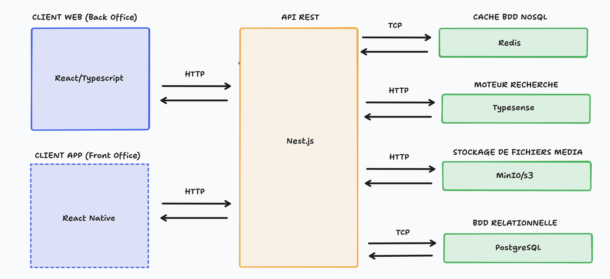

## Introduction

Ma stratégie architecturale de l'application s'appuie sur un équilibre entre familiarité technique et découverte de nouveaux outils. J'ai privilégié des technologies que je maîtrise déjà pour les composants critiques, tout en intégrant des solutions nouvelles pour enrichir mon apprentissage sans compromettre la viabilité du projet.

Cette approche me permet d'approfondir ma compréhension des enjeux d'architecture distribuée tout en maintenant un niveau de risque technique maîtrisable dans le cadre de ma formation.

## Vue d'ensemble architecturale

Suite à l'analyse des besoins, j'ai choisi de structurer l'application selon une architecture distribuée séparant clairement les différentes parties : une interface web pour les coachs, une application mobile pour les athlètes, et un backend centralisé. Cette séparation permet de développer et maintenir chaque partie indépendamment, facilitant ainsi l'évolution future de l'application.

Le diagramme ci-dessous présente les différents composants de l'application et leurs interactions :

Cette architecture répond aux contraintes identifiées lors de l'analyse des besoins : séparation des contextes d'usage (mobile pour les athlètes, web pour les coachs), centralisation des données pour assurer la cohérence, et modularité pour faciliter la maintenance et l'évolution.

## Analyse détaillée des composants principaux

### Client Web (Back Office) : React et TypeScript

Pour le back office destiné aux coachs, j'ai choisi React associé à TypeScript. Ce choix s'appuie sur ma maîtrise de ces technologies et la maturité de leur écosystème.

Cette familiarité me permet de me concentrer sur les enjeux métier spécifiques à l'haltérophilie. L'écosystème React offre des outils adaptés (Tanstack Router, React Hook Form, Shadcn) qui accélèrent le développement d'interfaces de gestion complexes.

### Application Mobile (Front Office) : React Native et Expo

L'application mobile, développée avec React Native et Expo, constitue le point d'accès principal pour les athlètes. N'ayant aucune expérience en développement mobile natif, React Native s'est présenté comme une solution pertinente pour transposer mes compétences React vers le développement mobile.

Cette technologie me permet de produire des applications natives pour iOS et Android à partir d'une base de code unique, tout en capitalisant sur mes connaissances existantes de React. Ce choix représente également une opportunité d'apprentissage du développement mobile dans un contexte réel, élargissant mon champ de compétences.

Expo simplifie le processus de développement et de déploiement en automatisant de nombreuses tâches complexes (gestion des certificats, build automatisés, over-the-air updates). Cette plateforme me permet de me concentrer sur le développement des fonctionnalités plutôt que sur la configuration de l'environnement de développement mobile.

L'architecture React Native facilite également le partage de logique métier avec l'application web via des modules TypeScript communs, optimisant ainsi le temps de développement et garantissant la cohérence des règles de calcul entre les plateformes.

### API REST : NestJS

Le backend repose sur NestJS, un framework Node.js que j'ai déjà eu l'occasion d'utiliser dans des projets précédents ainsi qu'en entreprise. Cette familiarité avec l'outil permet un développement plus efficace tout en m'offrant l'opportunité d'explorer des fonctionnalités plus avancées que je n'avais pas encore maîtrisées.

Son architecture modulaire inspirée d'Angular et sa documentation complète en font un bon choix pour structurer une API REST. La philosophie de NestJS, qui privilégie la séparation des responsabilités et l'injection de dépendances, correspond parfaitement aux besoins d'une application métier comme DropIt où la logique de gestion des entraînements nécessite une organisation rigoureuse du code.

#### Choix de l'ORM : MikroORM

Pour la couche d'accès aux données, j'ai choisi MikroORM plutôt que TypeORM, plus couramment utilisé avec NestJS. Ce choix s'explique par plusieurs avantages techniques que j'ai identifiés lors de mes recherches :

- **Pattern Unit of Work** : MikroORM implémente nativement ce pattern qui optimise les performances en regroupant les opérations de base de données et en gérant automatiquement l'ordre des transactions
- **Gestion des transactions** : La gestion plus cohérente des transactions réduit les risques de corruption de données, aspect crucial pour les données d'entraînement
- **Typage TypeScript strict** : Le typage plus rigoureux aide à détecter les erreurs de manipulation des entités dès la compilation

Bien que ce soit une nouvelle technologie pour moi, sa documentation détaillée et sa compatibilité native avec NestJS en font un choix pertinent pour ce projet d'apprentissage. Cette exploration me permet d'approfondir ma compréhension des ORM modernes et des patterns de gestion de données.

L'API est documentée automatiquement via Swagger, facilitant ainsi son utilisation et son évolution. Les principes REST sont suivis pour assurer une interface cohérente et prévisible, facilitant l'intégration future d'autres clients si le besoin se présente.

## Écosystème de services spécialisés

### Stratégie de cache : Redis

Redis, bien que non implémenté pour l'instant, est envisagé dans mon application pour la stratégie de performance.

Les athlètes consultent fréquemment leurs programmes pendant l'entraînement, souvent dans des conditions de réseau instables. Redis me permet de mettre en cache les données d'entraînement les plus consultées, réduisant significativement les temps de réponse et améliorant l'expérience utilisateur en salle de sport.

Sa simplicité d'utilisation et ses performances éprouvées en font un excellent choix pour le stockage temporaire des données fréquemment accédées. L'intégration avec NestJS est native et bien documentée, facilitant l'implémentation.

Cette exploration de Redis me permet également d'acquérir une compétence sur les bases de données NoSQL et les stratégies de cache, aspects essentiels du développement d'applications modernes.

### Recherche: Typesense

Typesense est envisagé afin de persister certaines recherches, notamment si le catalogue d'exercices et d'entraînement d'un coach grossit dans le temps. Ce ne sera pas implémenté dans le MVP mais la solution est déjà envisagée selon le besoin.

### Stockage de médias : MinIO 

Pour le stockage des médias, notamment les vidéos de démonstration d'exercices, j'ai opté pour MinIO, une alternative open-source compatible avec l'API S3 d'Amazon.

L'API compatible S3 garantit la portabilité vers AWS, Google Cloud Storage ou Azure si les besoins de scalabilité l'exigent, évitant le vendor lock-in.

MinIO me permet d'implémenter une solution complète sans coûts de stockage externes localement pendant le développement, tout en me permettant d'apprendre les principes du stockage objet.

En production, cette architecture facilite l'évolution vers des solutions managées (AWS S3, Cloudflare R2) sans modification du code applicatif, grâce à la standardisation de l'API S3.

### Base de données : PostgreSQL

PostgreSQL a été choisi comme base de données principale pour plusieurs raisons :

**Fiabilité dans le contexte métier** : Les données d'entraînement et de progression des athlètes nécessitent une fiabilité absolue. PostgreSQL offre des garanties ACID strictes et une robustesse éprouvée dans des contextes de production critiques.

**Capacités relationnelles avancées** : La modélisation des relations complexes entre athlètes, coachs, exercices, et programmes d'entraînement bénéficie des capacités relationnelles avancées de PostgreSQL (contraintes de clés étrangères, triggers, vues matérialisées).

**Familiarité technique** : Ma maîtrise préalable de PostgreSQL me permet de me concentrer sur les aspects métier de la modélisation plutôt que sur l'apprentissage de la base de données, optimisant ainsi le temps disponible pour explorer d'autres technologies.

**Écosystème et performances** : L'excellent support de PostgreSQL dans l'écosystème Node.js et ses performances pour les applications transactionnelles en font un choix sûr pour l'infrastructure de données.

### Stratégie de déploiement : Dokploy

Pour le déploiement, j'ai choisi Dokploy sur un VPS personnel, solution qui répond aux contraintes budgétaires du projet tout en m'offrant une expérience complète de déploiement d'applications modernes :

**Containerisation avec Docker** : Dokploy s'appuie sur Docker, me permettant d'apprendre les bonnes pratiques de containerisation tout en garantissant la reproductibilité des déploiements entre les environnements de développement et de production.

**Simplicité de gestion** : Cette plateforme simplifie la gestion de l'infrastructure tout en conservant un contrôle suffisant pour comprendre les mécanismes sous-jacents, équilibre idéal dans un contexte d'apprentissage.

**Évolutivité future** : L'expérience acquise avec Dokploy facilitera une migration future vers des solutions cloud plus complexes (Kubernetes, services managés) si les besoins l'exigent.

### Monitoring et observabilité : Sentry

L'intégration de Sentry pour le monitoring répond à un besoin de visibilité sur le comportement de l'application en production :

**Détection proactive des erreurs** : Sentry permet d'identifier rapidement les problèmes rencontrés par les utilisateurs

**Apprentissage de l'observabilité** : Cette intégration me familiarise avec les concepts d'observabilité et de monitoring

**Tableaux de bord et métriques** : Les capacités de reporting de Sentry m'aident à comprendre les patterns d'usage et à identifier les axes d'amélioration de l'application.

## Communication inter-composants et protocoles

La communication entre les différents composants s'effectue via des protocoles standardisés, le diagramme suivant représente les interactions entre les différentes couches de l'application. 

**HTTP/HTTPS pour les interactions client-serveur** : Ce protocole standardisé assure une communication fiable et sécurisée entre les applications frontend et l'API. Le chiffrement HTTPS garantit la confidentialité des échanges de données.

**Protocoles natifs pour les bases de données** : PostgreSQL utilise son protocole optimisé construit sur TCP/IP, tandis que Redis communique via son protocole spécifique également basé sur TCP.

**Format JSON pour les échanges de données** : Le format JSON assure une interopérabilité maximale entre les différents clients et facilite le débogage et la maintenance.

## Structure de projet monorepo

Le projet a été conçu selon une architecture monorepo facilitant le partage de code et la cohérence entre les différentes applications :

**Applications principales :**
- `apps/webapp` - Interface web pour les coachs
- `apps/mobileapp` - Application mobile pour les athlètes  
- `apps/api` - API REST centralisée

**Packages partagés :**
- `packages/contract` - Contrats d'API typés avec tsrest
- `packages/schema` - Schémas Zod pour la validation de données
- `packages/permissions` - Règles d'accès par rôles utilisateur
- `packages/i18n` - Gestion de l'internationalisation

Cette organisation optimise la réutilisabilité du code métier et garantit la cohérence des types entre frontend et backend. 

## Sécurité architecturale

La sécurité a été intégrée dès la conception de l'architecture plutôt que d'être ajoutée a posteriori. Elle est composée d'un ensemble de bonnes pratiques sur toutes les couches de l'application, dont les exemples les plus significatifs sont les suivants :

**Authentification** : L'authentification repose sur une architecture hybride combinant les avantages des tokens JWT avec la sécurité des sessions révocables.

**Chiffrement bout en bout** : Toutes les communications sont chiffrées via HTTPS, et un système d'autorisation granulaire contrôle l'accès aux différentes fonctionnalités selon le rôle utilisateur.

**Isolation des services** : La séparation des responsabilités entre les différents services (authentification, cache, stockage) limite la surface d'attaque et facilite l'application de mesures de sécurité spécifiques à chaque composant.

Une description détaillée des mécanismes de sécurité mis en place est disponible dans la section [Conception sécurisée](/securite/conception).

## Perspectives d'évolution et scalabilité

### Architecture évolutive

La séparation des différentes parties de l'application facilite l'évolution future selon plusieurs axes que j'ai envisagé :

**Évolution fonctionnelle** : Il sera possible d'enrichir l'application mobile avec de nouvelles fonctionnalités sans modifier le back office des coachs, et vice versa. Cette indépendance des clients facilite l'innovation sur chaque plateforme.

**Scalabilité horizontale** :  L'API peut être repliqué et deployer facilement avec l'ajout de nouvelles instances selon les besoins de charge.

**Migration cloud progressive** : Les choix technologiques (protocoles standardisés, API S3-compatible, containerisation) facilitent une migration progressive vers des solutions cloud managées selon l'évolution des besoins.

### Intégration de nouvelles technologies

Grâce à cette architecture globale, l'intégration de nouveaux modules est facilitée, voici certaines idées :

- **Outils d'extraction pdf/excel** : Les coachs ont parfois des entraînements au format excel ou pdf, il serait intéressant d'intégrer un import et extraction de ces programmes pour les ajouter automatiquement dans DropIt
- **Chronomètre** : Module chronomètre que j'ai déjà développé lors d'un projet précédent et qui pourrait être ajouté dans la visualisation d'exercice afin de permettre aux athlètes de lancer ce chronomètre si l'exercice le nécessite
- **Dashboard de statistiques avancés** : Pour le coach afin d'optimiser la performance de ses athlètes

## Conclusion

L'architecture choisie s'appuie sur des technologies que je maîtrise (React, NestJS, PostgreSQL) tout en intégrant de nouveaux outils pour enrichir mon apprentissage (MikroORM, React Native). Cette approche me permet de me concentrer sur les enjeux métier tout en découvrant des solutions modernes.

La structure monorepo et la séparation des responsabilités facilitent l'évolution future de l'application selon les retours d'usage de mon club.

