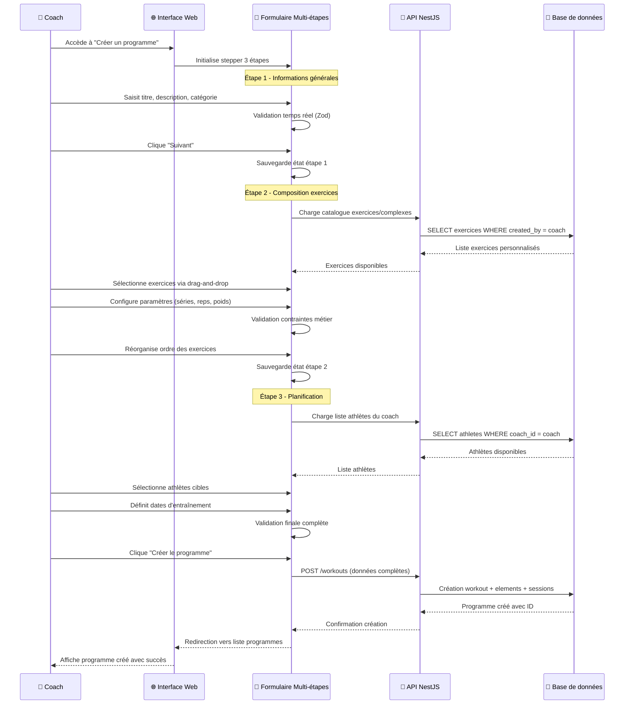

---
title: Implémentation frontend
description: Implémentation des wireframes et structure front end
---

## Création d'un programme d'entraînement

Le parcours de création de programme illustre la problématique métier que l'interface doit résoudre. Un coach doit pouvoir :

1. **Définir les informations générales** : titre, description, catégorie, niveau de difficulté
2. **Composer la séquence d'exercices** : sélection d'exercices ou de complexes avec paramètres (séries, répétitions, charges, temps de repos)
3. **Organiser l'ordre d'exécution** : drag-and-drop pour réorganiser les éléments
4. **Planifier l'assignation** : sélection des athlètes concernés et dates d'entraînement

Ce workflow nécessite une interface multi-étapes qui préserve les données saisies et permet les modifications à tout moment.



## Architecture frontend technique

### Organisation modulaire par features

L'implémentation respecte une architecture modulaire qui sépare clairement les responsabilités métier :

```
apps/web/src/
├── features/              # Modules métier isolés
│   ├── athletes/          # Gestion des athlètes
│   ├── exercises/         # Catalogue d'exercices  
│   ├── workout/           # Création et édition programmes
│   ├── planning/          # Interface calendaire
│   └── complex/           # Gestion des complexes
├── shared/                # Composants et logique partagés
│   ├── components/ui/     # Design system Shadcn/ui
│   ├── hooks/             # Hooks React réutilisables
│   └── utils/             # Utilitaires communs
└── routes/                # Structure de routage Tanstack Router
```

Cette organisation facilite la maintenance en isolant chaque domaine métier dans son propre module. Un développeur travaillant sur la gestion des athlètes n'a pas besoin de comprendre les spécificités de la création d'exercices.

### Validation centralisée avec Zod

L'intégration des schémas Zod partagés garantit une validation cohérente entre frontend et backend :

```typescript
// Réutilisation des schémas définis dans @dropit/schemas
import { CreateExercise, createExerciseSchema } from '@dropit/schemas';

export function ExerciseCreationForm() {
  const form = useForm<CreateExercise>({
    resolver: zodResolver(createExerciseSchema), // Validation automatique
    defaultValues: {
      name: '',
      description: '',
      category: undefined,
    },
  });

  const { mutateAsync: createExercise } = useMutation({
    mutationFn: async (data: CreateExercise) => {
      // Le schéma Zod valide côté client AVANT l'envoi
      const response = await api.exercise.createExercise({ body: data });
      if (response.status !== 201) throw new Error('Creation failed');
      return response.body;
    },
  });
}
```

Cette approche élimine les divergences de validation : les mêmes règles s'appliquent côté client (feedback immédiat) et côté serveur (sécurité), réduisant les erreurs d'intégration.

### Gestion d'état avec Tanstack Query

Tanstack Query centralise la logique de synchronisation avec l'API en offrant des fonctionnalités avancées :

```typescript
// Récupération et cache des catégories d'exercices
const { data: exerciseCategories, isLoading } = useQuery({
  queryKey: ['exercise-categories'],
  queryFn: async () => {
    const response = await api.exerciseCategory.getExerciseCategories();
    if (response.status !== 200) throw new Error('Failed to load categories');
    return response.body;
  },
  staleTime: 1000 * 60 * 5, // Cache pendant 5 minutes
  retry: 3, // 3 tentatives en cas d'échec
});

// Mutation avec invalidation automatique du cache
const { mutateAsync: createExercise } = useMutation({
  mutationFn: createExerciseRequest,
  onSuccess: () => {
    // Revalidation automatique des listes d'exercices
    queryClient.invalidateQueries({ queryKey: ['exercises'] });
    toast.success('Exercice créé avec succès');
  },
  onError: (error) => {
    toast.error(`Erreur: ${error.message}`);
  },
});
```

Cette stratégie garantit que les coachs travaillent toujours avec des données à jour, aspect critique pour la cohérence des programmes d'entraînement.

## Implémentation des fonctionnalités complexes

### Stepper de création de programme

La création de programme nécessite une interface multi-étapes qui préserve l'état entre les étapes :

```typescript
// Extension du schéma base pour inclure la planification
const extendedWorkoutSchema = createWorkoutSchema.extend({
  trainingSession: z.object({
    athleteIds: z.array(z.string()),
    scheduledDate: z.string(),
  }).optional(),
});

type ExtendedWorkoutSchema = z.infer<typeof extendedWorkoutSchema>;

const steps = [
  { id: 'info', name: 'Description' },
  { id: 'elements', name: 'Construction' }, 
  { id: 'planning', name: 'Planification' },
];

export function WorkoutCreationStepper() {
  const [currentStep, setCurrentStep] = useState(0);
  
  // Formulaire unique pour toutes les étapes
  const form = useForm<ExtendedWorkoutSchema>({
    resolver: zodResolver(extendedWorkoutSchema),
    mode: 'onChange', // Validation temps réel
  });

  const nextStep = async () => {
    // Validation de l'étape courante avant progression
    const isValid = await form.trigger();
    if (isValid) setCurrentStep(prev => prev + 1);
  };
}
```

Cette implémentation garantit que les données saisies sont préservées lors de la navigation entre étapes, améliorant l'expérience utilisateur.

### Drag-and-drop pour la composition de programmes

L'interface de composition utilise dnd-kit pour permettre la réorganisation intuitive des exercices :

```typescript
import { useSortable } from '@dnd-kit/sortable';
import { CSS } from '@dnd-kit/utilities';

interface SortableWorkoutElementProps {
  element: WorkoutElement;
  index: number;
  onRemove: (index: number) => void;
}

export function SortableWorkoutElement({ element, index, onRemove }: SortableWorkoutElementProps) {
  const {
    attributes,
    listeners,
    setNodeRef,
    transform,
    transition,
    isDragging,
  } = useSortable({ id: element.id });

  const style = {
    transform: CSS.Transform.toString(transform),
    transition,
    opacity: isDragging ? 0.5 : 1,
  };

  return (
    <Card ref={setNodeRef} style={style} className="relative">
      <CardContent className="flex items-center gap-4 p-4">
        {/* Handle de drag */}
        <div {...attributes} {...listeners} className="cursor-grab">
          <GripVertical className="h-4 w-4 text-muted-foreground" />
        </div>
        
        {/* Contenu de l'exercice */}
        <div className="flex-1">
          <h4>{element.name}</h4>
          <p className="text-sm text-muted-foreground">
            {element.sets} × {element.reps} @ {element.weight}kg
          </p>
        </div>
        
        {/* Action de suppression */}
        <Button variant="ghost" size="sm" onClick={() => onRemove(index)}>
          <Trash2 className="h-4 w-4" />
        </Button>
      </CardContent>
    </Card>
  );
}
```

Cette interface tactile permet aux coachs de construire intuitivement leurs programmes en réorganisant les exercices par glisser-déposer.

### Routage typé avec Tanstack Router

Tanstack Router apporte la type safety au routage, détectant les erreurs de navigation à la compilation :

```typescript
// Routes organisées hiérarchiquement
├── __home.tsx                    # Layout principal authentifié
│   ├── __home.dashboard.tsx      # Page d'accueil
│   ├── __home.programs.tsx       # Layout des programmes
│   │   ├── exercises.tsx         # Catalogue d'exercices
│   │   ├── workouts.tsx          # Liste des programmes
│   │   └── complex.tsx           # Gestion des complexes
│   ├── __home.athletes.tsx       # Gestion des athlètes
│   │   └── $athleteId.tsx        # Détail d'un athlète
│   └── __home.planning.tsx       # Interface calendaire
```

Cette structure garantit que les liens internes sont toujours valides et que les paramètres d'URL correspondent aux types attendus.

## Design system et composants réutilisables

### Architecture des composants Shadcn/ui

Mon design system s'appuie sur Shadcn/ui pour garantir cohérence et accessibilité :

```typescript
// Composant Button avec variants typés
interface ButtonProps extends React.ButtonHTMLAttributes<HTMLButtonElement> {
  variant?: 'default' | 'destructive' | 'outline' | 'secondary' | 'ghost' | 'link'
  size?: 'default' | 'sm' | 'lg' | 'icon'
  asChild?: boolean
}

// Usage dans les features
<Button variant="outline" size="sm" onClick={handleCreate}>
  <Plus className="h-4 w-4 mr-2" />
  Nouvel exercice
</Button>
```

Cette approche garantit une expérience utilisateur cohérente à travers toute l'application.

### Composants métier spécialisés

Au-delà des composants UI de base, j'ai développé des composants spécifiques au domaine de l'haltérophilie :

```typescript
// Composant de saisie de charge avec calcul automatique de pourcentages
interface WeightInputProps {
  personalRecord?: number;
  value: number;
  onChange: (weight: number, percentage?: number) => void;
}

export function WeightInput({ personalRecord, value, onChange }: WeightInputProps) {
  const [inputMode, setInputMode] = useState<'weight' | 'percentage'>('weight');
  
  const handleWeightChange = (weight: number) => {
    const percentage = personalRecord ? (weight / personalRecord) * 100 : undefined;
    onChange(weight, percentage);
  };
  
  return (
    <div className="flex items-center gap-2">
      <Input 
        type="number" 
        value={value} 
        onChange={(e) => handleWeightChange(Number(e.target.value))}
      />
      {personalRecord && (
        <Badge variant="secondary">
          {Math.round((value / personalRecord) * 100)}% RM
        </Badge>
      )}
    </div>
  );
}
```
Ces composants encapsulent la logique métier de l'haltérophilie tout en restant réutilisables.

## Performance et optimisations

### Stratégies de performance frontend

L'application met en œuvre plusieurs optimisations pour garantir une expérience fluide :

```typescript
// Lazy loading des composants volumineux
const WorkoutEditor = lazy(() => import('./workout-editor'));

// Memoization des calculs coûteux
const calculatedWorkoutStats = useMemo(() => {
  return workoutElements.reduce((stats, element) => {
    stats.totalVolume += element.sets * element.reps * element.weight;
    stats.totalDuration += element.sets * element.restTime;
    return stats;
  }, { totalVolume: 0, totalDuration: 0 });
}, [workoutElements]);

// Debouncing des recherches
const debouncedSearch = useDebounce(searchTerm, 300);
```

Ces optimisations maintiennent des temps de réponse inférieurs à 100ms pour les interactions courantes.

### Bundle optimization

Vite et Rollup optimisent automatiquement le bundle de production :
- **Code splitting** : Chargement à la demande des features
- **Tree shaking** : Élimination du code non utilisé  
- **Compression** : Réduction de 70% de la taille des assets

## Conclusion

Conclusion sur l'architecture et implémentation frontend global, sur les pistes d'amélioration, refacto etc... dans la suite on va parler d'une la sécurité globale des utilisateurs de leurs données de l'authentification, rgpd & co 