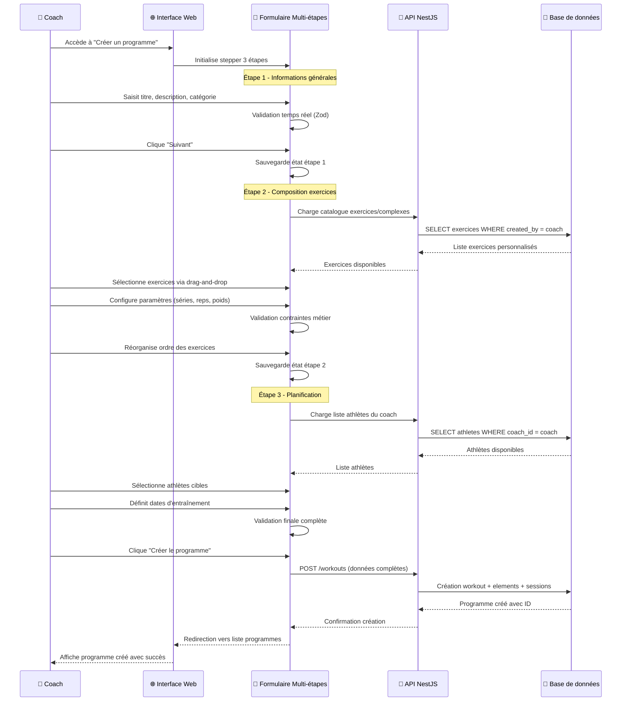

## Introduction

Après avoir posé les fondations techniques avec l'[architecture logicielle](/conception/architecture), la [modélisation de la base de données](/conception/base-donnees) et l'[accès aux données](/conception/acces-donnees), cette étape consiste à traduire les besoins utilisateurs identifiés lors de l'[analyse fonctionnelle](/conception/analyse) en interfaces concrètes.

Ma démarche de conception d'interfaces s'inscrit dans une approche centrée utilisateur que j'ai adaptée aux contraintes de mon projet de formation. N'étant pas designer de formation, j'ai privilégié une méthodologie structurée : partir des personas utilisateurs, concevoir des wireframes basse fidélité pour valider les flux, puis définir un design system cohérent avant l'implémentation technique détaillée dans la [section suivante](/conception/implementation-frontend).

## Personas utilisateurs

L'analyse fonctionnelle détaillée précédemment m'a permis d'identifier deux profils utilisateurs distincts que je synthétise ici sous forme de personas pour guider mes choix d'interface :

**Le coach** utilise principalement l'interface web depuis son bureau ou à domicile pour :
- Créer et gérer le catalogue d'exercices personnalisé
- Composer des programmes d'entraînement
- Planifier les séances
- Analyser les performances et ajuster les programmations

**L'athlète** utilise exclusivement l'application mobile en salle de sport pour :
- Consulter son programme du jour
- Enregistrer ses records personnels
- Communiquer avec son coach via des notes sur les entrainements

## Conception des wireframes

Pour la conception des interfaces, j'ai choisi de commencer par des wireframes basse fidélité qui se concentrent sur la structure informationnelle et les flux utilisateurs, sans me préoccuper des aspects visuels. Cette phase me permet de valider l'organisation de l'information et les flux utilisateurs avant de passer aux aspects visuels.

L'architecture de DropIt se décline en deux interfaces distinctes : une application web pour les coachs (back office) et une application mobile pour les athlètes (front office), chacune adaptée à son contexte d'usage spécifique.

### Wireframe web coach (Back office)

#### Page de bibliothèque d'exercices

<!-- TODO: Insérer wireframe vue générale bibliothèque -->

La vue générale présente l'interface globale avec une navigation latérale permanente donnant accès aux trois catalogues : exercices, complexes et programmes d'entraînement. Cette organisation facilite la navigation entre les différents types de contenus que le coach manipule quotidiennement.

#### Page de création d'exercice

<!-- TODO: Insérer wireframe page création exercice -->

Le wireframe révèle les éléments structurants :
- Zone principale de saisie (nom, description, catégorie)
- Section d'upload de médias (photos, vidéos de démonstration)
- Barre d'actions (sauvegarder, annuler, prévisualiser)
- Navigation de retour vers le catalogue

#### Page de création d'entraînement

<!-- TODO: Insérer wireframe composition programme multi-étapes -->

L'interface s'organise autour de trois zones distinctes :
- **Sidebar gauche** : catalogue d'exercices et complexes avec recherche
- **Zone centrale** : programme en construction avec éléments drag-and-drop
- **Panel droit** : paramètres détaillés de l'élément sélectionné

#### Contraintes responsive

Dans le MVP, j'ai fait le choix de ne pas optimiser l'interface web pour les mobiles. Les coachs utilisent principalement des ordinateurs de bureau ou tablettes pour créer leurs programmes, contexte qui permet une interface riche en interactions complexes. Cette décision me permet de concentrer l'effort sur une expérience optimale desktop plutôt que de multiplier les compromis.

### Interface mobile athlète (Front office)

#### Page d'accueil

<!-- TODO: Insérer wireframe page accueil mobile -->

L'écran d'accueil mobile privilégie l'accès rapide aux fonctionnalités essentielles : consultation du programme du jour, visualisation des records personnels, et navigation vers l'historique des entraînements.

#### Page de visualisation d'entraînement

<!-- TODO: Insérer wireframe visualisation programme mobile -->

L'interface mobile présente les exercices de manière séquentielle, optimisée pour la consultation en salle de sport avec des zones tactiles larges et une lisibilité maximale des informations critiques (charges, répétitions, temps de repos).

## Design system et cohérence visuelle

Pour le design system, j'ai choisi Shadcn/ui après avoir analysé les enjeux d'accessibilité et de maintenabilité que présentait DropIt. Cette décision s'appuie sur plusieurs arguments techniques décisifs pour un projet professionnel.

**Accessibilité native (WCAG 2.1 AA)** : Shadcn/ui s'appuie sur Radix UI qui implémente nativement les standards d'accessibilité. Chaque composant respecte les bonnes pratiques ARIA, la navigation clavier, et la compatibilité avec les lecteurs d'écran. Dans le contexte d'une application destinée à des clubs sportifs, cette accessibilité garantit l'inclusion de tous les utilisateurs, y compris ceux en situation de handicap.

**Architecture extensible** : Contrairement aux bibliothèques packagées (Material-UI, Ant Design), Shadcn/ui fournit des composants de base que je peux étendre et personnaliser selon les besoins métier de DropIt. Cette flexibilité m'évite les limitations frustrantes des bibliothèques fermées.

**Intégration native Tailwind** : Les composants utilisent directement Tailwind CSS, s'intégrant parfaitement dans l'écosystème technique que j'ai mis en place. Cette cohérence facilite la maintenance et évite les conflits de styles.

## Implémentations visuelles finales

Cette section présente le rendu final des interfaces après itération sur les wireframes et intégration du design system.

### Interface de dashboard coach

<!-- TODO: Insérer screenshot dashboard principal coach -->

Le dashboard centralise les informations critiques dans une vue d'ensemble :
- Widget calendrier avec aperçu des séances planifiées
- Statistiques d'activité des athlètes (programmes actifs, dernières performances)  
- Accès rapide aux actions fréquentes via des boutons d'action principaux
- Zone de notifications pour les nouveaux records et demandes d'athlètes

### Interface de création de programme

<!-- TODO: Insérer screenshot stepper création programme -->

L'interface multi-étapes guide le coach dans la composition avec un workflow intuitif :
- **Étape 1** : Informations générales avec validation Zod temps réel
- **Étape 2** : Construction du programme via drag-and-drop dnd-kit
- **Étape 3** : Planification et assignation aux athlètes avec sélection multiple

### Interface mobile de consultation

<!-- TODO: Insérer screenshots interface mobile -->

L'application mobile présente une navigation optimisée tactile avec :
- Bottom navigation pour l'accès rapide aux sections principales
- Cartes d'exercices avec informations essentielles (charges calculées, répétitions)
- Interface de saisie des performances réalisées avec clavier numérique optimisé

## Validation et tests utilisateurs

### Tests d'utilisabilité avec les coachs

J'ai organisé des sessions de test avec le coach de mon club pour valider l'interface de création de programme :

**Retours positifs** :
- "C'est pratique de centraliser un catalogue d'entrainement, d'exercices et de pouvoir les réutiliser"
- "La validation en temps réel évite les erreurs de saisie"
- "Je peux me concentrer sur la technique des Athlètes pendant les entrainements et moins sur un rappel permanent du nombre de répétion, des charges sur chaque exercices"

**Points d'amélioration identifiés** :
- Ajout d'un mode "duplication" pour créer des variantes de programmes existants
- Amélioration des filtres dans le catalogue d'exercices
- Import de programme au format Excel.

### Tests avec les athlètes

Les tests de l'application mobile ont révélé :

**Satisfactions** :
- "Plus besoin de calculer de tête les charges à mettre sur ma barre"
- "Pratique de pouvoir consulter directement sur téléphone plutôt que devoir se déplacer au tableau pour se rappeler les exercices à faire"

**Axes d'amélioration** :
- Timer intégré pour les temps de repos
- Notifications de rappel pour les séances planifiées

## Flow d'interaction : création d'un programme

Au-delà des wireframes statiques, il est important de comprendre comment ces interfaces s'articulent dans un parcours utilisateur complet. Le diagramme suivant illustre le flow d'interaction pour la création d'un programme d'entraînement, cas d'usage central de l'application :

Ce flow dynamique complète les wireframes statiques en montrant comment les différentes interfaces s'enchaînent pour former une expérience utilisateur cohérente. Il illustre également l'intégration entre les couches frontend et backend, préparant ainsi la transition vers l'implémentation technique détaillée.

## Conclusion

Ces maquettes, wireframes et flows d'interaction achèvent la conception technique de DropIt. L'ensemble de cette démarche établit les fondations nécessaires à l'implémentation de l'application.

La suite de ce dossier aborde les aspects sécuritaires, dimension critique pour une application gérant des données personnelles d'athlètes. 