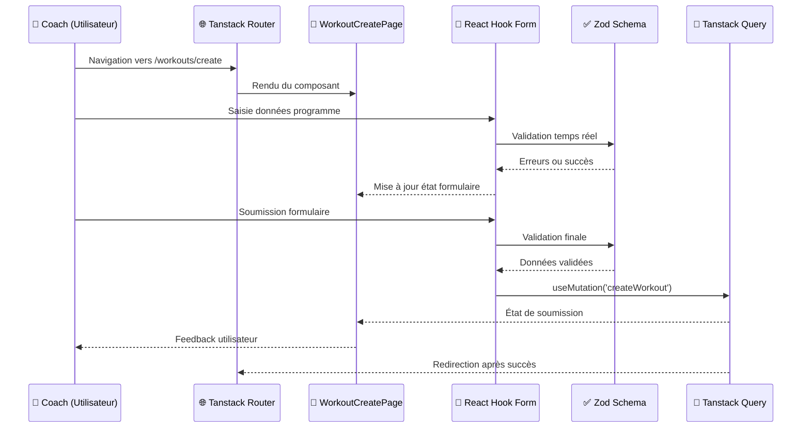
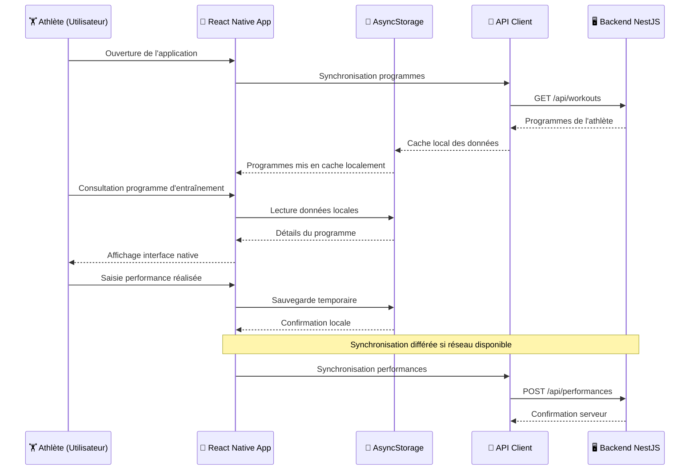

## Introduction

Après avoir détaillé l'[accès aux données](/conception/acces-donnees), cette section s'intéresse à l'implémentation concrète des couches de présentation web et mobile qui constituent les points d'entrée des utilisateurs vers l'application. L'[architecture logicielle](/conception/architecture) a présenté la vision d'ensemble ; nous explorons ici comment ces choix se traduisent en composants React et patterns d'implémentation, en réutilisant les [packages partagés du monorepo](/conception/architecture#packages-partagés-du-monorepo) (`@dropit/schemas`, `@dropit/contract`, `@dropit/i18n`) pour garantir la cohérence des règles métier entre plateformes.

## Architecture Web App

### Choix d'organisation modulaire

Ma stratégie d'architecture frontend s'appuie sur une organisation par features qui traduit directement les domaines métier identifiés lors de l'analyse des besoins. Cette approche, inspirée des principes du Domain-Driven Design, établit un langage commun entre l'équipe technique et les coachs utilisateurs. Plutôt que de structurer le code selon des préoccupations purement techniques (composants, services, utils), j'ai privilégié une architecture qui reflète le vocabulaire métier : "athletes", "exercises", "workout", "planning". Cette correspondance directe facilite considérablement les échanges avec les utilisateurs finaux et réduit les incompréhensions lors des phases de validation fonctionnelle.

```
apps/web/src/
├── features/              # Modules métier isolés
│   ├── athletes/          # Gestion des athlètes
│   ├── exercises/         # Catalogue d'exercices  
│   ├── workout/           # Création et édition programmes
│   ├── planning/          # Interface calendaire
│   └── complex/           # Gestion des complexes
├── shared/                # Composants et logique partagés
│   ├── components/ui/     # Design system Shadcn/ui
│   ├── hooks/             # Hooks React réutilisables
│   └── utils/             # Utilitaires communs
└── routes/                # Structure de routage Tanstack Router
```

Au-delà de cette cohérence sémantique, cette organisation présente des avantages techniques concrets que j'ai découverts au fil du développement. Elle facilite considérablement le développement parallèle : je peux travailler sur la gestion des exercices sans impacter les fonctionnalités de planification. Elle respecte également le principe de responsabilité unique au niveau des modules, chaque feature encapsulant sa logique métier spécifique et ses règles de validation propres.

L'isolation des domaines métier s'avère bénéfique dans le contexte de DropIt où les règles business diffèrent significativement entre la gestion des athlètes et la création d'exercices. Par exemple, le module `athletes/` implémente des validations spécifiques aux données personnelles (format email, validation d'âge, contraintes de confidentialité), tandis que le module `exercises/` se concentre sur les règles biomécaniques (validation des groupes musculaires, cohérence des paramètres de charge). Cette séparation me permet d'appliquer ces règles métier spécialisées sans créer de couplage entre les modules, facilitant ainsi leur maintenance et leur évolution indépendante.

### Gestion des formulaires avec React Hook Form

Pour la gestion des formulaires dans DropIt, j'avais besoin d'implémenter efficacement des fonctionnalités comme la validation en temps réel, la gestion des erreurs, et la soumission asynchrone sans réinventer ces mécanismes from scratch. React Hook Form me fournit ces fonctionnalités clés en main : gestion automatique des états de formulaire, validation intégrée, et optimisation des performances via des champs non contrôlés.

```typescript
// Exemple basique de React Hook Form
const form = useForm({
  mode: 'onChange', // Validation temps réel
  defaultValues: {
    name: '',
    category: '',
    sets: 1,
  },
});

const { register, handleSubmit, formState: { errors, isSubmitting } } = form;

const onSubmit = async (data) => {
  try {
    await createExercise(data);
  } catch (error) {
    // Gestion automatique des erreurs de soumission
  }
};

// Usage dans le JSX
<form onSubmit={handleSubmit(onSubmit)}>
  <input {...register('name', { required: 'Le nom est requis' })} />
  {errors.name && <span>{errors.name.message}</span>}
  
  <button disabled={isSubmitting}>
    {isSubmitting ? 'Création...' : 'Créer'}
  </button>
</form>
```

Cette approche me permet de me concentrer sur la logique métier spécifique à l'haltérophilie plutôt que sur l'implémentation des mécanismes de base des formulaires. 

### Intégration de la validation Zod partagée

L'un des aspects les plus enrichissants de cette implémentation a été l'intégration des schémas Zod définis dans le package partagé [`@dropit/schemas`](/conception/architecture#dropit-schemas--validation-centralisée-avec-zod), également utilisés côté API dans la [couche d'accès aux données](/conception/acces-donnees). Cette approche résout une problématique récurrente que j'avais rencontrée dans mes projets précédents : maintenir la cohérence des règles de validation entre le frontend et le backend.

Cette définition commune me permet d'exploiter les mêmes schémas pour deux usages complémentaires : d'une part la validation des données reçues par l'API côté serveur, d'autre part la validation des formulaires côté client avant envoi. Cette réutilisation garantit une parfaite synchronisation des règles de validation sur l'ensemble de l'application.

```typescript
// Réutilisation des schémas définis dans @dropit/schemas
import { CreateExercise, createExerciseSchema } from '@dropit/schemas';

export function ExerciseCreationForm() {
  const form = useForm<CreateExercise>({
    resolver: zodResolver(createExerciseSchema), // Validation automatique
    defaultValues: {
      name: '',
      description: '',
      category: undefined,
    },
  });

  const { mutateAsync: createExercise } = useMutation({
    mutationFn: async (data: CreateExercise) => {
      // Le schéma Zod valide côté client AVANT l'envoi
      const response = await api.exercise.createExercise({ body: data });
      if (response.status !== 201) throw new Error('Creation failed');
      return response.body;
    },
  });
}
```

Cette intégration m'a permis de découvrir la puissance de l'écosystème Zod, notamment le `zodResolver` fourni par `@hookform/resolvers`. Ce resolver fait le pont entre les schémas Zod et React Hook Form, transformant automatiquement les erreurs de validation en messages appropriés pour les composants de formulaire. Cette synergie crée une expérience utilisateur fluide où les erreurs apparaissent en temps réel pendant la saisie, sans code de validation manuel.

L'avantage le plus significatif réside dans l'élimination des divergences de validation. Dans mes projets précédents, il m'arrivait de définir des règles de validation différentes côté client et serveur, créant des incohérences frustrantes pour l'utilisateur. Avec cette approche centralisée, je garantis qu'un exercice respectant les contraintes côté client sera nécessairement accepté par l'API, réduisant drastiquement les erreurs d'intégration.

### Stratégie de synchronisation des données avec Tanstack Query

Dans le contexte de DropIt, la question de la gestion d'état s'est posée rapidement : comment synchroniser efficacement les données entre les différents écrans de l'application ? Un coach qui crée un exercice dans le catalogue doit le voir apparaître immédiatement dans l'interface de création de programme, sans rechargement manuel.

Ma première réflexion m'a orienté vers les solutions classiques que j'avais utilisées dans mes projets précédents. Le useState local était évidemment insuffisant pour partager des données entre composants éloignés dans l'arbre React. React Context m'aurait permis ce partage, mais j'avais déjà expérimenté ses limitations : re-renders en cascade et absence de stratégies de cache intelligentes. Les solutions externes comme Zustand ou Redux, que j'avais explorées lors de formations précédentes, offraient certes plus de contrôle, mais au prix d'une complexité importante pour gérer manuellement la synchronisation avec le serveur.

Cette réflexion m'a conduit à reconsidérer le problème sous un angle différent. Plutôt que de dupliquer les données serveur dans un store client - avec tous les risques de désynchronisation que cela implique - j'ai choisi Tanstack Query qui traite directement les requêtes HTTP comme source de vérité. Cette approche correspond mieux à la réalité d'une application moderne où la majorité de l'état provient effectivement du backend. 

```typescript
// Récupération et cache des catégories d'exercices
const { data: exerciseCategories, isLoading } = useQuery({
  queryKey: ['exercise-categories'],
  queryFn: async () => {
    const response = await api.exerciseCategory.getExerciseCategories();
    if (response.status !== 200) throw new Error('Failed to load categories');
    return response.body;
  },
  staleTime: 1000 * 60 * 5, // Cache pendant 5 minutes
  retry: 3, // 3 tentatives en cas d'échec
});

// Mutation avec invalidation automatique du cache
const { mutateAsync: createExercise } = useMutation({
  mutationFn: createExerciseRequest,
  onSuccess: () => {
    // Revalidation automatique des listes d'exercices
    queryClient.invalidateQueries({ queryKey: ['exercises'] });
    toast.success('Exercice créé avec succès');
  },
  onError: (error) => {
    toast.error(`Erreur: ${error.message}`);
  },
});
```

L'implémentation concrète de cette stratégie m'a révélé des avantages que je n'avais pas anticipés. L'invalidation automatique du cache constitue un mécanisme particulièrement élégant : lorsqu'un coach crée un nouvel exercice, Tanstack Query invalide automatiquement toutes les requêtes liées aux exercices, garantissant leur rechargement transparent lors du prochain accès. Cette synchronisation élimine les incohérences que j'avais pu observer dans des projets antérieurs, où des données obsolètes persistaient dans l'interface.

Dans mes implémentations précédentes avec des stores traditionnels, je devais systématiquement créer des états de loading manuels (`const [isLoading, setIsLoading] = useState(false)`), gérer les erreurs avec des try-catch répétitifs, et orchestrer manuellement les mises à jour du cache lors des mutations. Tanstack Query encapsule toute cette logique complexe dans ses hooks `useQuery` et `useMutation`, me permettant de me concentrer sur la logique métier plutôt que sur la plomberie de la synchronisation des données.

### Routage typé avec Tanstack Router

Dans le contexte d'une Single Page Application (SPA) comme DropIt, la gestion du routage devient cruciale pour offrir une expérience utilisateur fluide. Contrairement aux applications web traditionnelles où chaque page nécessite un rechargement serveur, une SPA doit gérer la navigation côté client tout en maintenant la cohérence de l'URL et l'historique de navigation. Les coachs naviguent fréquemment entre la création de programmes, la gestion des athlètes et la planification des séances, nécessitant des transitions rapides sans interruption de leur workflow.

J'ai choisi d'explorer Tanstack Router plutôt que React Router principalement dans une démarche d'apprentissage d'une alternative moderne au routage classique. L'approche file-based routing où chaque route correspond à un fichier m'a semblé plus intuitive que la configuration centralisée de React Router, facilitant l'organisation et la maintenance du code.

Bien que je n'aie pas encore exploité toutes ses capacités avancées, Tanstack Router offre des perspectives intéressantes pour l'évolution future de l'application, notamment l'intégration native avec Tanstack Query pour le preloading des données. Cette synergie pourrait permettre d'optimiser l'expérience utilisateur en préchargeant les données lors de la navigation.

Dans le cadre de ma formation, cette exploration d'une technologie émergente enrichit ma compréhension des différentes approches de routage et me prépare aux évolutions de l'écosystème React.

```typescript
// Routes organisées hiérarchiquement
├── __home.tsx                    # Layout principal authentifié
│   ├── __home.dashboard.tsx      # Page d'accueil
│   ├── __home.programs.tsx       # Layout des programmes
│   │   ├── exercises.tsx         # Catalogue d'exercices
│   │   ├── workouts.tsx          # Liste des programmes
│   │   └── complex.tsx           # Gestion des complexes
│   ├── __home.athletes.tsx       # Gestion des athlètes
│   │   └── $athleteId.tsx        # Détail d'un athlète
│   └── __home.planning.tsx       # Interface calendaire
```

Cette structure hiérarchique reflète l'organisation logique de l'application et facilite la gestion des layouts imbriqués. Le préfixe `__home` indique les routes protégées par authentification, simplifiant la logique de protection des pages.

### Flux de données

Pour mettre en perspectives tous ces élements voici un exemple de flux de données dans le client web:



L'application suit un flux de données unidirectionnel où Tanstack Query centralise la gestion de l'état serveur, tandis que React se charge de l'état local des composants. Cette séparation facilite la maintenance et le débogage et me permet d'isoler les problèmes selon leur nature.

La structure respecte une séparation entre les différentes couches : présentation avec les composants UI, logique métier encapsulée dans des hooks personnalisés, et communication gérée par les clients API. Cette organisation facilite non seulement les tests unitaires en isolant chaque responsabilité, mais aussi l'évolution future du code en permettant de modifier une couche sans impacter les autres. Pour optimiser les performances de rendu, j'ai prévu d'implémenter une pagination progressive pour les longues listes d'athlètes et la technique de lazy loading pour les détails de programmes, évitant ainsi de charger l'intégralité des données au premier accès.

### Gestion des dates avec date-fns

Dans DropIt, la manipulation des dates intervient fréquemment : planification des séances, formatage des dates d'entraînement, calculs de périodes. J'avais besoin d'une solution fiable pour éviter les pièges classiques de manipulation des objets Date JavaScript natifs.

J'ai choisi date-fns pour son approche fonctionnelle avec des fonctions pures qui ne mutent pas les dates originales. Cette immutabilité évite les modifications involontaires que j'avais déjà rencontrées dans des projets précédents. Sa modularité me permet également d'importer uniquement les fonctions nécessaires, optimisant la taille du bundle final.

```typescript
import { format, addDays, isAfter, parseISO } from 'date-fns';
import { fr } from 'date-fns/locale';

// Formatage des dates en français pour l'interface
const formatSessionDate = (dateString: string) => {
  return format(parseISO(dateString), 'EEEE d MMMM yyyy', { locale: fr });
};

// Calculs de dates pour la planification
const getNextTrainingDate = (lastSession: string, frequency: number) => {
  return addDays(parseISO(lastSession), frequency);
};
```

Cette approche garantit une gestion cohérente des dates à travers l'application, évitant les incohérences de formatage qui pourraient nuire à l'expérience utilisateur.

### Drag-and-drop pour la composition

Pour la réorganisation des exercices dans un programme, j'avais besoin d'une interface permettant de modifier facilement l'ordre des éléments. L'approche par champs numériques aurait fonctionné, mais j'ai préféré une interaction plus directe. J'ai donc choisi d'utiliser la bibliothèque dnd-kit qui me fournit tous les hooks et utilitaires nécessaires pour implémenter le drag-and-drop : gestion des événements, animations fluides, et support de l'accessibilité. Cette solution m'évite de réinventer la logique complexe de détection des zones de drop.

```typescript
import { useSortable } from '@dnd-kit/sortable';
import { CSS } from '@dnd-kit/utilities';

interface SortableWorkoutElementProps {
  element: WorkoutElement;
  index: number;
  onRemove: (index: number) => void;
}

export function SortableWorkoutElement({ element, index, onRemove }: SortableWorkoutElementProps) {
  const {
    attributes,
    listeners,
    setNodeRef,
    transform,
    transition,
    isDragging,
  } = useSortable({ id: element.id });

  const style = {
    transform: CSS.Transform.toString(transform),
    transition,
    opacity: isDragging ? 0.5 : 1,
  };

  return (
    <Card ref={setNodeRef} style={style} className="relative">
      <CardContent className="flex items-center gap-4 p-4">
        {/* Handle de drag */}
        <div {...attributes} {...listeners} className="cursor-grab">
          <GripVertical className="h-4 w-4 text-muted-foreground" />
        </div>
        
        {/* Contenu de l'exercice */}
        <div className="flex-1">
          <h4>{element.name}</h4>
          <p className="text-sm text-muted-foreground">
            {element.sets} × {element.reps} @ {element.weight}kg
          </p>
        </div>
        
        {/* Action de suppression */}
        <Button variant="ghost" size="sm" onClick={() => onRemove(index)}>
          <Trash2 className="h-4 w-4" />
        </Button>
      </CardContent>
    </Card>
  );
}
```

L'implémentation repose sur le hook `useSortable` qui me donne tous les éléments nécessaires : les `attributes` et `listeners` pour capturer les interactions, la référence `setNodeRef` pour attacher le comportement au DOM, et les propriétés `transform` et `transition` pour gérer les animations. Le composant affiche l'exercice avec ses paramètres (séries, répétitions, poids) tout en restant complètement déplaçable grâce à la logique encapsulée par dnd-kit.
```

### Gestion du planning avec FullCalendar

Pour l'interface calendaire de planification des séances, j'ai intégré FullCalendar, une bibliothèque JavaScript mature spécialisée dans l'affichage de calendriers interactifs. Cette solution me évite de développer from scratch les fonctionnalités complexes de navigation temporelle, gestion des fuseaux horaires, et interactions utilisateur propres aux calendriers.

```typescript
// Configuration FullCalendar pour les séances d'entraînement
const calendarOptions = {
  plugins: [dayGridPlugin, timeGridPlugin, interactionPlugin],
  headerToolbar: {
    left: 'prev,next today',
    center: 'title',
    right: 'dayGridMonth,timeGridWeek,timeGridDay'
  },
  events: trainingSessions.map(session => ({
    id: session.id,
    title: `${session.workout.name} - ${session.athletes.length} athlètes`,
    start: session.scheduledDate,
    backgroundColor: getWorkoutTypeColor(session.workout.type),
  })),
  eventClick: (info) => {
    // Navigation vers les détails de la séance
    navigate(`/planning/session/${info.event.id}`);
  }
};
```

Cette intégration me permet de proposer aux coachs une expérience familiar d'agenda, avec visualisations mensuelle, hebdomadaire et quotidienne selon leurs préférences d'organisation.

### Internationalisation côté client

Au-delà de la perspective multilingue, l'implémentation d'un système d'internationalisation répond à deux besoins pratiques : externaliser tous les textes dans des fichiers dédiés plutôt que dispersés dans le code, et mutualiser certains messages (notamment les erreurs) entre l'application web et mobile.

J'ai donc intégré react-i18next côté client en réutilisant le package [`@dropit/i18n`](/conception/architecture#dropit-i18n--internationalisation-partagée) décrit dans l'architecture globale. Cette approche centralisée facilite la maintenance des textes et évite la duplication de messages entre les plateformes :

```typescript
// Configuration du client i18next
import { resources } from '@dropit/i18n';

i18n
  .use(initReactI18next)
  .init({
    resources,
    lng: 'fr', // Langue par défaut
    interpolation: {
      escapeValue: false, // React échappe déjà les valeurs
    },
  });

// Usage dans les composants
const CreateWorkoutButton = () => {
  const { t } = useTranslation('workout');
  
  return (
    <Button onClick={handleCreate}>
      {t('create.button')} // "Créer un programme"
    </Button>
  );
};
```

Les fichiers de traduction sont organisés par domaines métier, permettant une maintenance ciblée :

```json
// packages/i18n/locales/fr/workout.json
{
  "title": "Programme d'entraînement",
  "create": {
    "button": "Créer un programme",
    "success": "Programme créé avec succès",
    "error": "Erreur lors de la création du programme"
  },
  "validation": {
    "name_required": "Le nom du programme est requis",
    "min_exercises": "Un programme doit contenir au moins un exercice"
  }
}
```

### TailwindCSS

Dans le contexte de DropIt, j'avais besoin d'une approche CSS permettant un développement rapide sans sacrifier la cohérence visuelle ni les performances finales. TailwindCSS répond précisément à cette problématique en inversant la logique traditionnelle du développement CSS.

#### Philosophie utility-first

Contrairement à l'approche classique où j'aurais créé des classes CSS sémantiques comme `.workout-card` ou `.athlete-form`, Tailwind propose des classes utilitaires atomiques qui correspondent directement aux propriétés CSS. Cette méthodologie que j'ai adoptée me permet de composer les interfaces directement dans le JSX sans naviguer constamment entre fichiers CSS et composants.

```typescript
// Approche traditionnelle que j'aurais pu utiliser
<div className="workout-card"> // Nécessite définition CSS séparée
  <h3 className="workout-title">Programme Force</h3>
</div>

// Approche Tailwind adoptée dans DropIt
<div className="bg-white rounded-lg shadow-md p-6 border border-gray-200">
  <h3 className="text-xl font-semibold text-gray-900 mb-2">Programme Force</h3>
</div>
```

Cette approche me fait gagner un temps considérable lors du développement des formulaires de création d'exercices et des interfaces de planning. Au lieu de définir des styles CSS personnalisés, puis de les maintenir et les faire évoluer, je compose directement les interfaces avec des classes atomiques qui correspondent à mes besoins visuels immédiats.

#### Configuration et optimisation du build

L'intégration de Tailwind dans le projet Vite nécessite une configuration spécifique que j'ai adaptée aux besoins de DropIt. Le compilateur JIT (Just-In-Time) que j'ai activé génère uniquement les styles CSS correspondant aux classes effectivement utilisées dans le code, optimisant drastiquement la taille du bundle final.

```javascript
// tailwind.config.js - Configuration optimisée pour DropIt
export default {
  content: [
    "./index.html",
    "./src/**/*.{js,ts,jsx,tsx}", // Scan tous les composants React
    "./node_modules/@dropit/ui/**/*.{js,ts,jsx,tsx}", // Composants partagés
  ],
  theme: {
    extend: {
      colors: {
        // Palette spécifique à l'haltérophilie
        'dropit-primary': {
          500: '#2563eb', // Bleu principal
          600: '#1d4ed8',
        },
        'dropit-success': '#10b981', // Validation performance
        'dropit-warning': '#f59e0b', // Alertes sécurité
      },
    },
  },
  plugins: [
    require('@tailwindcss/forms'), // Styles formulaires optimisés
    require('@tailwindcss/typography'), // Formatage contenu riche
  ],
}
```

Cette configuration me permet d'étendre la palette de base avec des couleurs métier spécifiques à l'application tout en bénéficiant des plugins officiels pour les formulaires et la typographie. Le système de purge automatique élimine toutes les classes non utilisées, résultant en un fichier CSS final de quelques kilooctets seulement malgré la richesse de la librairie Tailwind complète.

#### Intégration avec l'écosystème de développement

Dans mon workflow de développement, Tailwind s'intègre harmonieusement avec les autres outils que j'utilise. L'extension VSCode de Tailwind fournit l'autocomplétion intelligente des classes, me permettant de composer rapidement les interfaces sans mémoriser toute la nomenclature. Cette assistance s'avère particulièrement précieuse lors du développement des composants de drag-and-drop où les styles de transition et d'animation nécessitent des classes spécifiques.

L'approche responsive de Tailwind facilite également le développement mobile-first que j'ai adopté. Les préfixes `sm:`, `md:`, `lg:` permettent d'adapter facilement les interfaces aux différentes tailles d'écran sans écrire de media queries CSS manuelles, aspect crucial pour une application utilisée à la fois sur desktop par les coachs et sur mobile par les athlètes.

### Shadcn/ui

Dans le développement de DropIt, j'ai privilégié Shadcn/ui non seulement pour sa productivité, mais surtout pour son approche fondamentale de l'accessibilité et de la durabilité numérique. Dans le contexte de ma formation, ces préoccupations d'accessibilité universelle et d'écoconception sont devenues centrales, particulièrement pour une application destinée à un public diversifié d'athlètes.

#### Conformité RGAA et accessibilité universelle

Shadcn/ui s'appuie sur Radix UI, une bibliothèque qui implémente nativement les recommandations WCAG 2.1 et respecte les critères du RGAA (Référentiel Général d'Amélioration de l'Accessibilité). Cette conformité n'est pas optionnelle dans mon approche : elle garantit que DropIt reste utilisable par tous les athlètes, y compris ceux en situation de handicap.

```typescript
// Composant accessible intégrant les bonnes pratiques RGAA
<Dialog>
  <DialogTrigger asChild>
    <Button 
      variant="outline" 
      aria-label="Ouvrir la création d'exercice"
      aria-describedby="exercise-help"
    >
      <Plus className="h-4 w-4 mr-2" aria-hidden="true" />
      Nouvel exercice
    </Button>
  </DialogTrigger>
  
  <DialogContent 
    className="max-w-md"
    aria-labelledby="dialog-title"
    aria-describedby="dialog-description"
  >
    <DialogHeader>
      <DialogTitle id="dialog-title">Créer un exercice</DialogTitle>
      <DialogDescription id="dialog-description">
        Définir un nouvel exercice pour vos programmes d'entraînement
      </DialogDescription>
    </DialogHeader>
    
    {/* Formulaire avec labels explicites et messages d'erreur */}
    <form onSubmit={handleSubmit}>
      <div className="space-y-4">
        <div>
          <Label htmlFor="exercise-name" className="sr-only">
            Nom de l'exercice
          </Label>
          <Input
            id="exercise-name"
            placeholder="Nom de l'exercice"
            aria-required="true"
            aria-describedby="name-error"
            {...register("name")}
          />
          {errors.name && (
            <div id="name-error" role="alert" className="text-red-600 text-sm mt-1">
              {errors.name.message}
            </div>
          )}
        </div>
      </div>
    </form>
  </DialogContent>
</Dialog>
```

Cette implémentation respecte les critères RGAA essentiels : structure sémantique avec des rôles ARIA appropriés, gestion du focus pour la navigation clavier, contrastes de couleurs conformes (ratio 4.5:1 minimum), et messages d'erreur associés via `aria-describedby`. L'attribut `role="alert"` assure que les lecteurs d'écran annoncent immédiatement les erreurs de validation, améliorant l'expérience des utilisateurs malvoyants.

#### Écoconception et performances durables

Au-delà de l'accessibilité, j'ai intégré des considérations d'écoconception dans l'utilisation de Shadcn/ui. Cette approche répond à une double préoccupation : réduire l'empreinte carbone de l'application et améliorer l'expérience utilisateur sur des appareils moins performants.

La stratégie de bundling que j'ai adoptée avec Shadcn permet un tree-shaking optimal : seuls les composants effectivement utilisés sont inclus dans le bundle final. Cette approche contraste avec les bibliothèques monolithiques qui imposent le téléchargement complet même pour quelques composants utilisés.

```typescript
// Import sélectif optimisant la taille du bundle
import { Button } from "@/components/ui/button"
import { Dialog, DialogContent, DialogTrigger } from "@/components/ui/dialog"
import { Form, FormControl, FormField } from "@/components/ui/form"

// Plutôt qu'un import global coûteux comme :
// import * as UI from "@shadcn/ui" // ❌ Approche non durable
```

Cette granularité d'import réduit significativement la taille du JavaScript téléchargé, diminuant la consommation énergétique côté client et améliorant les temps de chargement sur des connexions limitées. Dans le contexte de DropIt, où les athlètes utilisent souvent l'application mobile en salle de sport avec une connectivité variable, cette optimisation devient cruciale.

#### Architecture de composants évolutive et maintenable

L'approche "copy-paste" de Shadcn/ui, bien que surprenante initialement, s'est révélée particulièrement adaptée aux besoins évolutifs de DropIt. Contrairement aux bibliothèques de composants traditionnelles où j'aurais été contraint par les API existantes, cette méthode me donne un contrôle total sur l'adaptation des composants aux spécificités métier de l'haltérophilie.

```typescript
// Adaptation du composant Button pour les besoins spécifiques de DropIt
const WorkoutActionButton = React.forwardRef<
  HTMLButtonElement,
  ButtonProps & {
    workoutStatus?: 'draft' | 'active' | 'completed'
    dangerLevel?: 'low' | 'medium' | 'high'
  }
>(({ workoutStatus, dangerLevel, className, variant, ...props }, ref) => {
  // Logique métier spécifique à la sécurité en haltérophilie
  const getStatusVariant = () => {
    if (dangerLevel === 'high') return 'destructive'
    if (workoutStatus === 'completed') return 'secondary'
    return variant || 'default'
  }

  return (
    <Button
      className={cn(
        // Classes de base Shadcn
        buttonVariants({ variant: getStatusVariant(), size }),
        // Extensions spécifiques DropIt avec indicateurs visuels sécurité
        dangerLevel === 'high' && 'ring-2 ring-red-500 ring-offset-2',
        className
      )}
      ref={ref}
      {...props}
    />
  )
})
```

Cette flexibilité me permet d'intégrer des fonctionnalités métier comme les indicateurs de sécurité pour les exercices à risque, tout en conservant les garanties d'accessibilité de la base Radix UI. L'extension reste cohérente avec le design system général et maintient la compatibilité avec les outils d'automatisation des tests.

#### Design system cohérent et documentation intégrée

L'implémentation de Shadcn/ui dans DropIt s'articule autour d'un design system documenté qui facilite la collaboration future et la maintenance. Chaque composant adapté inclut une documentation des variants, des cas d'usage métier, et des exemples d'accessibilité.

Cette approche structurée me permet de construire une interface utilisateur cohérente qui respecte les principes de conception universelle tout en restant adaptée aux contraintes spécifiques de l'haltérophilie. La base solide de Radix UI garantit que ces adaptations conservent leurs propriétés d'accessibilité même lors d'évolutions futures.

### Système d'icônes avec Lucide React

Dans le développement des interfaces de DropIt, j'avais besoin d'un système d'icônes cohérent qui s'intègre harmonieusement avec l'écosystème React et Tailwind tout en respectant les principes d'accessibilité. Lucide React s'est imposé comme une solution naturelle, étant un fork maintenu et amélioré de Feather Icons, avec des optimisations spécifiques pour React.

#### Cohérence visuelle et sémantique métier

Le choix de Lucide React répond d'abord à un besoin de cohérence visuelle dans l'interface utilisateur. Contrairement à l'approche que j'aurais pu adopter en mélangeant différentes sources d'icônes (Font Awesome, Material Icons, icônes personnalisées), Lucide propose un style unifié avec des traits fins et des proportions harmonieuses qui s'accordent parfaitement avec l'esthétique moderne de Tailwind.

Cette cohérence devient particulièrement importante dans le contexte métier de DropIt où chaque icône porte une signification fonctionnelle précise pour les utilisateurs. J'ai établi un vocabulaire iconographique cohérent qui facilite la reconnaissance et l'apprentissage de l'interface :

```typescript
// Vocabulaire iconographique structuré pour DropIt
import {
  // Actions de création et modification
  Plus, Edit, Trash2, Copy,
  
  // Domaines métier haltérophilie
  Dumbbell, Timer, Target, TrendingUp,
  
  // Navigation et organisation
  Calendar, Users, Settings, Home,
  
  // États et feedback utilisateur
  CheckCircle, AlertTriangle, Info, X,
  
  // Interactions et contrôles
  ChevronDown, Search, Filter, MoreHorizontal
} from "lucide-react"

// Usage contextuel avec sémantique métier
<Button variant="outline">
  <Dumbbell className="h-4 w-4 mr-2" aria-hidden="true" />
  Nouvel exercice
</Button>

<Card>
  <CardHeader className="flex flex-row items-center space-y-0 pb-2">
    <CardTitle className="text-sm font-medium">Progression</CardTitle>
    <TrendingUp className="h-4 w-4 text-green-600" aria-label="Tendance positive" />
  </CardHeader>
</Card>
```

Cette standardisation évite la confusion cognitive que j'avais observée dans des applications utilisant des icônes disparates, où les utilisateurs doivent réapprendre la signification de chaque symbole selon son contexte.

#### Optimisation technique et performance

L'implémentation technique de Lucide React présente des avantages significatifs en termes de performance et d'optimisation. Contrairement aux font-icons qui imposent le téléchargement complet de la police même pour quelques icônes utilisées, Lucide permet un tree-shaking granulaire où seules les icônes effectivement importées sont incluses dans le bundle final.

```typescript
// Import optimisé - seules les icônes utilisées sont bundlées
import { Plus, Calendar, Dumbbell } from "lucide-react"

// ❌ Approche non optimisée avec font-icons
// Téléchargement complet de Font Awesome pour 3 icônes utilisées
```

Cette approche réduit significativement la taille du JavaScript téléchargé, aspect crucial dans ma démarche d'écoconception. Les icônes étant des composants SVG React natifs, elles bénéficient du rendu optimisé de React et peuvent être stylées dynamiquement sans impact performance notable.

#### Accessibilité et conformité RGAA

L'intégration de Lucide React dans DropIt respecte scrupuleusement les recommandations d'accessibilité, particulièrement importantes pour garantir l'utilisabilité par tous les athlètes. Chaque icône est implémentée avec les attributs ARIA appropriés selon son contexte d'usage :

```typescript
// Icônes décoratives - masquées pour les lecteurs d'écran
<Button>
  <Plus className="h-4 w-4 mr-2" aria-hidden="true" />
  Créer un exercice
</Button>

// Icônes informatives - avec label explicite
<div className="flex items-center gap-2">
  <AlertTriangle 
    className="h-5 w-5 text-amber-600" 
    aria-label="Attention : exercice à risque élevé"
  />
  <span>Épaulé-jeté 85% 1RM</span>
</div>

// Icônes interactives - avec description contextuelle
<button 
  onClick={handleDelete}
  aria-label="Supprimer le programme d'entraînement Force A"
>
  <Trash2 className="h-4 w-4" aria-hidden="true" />
</button>
```

Cette approche garantit que les informations portées par les icônes restent accessibles même aux utilisateurs de technologies d'assistance, conformément aux exigences RGAA pour les services publics numériques.

#### Flexibilité et adaptation contextuelle

La nature de composants React de Lucide permet une adaptation dynamique selon le contexte d'usage, particulièrement utile dans une interface responsive comme celle de DropIt. Les icônes s'adaptent automatiquement aux différents états de l'interface (hover, focus, disabled) grâce à l'intégration avec Tailwind :

```typescript
// Adaptation responsive et états dynamiques
<Button 
  variant={isLoading ? "secondary" : "default"}
  disabled={isLoading}
  className="transition-all duration-200"
>
  {isLoading ? (
    <Loader2 className="h-4 w-4 mr-2 animate-spin" aria-hidden="true" />
  ) : (
    <Plus className="h-4 w-4 mr-2" aria-hidden="true" />
  )}
  {isLoading ? "Création..." : "Créer"}
</Button>

// Adaptation contextuelle selon le statut métier
const getWorkoutStatusIcon = (status: WorkoutStatus) => {
  switch (status) {
    case 'draft':
      return <Edit className="h-4 w-4 text-gray-500" aria-label="Brouillon" />
    case 'active':
      return <CheckCircle className="h-4 w-4 text-green-600" aria-label="Actif" />
    case 'archived':
      return <Archive className="h-4 w-4 text-gray-400" aria-label="Archivé" />
  }
}
```

Cette flexibilité me permet d'enrichir l'interface avec des indicateurs visuels contextuels qui améliorent la compréhension immédiate de l'état des données sans surcharger l'interface textuelle. L'approche programmatique facilite également la maintenance : modifier l'icône d'un statut se fait en un seul endroit plutôt que dans chaque composant l'utilisant.


### Optimisations du build avec Vite

Dans le contexte de DropIt, j'ai choisi Vite comme bundler pour bénéficier d'optimisations automatiques sans configuration complexe. Contrairement à Webpack que j'utilisais précédemment et qui nécessitait des ajustements manuels pour maintenir de bonnes performances, Vite automatise les optimisations essentielles.

L'outil applique automatiquement trois optimisations cruciales que j'aurais dû configurer manuellement avec d'autres bundlers :

**Code splitting** : Chaque route Tanstack Router génère automatiquement un chunk séparé, permettant aux utilisateurs de ne télécharger que le JavaScript nécessaire à la page consultée. Les modules `athletes`, `exercises`, `workout` et `planning` deviennent des chunks indépendants, optimisant les temps de chargement.

**Tree shaking** : L'élimination automatique du code non utilisé s'applique à tous les niveaux. Dans DropIt, cela supprime les composants Shadcn/ui non utilisés et les fonctions d'internationalisation des langues non activées, réduisant significativement la taille du bundle final.

**Compression des assets** : La minification du CSS et JavaScript, ainsi que l'optimisation des images s'effectuent transparemment, améliorant les performances particulièrement critiques pour l'usage mobile en salle de sport.

Cette approche me permet de bénéficier d'optimisations modernes sans configuration complexe, aspect appréciable dans un contexte de formation où je préfère me concentrer sur les aspects métier plutôt que sur l'optimisation fine du bundling.

## Architecture Mobile App

### Partage de la logique métier

L'application mobile, développée avec React Native et Expo, bénéficie pleinement de l'architecture monorepo en réutilisant l'ensemble des packages partagés : `@dropit/schemas` pour la validation, `@dropit/contract` pour les appels API typés, `@dropit/permissions` pour les autorisations, et `@dropit/i18n` pour les traductions.

```typescript
// Même logique de validation côté mobile
import { createPerformanceSchema } from '@dropit/schemas';
import { useForm } from 'react-hook-form';
import { zodResolver } from '@hookform/resolvers/zod';

export function PerformanceForm() {
  const form = useForm({
    resolver: zodResolver(createPerformanceSchema), // Même validation que le web
  });

  const { mutateAsync } = useMutation({
    mutationFn: (data) => api.performance.create({ body: data }), // Même contrat API
  });
}
```

Cette réutilisation garantit une cohérence parfaite des règles métier entre les plateformes web et mobile, éliminant les risques de divergence fonctionnelle.

### Adaptations spécifiques au mobile

## Async storage 

//Todo : Expliquer ce que c'est. Et pouquoi on utilise pas httpOnly comme en web pour stocker dans un cookie

## Considérations de performance

J'ai appliqué plusieurs optimisations classiques du développement React moderne, en évitant l'optimisation prématurée qui nuit à la lisibilité :

```typescript
// Lazy loading des composants volumineux
const WorkoutEditor = lazy(() => import('./workout-editor'));

// Memoization des calculs coûteux
const calculatedWorkoutStats = useMemo(() => {
  return workoutElements.reduce((stats, element) => {
    stats.totalVolume += element.sets * element.reps * element.weight;
    stats.totalDuration += element.sets * element.restTime;
    return stats;
  }, { totalVolume: 0, totalDuration: 0 });
}, [workoutElements]);

// Debouncing des recherches
const debouncedSearch = useDebounce(searchTerm, 300);
```

Ces optimisations ciblent les problématiques courantes : chargement différé des composants lourds, évitement des calculs redondants, et limitation des appels réseau excessifs. Dans le contexte d'usage de DropIt (quelques dizaines d'utilisateurs par club), ces optimisations suffisent largement.

#### Architecture mobile et flux de données



Le stockage local des données constitue une piste d'évolution future qui permettrait de garantir une utilisation continue même sans connexion internet, contrainte fréquente en salle de sport. Cette fonctionnalité n'est pas implémentée dans le MVP actuel.


## Bilan des choix architecturaux frontend

L'architecture des couches de présentation que j'ai mise en place illustre concrètement l'application des patterns architecturaux : organisation par features, validation Zod partagée, gestion d'état avec Tanstack Query, et composants Shadcn/ui avec TailwindCSS.

Ces choix techniques - React/TypeScript pour le web, React Native pour le mobile, packages partagés du monorepo - créent un écosystème cohérent où la logique métier reste centralisée tout en permettant des adaptations spécifiques à chaque plateforme.

Maintenant que cette fondation architecturale est établie, la section suivante détaille la conception des interfaces utilisateur et les wireframes qui matérialisent ces choix techniques en expérience utilisateur concrète.  