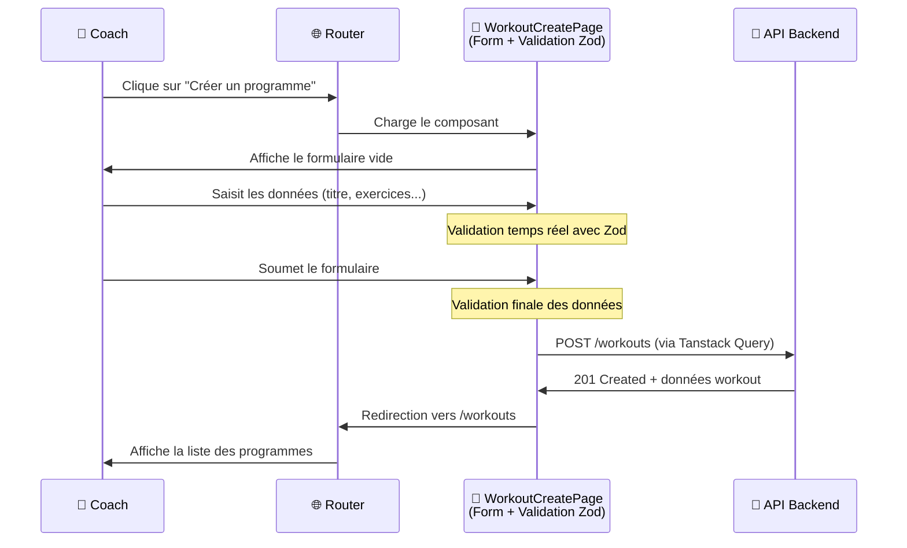

## Architecture Web App

### Organisation modulaire

L'architecture frontend adopte une organisation par features structurant le code selon le vocabulaire métier (`athletes`, `exercises`, `workout`, `planning`) plutôt que par préoccupations techniques.

```markdown
apps/web/src/
├── features/              # Modules métier isolés
│   ├── athletes/          # Gestion des athlètes
│   ├── exercises/         # Catalogue d'exercices  
│   ├── workout/           # Création et édition d'entrainements
│   ├── planning/          # Interface calendaire
│   └── complex/           # Gestion des complexes
├── shared/                # Composants et logique partagés
│   ├── components/ui/     # Design system Shadcn/ui
│   ├── hooks/             # Hooks React réutilisables
│   └── utils/             # Utilitaires communs
└── routes/                # Structure de routage Tanstack Router
```

Chaque feature encapsule ses composants UI et sa logique d'interface spécifique, respectant le principe de responsabilité unique.

### Gestion des formulaires avec React Hook Form

React Hook Form fournit la validation en temps réel, la gestion des erreurs et l'optimisation des performances de saisie dans les formulaires, me permettant de me concentrer sur la logique métier spécifique à l'haltérophilie.

> **Exemple d'implémentation** : Voir l'annexe [Formulaires avec React Hook Form et validation Zod](/annexes/implementation-presentations/#formulaires-avec-react-hook-form-et-validation-zod) 

### Intégration de la validation Zod partagée

J'utilise les schémas Zod définis dans le package partagé `@dropit/schemas`, également utilisés côté API dans la [couche d'accès aux données](/conception/acces-donnees#s%C3%A9curit%C3%A9-applicative-et-protection-owasp). Cette centralisation garantit qu'un exercice validé côté client sera nécessairement accepté par l'API, éliminant les divergences de validation qui pourraient générer des erreurs d'intégration.

### Synchronisation des données avec Tanstack Query

Dans DropIt, un coach qui crée un exercice dans le catalogue doit le voir apparaître immédiatement dans l'interface de création de programme, sans rechargement manuel. Cette synchronisation nécessite une gestion cohérente de l'état des données entre les différents écrans.

J'ai choisi Tanstack Query qui traite les requêtes HTTP comme source de vérité, évitant de dupliquer les données serveur dans un store client. Quand un coach crée un nouvel exercice, Tanstack Query invalide automatiquement le cache des listes d'exercices, déclenchant leur rechargement transparent lors du prochain accès. Cette approche répond à mon besoin sans complexité supplémentaire : la majorité de l'état de l'application provient directement du backend.

> **Exemple d'implémentation Tanstack Query** : Voir l'annexe [Synchronisation des données avec Tanstack Query](/annexes/implementation-presentations/#synchronisation-des-données-avec-tanstack-query)

### Routage typé avec Tanstack Router

L'application web est une Single Page Application (SPA) : toute la navigation se fait côté client sans rechargement de page, nécessitant un système de routage pour gérer les différents écrans.

J'ai choisi Tanstack Router dans une démarche d'apprentissage, pour découvrir une alternative à React Router que je connaissais déjà. Le typage strict des paramètres de route évite les erreurs de navigation, et l'organisation en fichiers correspond bien à la structure modulaire du projet.

### Flux de données

Pour mettre en perspective tous ces éléments, voici un exemple de flux de données lors de la création d'un programme d'entraînement :



Ce flux illustre la séparation des responsabilités : les composants gèrent l'affichage, Tanstack Query gère la communication avec l'API, et la validation Zod garantit la cohérence des données avant envoi. Cette organisation facilite la maintenance en isolant chaque préoccupation.

### Internationalisation côté client

Au-delà de la perspective multilingue, l'implémentation d'un système d'internationalisation répond à deux besoins pratiques : externaliser tous les textes dans des fichiers dédiés plutôt que dispersés dans le code, et mutualiser certains messages (notamment les erreurs) entre l'application web et mobile.

J'ai donc intégré `react-i18next` côté client en réutilisant le package `@dropit/i18n` décrit dans l'architecture globale. Cette approche centralisée facilite la maintenance des textes et évite la duplication de messages entre les plateformes.

Les fichiers de traduction sont organisés par domaines métier, permettant une maintenance ciblée et une évolution future facilitée.

> **Exemple d'implémentation** : Voir l'annexe [Implémentation i18n](/annexes/implementation-presentations/#implémentation-i18n)

### TailwindCSS

TailwindCSS fournit des classes utilitaires qui correspondent directement aux propriétés CSS (`flex`, `text-center`, `p-4`), permettant de styler les composants directement dans le JSX sans naviguer entre fichiers CSS et composants.

L'approche responsive mobile-first utilise les préfixes `sm:`, `md:`, `lg:` pour adapter les interfaces aux différentes tailles d'écran (`sm:text-lg`, `md:grid-cols-2`) sans écrire de media queries manuelles. Vite génère automatiquement uniquement les styles effectivement utilisés, optimisant la taille du bundle final.

> **Exemple d'implémentation Tailwind** : Voir l'annexe [Exemple d'implémentation Tailwind](/annexes/implementation-presentations/#exemple-dimplémentation-tailwind)

### Shadcn/ui

Shadcn/ui s'appuie sur Radix UI pour implémenter nativement les recommandations WCAG 2.1 et respecter les critères RGAA (Référentiel Général d'Amélioration de l'Accessibilité). Cette conformité facilite l'utilisation par tous les athlètes, y compris ceux en situation de handicap.

L'implémentation respecte les critères RGAA essentiels : structure sémantique avec rôles ARIA appropriés, gestion du focus pour la navigation clavier, contrastes conformes (ratio 4.5:1 minimum), et messages d'erreur associés via `aria-describedby`. L'attribut `role="alert"` assure l'annonce immédiate des erreurs par les lecteurs d'écran.

L'approche "copy-paste" offre un contrôle total sur l'adaptation aux spécificités métier tout en conservant les garanties d'accessibilité de Radix UI. Les composants étant conçus pour être tree-shakeable, Vite peut éliminer automatiquement les composants non utilisés du bundle final, réduisant la taille du JavaScript téléchargé et répondant aux enjeux de durabilité numérique.

> **Exemple d'implémentation Shadcn/ui** : Voir l'annexe [Exemple d'implémentation Shadcn/ui](/annexes/implementation-presentations/#exemple-dimplémentation-shadcnui)

### Système d'icônes avec Lucide React

Lucide fournit des icônes sous forme de composants SVG React, permettant d'importer uniquement celles effectivement utilisées dans l'application. Cette approche s'inscrit dans une démarche d'écoconception en réduisant la taille du JavaScript téléchargé, donc la consommation de bande passante de l'application.

Chaque icône est implémentée avec les attributs ARIA appropriés selon son contexte d'usage (décoratif ou informatif), respectant les recommandations d'accessibilité.

> **Exemple d'implémentation Lucide React** : Voir l'annexe [Exemple d'implémentation Lucide React](/annexes/implementation-presentations/#exemple-dimplémentation-lucide-react)

### Optimisations du build avec Vite

Vite est un bundler qui automatise trois optimisations sans configuration complexe : le **code splitting** génère des chunks séparés pour chaque route, permettant de télécharger uniquement le JavaScript nécessaire à la page consultée ; le **tree shaking** élimine le code non utilisé (composants Shadcn/ui, fonctions i18n non activées) ; et la **compression des assets** minifie le CSS et JavaScript. Ces optimisations améliorent les performances de l'application web.

## Architecture Mobile App

### Structure du projet mobile

```markdown
apps/mobile/
├── src/
│   ├── components/          # Composants React Native
│   │   ├── AuthProvider.tsx # Gestion authentification globale
│   │   ├── LoginScreen.tsx  # Écran de connexion
│   │   └── DashboardScreen.tsx # Interface principale athlète
│   └── lib/                 # Configuration et clients
│       ├── auth-client.ts   # Client Better Auth pour mobile
│       └── api.ts          # Client HTTP configuré
├── assets/                  # Images et ressources natives
│   ├── icon.png            # Icône application
│   ├── splash-icon.png     # Écran de démarrage
│   └── adaptive-icon.png   # Icône adaptative Android
├── app.json                 # Configuration Expo
└── App.tsx                 # Point d'entrée de l'application
```

La structure mobile reste volontairement simple avec une séparation entre les composants d'interface et la configuration des services externes, facilitant la maintenance et réduisant la complexité cognitive. Les assets sont organisés selon les conventions Expo pour une génération automatique des icônes et écrans de démarrage adaptés à chaque plateforme.

### Partage de la logique métier

L'application mobile, développée avec React Native et Expo, bénéficie pleinement de l'architecture monorepo en réutilisant l'ensemble des packages partagés : `@dropit/schemas` pour la validation, `@dropit/contract` pour les appels API typés, `@dropit/permissions` pour les autorisations, et `@dropit/i18n` pour les traductions.

Cette réutilisation garantit une cohérence des règles métier entre les plateformes web et mobile, éliminant les risques de divergence fonctionnelle.

> **Flux d'interaction mobile** : Voir l'annexe [Architecture mobile flux de données](/annexes/implementation-presentations/#architecture-mobile-flux-de-données)

### Async storage 

Le stockage mobile utilise AsyncStorage pour conserver le token d'authentification localement, contrairement au web qui utilise des cookies httpOnly. Cette approche permet une authentification persistante et pourrait être étendue pour une utilisation hors-ligne partielle, particulièrement utile en salle de sport où la connectivité peut être limitée.

## Considérations de performance

J'ai appliqué plusieurs optimisations classiques du développement React moderne, en évitant l'optimisation prématurée qui nuit à la lisibilité :

- **Lazy loading** des composants volumineux pour réduire le bundle initial
- **Memoization** des calculs coûteux pour éviter les recalculs inutiles  
- **Debouncing** des recherches pour limiter les appels réseau excessifs

Ces optimisations ciblent les problématiques courantes : chargement différé des composants lourds, évitement des calculs redondants, et limitation des appels réseau excessifs. Dans le contexte d'usage de DropIt (quelques dizaines d'utilisateurs par club), ces optimisations suffisent largement.

> **Exemple d'optimisations React** : Voir l'annexe [Exemples d'optimisations React](/annexes/implementation-presentations/#exemple-doptimisations-react)
