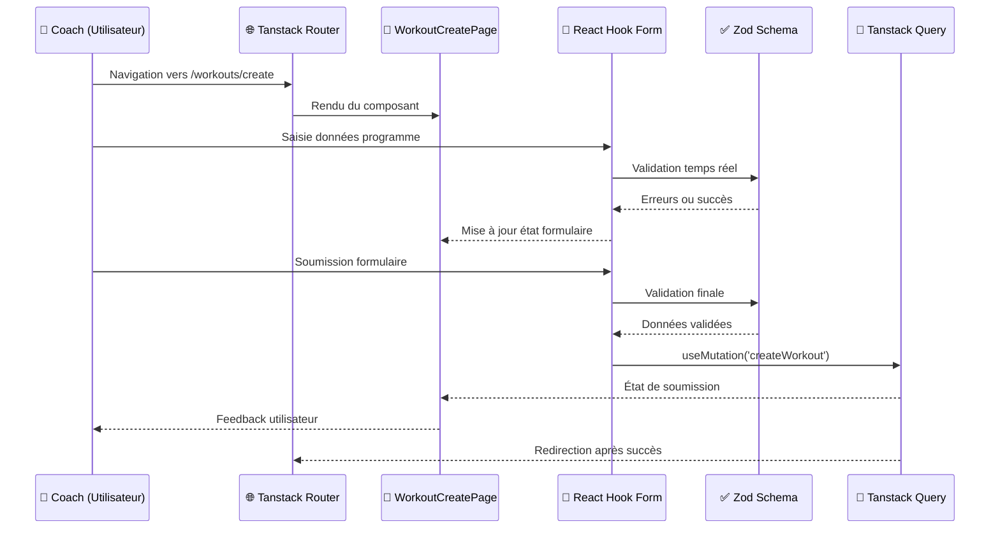

## Introduction

Après avoir détaillé l'[accès aux données](/conception/acces-donnees), cette section s'intéresse à l'implémentation concrète des couches de présentation web et mobile qui constituent les points d'entrée des utilisateurs vers l'application. L'[architecture logicielle](/conception/architecture) a présenté la vision d'ensemble ; nous explorons ici comment ces choix se traduisent en composants React et patterns d'implémentation, en réutilisant les [packages partagés du monorepo](/conception/architecture#packages-partagés-du-monorepo) (`@dropit/schemas`, `@dropit/contract`, `@dropit/i18n`) pour garantir la cohérence des règles métier entre plateformes.

## Architecture Web App

### Choix d'organisation modulaire

Ma stratégie d'architecture frontend s'appuie sur une organisation par features qui traduit directement les domaines métier identifiés lors de l'analyse des besoins. Cette approche, inspirée des principes du Domain-Driven Design, établit un langage commun entre l'équipe technique et les coachs utilisateurs. Plutôt que de structurer le code selon des préoccupations purement techniques (composants, services, utils), j'ai privilégié une architecture qui reflète le vocabulaire métier : "athletes", "exercises", "workout", "planning". Cette correspondance directe facilite considérablement les échanges avec les utilisateurs finaux et réduit les incompréhensions lors des phases de validation fonctionnelle.

```markdown
apps/web/src/
├── features/              # Modules métier isolés
│   ├── athletes/          # Gestion des athlètes
│   ├── exercises/         # Catalogue d'exercices  
│   ├── workout/           # Création et édition programmes
│   ├── planning/          # Interface calendaire
│   └── complex/           # Gestion des complexes
├── shared/                # Composants et logique partagés
│   ├── components/ui/     # Design system Shadcn/ui
│   ├── hooks/             # Hooks React réutilisables
│   └── utils/             # Utilitaires communs
└── routes/                # Structure de routage Tanstack Router
```

Au-delà de cette cohérence sémantique, cette organisation présente des avantages techniques concrets que j'ai découverts au fil du développement. Elle facilite considérablement le développement parallèle : je peux travailler sur la gestion des exercices sans impacter les fonctionnalités de planification. Elle respecte également le principe de responsabilité unique au niveau des modules, chaque feature encapsulant sa logique métier spécifique et ses règles de validation propres.

L'isolation des domaines métier s'avère bénéfique dans le contexte de DropIt où les règles business diffèrent significativement entre la gestion des athlètes et la création d'exercices. Par exemple, le module `athletes/` implémente des validations spécifiques aux données personnelles (format email, validation d'âge, contraintes de confidentialité), tandis que le module `exercises/` se concentre sur les règles biomécaniques (validation des groupes musculaires, cohérence des paramètres de charge). Cette séparation me permet d'appliquer ces règles métier spécialisées sans créer de couplage entre les modules, facilitant ainsi leur maintenance et leur évolution indépendante.

### Gestion des formulaires avec React Hook Form

Pour la gestion des formulaires dans DropIt, j'avais besoin d'implémenter efficacement des fonctionnalités comme la validation en temps réel, la gestion des erreurs, et la soumission asynchrone sans réinventer ces mécanismes from scratch. React Hook Form me fournit ces fonctionnalités clés en main : gestion automatique des états de formulaire, validation intégrée, et optimisation des performances via des champs non contrôlés.

Cette approche me permet de me concentrer sur la logique métier spécifique à l'haltérophilie plutôt que sur l'implémentation des mécanismes de base des formulaires.

> **Exemples d'implémentation** : Voir l'[Annexe - Implémentation des présentations](/annexes/implementation-presentations/) 

### Intégration de la validation Zod partagée

L'un des aspects les plus enrichissants de cette implémentation a été l'intégration des schémas Zod définis dans le package partagé [`@dropit/schemas`](/conception/architecture#dropit-schemas--validation-centralisée-avec-zod), également utilisés côté API dans la [couche d'accès aux données](/conception/acces-donnees). Cette approche résout une problématique récurrente : maintenir la cohérence des règles de validation entre le frontend et le backend.

Cette définition commune me permet d'exploiter les mêmes schémas pour deux usages complémentaires : validation des données reçues par l'API côté serveur, et validation des formulaires côté client avant envoi. Cette réutilisation garantit une parfaite synchronisation des règles de validation sur l'ensemble de l'application.

L'avantage le plus significatif réside dans l'élimination des divergences de validation. Avec cette approche centralisée, je garantis qu'un exercice respectant les contraintes côté client sera nécessairement accepté par l'API, réduisant drastiquement les erreurs d'intégration.

> **Exemples d'intégration Zod** : Voir l'[Annexe - Implémentation des présentations](/annexes/implementation-presentations/)

### Stratégie de synchronisation des données avec Tanstack Query

Dans le contexte de DropIt, la question de la gestion d'état s'est posée rapidement : comment synchroniser efficacement les données entre les différents écrans de l'application ? Un coach qui crée un exercice dans le catalogue doit le voir apparaître immédiatement dans l'interface de création de programme, sans rechargement manuel.

J'ai choisi Tanstack Query qui traite directement les requêtes HTTP comme source de vérité plutôt que de dupliquer les données serveur dans un store client. Cette approche correspond mieux à la réalité d'une application moderne où la majorité de l'état provient effectivement du backend.

L'invalidation automatique du cache constitue un mécanisme particulièrement élégant : lorsqu'un coach crée un nouvel exercice, Tanstack Query invalide automatiquement toutes les requêtes liées aux exercices, garantissant leur rechargement transparent lors du prochain accès. Cette synchronisation élimine les incohérences que j'avais pu observer dans des projets antérieurs.

Tanstack Query encapsule toute la logique complexe de gestion d'état dans ses hooks `useQuery` et `useMutation`, me permettant de me concentrer sur la logique métier plutôt que sur la plomberie de la synchronisation des données.

> **Exemples d'implémentation Tanstack Query** : Voir l'[Annexe - Implémentation des présentations](/annexes/implementation-presentations/)

### Routage typé avec Tanstack Router

Dans le contexte d'une Single Page Application (SPA) comme DropIt, la gestion du routage devient cruciale pour offrir une expérience utilisateur fluide. Les coachs naviguent fréquemment entre la création de programmes, la gestion des athlètes et la planification des séances, nécessitant des transitions rapides sans interruption de leur workflow.

J'ai choisi d'explorer Tanstack Router plutôt que React Router principalement dans une démarche d'apprentissage d'une alternative moderne au routage classique. L'approche file-based routing où chaque route correspond à un fichier m'a semblé plus intuitive que la configuration centralisée de React Router, facilitant l'organisation et la maintenance du code.

Cette structure hiérarchique reflète l'organisation logique de l'application et facilite la gestion des layouts imbriqués. Le préfixe `__home` indique les routes protégées par authentification, simplifiant la logique de protection des pages.

> **Configuration et exemples de routage** : Voir l'[Annexe - Implémentation des présentations](/annexes/implementation-presentations/)

### Flux de données

Pour mettre en perspectives tous ces élements voici un exemple de flux de données dans le client web:



L'application suit un flux de données unidirectionnel où Tanstack Query centralise la gestion de l'état serveur, tandis que React se charge de l'état local des composants. Cette séparation facilite la maintenance et le débogage et me permet d'isoler les problèmes selon leur nature.

La structure respecte une séparation entre les différentes couches : présentation avec les composants UI, logique métier encapsulée dans des hooks personnalisés, et communication gérée par les clients API. Cette organisation facilite non seulement les tests unitaires en isolant chaque responsabilité, mais aussi l'évolution future du code en permettant de modifier une couche sans impacter les autres. Pour optimiser les performances de rendu, j'ai prévu d'implémenter une pagination progressive pour les longues listes d'athlètes et la technique de lazy loading pour les détails de programmes, évitant ainsi de charger l'intégralité des données au premier accès.

### Gestion des dates avec date-fns

Dans DropIt, la manipulation des dates intervient fréquemment : planification des séances, formatage des dates d'entraînement, calculs de périodes. J'avais besoin d'une solution fiable pour éviter les pièges classiques de manipulation des objets Date JavaScript natifs.

J'ai choisi date-fns pour son approche fonctionnelle avec des fonctions pures qui ne mutent pas les dates originales. Cette immutabilité évite les modifications involontaires que j'avais déjà rencontrées dans des projets précédents. Sa modularité me permet également d'importer uniquement les fonctions nécessaires, optimisant la taille du bundle final.

Cette approche garantit une gestion cohérente des dates à travers l'application, évitant les incohérences de formatage qui pourraient nuire à l'expérience utilisateur.

> **Exemples d'utilisation date-fns** : Voir l'[Annexe - Implémentation des présentations](/annexes/implementation-presentations/)

### Drag-and-drop pour la composition

Pour la réorganisation des exercices dans un programme, j'avais besoin d'une interface permettant de modifier facilement l'ordre des éléments. L'approche par champs numériques aurait fonctionné, mais j'ai préféré une interaction plus directe. J'ai donc choisi d'utiliser la bibliothèque dnd-kit qui me fournit tous les hooks et utilitaires nécessaires pour implémenter le drag-and-drop : gestion des événements, animations fluides, et support de l'accessibilité. Cette solution m'évite de réinventer la logique complexe de détection des zones de drop.

L'implémentation repose sur le hook `useSortable` qui me donne tous les éléments nécessaires : les `attributes` et `listeners` pour capturer les interactions, la référence `setNodeRef` pour attacher le comportement au DOM, et les propriétés `transform` et `transition` pour gérer les animations. Le composant affiche l'exercice avec ses paramètres (séries, répétitions, poids) tout en restant complètement déplaçable grâce à la logique encapsulée par dnd-kit.

> **Exemples d'implémentation drag-and-drop** : Voir l'[Annexe - Implémentation des présentations](/annexes/implementation-presentations/)

### Gestion du planning avec FullCalendar

Pour l'interface calendaire de planification des séances, j'ai intégré FullCalendar, une bibliothèque JavaScript mature spécialisée dans l'affichage de calendriers interactifs. Cette solution me évite de développer from scratch les fonctionnalités complexes de navigation temporelle, gestion des fuseaux horaires, et interactions utilisateur propres aux calendriers.

Cette intégration me permet de proposer aux coachs une expérience familiar d'agenda, avec visualisations mensuelle, hebdomadaire et quotidienne selon leurs préférences d'organisation.

> **Configuration FullCalendar** : Voir l'[Annexe - Implémentation des présentations](/annexes/implementation-presentations/)

### Internationalisation côté client

Au-delà de la perspective multilingue, l'implémentation d'un système d'internationalisation répond à deux besoins pratiques : externaliser tous les textes dans des fichiers dédiés plutôt que dispersés dans le code, et mutualiser certains messages (notamment les erreurs) entre l'application web et mobile.

J'ai donc intégré react-i18next côté client en réutilisant le package [`@dropit/i18n`](/conception/architecture#dropit-i18n--internationalisation-partagée) décrit dans l'architecture globale. Cette approche centralisée facilite la maintenance des textes et évite la duplication de messages entre les plateformes.

Les fichiers de traduction sont organisés par domaines métier, permettant une maintenance ciblée et une évolution future facilitée.

> **Configuration i18next et exemples** : Voir l'[Annexe - Implémentation des présentations](/annexes/implementation-presentations/)

### TailwindCSS

Dans le contexte de DropIt, j'avais besoin d'une approche CSS permettant un développement rapide sans sacrifier la cohérence visuelle ni les performances finales. TailwindCSS répond précisément à cette problématique en inversant la logique traditionnelle du développement CSS.

Contrairement à l'approche classique où j'aurais créé des classes CSS sémantiques comme `.workout-card` ou `.athlete-form`, Tailwind propose des classes utilitaires atomiques qui correspondent directement aux propriétés CSS. Cette méthodologie me permet de composer les interfaces directement dans le JSX sans naviguer constamment entre fichiers CSS et composants.

Cette approche me fait gagner un temps considérable lors du développement des formulaires de création d'exercices et des interfaces de planning. Au lieu de définir des styles CSS personnalisés, puis de les maintenir et les faire évoluer, je compose directement les interfaces avec des classes atomiques qui correspondent à mes besoins visuels immédiats.

L'intégration de Tailwind dans le projet Vite nécessite une configuration spécifique que j'ai adaptée aux besoins de DropIt. Le compilateur JIT (Just-In-Time) génère uniquement les styles CSS correspondant aux classes effectivement utilisées dans le code, optimisant drastiquement la taille du bundle final.

Cette configuration me permet d'étendre la palette de base avec des couleurs métier spécifiques à l'application tout en bénéficiant des plugins officiels pour les formulaires et la typographie. Le système de purge automatique élimine toutes les classes non utilisées, résultant en un fichier CSS final de quelques kilooctets seulement.

L'approche responsive de Tailwind facilite également le développement mobile-first que j'ai adopté. Les préfixes `sm:`, `md:`, `lg:` permettent d'adapter facilement les interfaces aux différentes tailles d'écran sans écrire de media queries CSS manuelles, aspect crucial pour une application utilisée à la fois sur desktop par les coachs et sur mobile par les athlètes.

> **Configuration Tailwind et exemples** : Voir l'[Annexe - Implémentation des présentations](/annexes/implementation-presentations/)

### Shadcn/ui

Dans le développement de DropIt, j'ai privilégié Shadcn/ui non seulement pour sa productivité, mais surtout pour son approche fondamentale de l'accessibilité et de la durabilité numérique. Dans le contexte de ma formation, ces préoccupations d'accessibilité universelle et d'écoconception sont devenues centrales, particulièrement pour une application destinée à un public diversifié d'athlètes.

Shadcn/ui s'appuie sur Radix UI, une bibliothèque qui implémente nativement les recommandations WCAG 2.1 et respecte les critères du RGAA (Référentiel Général d'Amélioration de l'Accessibilité). Cette conformité garantit que DropIt reste utilisable par tous les athlètes, y compris ceux en situation de handicap.

Cette implémentation respecte les critères RGAA essentiels : structure sémantique avec des rôles ARIA appropriés, gestion du focus pour la navigation clavier, contrastes de couleurs conformes (ratio 4.5:1 minimum), et messages d'erreur associés via `aria-describedby`. L'attribut `role="alert"` assure que les lecteurs d'écran annoncent immédiatement les erreurs de validation, améliorant l'expérience des utilisateurs malvoyants.

La stratégie de bundling que j'ai adoptée avec Shadcn permet un tree-shaking optimal : seuls les composants effectivement utilisés sont inclus dans le bundle final. Cette granularité d'import réduit significativement la taille du JavaScript téléchargé, diminuant la consommation énergétique côté client et améliorant les temps de chargement sur des connexions limitées.

L'approche "copy-paste" de Shadcn/ui me donne un contrôle total sur l'adaptation des composants aux spécificités métier de l'haltérophilie. Cette flexibilité me permet d'intégrer des fonctionnalités métier comme les indicateurs de sécurité pour les exercices à risque, tout en conservant les garanties d'accessibilité de la base Radix UI.

> **Exemples d'implémentation Shadcn/ui** : Voir l'[Annexe - Implémentation des présentations](/annexes/implementation-presentations/)

### Système d'icônes avec Lucide React

Dans le développement des interfaces de DropIt, j'avais besoin d'un système d'icônes cohérent qui s'intègre harmonieusement avec l'écosystème React et Tailwind tout en respectant les principes d'accessibilité. Lucide React s'est imposé comme une solution naturelle, étant un fork maintenu et amélioré de Feather Icons, avec des optimisations spécifiques pour React.

Le choix de Lucide React répond d'abord à un besoin de cohérence visuelle dans l'interface utilisateur. Contrairement à l'approche que j'aurais pu adopter en mélangeant différentes sources d'icônes (Font Awesome, Material Icons, icônes personnalisées), Lucide propose un style unifié avec des traits fins et des proportions harmonieuses qui s'accordent parfaitement avec l'esthétique moderne de Tailwind.

Cette cohérence devient particulièrement importante dans le contexte métier de DropIt où chaque icône porte une signification fonctionnelle précise pour les utilisateurs. J'ai établi un vocabulaire iconographique cohérent qui facilite la reconnaissance et l'apprentissage de l'interface.

L'implémentation technique de Lucide React présente des avantages significatifs en termes de performance et d'optimisation. Contrairement aux font-icons qui imposent le téléchargement complet de la police même pour quelques icônes utilisées, Lucide permet un tree-shaking granulaire où seules les icônes effectivement importées sont incluses dans le bundle final.

Cette approche réduit significativement la taille du JavaScript téléchargé, aspect crucial dans ma démarche d'écoconception. Les icônes étant des composants SVG React natifs, elles bénéficient du rendu optimisé de React et peuvent être stylées dynamiquement sans impact performance notable.

L'intégration de Lucide React dans DropIt respecte scrupuleusement les recommandations d'accessibilité, particulièrement importantes pour garantir l'utilisabilité par tous les athlètes. Chaque icône est implémentée avec les attributs ARIA appropriés selon son contexte d'usage.

> **Exemples d'implémentation Lucide React** : Voir l'[Annexe - Implémentation des présentations](/annexes/implementation-presentations/)

### Optimisations du build avec Vite

Dans le contexte de DropIt, j'ai choisi Vite comme bundler pour bénéficier d'optimisations automatiques sans configuration complexe. Contrairement à Webpack que j'utilisais précédemment et qui nécessitait des ajustements manuels pour maintenir de bonnes performances, Vite automatise les optimisations essentielles.

L'outil applique automatiquement trois optimisations cruciales que j'aurais dû configurer manuellement avec d'autres bundlers :

**Code splitting** : Chaque route Tanstack Router génère automatiquement un chunk séparé, permettant aux utilisateurs de ne télécharger que le JavaScript nécessaire à la page consultée. Les modules `athletes`, `exercises`, `workout` et `planning` deviennent des chunks indépendants, optimisant les temps de chargement.

**Tree shaking** : L'élimination automatique du code non utilisé s'applique à tous les niveaux. Dans DropIt, cela supprime les composants Shadcn/ui non utilisés et les fonctions d'internationalisation des langues non activées, réduisant significativement la taille du bundle final.

**Compression des assets** : La minification du CSS et JavaScript, ainsi que l'optimisation des images s'effectuent transparemment, améliorant les performances particulièrement critiques pour l'usage mobile en salle de sport.

Cette approche me permet de bénéficier d'optimisations modernes sans configuration complexe, aspect appréciable dans un contexte de formation où je préfère me concentrer sur les aspects métier plutôt que sur l'optimisation fine du bundling.

> **Configuration Vite et optimisations** : Voir l'[Annexe - Implémentation des présentations](/annexes/implementation-presentations/)

## Architecture Mobile App

### Partage de la logique métier

L'application mobile, développée avec React Native et Expo, bénéficie pleinement de l'architecture monorepo en réutilisant l'ensemble des packages partagés : `@dropit/schemas` pour la validation, `@dropit/contract` pour les appels API typés, `@dropit/permissions` pour les autorisations, et `@dropit/i18n` pour les traductions.

Cette réutilisation garantit une cohérence parfaite des règles métier entre les plateformes web et mobile, éliminant les risques de divergence fonctionnelle.

### Adaptations spécifiques au mobile

L'application mobile nécessite des adaptations spécifiques pour l'environnement mobile, notamment pour le stockage local des données et la synchronisation différée. Ces adaptations s'intègrent harmonieusement avec l'architecture globale du monorepo.

### Async storage 

Le stockage mobile utilise AsyncStorage pour conserver les données localement, contrairement au web qui utilise des cookies httpOnly. Cette approche permet une utilisation hors-ligne partielle, particulièrement utile en salle de sport où la connectivité peut être limitée.

> **Implémentation React Native complète** : Voir l'[Annexe - Implémentation des présentations](/annexes/implementation-presentations/)

## Considérations de performance

J'ai appliqué plusieurs optimisations classiques du développement React moderne, en évitant l'optimisation prématurée qui nuit à la lisibilité :

- **Lazy loading** des composants volumineux pour réduire le bundle initial
- **Memoization** des calculs coûteux pour éviter les recalculs inutiles  
- **Debouncing** des recherches pour limiter les appels réseau excessifs

Ces optimisations ciblent les problématiques courantes : chargement différé des composants lourds, évitement des calculs redondants, et limitation des appels réseau excessifs. Dans le contexte d'usage de DropIt (quelques dizaines d'utilisateurs par club), ces optimisations suffisent largement.

> **Exemples d'optimisations React** : Voir l'[Annexe - Implémentation des présentations](/annexes/implementation-presentations/)


## Bilan des choix architecturaux frontend

L'architecture des couches de présentation que j'ai mise en place illustre concrètement l'application des patterns architecturaux : organisation par features, validation Zod partagée, gestion d'état avec Tanstack Query, et composants Shadcn/ui avec TailwindCSS.

Ces choix techniques - React/TypeScript pour le web, React Native pour le mobile, packages partagés du monorepo - créent un écosystème cohérent où la logique métier reste centralisée tout en permettant des adaptations spécifiques à chaque plateforme.

Maintenant que cette fondation architecturale est établie, la section suivante détaille la conception des interfaces utilisateur et les wireframes qui matérialisent ces choix techniques en expérience utilisateur concrète.  