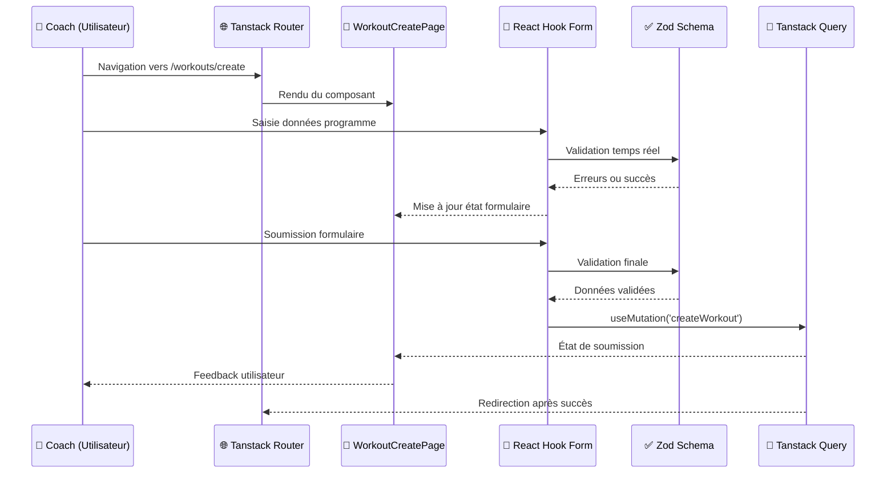

## Architecture Web App

### Organisation modulaire

L'architecture frontend adopte une organisation par features inspirée du Domain-Driven Design, structurant le code selon le vocabulaire métier ("athletes", "exercises", "workout", "planning") plutôt que par préoccupations techniques. Cette approche établit un langage commun avec les utilisateurs et facilite le développement parallèle.

```markdown
apps/web/src/
├── features/              # Modules métier isolés
│   ├── athletes/          # Gestion des athlètes
│   ├── exercises/         # Catalogue d'exercices  
│   ├── workout/           # Création et édition programmes
│   ├── planning/          # Interface calendaire
│   └── complex/           # Gestion des complexes
├── shared/                # Composants et logique partagés
│   ├── components/ui/     # Design system Shadcn/ui
│   ├── hooks/             # Hooks React réutilisables
│   └── utils/             # Utilitaires communs
└── routes/                # Structure de routage Tanstack Router
```

Chaque feature encapsule sa logique métier spécifique et ses règles de validation propres, respectant le principe de responsabilité unique. Cette isolation permet d'appliquer des règles business différenciées (données personnelles pour `athletes/`, règles biomécaniques pour `exercises/`) sans créer de couplage entre modules.

### Gestion des formulaires avec React Hook Form

React Hook Form fournit la validation en temps réel, la gestion des erreurs et l'optimisation des performances via des champs non contrôlés, me permettant de me concentrer sur la logique métier spécifique à l'haltérophilie.

> **Exemples d'implémentation** : Voir l'[Annexe - Implémentation des présentations](/annexes/implementation-presentations/#formulaires-avec-react-hook-form-et-validation-zod) 

### Intégration de la validation Zod partagée

L'un des aspects les plus enrichissants de cette implémentation a été l'intégration des schémas Zod définis dans le package partagé [`@dropit/schemas`](/conception/architecture#dropit-schemas--validation-centralisée-avec-zod), également utilisés côté API dans la [couche d'accès aux données](/conception/acces-donnees). Cette approche résout une problématique récurrente : maintenir la cohérence des règles de validation entre le frontend et le backend.

Cette définition commune permet d'exploiter les mêmes schémas côté serveur et client, garantissant une synchronisation parfaite des règles de validation. Avec cette approche centralisée, je garantis qu'un exercice respectant les contraintes côté client sera nécessairement accepté par l'API, réduisant drastiquement les erreurs d'intégration.

> **Exemples d'intégration Zod** : Voir l'[Annexe - Implémentation des présentations](/annexes/implementation-presentations/#gestion-des-erreurs-de-validation)

### Stratégie de synchronisation des données avec Tanstack Query

Dans le contexte de DropIt, la question de la gestion d'état s'est posée rapidement : comment synchroniser efficacement les données entre les différents écrans de l'application ? Un coach qui crée un exercice dans le catalogue doit le voir apparaître immédiatement dans l'interface de création de programme, sans rechargement manuel.

J'ai choisi Tanstack Query qui traite directement les requêtes HTTP comme source de vérité plutôt que de dupliquer les données serveur dans un store client. Cette approche correspond mieux à la réalité d'une application moderne où la majorité de l'état provient effectivement du backend.

L'invalidation automatique du cache constitue un mécanisme particulièrement élégant : lorsqu'un coach crée un nouvel exercice, Tanstack Query invalide automatiquement toutes les requêtes liées aux exercices, garantissant leur rechargement transparent lors du prochain accès. Cette synchronisation élimine les incohérences que j'avais pu observer dans des projets antérieurs.

Tanstack Query encapsule toute la logique complexe de gestion d'état dans ses hooks `useQuery` et `useMutation`, me permettant de me concentrer sur la logique métier plutôt que sur la plomberie de la synchronisation des données.

> **Exemples d'implémentation Tanstack Query** : Voir l'[Annexe - Implémentation des présentations](/annexes/implementation-presentations/#synchronisation-des-données-avec-tanstack-query)

### Routage typé avec Tanstack Router

Dans le contexte d'une Single Page Application (SPA) comme DropIt, la gestion du routage devient cruciale pour offrir une expérience utilisateur fluide. Les coachs naviguent fréquemment entre la création de programmes, la gestion des athlètes et la planification des séances, nécessitant des transitions rapides sans interruption de leur workflow.

J'ai choisi d'explorer Tanstack Router plutôt que React Router principalement dans une démarche d'apprentissage d'une alternative moderne au routage classique. L'approche file-based routing où chaque route correspond à un fichier m'a semblé plus intuitive que la configuration centralisée de React Router, facilitant l'organisation et la maintenance du code.

Cette structure hiérarchique reflète l'organisation logique de l'application et facilite la gestion des layouts imbriqués. Le préfixe `__home` indique les routes protégées par authentification.

### Flux de données

Pour mettre en perspectives tous ces élements voici un exemple de flux de données dans le client web:



L'application suit un flux de données unidirectionnel où Tanstack Query centralise la gestion de l'état serveur, tandis que React se charge de l'état local des composants. Cette séparation facilite la maintenance et le débogage et me permet d'isoler les problèmes selon leur nature.

La structure respecte une séparation entre les différentes couches : présentation avec les composants UI, logique métier encapsulée dans des hooks personnalisés, et communication gérée par les clients API. Cette organisation facilite non seulement les tests unitaires en isolant chaque responsabilité, mais aussi l'évolution future du code en permettant de modifier une couche sans impacter les autres. Pour optimiser les performances de rendu, j'ai prévu d'implémenter une pagination progressive pour les longues listes d'athlètes et la technique de lazy loading pour les détails de programmes, évitant ainsi de charger l'intégralité des données au premier accès.

### Gestion des dates avec date-fns

Dans DropIt, la manipulation des dates intervient fréquemment : planification des séances, formatage des dates d'entraînement, calculs de périodes. J'ai choisi date-fns pour son approche fonctionnelle avec des fonctions pures qui ne mutent pas les dates originales, évitant les modifications involontaires. Sa modularité permet d'importer uniquement les fonctions nécessaires, optimisant la taille du bundle.

### Drag-and-drop pour la composition

Pour la réorganisation des exercices dans un programme, j'avais besoin d'une interface permettant de modifier facilement l'ordre des éléments. L'approche par champs numériques aurait fonctionné, mais j'ai préféré une interaction plus directe. J'ai donc choisi d'utiliser la bibliothèque dnd-kit qui me fournit tous les hooks et utilitaires nécessaires pour implémenter le drag-and-drop : gestion des événements, animations fluides, et support de l'accessibilité. Cette solution m'évite de réinventer la logique complexe de détection des zones de drop.

L'implémentation utilise le hook `useSortable` qui fournit les événements, références DOM et animations nécessaires pour rendre les exercices déplaçables avec leurs paramètres.

### Internationalisation côté client

Au-delà de la perspective multilingue, l'implémentation d'un système d'internationalisation répond à deux besoins pratiques : externaliser tous les textes dans des fichiers dédiés plutôt que dispersés dans le code, et mutualiser certains messages (notamment les erreurs) entre l'application web et mobile.

J'ai donc intégré `react-i18next` côté client en réutilisant le package `@dropit/i18n` décrit dans l'architecture globale. Cette approche centralisée facilite la maintenance des textes et évite la duplication de messages entre les plateformes.

Les fichiers de traduction sont organisés par domaines métier, permettant une maintenance ciblée et une évolution future facilitée.

> **Un exemple d'implémentation** : Voir l'[Annexe - Implémentation des présentations](/annexes/implementation-presentations/#implémentation-i18n)

### TailwindCSS

TailwindCSS adopte une approche CSS atomique avec des classes utilitaires correspondant directement aux propriétés CSS, permettant de composer les interfaces directement dans le JSX. Cette méthodologie élimine la navigation constante entre fichiers CSS et composants, optimisant le développement des formulaires et interfaces de planning.

L'intégration avec Vite utilise le compilateur JIT (Just-In-Time) qui génère uniquement les styles correspondant aux classes effectivement utilisées, optimisant drastiquement la taille du bundle final. Le système de purge automatique élimine les classes non utilisées, résultant en un fichier CSS de quelques kilooctets.

L'approche responsive mobile-first utilise les préfixes `sm:`, `md:`, `lg:` pour adapter les interfaces aux différentes tailles d'écran sans media queries manuelles.

> **Exemple implémentation Tailwind** : Voir l'[Annexe - Implémentation des présentations](/annexes/implementation-presentations/#exemple-implémtation-tailwind)

### Shadcn/ui

Shadcn/ui s'appuie sur Radix UI pour implémenter nativement les recommandations WCAG 2.1 et respecter les critères RGAA (Référentiel Général d'Amélioration de l'Accessibilité). Cette conformité garantit l'utilisabilité par tous les athlètes, y compris ceux en situation de handicap.

L'implémentation respecte les critères RGAA essentiels : structure sémantique avec rôles ARIA appropriés, gestion du focus pour la navigation clavier, contrastes conformes (ratio 4.5:1 minimum), et messages d'erreur associés via `aria-describedby`. L'attribut `role="alert"` assure l'annonce immédiate des erreurs par les lecteurs d'écran.

L'approche "copy-paste" offre un contrôle total sur l'adaptation aux spécificités métier tout en conservant les garanties d'accessibilité de Radix UI. Les composants étant conçus pour être tree-shakeable, Vite peut éliminer automatiquement les composants non utilisés du bundle final, réduisant la taille du JavaScript téléchargé et répondant aux enjeux de durabilité numérique.

> **Exemple d'implémentation Shadcn/ui** : Voir l'[Annexe - Implémentation des présentations](/annexes/implementation-presentations/#exemple-dimplémentation-shadcnui)

### Système d'icônes avec Lucide React

Lucide React, fork amélioré de Feather Icons, propose un style unifié avec des traits fins et des proportions harmonieuses qui s'intègrent parfaitement avec l'esthétique moderne de Tailwind. Cette cohérence visuelle facilite la reconnaissance et l'apprentissage de l'interface dans le contexte métier de DropIt.

Contrairement aux font-icons, Lucide permet un tree-shaking granulaire et des composants SVG natifs. Cette approche réduit la taille du JavaScript téléchargé, aspect crucial pour l'écoconception. Les icônes étant des composants SVG React natifs, elles bénéficient du rendu optimisé de React et peuvent être stylées dynamiquement.

L'intégration respecte scrupuleusement les recommandations d'accessibilité, chaque icône étant implémentée avec les attributs ARIA appropriés selon son contexte d'usage.

> **Exemple d'implémentation Lucide React** : Voir l'[Annexe - Implémentation des présentations](/annexes/implementation-presentations/#exemple-dimplémentation-lucide-react)

### Optimisations du build avec Vite

Vite, bundler moderne remplaçant Webpack, automatise les optimisations essentielles sans configuration complexe. Il applique trois optimisations cruciales : le code splitting qui génère automatiquement des chunks séparés pour chaque route Tanstack Router, permettant aux utilisateurs de télécharger uniquement le JavaScript nécessaire à la page consultée ; le tree shaking qui élimine automatiquement le code non utilisé (composants Shadcn/ui non utilisés, fonctions d'internationalisation des langues non activées) ; et la compression des assets qui minifie le CSS et JavaScript tout en optimisant les images, améliorant les performances particulièrement critiques pour l'usage mobile en salle de sport.

## Architecture Mobile App

### Structure du projet mobile

```markdown
apps/mobile/
├── src/
│   ├── components/          # Composants React Native
│   │   ├── AuthProvider.tsx # Gestion authentification globale
│   │   ├── LoginScreen.tsx  # Écran de connexion
│   │   └── DashboardScreen.tsx # Interface principale athlète
│   └── lib/                 # Configuration et clients
│       ├── auth-client.ts   # Client Better Auth pour mobile
│       └── api.ts          # Client HTTP configuré
├── assets/                  # Images et ressources natives
│   ├── icon.png            # Icône application
│   ├── splash-icon.png     # Écran de démarrage
│   └── adaptive-icon.png   # Icône adaptative Android
├── app.json                 # Configuration Expo
└── App.tsx                 # Point d'entrée de l'application
```

La structure mobile reste volontairement simple avec une séparation entre les composants d'interface et la configuration des services externes, facilitant la maintenance et réduisant la complexité cognitive. Les assets sont organisés selon les conventions Expo pour une génération automatique des icônes et écrans de démarrage adaptés à chaque plateforme.

### Partage de la logique métier

L'application mobile, développée avec React Native et Expo, bénéficie pleinement de l'architecture monorepo en réutilisant l'ensemble des packages partagés : `@dropit/schemas` pour la validation, `@dropit/contract` pour les appels API typés, `@dropit/permissions` pour les autorisations, et `@dropit/i18n` pour les traductions.

Cette réutilisation garantit une cohérence parfaite des règles métier entre les plateformes web et mobile, éliminant les risques de divergence fonctionnelle.

> **Flux d'intéraction mobile** : Voir l'[Annexe - Implémentation des présentations](/annexes/implementation-presentations/#architecture-mobile-flux-de-données)

### Async storage 

Le stockage mobile utilise AsyncStorage pour conserver le token d'authentification localement, contrairement au web qui utilise des cookies httpOnly. Cette approche permet une authentification persistante et pourrait être étendue pour une utilisation hors-ligne partielle, particulièrement utile en salle de sport où la connectivité peut être limitée.

> **Exemple implémentation React Native** : Voir l'[Annexe - Implémentation des présentations](/annexes/implementation-presentations/#exemple-implémentation-react-native)

## Considérations de performance

J'ai appliqué plusieurs optimisations classiques du développement React moderne, en évitant l'optimisation prématurée qui nuit à la lisibilité :

- **Lazy loading** des composants volumineux pour réduire le bundle initial
- **Memoization** des calculs coûteux pour éviter les recalculs inutiles  
- **Debouncing** des recherches pour limiter les appels réseau excessifs

Ces optimisations ciblent les problématiques courantes : chargement différé des composants lourds, évitement des calculs redondants, et limitation des appels réseau excessifs. Dans le contexte d'usage de DropIt (quelques dizaines d'utilisateurs par club), ces optimisations suffisent largement.

> **Exemples d'optimisations React** : Voir l'[Annexe - Implémentation des présentations](/annexes/implementation-presentations/#exemples-doptimisations-react)


## Conclusion

L'architecture des couches de présentation illustre l'application des patterns architecturaux modernes, créant un écosystème cohérent où la logique métier reste centralisée tout en permettant des adaptations spécifiques à chaque plateforme.

La section suivante détaille la conception des wireframes qui matérialisent ces choix techniques en expérience utilisateur concrète.