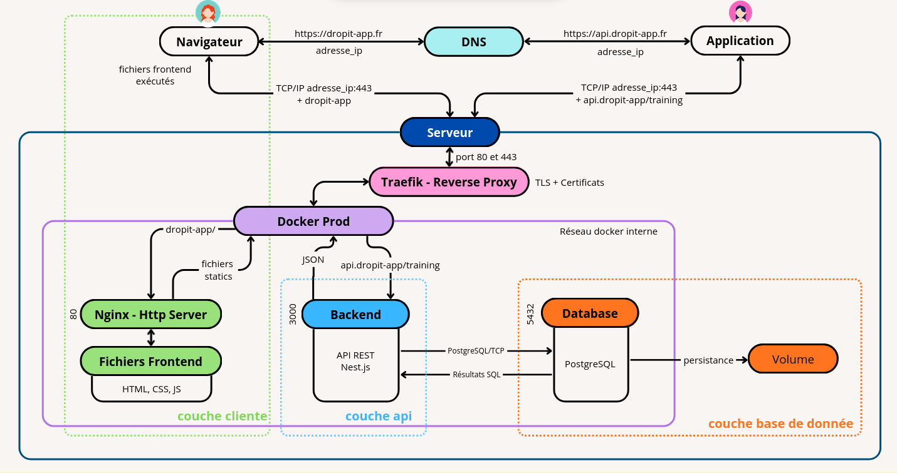

## Infrastructure VPS

### Configuration Infomaniak

J'ai choisi Infomaniak pour leur engagement écologique et infrastructure européenne, garantissant le respect du RGPD. La configuration comprend un serveur Debian Bookworm avec 4 vCPU, 8 GB RAM, et 160 GB SSD, dimensionné pour les besoins initiaux.

Le domaine `dropit-app.fr` est géré chez le même fournisseur, simplifiant la configuration DNS et centralisant la gestion des services.

### Sécurisation

La sécurisation suit les bonnes pratiques DevSecOps : utilisateur non-root avec sudo, authentification par clés SSH uniquement, firewall restrictif autorisant les ports nécessaires (22, 80/443 et 3000 pour le panel admin de Dokploy).

### Sécurisation des secrets

La gestion des credentials critiques suit une approche centralisée via 1Password Business, permettant partage sécurisé et rotation des clés avec traçabilité des accès. Cette solution garantit que les secrets de production (tokens API, mots de passe base de données, clés SSL) ne sont jamais stockés en dur dans le code.

Les variables d'environnement sensibles sont injectées au runtime via Dokploy, évitant l'exposition des secrets dans les images Docker.

## Installation Dokploy

### Architecture Docker Swarm

Dokploy est une plateforme open-source qui transforme un VPS en environnement de déploiement moderne, similaire à Vercel ou Netlify mais pouvant être hébergé sur mon propre serveur. L'installation de Dokploy configure automatiquement Docker Swarm comme orchestrateur de conteneurs et déploie Traefik comme reverse proxy, créant un environnement complet et fonctionnel en une seule commande.

Concrètement, Dokploy fonctionne comme une image Docker d'administration qui s'exécute sur le port 3000 du serveur. Cette interface web permet de gérer les déploiements, déclencher des builds, configurer les domaines et surveiller les services. Chaque action effectuée via l'interface génère automatiquement les configurations appropriées dans Traefik pour le routage des requêtes et dans Docker Swarm pour l'orchestration des conteneurs.

### Services séparés

J'ai opté pour des services Dokploy indépendants plutôt qu'un stack unique, offrant une meilleure granularité :

- **PostgreSQL** : Service natif Dokploy optimisé, évitant les rate limits Docker Hub
- **API Backend** : Service Docker avec Dockerfile multi-stage optimisé
- **Frontend** : Site statique avec build Vite et Nginx automatique
- **Reverse Proxy** : Traefik intégré avec SSL automatique Let's Encrypt

Cette architecture permet de gérer chaque composant indépendamment, facilitant debugging, monitoring, et scalabilité. L'absence de dépendances simplifie déploiements et rollbacks.

### Optimisations Dockerfile

Le Dockerfile multi-stage intègre plusieurs optimisations pour la production :

**Build multi-stage** : Le premier stage contient tous les outils de compilation TypeScript et devDependencies (~800MB), le stage final ne conserve que le runtime et dépendances de production (~200MB). Cette séparation réduit drastiquement la taille de l'image finale, améliorant les performances de déploiement.

**Cache BuildKit pour pnpm** : L'utilisation de cache mounts accélère les rebuilds de 2-3 minutes à 30 secondes en réutilisant le store pnpm entre builds. Cette optimisation s'avère cruciale pour les itérations de développement et CI/CD.

**Sécurité via utilisateur non-root** : L'exécution sous un utilisateur `nestjs` dédié (UID 1001) respecte le principe du moindre privilège et réduit la surface d'attaque en cas de compromission du container.

**Gestion des signaux avec dumb-init** : L'intégration de dumb-init garantit la propagation correcte des signaux SIGTERM/SIGINT, permettant un arrêt gracieux des containers lors des redémarrages Dokploy.

**Health checks intégrés** : Un health check HTTP sur `/api/health` permet à Docker et Dokploy de détecter automatiquement les défaillances et déclencher des redémarrages, améliorant la résilience.

## Pipeline CI/CD

### Stratégie de branches

Ma stratégie Git repose sur un workflow GitFlow à deux branches : `develop` pour l'intégration continue des fonctionnalités et `main` pour la production.

Branche `develop` - Intégration continue :
Chaque pull request déclenche automatiquement un workflow CI complet : linting avec Biome, build du monorepo, vérification et application des migrations MikroORM sur une base PostgreSQL de
test, puis exécution des tests unitaires et d'intégration. Cette validation systématique garantit que `develop` reste toujours stable et déployable.

Branche `main` - Livraison continue :
Le merge manuel de `develop` vers `main` active un webhook GitHub qui notifie Dokploy. La plateforme orchestre alors le déploiement complet : build des images Docker, déploiement avec rolling
updates Docker Swarm pour un zero-downtime, et conservation automatique des versions précédentes permettant un rollback manuel via l'interface si nécessaire. Les health checks HTTP
post-déploiement garantissent le bon fonctionnement avant de router le trafic utilisateur.

Cette approche automatise les vérifications et le déploiement tout en maintenant un contrôle explicite sur le passage en production.

## Monitoring et observabilité

### Logging centralisé

Dokploy agrège automatiquement les logs de tous les services dans son interface, facilitant debugging et surveillance. Cette solution basique capturant les sorties stdout/stderr permet un premier niveau de débogage mais reste limitée : absence de structuration des logs, recherche difficile, pas de corrélation entre les événements.

L'implémentation d'une solution de logging structuré via Pino dans NestJS améliorerait la qualité des traces avec des logs JSON performants et des niveaux appropriés. Cette approche nécessiterait l'ajout d'une stack ELK ou similaire pour l'agrégation et la visualisation.

Pour l'évolution future, j'envisage l'intégration de SignOz (alternative open-source complète avec support OpenTelemetry) ou Grafana pour un monitoring avancé avec métriques customisées et alerting automatisé.

### Surveillance performances

Le monitoring s'appuie sur les métriques système Dokploy (CPU, mémoire, disque) et health checks applicatifs. Cette approche permet de détecter rapidement les problèmes et d'ajuster les ressources.

L'implémentation d'alertes email est prévue pour les événements critiques, garantissant une réaction rapide même hors heures de travail.

## Sauvegardes et continuité

### Stratégie backup

Les sauvegardes PostgreSQL s'exécutent quotidiennement via un container dédié exportant vers un bucket S3 chiffré. Cette stratégie 3-2-1 (3 copies, 2 supports différents, 1 site distant) assure la résilience des données critiques.

Les backups incluent configurations Dokploy et images Docker, permettant une restauration complète. Les procédures sont documentées et testées régulièrement.

### Plan de continuité

En cas d'incident majeur, le plan prévoit la reconstruction complète sur un nouveau VPS en moins de 4 heures, incluant restauration des données et redirection DNS. Les objectifs de continuité sont un RTO (Recovery Time Objective) de 4 heures maximum et un RPO (Recovery Point Objective) de 1 heure maximum, adaptés aux contraintes opérationnelles d'un club sportif.

L'anonymisation des données sensibles respecte les obligations RGPD en situation de crise. La procédure complète est documentée dans le code source de l'application.

### Configuration DNS

La configuration DNS pour `dropit-app.fr` structure l'infrastructure :

**Enregistrements configurés** :
- `dropit-app.fr` (A) → Frontend statique Nginx
- `api.dropit-app.fr` (A) → API NestJS containerisée
- `dokploy.dropit-app.fr` (A) → Interface d'administration

Cette segmentation facilite la gestion des certificats SSL automatiques et prépare l'évolution architecturale. Le TTL à 300 secondes offre un compromis entre performances et flexibilité.

### Défis techniques rencontrés

**Rate limits Docker Hub** : Les builds fréquents ont atteint la limite de 100 pulls anonymes/6h. Un compte Docker Hub gratuit (200 pulls/6h) et l'authentification ont résolu cette contrainte.

**Firewall Infomaniak** : Le port 3000 du panel d'administration Dokploy était inaccessible depuis Internet. La configuration via le panel Infomaniak (VPS → Firewall → TCP 3000) a corrigé le problème, soulignant l'importance de vérifier les firewalls à tous les niveaux.

## Architecture de production déployée

Cette architecture VPS avec services containerisés (API NestJS, Frontend Nginx, PostgreSQL, Dokploy) garantit la maintenabilité et la simplicité de gestion tout en conservant les performances et la sécurité nécessaires pour l'application DropIt.

## Perspectives d'évolution

### Scaling horizontal

L'architecture Docker Swarm facilite l'évolution vers un clustering multi-nodes si la charge augmente. Cette transition s'effectuerait en ajoutant des workers au swarm existant, permettant la répartition automatique des services.

Pour une croissance significative, la migration vers Kubernetes offrirait des capacités d'orchestration avancées, tout en conservant la compatibilité avec les containers existants.

### Optimisations futures

L'implémentation de CDN pour les assets statiques, Redis Cluster pour la haute disponibilité, et un environnement de staging complet constituent les prochaines étapes d'amélioration.

Ces évolutions s'appuieraient sur l'expérience acquise, garantissant une progression maîtrisée vers une infrastructure de niveau entreprise.

Cette infrastructure de production opérationnelle me permet maintenant de me concentrer sur les aspects organisationnels et collaboratifs du projet. La section suivante détaille comment j'ai structuré le développement pour faciliter la contribution et la maintenance à long terme. 