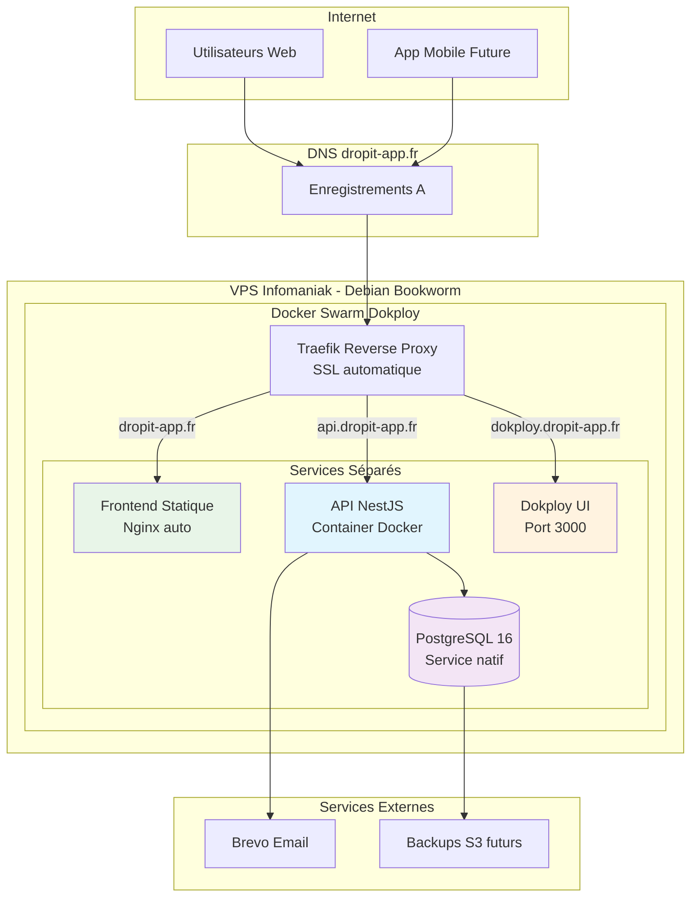

## Configuration de l'infrastructure VPS

### Provisionnement chez Infomaniak

J'ai choisi Infomaniak pour l'hébergement du VPS en raison de leur engagement écologique et de leur infrastructure européenne, garantissant le respect du RGPD pour les données des athlètes. La configuration comprend un serveur Debian Bookworm 64 bits avec 4 vCPU, 8 GB RAM, et 160 GB SSD, dimensionnement adapté aux besoins initiaux de l'application.

Le domaine `dropit-app.fr` est également géré chez Infomaniak, simplifiant la configuration DNS et centralisant la gestion des services. Cette approche intégrée évite les complications de synchronisation entre fournisseurs différents tout en bénéficiant d'un support technique unifié.

### Sécurisation du serveur

La sécurisation suit les bonnes pratiques DevSecOps : création d'un utilisateur non-root avec privilèges sudo, désactivation de l'authentification par mot de passe au profit des clés SSH, et configuration d'un firewall restrictif autorisant uniquement les ports nécessaires (22 pour SSH, 80/443 pour HTTP/HTTPS, et les ports spécifiques à Dokploy).

Les credentials d'accès sont centralisés dans 1Password Business, permettant un partage sécurisé des accès avec l'équipe et une rotation régulière des clés. Cette approche garantit la traçabilité des accès et facilite la gestion des permissions.

## Installation et configuration de Dokploy

### Architecture Docker Swarm

Dokploy s'installe via un script automatisé qui configure Docker Swarm en mode single-node, créant un environnement d'orchestration simplifié mais évolutif. Cette architecture me permet de gérer facilement les services de l'application (API NestJS, base PostgreSQL, Redis pour les sessions) comme des stacks Docker indépendantes.

L'interface web de Dokploy centralise la gestion des déploiements, des logs, et du monitoring, transformant la complexité de Docker Swarm en une expérience utilisateur similaire aux PaaS commerciaux. Cette approche démocratise l'accès aux technologies d'orchestration sans sacrifier la flexibilité.

### Stratégie de déploiement par services séparés

J'ai opté pour une approche de services Dokploy indépendants plutôt qu'un stack Docker unique, offrant une meilleure granularité de gestion :

- **PostgreSQL** : Service natif Dokploy optimisé et stable, évitant les rate limits Docker Hub
- **API Backend** : Service Docker personnalisé avec Dockerfile multi-stage optimisé
- **Frontend** : Site statique avec build Vite et Nginx automatique
- **Reverse Proxy** : Traefik intégré avec SSL automatique Let's Encrypt

Cette architecture me permet de gérer chaque composant indépendamment via l'interface Dokploy, facilitant le debugging, le monitoring, et la scalabilité future. L'absence de dépendances entre services simplifie également les déploiements et les rollbacks.

### Optimisations du Dockerfile API

Le Dockerfile multi-stage développé pour l'API intègre plusieurs optimisations critiques pour la production :

**Build multi-stage pour la réduction de taille** : Le premier stage contient tous les outils de build TypeScript et devDependencies (~800MB), tandis que le stage final ne conserve que le runtime et les dépendances de production (~200MB), réduisant significativement l'empreinte mémoire.

**Cache BuildKit pour pnpm** : L'utilisation de cache mounts accélère les rebuilds de 2-3 minutes à 30 secondes en réutilisant le store pnpm entre builds. Cette optimisation s'avère cruciale pour les itérations de développement et les déploiements CI/CD.

**Sécurité via utilisateur non-root** : L'exécution sous un utilisateur `nestjs` dédié (UID 1001) respecte le principe du moindre privilège et réduit la surface d'attaque en cas de compromission du container.

**Gestion des signaux avec dumb-init** : L'intégration de dumb-init garantit la propagation correcte des signaux SIGTERM/SIGINT, permettant un arrêt gracieux des containers lors des redémarrages Dokploy.

**Health checks intégrés** : Un health check HTTP sur `/api/health` permet à Docker et Dokploy de détecter automatiquement les défaillances et déclencher des redémarrages, améliorant la résilience de l'application.

## Pipeline CI/CD avec GitHub Actions

### Stratégie de branches

Ma stratégie Git s'articule autour de deux branches principales : `develop` pour l'intégration continue des fonctionnalités, et `main` pour les releases en production. Cette approche GitFlow simplifiée garantit que seul du code validé atteint l'environnement de production.

Le workflow CI/CD s'active automatiquement sur les push vers `main` : exécution de la suite de tests complète, build de l'image Docker, et déploiement sur Dokploy via webhook sécurisé. Cette automatisation élimine les erreurs humaines et assure la reproductibilité des déploiements.

### Intégration avec Dokploy

Le pipeline GitHub Actions utilise les webhooks Dokploy pour déclencher automatiquement les déploiements. Cette intégration permet un déploiement zero-downtime grâce au système de rolling updates de Docker Swarm, maintenant la disponibilité de l'application pendant les mises à jour.

La configuration inclut des étapes de vérification post-déploiement via des health checks HTTP, garantissant que la nouvelle version fonctionne correctement avant de router le trafic utilisateur.

## Stratégie de monitoring et observabilité

### Logging centralisé

Dokploy agrège automatiquement les logs de tous les services dans son interface, facilitant le debugging et la surveillance des performances. Cette centralisation me permet de corréler rapidement les événements entre les différents composants de l'application.

Pour l'évolution future, j'envisage l'intégration de SigNoz ou Grafana pour un monitoring plus avancé avec métriques customisées et alerting automatisé. Cette progression naturelle s'appuierait sur l'infrastructure Docker existante.

### Surveillance des performances

Le monitoring actuel s'appuie sur les métriques système de Dokploy (CPU, mémoire, disque) et les health checks applicatifs. Cette approche me permet de détecter rapidement les problèmes de performance et d'ajuster les ressources selon les besoins.

L'implémentation d'alertes email est prévue pour les événements critiques (service indisponible, utilisation excessive des ressources), garantissant une réaction rapide aux incidents même hors heures de travail.

## Gestion des sauvegardes et continuité

### Stratégie de backup automatisée

Les sauvegardes PostgreSQL s'exécutent quotidiennement via un container dédié qui exporte les données vers un bucket S3 chiffré. Cette stratégie 3-2-1 (3 copies, 2 supports différents, 1 site distant) assure la résilience des données critiques des clubs.

Les backups incluent également les configurations Dokploy et les images Docker, permettant une restauration complète de l'infrastructure en cas de défaillance majeure. Les procédures de restauration sont documentées et testées régulièrement.

### Plan de continuité d'activité

En cas d'incident majeur, le plan de reprise prévoit la reconstruction complète de l'infrastructure sur un nouveau VPS en moins de 4 heures, incluant la restauration des données et la redirection DNS. Cette approche garantit une continuité de service acceptable pour les clubs utilisateurs.

L'anonymisation des données sensibles est intégrée aux procédures d'urgence, respectant les obligations RGPD même en situation de crise.

### Configuration DNS et domaines

La configuration DNS pour `dropit-app.fr` illustre l'approche méthodique adoptée pour structurer l'infrastructure :

**Enregistrements DNS configurés** :
- `dropit-app.fr` (A) → Frontend statique Nginx
- `api.dropit-app.fr` (A) → API NestJS containerisée
- `dokploy.dropit-app.fr` (A) → Interface d'administration Dokploy

Cette segmentation par sous-domaines facilite la gestion des certificats SSL automatiques via Let's Encrypt et prépare l'évolution vers une architecture distribuée. Le TTL configuré à 300 secondes offre un bon compromis entre performances et flexibilité pour les modifications futures.

### Défis techniques rencontrés et solutions

**Rate limits Docker Hub** : Les builds fréquents ont rapidement atteint la limite de 100 pulls anonymes par 6 heures. La création d'un compte Docker Hub gratuit (200 pulls/6h) et l'authentification via `docker login` ont résolu cette contrainte, enseignement précieux sur les limites des services gratuits en production.

**Firewall Infomaniak** : Le port 3000 de Dokploy était initialement inaccessible depuis Internet. La configuration via le panel Infomaniak (VPS → Firewall → TCP 3000) a corrigé le problème, soulignant l'importance de vérifier les firewalls à tous les niveaux (OS, hyperviseur, réseau).

## Architecture de production déployée

Cette architecture services séparés garantit la maintenabilité et la simplicité de gestion tout en conservant les performances et la sécurité nécessaires pour l'application DropIt.

## Perspectives d'évolution

### Scaling horizontal

L'architecture Docker Swarm actuelle facilite l'évolution vers un clustering multi-nodes si la charge augmente. Cette transition s'effectuerait en ajoutant des workers au swarm existant, permettant la répartition automatique des services sur plusieurs serveurs.

Pour une croissance significative, la migration vers Kubernetes offrirait des capacités d'orchestration avancées, tout en conservant la compatibilité avec les containers existants. Cette évolution représenterait une progression naturelle de mes compétences DevOps.

### Optimisations futures

L'implémentation de CDN pour les assets statiques, la mise en place de Redis Cluster pour la haute disponibilité du cache, et l'ajout d'un environnement de staging complet constituent les prochaines étapes d'amélioration de l'infrastructure.

Ces évolutions s'appuieraient sur l'expérience acquise avec la stack actuelle, garantissant une progression maîtrisée vers une infrastructure de niveau entreprise. 