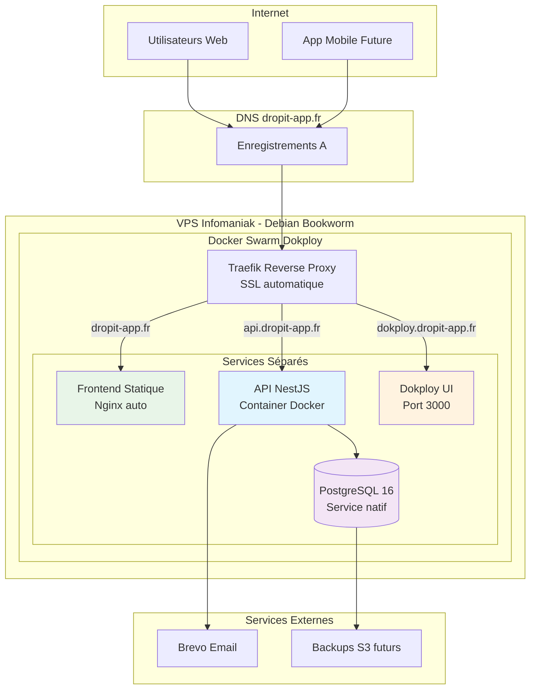

## Infrastructure VPS

### Configuration Infomaniak

J'ai choisi Infomaniak pour leur engagement écologique et infrastructure européenne, garantissant le respect du RGPD. La configuration comprend un serveur Debian Bookworm avec 4 vCPU, 8 GB RAM, et 160 GB SSD, dimensionné pour les besoins initiaux.

Le domaine `dropit-app.fr` est géré chez le même fournisseur, simplifiant la configuration DNS et centralisant la gestion des services.

### Sécurisation

La sécurisation suit les bonnes pratiques DevSecOps : utilisateur non-root avec sudo, authentification par clés SSH uniquement, firewall restrictif autorisant les ports nécessaires (22, 80/443, ports Dokploy).

Les credentials sont centralisés dans 1Password Business, permettant partage sécurisé et rotation des clés avec traçabilité des accès.

## Installation Dokploy

### Architecture Docker Swarm

Dokploy s'installe via un script automatisé configurant Docker Swarm en mode single-node, créant un environnement d'orchestration simplifié mais évolutif. Cette architecture me permet de gérer les services (API NestJS, PostgreSQL, Redis) comme des stacks indépendantes.

L'interface web centralise gestion des déploiements, logs, et monitoring, transformant la complexité de Docker Swarm en expérience similaire aux PaaS commerciaux.

### Services séparés

J'ai opté pour des services Dokploy indépendants plutôt qu'un stack unique, offrant une meilleure granularité :

- **PostgreSQL** : Service natif Dokploy optimisé, évitant les rate limits Docker Hub
- **API Backend** : Service Docker avec Dockerfile multi-stage optimisé
- **Frontend** : Site statique avec build Vite et Nginx automatique
- **Reverse Proxy** : Traefik intégré avec SSL automatique Let's Encrypt

Cette architecture permet de gérer chaque composant indépendamment, facilitant debugging, monitoring, et scalabilité. L'absence de dépendances simplifie déploiements et rollbacks.

### Optimisations Dockerfile

Le Dockerfile multi-stage intègre plusieurs optimisations critiques pour la production :

**Build multi-stage** : Le premier stage contient tous les outils de compilation TypeScript et devDependencies (~800MB), le stage final ne conserve que le runtime et dépendances de production (~200MB). Cette séparation réduit drastiquement la taille de l'image finale, améliorant les performances de déploiement.

**Cache BuildKit pour pnpm** : L'utilisation de cache mounts accélère les rebuilds de 2-3 minutes à 30 secondes en réutilisant le store pnpm entre builds. Cette optimisation s'avère cruciale pour les itérations de développement et CI/CD.

**Sécurité via utilisateur non-root** : L'exécution sous un utilisateur `nestjs` dédié (UID 1001) respecte le principe du moindre privilège et réduit la surface d'attaque en cas de compromission du container.

**Gestion des signaux avec dumb-init** : L'intégration de dumb-init garantit la propagation correcte des signaux SIGTERM/SIGINT, permettant un arrêt gracieux des containers lors des redémarrages Dokploy.

**Health checks intégrés** : Un health check HTTP sur `/api/health` permet à Docker et Dokploy de détecter automatiquement les défaillances et déclencher des redémarrages, améliorant la résilience.

## Pipeline CI/CD

### Stratégie de branches

Ma stratégie Git s'articule autour de deux branches : `develop` pour l'intégration des fonctionnalités, `main` pour les releases production. Cette approche GitFlow simplifiée garantit que seul du code validé atteint l'environnement de production.

Le workflow CI/CD s'active automatiquement sur les push vers `main` : tests complets, build de l'image Docker, déploiement sur Dokploy via webhook sécurisé. Cette automatisation élimine les erreurs humaines et assure la reproductibilité.

### Intégration Dokploy

Le pipeline utilise les webhooks Dokploy pour déclencher automatiquement les déploiements. Cette intégration permet un déploiement zero-downtime grâce aux rolling updates de Docker Swarm, maintenant la disponibilité pendant les mises à jour.

La configuration inclut des vérifications post-déploiement via health checks HTTP, garantissant le fonctionnement correct avant de router le trafic utilisateur.

## Monitoring et observabilité

### Logging centralisé

Dokploy agrège automatiquement les logs de tous les services dans son interface, facilitant debugging et surveillance. Cette centralisation permet de corréler rapidement les événements entre composants.

Pour l'évolution future, j'envisage l'intégration de SigNoz ou Grafana pour un monitoring avancé avec métriques customisées et alerting automatisé.

### Surveillance performances

Le monitoring s'appuie sur les métriques système Dokploy (CPU, mémoire, disque) et health checks applicatifs. Cette approche permet de détecter rapidement les problèmes et d'ajuster les ressources.

L'implémentation d'alertes email est prévue pour les événements critiques, garantissant une réaction rapide même hors heures de travail.

## Sauvegardes et continuité

### Stratégie backup

Les sauvegardes PostgreSQL s'exécutent quotidiennement via un container dédié exportant vers un bucket S3 chiffré. Cette stratégie 3-2-1 (3 copies, 2 supports différents, 1 site distant) assure la résilience des données critiques.

Les backups incluent configurations Dokploy et images Docker, permettant une restauration complète. Les procédures sont documentées et testées régulièrement.

### Plan de continuité

En cas d'incident majeur, le plan prévoit la reconstruction complète sur un nouveau VPS en moins de 4 heures, incluant restauration des données et redirection DNS. L'anonymisation des données sensibles respecte les obligations RGPD en situation de crise.

### Configuration DNS

La configuration DNS pour `dropit-app.fr` structure l'infrastructure :

**Enregistrements configurés** :
- `dropit-app.fr` (A) → Frontend statique Nginx
- `api.dropit-app.fr` (A) → API NestJS containerisée
- `dokploy.dropit-app.fr` (A) → Interface d'administration

Cette segmentation facilite la gestion des certificats SSL automatiques et prépare l'évolution architecturale. Le TTL à 300 secondes offre un compromis entre performances et flexibilité.

### Défis techniques rencontrés

**Rate limits Docker Hub** : Les builds fréquents ont atteint la limite de 100 pulls anonymes/6h. Un compte Docker Hub gratuit (200 pulls/6h) et l'authentification ont résolu cette contrainte.

**Firewall Infomaniak** : Le port 3000 du panel d'administration Dokploy était inaccessible depuis Internet. La configuration via le panel Infomaniak (VPS → Firewall → TCP 3000) a corrigé le problème, soulignant l'importance de vérifier les firewalls à tous les niveaux.

## Architecture de production déployée

Cette architecture services séparés garantit la maintenabilité et la simplicité de gestion tout en conservant les performances et la sécurité nécessaires pour l'application DropIt.

## Perspectives d'évolution

### Scaling horizontal

L'architecture Docker Swarm facilite l'évolution vers un clustering multi-nodes si la charge augmente. Cette transition s'effectuerait en ajoutant des workers au swarm existant, permettant la répartition automatique des services.

Pour une croissance significative, la migration vers Kubernetes offrirait des capacités d'orchestration avancées, tout en conservant la compatibilité avec les containers existants.

### Optimisations futures

L'implémentation de CDN pour les assets statiques, Redis Cluster pour la haute disponibilité, et un environnement de staging complet constituent les prochaines étapes d'amélioration.

Ces évolutions s'appuieraient sur l'expérience acquise, garantissant une progression maîtrisée vers une infrastructure de niveau entreprise.

Cette infrastructure de production opérationnelle me permet maintenant de me concentrer sur les aspects organisationnels et collaboratifs du projet. La section suivante détaille comment j'ai structuré le développement pour faciliter la contribution et la maintenance à long terme. 