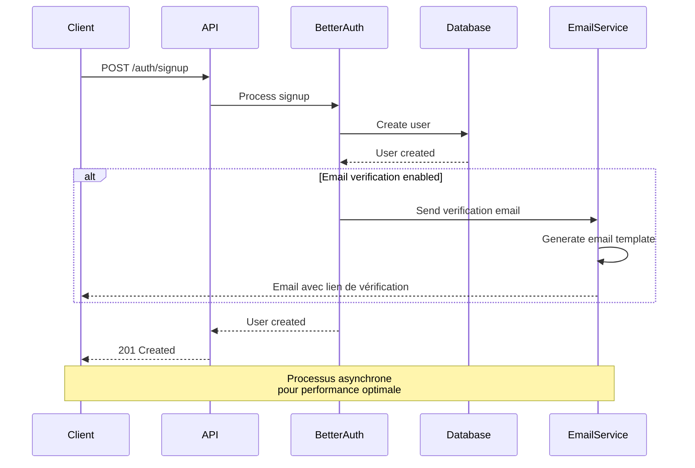
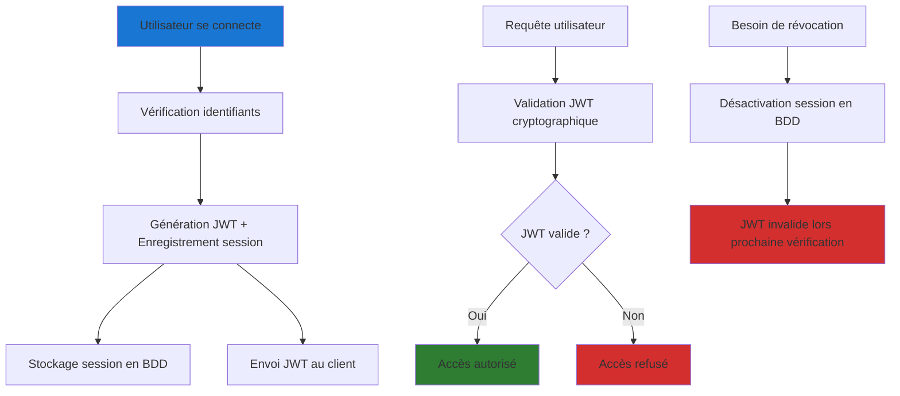
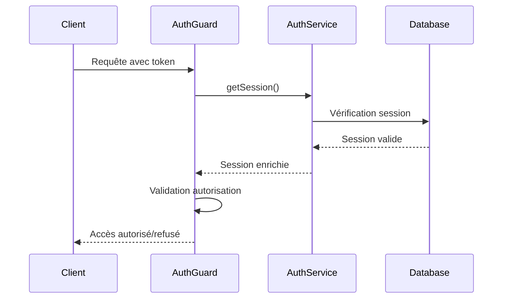

TODO: Partie à expliquer
1. Introduction sur comment fonctionne better auth (jwt, session, schema de db, protection des routes, exposition d'un middleware d'api pour communiquer avec les entités généré etc)
2. Rapide introduction de comment j'ai ranger mes features d'auth dans mon api
3. Schema better auth explications des entités généré (à quoi ça sert etc) vulgarisation
4. Endpoints exposés par better auth
5. Configuration du middleware
6. Restriction des ressources (protection)
7. Implémentation concrete sur un exemple d'une route d'un controlleur (prendre le meme exemple que dans l'architecture)
8. Gestion des sessions et sécurité: explications du concept et redirection dans les annexes pour le détails
9. Stratégie de sécu JWT (rappel de la techno vite fait, header, payload, signature) et distinction du stockage coté client entre interface web et app mobile (pareil si besoin de plus on envoi dans les annexes)
10. Implémentation de la lib coté clients pour profiter des rescrtions coté client aussi (page, composants)
11. Conclusion et intro sur ce qui va suivre : les permissions (roles) avec le plugin Organization de better auth

## Introduction

Comme évoqué Better-Auth permet une approche hybride combinant JWT et sessions révocables.
Cette implémentation s'articule autour de plusieurs composants interdépendants: la configuration du service d'authentification, la gestion des entités de données, la protection des routes via des guards, et l'exposition d'une API cohérente pour les applications clientes.

## Architecture modulaire

J'ai choisi d'isoler toute ce qui concerne l'authentification au sein d'un domaine spécifique afin d'en faciliter la maintenant et de garder toute ces fonctionnalité découplé le plus possible du reste de mon application. même si je n'en ai pas le besoin c'est une approche qui m'a semblé plus naturelle pour garder la possibilité un jour de migrer plus facilement de systeme d'authentification (hum non ça risque d'etre vraiement le bordel quand meme, vu que j'aurai des données utilisateurs donc difficile comme argument) structuré l'implémentation selon une architecture modulaire qui sépare clairement les responsabilités et facilite la maintenance.

```
modules/auth/
├── auth.decorator.ts  # Décorateurs pour l'authentification
├── auth.entity.ts     # Entités complémentaires 
├── auth.guard.ts      # Guard de protection des routes
├── auth.module.ts     # Configuration du module
├── auth.service.ts    # Service principal Better-Auth
└── README.md          # Documentation technique
```

## Schema Better Auth

Better auth propose des packages pour l'api et les différents clients web et mobile. 
Pour la partie backend, y a un schema a respecter, donc les entités etc a présenter qu'il a fallu intégrer dans mon systeme déjà existant. Hormis la table User, les autres tables sont autonomes et ne représente pas de difficulté particulière dans l'implémentation. 

Faire la liste des entités généré: User, Session, Account, Verification

TODO: Schema MCD => redirection dans les annexes (j'ai les png qu'il faut que j'integre dans le projet et qui seront visible dans les annexes)

TODO: Schema MLD => redirection dans les annexes  (j'ai les png qu'il faut que j'integre dans le projet et qui seront visible dans les annexes)

TODO: Schema MPD => redirection dans les annexes (j'ai les png qu'il faut que j'integre dans le projet et qui seront visible dans les annexes)

### Entité Session : Gestion des sessions actives

```typescript
@Entity('auth_session')
export class AuthSession {
  @PrimaryKey()
  id!: string;

  @Property()
  userId!: string;

  @Property({ type: 'text', nullable: true })
  impersonatedBy?: string;

  @Property()
  token!: string;

  @Property()
  expiresAt!: Date;

  @Property()
  ipAddress?: string;

  @Property()
  userAgent?: string;

  @Property()
  createdAt = new Date();

  @Property({ onUpdate: () => new Date() })
  updatedAt = new Date();
}
```

Cette entité me permet de gérer les sessions actives avec un contrôle granulaire sur les métadonnées de connexion. L'intégration des informations d'IP et User-Agent facilite le monitoring et la détection d'activités suspectes.

### Entité Verification : Tokens temporaires

```typescript
@Entity('auth_verification')
export class AuthVerification {
  @PrimaryKey()
  id!: string;

  @Property()
  identifier!: string;

  @Property()
  value!: string;

  @Property()
  expiresAt!: Date;

  @Property()
  createdAt = new Date();

  @Property({ onUpdate: () => new Date() })
  updatedAt = new Date();
}
```

Cette entité gère les tokens de vérification temporaires (email, réinitialisation de mot de passe), avec gestion automatique de l'expiration pour la sécurité.

Bien évidemment on utilera plutot un script pour les généré directement en code first coté api. Il est aussi possible de les créer à la main entité par entité dans nest.js en faisant bien attention de respecter scrupuleursement le schema de bdd requis par Better auth. 

## Endpoints exposées par Better-Auth

La génération du schema et des tables s'accompagne d'endpoints 
Better-Auth expose automatiquement plusieurs endpoints sur le préfixe `/auth`, réduisant significativement le code à maintenir.

| Route | Méthode | Description | Usage dans DropIt |
|-------|---------|-------------|-------------------|
| `/auth/signup` | POST | Inscription utilisateur | Création comptes coachs/athlètes |
| `/auth/login` | POST | Connexion | Accès quotidien à l'application |
| `/auth/logout` | POST | Déconnexion | Sécurisation des sessions |
| `/auth/me` | GET | Profil utilisateur | Données session courante |
| `/auth/refresh` | POST | Renouvellement token | Maintien des sessions longues |
| `/auth/verify` | GET | Vérification email | Sécurisation des comptes |
| `/auth/reset-password` | POST | Réinitialisation | Récupération comptes oubliés |

Cette standardisation permet d'avoir toute les routes clefs en main pour implémenter rapidement toute les bonnes pratique d'auth et securisé. 
Lorsqu'on défini la configuration de better auth, on peut ajouter le pluggin openApi() qui permet aux développeurs d'acceder à la documentation de chacune de ces routes, ce que j'ai fait. 

## Configuration du middleware

En gros ici je veux dire que chaque requete qui entre sur mon api si elle commence par '/auth' est rediriger vers les routes better auth car on delegue toutes ces fonctionnalité à la librairie 

Faire un petit diagramme de sequence avec couche client, api, better auth middleware, database

et un extrait de code de `main.ts` pour illustrer cette config au sein du point d'entrée de mon app 

```ts
import { NestFactory } from '@nestjs/core';
import { SwaggerModule } from '@nestjs/swagger';
import * as dotenv from 'dotenv';
import * as express from 'express';
import { AppModule } from './app.module';
import { config } from './config/env.config';
import { openApiDocument } from './config/swagger.config';

dotenv.config();

const PREFIX = '/api';
const PORT = process.env.API_PORT || 3000;

async function bootstrap() {
  const app = await NestFactory.create(AppModule, {
    bodyParser: false,
  });

  // Conditional middleware for better auth
  app.use(
    (
      req: express.Request,
      res: express.Response,
      next: express.NextFunction
    ) => {
      // If is routes of better auth, next
      if (req.originalUrl.startsWith(`${PREFIX}/auth`)) {
        return next();
      }
      // Else, apply the express json middleware
      express.json()(req, res, next);
    }
  );

  app.enableCors({
    origin: config.betterAuth.trustedOrigins,
    credentials: true,
  });

  app.setGlobalPrefix(PREFIX);

  // Configuration Swagger
  SwaggerModule.setup('api', app, openApiDocument);

  await app.listen(PORT, '0.0.0.0');
  console.log(`Application is running on: http://localhost:${PORT}`);
  console.log(`Also accessible on network: http://192.168.1.147:${PORT}`);
}

bootstrap();
```

## Protection des routes et système de guards

### Implémentation du AuthGuard

Le guard d'authentification constitue le point d'entrée de la sécurisation des routes dans DropIt. Ecrire une petite introduction sur ce que sont les guard, et dire qu'on utilisera ça avec des decorateur ? 

```typescript
@Injectable()
export class AuthGuard implements CanActivate {
  constructor(private reflector: Reflector, private authService: AuthService) {}

  async canActivate(context: ExecutionContext): Promise<boolean> {
    const request = context.switchToHttp().getRequest();
    
    // Vérification des métadonnées de route (@Public, @Optional)
    const isPublic = this.reflector.getAllAndOverride<boolean>('isPublic', [
      context.getHandler(),
      context.getClass(),
    ]);

    const isOptional = this.reflector.getAllAndOverride<boolean>('isOptional', [
      context.getHandler(),
      context.getClass(),
    ]);

    try {
      // Récupération de la session via Better-Auth
      const session = await this.authService.auth.api.getSession({
        headers: request.headers,
      });

      if (session) {
        // Enrichissement de la requête avec les données utilisateur
        request.user = session.user;
        request.session = session.session;
        return true;
      }

      // Gestion des routes publiques et optionnelles
      return isPublic || isOptional || false;
    } catch (error) {
      return isPublic || isOptional || false;
    }
  }
}
```

### Décorateurs 

expliquer rapidement ce que sont les décorateurs 

```typescript
// auth.decorator.ts - Décorateurs personnalisés

// Marquer une route comme publique
export const Public = () => SetMetadata('isPublic', true);

// Authentification optionnelle
export const Optional = () => SetMetadata('isOptional', true);

// Injection de la session dans les paramètres
export const Session = createParamDecorator(
  (data: unknown, ctx: ExecutionContext) => {
    const request = ctx.switchToHttp().getRequest();
    return data ? request.session?.[data] : request.session;
  },
);

// Hooks pour logique personnalisée
export const BeforeHook = (hookFn: Function) => SetMetadata('beforeHook', hookFn);
export const AfterHook = (hookFn: Function) => SetMetadata('afterHook', hookFn);
```

### Intégration avec le système d'email

TODO: En parler vite fait mais mettre le détail et schema dans l'annexe dédié (authentifications)
L'intégration du système d'email avec Better-Auth ... Cette implémentation prépare l'évolution vers des communications plus riches (notifications push, SMS) :



## Patterns d'utilisation dans les contrôleurs

### Protection complète d'un contrôleur

L'application du guard au niveau du contrôleur simplifie la sécurisation de l'ensemble des routes d'un module métier :

```typescript
@Controller('athlete')
@UseGuards(AuthGuard)  // Protection globale du contrôleur
export class AthleteController {
  @Get('profile')
  getProfile(@Session() session) {
    // Accès automatique aux données de session
    return {
      user: session.user,
      lastLogin: session.session.createdAt,
    };
  }
  
  @Get('public-stats')
  @Public()  // Exception pour route publique
  getPublicStats() {
    // Statistiques publiques du club
    return this.athleteService.getPublicStats();
  }
}
```

### Authentification optionnelle pour contenu personnalisé

Certaines fonctionnalités de DropIt bénéficient d'une personnalisation selon l'état d'authentification, sans l'exiger absolument :

```typescript
@Controller('content')
@UseGuards(AuthGuard)
export class ContentController {
  @Get('articles')
  @Optional()  // Authentification optionnelle
  getArticles(@Session() session) {
    if (session) {
      // Contenu personnalisé pour utilisateur authentifié
      return this.contentService.getPersonalizedContent(session.user);
    } else {
      // Contenu public pour visiteur anonyme
      return this.contentService.getPublicContent();
    }
  }
}
```

## Gestion des sessions et sécurité

ICI Il faut simplifier et expliquer le fonctionnement et l'approche session des utilisateur. Eventuellement balancer des détails dans les annexes 'authentifications' avec des liens pour alleger un peu le tout

### Architecture hybride retenue

L'architecture d'authentification que j'ai implémentée avec Better-Auth combine les approches JWT et sessions pour tirer parti des avantages de chacune :



Cette approche me permet de bénéficier des performances des JWT pour la validation courante, tout en conservant la possibilité de révocation grâce au suivi des sessions en base de données. Concrètement, chaque token émis est enregistré dans une table `AuthSession` qui stocke les métadonnées de connexion (device, IP, date de création).

### Cycle de vie des sessions

L'implémentation de Better-Auth me permet de gérer finement le cycle de vie des sessions utilisateur :



## Stratégie de sécurisation des tokens JWT

### Stockage côté client

La sécurisation du stockage des tokens côté client constitue un enjeu majeur que j'ai abordé en analysant les différentes approches possibles. Pour le backoffice web de DropIt, j'ai opté pour les cookies HttpOnly qui offrent une protection optimale contre les attaques XSS, vulnérabilité qui permet de ?... dans un environnement web. 

Les coachs accèdent au backoffice depuis des postes potentiellement partagés, rendant crucial le niveau de sécurité du stockage des tokens. Les cookies HttpOnly, inaccessibles depuis JavaScript, réduisent significativement la surface d'attaque.

Pour l'application mobile développée avec Expo et React Native, j'ai opté pour une approche plus intégrée grâce au plugin Expo de Better-Auth. Cette solution utilise automatiquement `expo-secure-store` pour le stockage sécurisé des sessions, gérant de manière transparente les spécificités iOS (Keychain) et Android (EncryptedSharedPreferences) sans nécessiter d'implémentation manuelle. Le plugin `@better-auth/expo/client` prend en charge la gestion automatique des cookies dans les headers, le deep linking (c'est quoi ?) pour l'authentification sociale, et la synchronisation des sessions entre les différentes parties de l'application mobile.

### Sécurité d'accès et expiration des sessions

Dans le contexte de DropIt, j'ai configuré Better-Auth pour gérer automatiquement l'expiration des sessions afin de maintenir un niveau de sécurité approprié sans créer de friction excessive pour les utilisateurs. Les sessions web ont une durée de vie de 7 jours avec renouvellement automatique lors d'activité, tandis que les sessions mobiles persistent 30 jours pour éviter des reconnexions fréquentes qui nuiraient à l'expérience utilisateur.

Cette approche s'appuie sur mon analyse des habitudes d'usage : les coachs accèdent régulièrement au backoffice web pour programmer les séances, tandis que les athlètes consultent leurs données de manière plus sporadique via l'application mobile.

## Implémentation clients

L'intégration de Better-Auth dans DropIt s'appuie sur une configuration que j'ai adaptée aux besoins spécifiques de l'application, particulièrement pour supporter l'architecture web et mobile des deux clients:

```typescript
// Configuration Better-Auth côté serveur pour DropIt
const authConfig = {
  database: {
    // Utilisation de la base PostgreSQL existante
    provider: "postgresql",
    url: process.env.DATABASE_URL
  },
  
  // Plugin Expo pour le support mobile
  plugins: [expo()],
  
  // Support multi-plateforme
  cookies: {
    enabled: true,
    httpOnly: true,
    secure: process.env.NODE_ENV === 'production',
    sameSite: 'strict'
  },
  
  // Deep linking et origines de confiance pour Expo
  trustedOrigins: [
    "dropit://", // Scheme principal de l'app mobile
    "dropit://*" // Support des deep links avec chemins
  ],
  
  // Personnalisation pour DropIt
  user: {
    additionalFields: {
      role: "string",
      clubId: "string"
    }
  }
};
```

Du côté client mobile avec le framework `Expo`, la configuration s'adapte à l'écosystème React Native :

```typescript
// Configuration client mobile avec Expo
import { createAuthClient } from "better-auth/react";
import { expoClient } from "@better-auth/expo/client";
import * as SecureStore from "expo-secure-store";

export const authClient = createAuthClient({
  baseURL: process.env.EXPO_PUBLIC_API_URL,
  plugins: [
    expoClient({
      scheme: "dropit",
      storagePrefix: "dropit-auth",
      storage: SecureStore,
    })
  ]
});
```

L'intégration du plugin Expo simplifie considérablement la gestion de la sécurité mobile en automatisant le stockage sécurisé, la gestion des cookies et le deep linking, tout en maintenant la cohérence avec le backoffice web.

FAUT Dire que better auth permet la sécurisation a la fois de l'acces api mais aussi de conditionner le rendu des pages et/ou composant coté client le tout harmonisé des deux cotés

## Conclusion

L'implémentation du système d'authentification de DropIt illustre la complexité pratique de la sécurisation d'une application moderne. Cette base prépare maintenant l'étape suivante : la mise en œuvre d'un système de gestion des autorisations granulaire adapté aux rôles spécifiques de l'écosystème haltérophilie.

La section suivante détaillera comment cette fondation d'authentification s'enrichit d'un système RBAC (Role-Based Access Control) permettant de gérer finement les permissions entre coachs, athlètes, et administrateurs, garantissant ainsi que chaque utilisateur accède uniquement aux fonctionnalités et données qui lui sont destinées.

