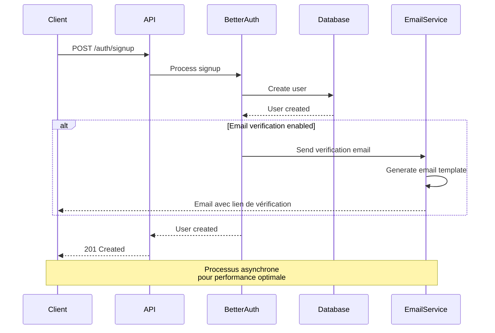
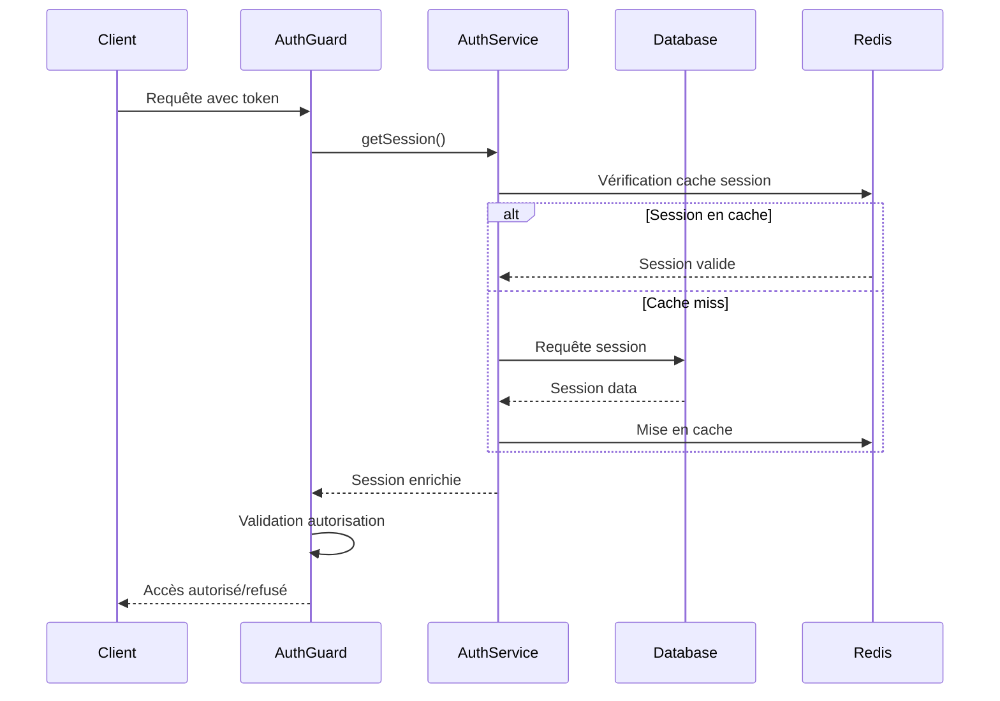

## Introduction

Comme évoqué Better-Auth permet une approche hybride combinant JWT et sessions révocables.
Cette implémentation s'articule autour de plusieurs composants interdépendants: la configuration du service d'authentification, la gestion des entités de données, la protection des routes via des guards, et l'exposition d'une API cohérente pour les applications clientes.

## Vue d'ensemble de l'architecture d'authentification

### Schema Better Auth

Better auth propose des packages pour l'api et les différents clients web et mobile. 
Pour la partie backend, y a un schema a respecter, donc les entités etc a présenter qu'il a fallu intégrer dans mon systeme déjà existant. Hormis la table User, les autres tables sont autonomes et ne représente pas de difficulté particulière dans l'implémentation. 
Pour bien visualiser les tables généré par le package je les ai representer sous forme de méthode merise ci dessous 

TODO: Schema MCD 

TODO: Schema MLD

TODO: Schema MPD

Bien évidemment on utilera plutot un script pour les généré directement en code first coté api. Il est aussi possible de les créer à la main entité par entité dans nest.js en faisant bien attention de respecter scrupuleursement le schema de bdd requis par Better auth. 

### Architecture modulaire adoptée

J'ai structuré l'implémentation selon une architecture modulaire qui sépare clairement les responsabilités et facilite la maintenance.

```
modules/auth/
├── auth.decorator.ts  # Décorateurs pour l'authentification
├── auth.entity.ts     # Entités complémentaires 
├── auth.guard.ts      # Guard de protection des routes
├── auth.module.ts     # Configuration du module
├── auth.service.ts    # Service principal Better-Auth
└── README.md          # Documentation technique
```

## Configuration et service principal

### Implémentation du service Better-Auth

Le cœur du système d'authentification réside dans le service Better-Auth que j'ai configuré pour répondre aux besoins spécifiques de DropIt. Parler aussi du systeme d'email, à quoi il sert? 

```typescript
// Configuration Better-Auth adaptée à DropIt
this._auth = betterAuth({
  secret: config.betterAuth.secret,
  trustedOrigins: config.betterAuth.trustedOrigins,
  
  // Authentification email/password adaptée au contexte club
  emailAndPassword: {
    enabled: true,
    sendResetPassword: async (data) => {
      // Intégration avec le service email pour réinitialisation
      await this.emailService.sendPasswordReset(data);
    },
  },
  
  // Vérification email pour sécuriser les comptes
  emailVerification: {
    sendOnSignUp: true,
    expiresIn: 60 * 60 * 24 * 10, // 10 jours - adapté aux habitudes utilisateur
    sendVerificationEmail: async (data) => {
      await this.emailService.sendVerificationEmail(data);
    },
  },
  
  // Connexion PostgreSQL pour cohérence avec l'architecture
  database: new Pool({
    connectionString: config.database.connectionString,
  }),
  
  // Configuration rate limiting pour protection DDoS
  rateLimit: {
    window: 50,
    max: 100,
  },
  
  // Hooks personnalisés pour logique métier DropIt
  hooks: {
    before: createAuthMiddleware(async (ctx) => {
      // Hook de pré-traitement pour logs et validation
    }),
  },
  
  plugins: [openAPI()], // Documentation automatique des endpoints
});
```

## Gestion des entités et persistance des données

### Modélisation des données d'authentification

L'implémentation de Better-Auth s'articule autour de plusieurs entités clefs en complément de l'entité `User` dont les principales sont les suivantes.

#### Entité AuthSession : Gestion des sessions actives

```typescript
@Entity('auth_session')
export class AuthSession {
  @PrimaryKey()
  id!: string;

  @Property()
  userId!: string;

  @Property({ type: 'text', nullable: true })
  impersonatedBy?: string;

  @Property()
  token!: string;

  @Property()
  expiresAt!: Date;

  @Property()
  ipAddress?: string;

  @Property()
  userAgent?: string;

  @Property()
  createdAt = new Date();

  @Property({ onUpdate: () => new Date() })
  updatedAt = new Date();
}
```

Cette entité me permet de gérer les sessions actives avec un contrôle granulaire sur les métadonnées de connexion. L'intégration des informations d'IP et User-Agent facilite le monitoring et la détection d'activités suspectes.

#### Entité AuthVerification : Tokens temporaires

```typescript
@Entity('auth_verification')
export class AuthVerification {
  @PrimaryKey()
  id!: string;

  @Property()
  identifier!: string;

  @Property()
  value!: string;

  @Property()
  expiresAt!: Date;

  @Property()
  createdAt = new Date();

  @Property({ onUpdate: () => new Date() })
  updatedAt = new Date();
}
```

Cette entité gère les tokens de vérification temporaires (email, réinitialisation de mot de passe), avec gestion automatique de l'expiration pour la sécurité.

## Protection des routes et système de guards

### Implémentation du AuthGuard

Le guard d'authentification constitue le point d'entrée de la sécurisation des routes dans DropIt. Ecrire une petite introduction sur ce que sont les guard, les decorateurs et à quoi ils servent...

```typescript
@Injectable()
export class AuthGuard implements CanActivate {
  constructor(private reflector: Reflector, private authService: AuthService) {}

  async canActivate(context: ExecutionContext): Promise<boolean> {
    const request = context.switchToHttp().getRequest();
    
    // Vérification des métadonnées de route (@Public, @Optional)
    const isPublic = this.reflector.getAllAndOverride<boolean>('isPublic', [
      context.getHandler(),
      context.getClass(),
    ]);

    const isOptional = this.reflector.getAllAndOverride<boolean>('isOptional', [
      context.getHandler(),
      context.getClass(),
    ]);

    try {
      // Récupération de la session via Better-Auth
      const session = await this.authService.auth.api.getSession({
        headers: request.headers,
      });

      if (session) {
        // Enrichissement de la requête avec les données utilisateur
        request.user = session.user;
        request.session = session.session;
        return true;
      }

      // Gestion des routes publiques et optionnelles
      return isPublic || isOptional || false;
    } catch (error) {
      return isPublic || isOptional || false;
    }
  }
}
```

### Décorateurs 

Décorateur pour la flexibilité d'usages :

```typescript
// auth.decorator.ts - Décorateurs personnalisés

// Marquer une route comme publique
export const Public = () => SetMetadata('isPublic', true);

// Authentification optionnelle
export const Optional = () => SetMetadata('isOptional', true);

// Injection de la session dans les paramètres
export const Session = createParamDecorator(
  (data: unknown, ctx: ExecutionContext) => {
    const request = ctx.switchToHttp().getRequest();
    return data ? request.session?.[data] : request.session;
  },
);

// Hooks pour logique personnalisée
export const BeforeHook = (hookFn: Function) => SetMetadata('beforeHook', hookFn);
export const AfterHook = (hookFn: Function) => SetMetadata('afterHook', hookFn);
```

## Endpoints et API d'authentification

### Routes automatiquement exposées par Better-Auth

Better-Auth expose automatiquement plusieurs endpoints sur le préfixe `/auth`, réduisant significativement le code à maintenir.

| Route | Méthode | Description | Usage dans DropIt |
|-------|---------|-------------|-------------------|
| `/auth/signup` | POST | Inscription utilisateur | Création comptes coachs/athlètes |
| `/auth/login` | POST | Connexion | Accès quotidien à l'application |
| `/auth/logout` | POST | Déconnexion | Sécurisation des sessions |
| `/auth/me` | GET | Profil utilisateur | Données session courante |
| `/auth/refresh` | POST | Renouvellement token | Maintien des sessions longues |
| `/auth/verify` | GET | Vérification email | Sécurisation des comptes |
| `/auth/reset-password` | POST | Réinitialisation | Récupération comptes oubliés |

Cette standardisation facilite l'intégration côté client et garantit la cohérence des réponses API.

### Intégration avec le système d'email

L'intégration du système d'email avec Better-Auth ... Cette implémentation prépare l'évolution vers des communications plus riches (notifications push, SMS) :



## Patterns d'utilisation dans les contrôleurs

### Protection complète d'un contrôleur

L'application du guard au niveau du contrôleur simplifie la sécurisation de l'ensemble des routes d'un module métier :

```typescript
@Controller('athlete')
@UseGuards(AuthGuard)  // Protection globale du contrôleur
export class AthleteController {
  @Get('profile')
  getProfile(@Session() session) {
    // Accès automatique aux données de session
    return {
      user: session.user,
      lastLogin: session.session.createdAt,
    };
  }
  
  @Get('public-stats')
  @Public()  // Exception pour route publique
  getPublicStats() {
    // Statistiques publiques du club
    return this.athleteService.getPublicStats();
  }
}
```

### Authentification optionnelle pour contenu personnalisé

Certaines fonctionnalités de DropIt bénéficient d'une personnalisation selon l'état d'authentification, sans l'exiger absolument :

```typescript
@Controller('content')
@UseGuards(AuthGuard)
export class ContentController {
  @Get('articles')
  @Optional()  // Authentification optionnelle
  getArticles(@Session() session) {
    if (session) {
      // Contenu personnalisé pour utilisateur authentifié
      return this.contentService.getPersonalizedContent(session.user);
    } else {
      // Contenu public pour visiteur anonyme
      return this.contentService.getPublicContent();
    }
  }
}
```

## Gestion des sessions et sécurité

### Cycle de vie des sessions

L'implémentation de Better-Auth me permet de gérer finement le cycle de vie des sessions utilisateur, aspect crucial pour la sécurité d'une application de gestion sportive :



### Révocation et invalidation

L'architecture hybride choisie facilite la révocation immédiate des sessions, fonctionnalité particulièrement importante dans un contexte où les coachs peuvent avoir besoin de suspendre l'accès d'un athlète :

```typescript
// Révocation de session - exemple d'usage
async revokeUserSession(userId: string, sessionId?: string) {
  if (sessionId) {
    // Révocation d'une session spécifique
    await this.authService.auth.api.revokeSession({ sessionId });
  } else {
    // Révocation de toutes les sessions utilisateur
    await this.authService.auth.api.revokeUserSessions({ userId });
  }
}
```

## Monitoring et observabilité

### Hooks pour traçabilité

L'implémentation de hooks me permet d'ajouter des capacités de monitoring et de traçabilité sans altérer la logique core de Better-Auth :

```typescript
hooks: {
  before: createAuthMiddleware(async (ctx) => {
    // Log des tentatives d'authentification
    this.logger.log(`Auth attempt: ${ctx.request.method} ${ctx.request.url}`);
  }),
  after: createAuthMiddleware(async (ctx) => {
    // Log des authentifications réussies
    this.logger.log(`Auth success: ${ctx.user?.email}`);
  }),
}
```

Cette approche facilite le debugging et le monitoring de la sécurité en production.

## Implémentation clients

L'intégration de Better-Auth dans DropIt s'appuie sur une configuration que j'ai adaptée aux besoins spécifiques de l'application, particulièrement pour supporter l'architecture web et mobile des deux clients:

```typescript
// Configuration Better-Auth côté serveur pour DropIt
const authConfig = {
  database: {
    // Utilisation de la base PostgreSQL existante
    provider: "postgresql",
    url: process.env.DATABASE_URL
  },
  
  // Plugin Expo pour le support mobile
  plugins: [expo()],
  
  // Support multi-plateforme
  cookies: {
    enabled: true,
    httpOnly: true,
    secure: process.env.NODE_ENV === 'production',
    sameSite: 'strict'
  },
  
  // Deep linking et origines de confiance pour Expo
  trustedOrigins: [
    "dropit://", // Scheme principal de l'app mobile
    "dropit://*" // Support des deep links avec chemins
  ],
  
  // Personnalisation pour DropIt
  user: {
    additionalFields: {
      role: "string",
      clubId: "string"
    }
  }
};
```

Du côté client mobile avec le framework `Expo`, la configuration s'adapte à l'écosystème React Native :

```typescript
// Configuration client mobile avec Expo
import { createAuthClient } from "better-auth/react";
import { expoClient } from "@better-auth/expo/client";
import * as SecureStore from "expo-secure-store";

export const authClient = createAuthClient({
  baseURL: process.env.EXPO_PUBLIC_API_URL,
  plugins: [
    expoClient({
      scheme: "dropit",
      storagePrefix: "dropit-auth",
      storage: SecureStore,
    })
  ]
});
```

L'intégration du plugin Expo simplifie considérablement la gestion de la sécurité mobile en automatisant le stockage sécurisé, la gestion des cookies et le deep linking, tout en maintenant la cohérence avec le backoffice web.

## Implémation spécifiques au client mobile

L'interface mobile privilégie une approche offline-first avec stockage local via AsyncStorage pour maintenir la continuité d'usage en salle de sport. Les données critiques (programmes, exercices, performances en cours) sont synchronisées automatiquement lorsque la connectivité le permet :

```typescript
// Stratégie de cache hybride mobile
const syncWithServer = async () => {
  try {
    // Synchronisation ascendante : envoi des données locales
    const localData = await AsyncStorage.getItem('pending-performances');
    if (localData) {
      await api.performance.batchCreate({ body: JSON.parse(localData) });
      await AsyncStorage.removeItem('pending-performances');
    }
    
    // Synchronisation descendante : récupération des nouvelles données
    const workouts = await api.workout.getMyWorkouts();
    await AsyncStorage.setItem('workouts', JSON.stringify(workouts));
  } catch (error) {
    // Gestion gracieuse des erreurs de connectivité
    console.warn('Sync failed, will retry later:', error);
  }
};
```
## Conclusion

L'implémentation du système d'authentification de DropIt illustre la complexité pratique de la sécurisation d'une application moderne. Cette base prépare maintenant l'étape suivante : la mise en œuvre d'un système de gestion des autorisations granulaire adapté aux rôles spécifiques de l'écosystème haltérophilie.

La section suivante détaillera comment cette fondation d'authentification s'enrichit d'un système RBAC (Role-Based Access Control) permettant de gérer finement les permissions entre coachs, athlètes, et administrateurs, garantissant ainsi que chaque utilisateur accède uniquement aux fonctionnalités et données qui lui sont destinées.

