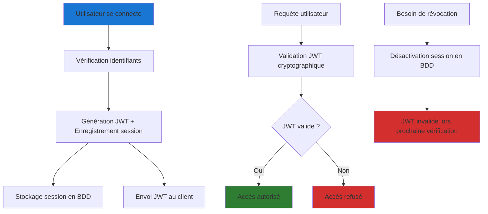
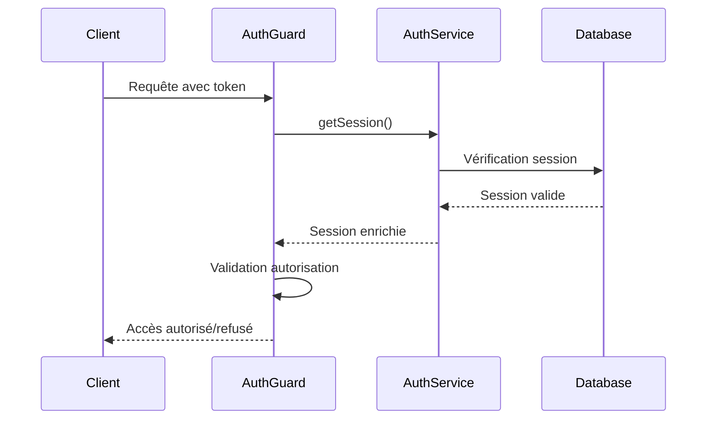

TODO: Partie à expliquer
1. Introduction sur comment fonctionne better auth (jwt, session, schema de db, protection des routes, exposition d'un middleware d'api pour communiquer avec les entités généré etc)
2. Rapide introduction de comment j'ai ranger mes features d'auth dans mon api
3. Schema better auth explications des entités généré (à quoi ça sert etc) vulgarisation
4. Endpoints exposés par better auth
5. Configuration du middleware
6. Restriction des ressources (protection)
7. Gestion des sessions et sécurité: explications du concept et redirection dans les annexes pour le détails
8. Stratégie de sécu JWT (rappel de la techno vite fait, header, payload, signature) et distinction du stockage coté client entre interface web et app mobile (pareil si besoin de plus on envoi dans les annexes)
9. Implémentation de la lib coté clients pour profiter des rescrtions coté client aussi (page, composants)
10. Conclusion et intro sur ce qui va suivre : les permissions (roles) avec le plugin Organization de better auth

## Introduction

Après avoir justifié le choix de Better-Auth comme solution d'authentification, je détaille ici son implémentation concrète dans DropIt. Cette librairie m'offre une approche hybride combinant JWT et sessions révocables, répondant parfaitement aux besoins identifiés.

L'implémentation de Better-Auth dans mon projet s'articule autour de plusieurs composants : la génération automatique d'entités de base de données, l'exposition d'endpoints d'authentification prêts à l'emploi, la protection des routes via un système de guards, et la configuration d'un middleware pour déléguer les requêtes d'authentification à la librairie.

## Organisation modulaire de l'authentification

Dans mon API NestJS, j'ai choisi d'isoler tout ce qui concerne l'authentification au sein d'un module dédié. Cette approche me permet de maintenir une séparation claire des responsabilités et facilite la maintenance du code d'authentification.

```
modules/auth/
├── auth.decorator.ts  # Décorateurs pour l'authentification
├── auth.entity.ts     # Entités complémentaires 
├── auth.guard.ts      # Guard de protection des routes
├── auth.module.ts     # Configuration du module
├── auth.service.ts    # Service principal Better-Auth
└── README.md          # Documentation technique
```

## Entités générées par Better-Auth

Better-Auth impose un schéma de base de données spécifique que j'ai dû intégrer dans mon système existant. Cette librairie génère automatiquement quatre entités principales : User, Session, Account, et Verification.

L'intégration de ces entités dans mon architecture existante s'est révélée simple. Seule la table User nécessitait une attention particulière car elle devait s'harmoniser avec mon modèle utilisateur existant. Les autres tables (Session, Account, Verification) sont autonomes et n'ont posé aucune difficulté d'implémentation.

Les schémas détaillés de ces entités (MCD, MLD, MPD) sont disponibles dans la section [Annexes authentification](/annexes/authentifications/) pour une vision complète de l'architecture de données.

### Entités clés : Session et Verification

L'entité **Session** gère les sessions actives des utilisateurs en stockant les métadonnées essentielles : ID utilisateur, token de session, date d'expiration, ainsi que l'adresse IP et le User-Agent pour le monitoring de sécurité. Cette approche me permet de détecter facilement les activités suspectes.

L'entité **Verification** s'occupe des tokens temporaires utilisés pour la vérification d'email et la réinitialisation de mot de passe. Chaque token a une durée de vie limitée, gérant automatiquement l'expiration pour renforcer la sécurité.

Dans mon implémentation, j'utilise l'approche code-first de NestJS avec MikroORM pour générer automatiquement ces entités. Il est aussi possible de les créer manuellement, mais il faut respecter scrupuleusement le schéma requis par Better-Auth. 

## Endpoints d'authentification automatiques

L'un des avantages majeurs de Better-Auth est l'exposition automatique d'endpoints d'authentification complets sur le préfixe `/auth`. Cette fonctionnalité me fait gagner un temps considérable en évitant le développement manuel de ces routes critiques.

| Route | Méthode | Description | Usage dans DropIt |
|-------|---------|-------------|-------------------|
| `/auth/signup` | POST | Inscription utilisateur | Création comptes coachs/athlètes |
| `/auth/login` | POST | Connexion | Accès quotidien à l'application |
| `/auth/logout` | POST | Déconnexion | Sécurisation des sessions |
| `/auth/me` | GET | Profil utilisateur | Données session courante |
| `/auth/refresh` | POST | Renouvellement token | Maintien des sessions longues |
| `/auth/verify` | GET | Vérification email | Sécurisation des comptes |
| `/auth/reset-password` | POST | Réinitialisation | Récupération comptes oubliés |

Cette standardisation me garantit l'implémentation des bonnes pratiques de sécurité sans effort supplémentaire. J'ai ajouté le plugin openAPI() à ma configuration Better-Auth, ce qui génère automatiquement la documentation Swagger de tous ces endpoints pour faciliter le développement côté client. 

## Configuration du middleware d'authentification

Pour intégrer Better-Auth dans mon API NestJS, j'ai configuré un middleware qui redirige automatiquement toutes les requêtes commençant par `/auth` vers les routes gérées par Better-Auth. Cette approche me permet de déléguer complètement la gestion de l'authentification à la librairie.


Voici la configuration dans le point d'entrée de mon application : 

```ts
import { NestFactory } from '@nestjs/core';
import { SwaggerModule } from '@nestjs/swagger';
import * as dotenv from 'dotenv';
import * as express from 'express';
import { AppModule } from './app.module';
import { config } from './config/env.config';
import { openApiDocument } from './config/swagger.config';

dotenv.config();

const PREFIX = '/api';
const PORT = process.env.API_PORT || 3000;

async function bootstrap() {
  const app = await NestFactory.create(AppModule, {
    bodyParser: false,
  });

  // Conditional middleware for better auth
  app.use(
    (
      req: express.Request,
      res: express.Response,
      next: express.NextFunction
    ) => {
      // If is routes of better auth, next
      if (req.originalUrl.startsWith(`${PREFIX}/auth`)) {
        return next();
      }
      // Else, apply the express json middleware
      express.json()(req, res, next);
    }
  );

  await app.listen(PORT, '0.0.0.0');
}

bootstrap();
```

## Protection des routes

### Décorateurs

Un décorateur en TypeScript est une fonction qui permet d'annoter et de modifier des classes, méthodes ou propriétés. Dans le contexte de NestJS, les décorateurs me permettent d'ajouter des métadonnées à mes routes pour indiquer leur niveau de sécurité.

Concrètement, au lieu d'écrire de la logique conditionnelle dans chaque contrôleur, j'annote simplement mes routes avec `@Public()` ou `@Optional()` pour indiquer leur niveau de sécurité. Je peux aussi injecter directement l'utilisateur connecté ou sa session dans les paramètres de mes méthodes.

Dans mon projet, j'ai configuré l'authentification comme étant globale : par défaut, toutes les routes nécessitent une authentification, sauf si je les marque explicitement avec `@Public()`. Cette configuration se fait via un système de Guards que je vais présenter juste après.

Voici une version simplifiée de mes décorateurs principaux :

```typescript
/**
 * Décorateur pour marquer une route comme publique (accessible sans authentification)
 */
export const Public = () => SetMetadata('PUBLIC', true);

/**
 * Décorateur pour marquer une route comme optionnelle (accessible avec ou sans authentification)
 */
export const Optional = () => SetMetadata('OPTIONAL', true);

/**
 * Décorateur pour injecter la session dans un contrôleur
 */
export const Session = createParamDecorator(
  (_data: unknown, context: ExecutionContext) => {
    const request = context.switchToHttp().getRequest();
    return request.session;
  }
);

/**
 * Décorateur pour injecter l'utilisateur connecté dans un contrôleur
 */
export const CurrentUser = createParamDecorator(
  (_data: unknown, context: ExecutionContext) => {
    const request = context.switchToHttp().getRequest();
    return request.user;
  }
);
```

Ces décorateurs me permettent d'annoter facilement mes routes selon leur niveau de sécurité et d'injecter automatiquement les données de session dans mes contrôleurs.

### Guards

Les Guards sont des classes qui implémentent une logique de sécurité dans NestJS. Un Guard s'exécute avant chaque route pour déterminer si la requête peut y accéder. Dans le contexte de l'authentification, le Guard vérifie si l'utilisateur est connecté et dispose des droits nécessaires.

Le Guard lit les métadonnées ajoutées par les décorateurs pour adapter son comportement. Par exemple, si une route est marquée `@Public()`, le Guard autorisera l'accès même sans authentification. 

Voici une version allégée de mon AuthGuard qui montre la logique principale :

```typescript
@Injectable()
export class AuthGuard implements CanActivate {
  constructor(
    private readonly reflector: Reflector,
    private readonly authService: AuthService
  ) {}

  async canActivate(context: ExecutionContext): Promise<boolean> {
    const request = context.switchToHttp().getRequest();
    
    try {
      // Récupération de la session via Better-Auth
      const session = await this.authService.api.getSession({
        headers: fromNodeHeaders(request.headers),
      });

      // Injection session et utilisateur dans la requête
      request.session = session;
      request.user = session?.user ?? null;

      // Vérification des métadonnées de route
      const isPublic = this.reflector.get('PUBLIC', context.getHandler());
      const isOptional = this.reflector.get('OPTIONAL', context.getHandler());

      if (isPublic) return true;
      if (isOptional && !session) return true;
      
      if (!session) {
        throw new UnauthorizedException('You must be logged in to access this resource');
      }

      return true;
    } catch (error) {
      throw new UnauthorizedException('Authentication failed');
    }
  }
}
```

### Exemple d'utilisation concrète

Pour illustrer l'usage pratique de ces décorateurs et du système de Guards, voici un extrait simplifié de mon `WorkoutController`:

```typescript
@UseGuards(PermissionsGuard)
@Controller()
export class WorkoutController {
  constructor(
    private readonly workoutUseCases: WorkoutUseCases
  ) {}

  getWorkouts(@CurrentUser() user: AuthenticatedUser) {
    return tsRestHandler(c.getWorkouts, async () => {
      return await this.workoutUseCases.getWorkouts(organizationId, user.id);
    });
  }
}
```

Dans cet exemple, on voit comment :
- L'`AuthGuard` global vérifie automatiquement l'authentification avant d'arriver au contrôleur
- Le décorateur `@CurrentUser()` injecte automatiquement l'utilisateur connecté dans les paramètres
- Aucune route n'est marquée `@Public()` donc toutes nécessitent une authentification
- Le `@UseGuards(PermissionsGuard)` ajoute une couche de vérification des permissions (système qui sera détaillé dans la section suivante)

## Gestion des sessions et sécurité

ICI Il faut simplifier et expliquer le fonctionnement et l'approche session des utilisateur. Eventuellement balancer des détails dans les annexes 'authentifications' avec des liens pour alleger un peu le tout

### Architecture hybride retenue

L'architecture d'authentification que j'ai implémentée avec Better-Auth combine les approches JWT et sessions pour tirer parti des avantages de chacune :



Cette approche me permet de bénéficier des performances des JWT pour la validation courante, tout en conservant la possibilité de révocation grâce au suivi des sessions en base de données. Concrètement, chaque token émis est enregistré dans une table `AuthSession` qui stocke les métadonnées de connexion (device, IP, date de création).

### Cycle de vie des sessions

L'implémentation de Better-Auth me permet de gérer finement le cycle de vie des sessions utilisateur :



## Stratégie de sécurisation des tokens JWT

### Stockage côté client

La sécurisation du stockage des tokens côté client constitue un enjeu majeur que j'ai abordé en analysant les différentes approches possibles. Pour le backoffice web de DropIt, j'ai opté pour les cookies HttpOnly qui offrent une protection optimale contre les attaques XSS, vulnérabilité qui permet de ?... dans un environnement web. 

Les coachs accèdent au backoffice depuis des postes potentiellement partagés, rendant crucial le niveau de sécurité du stockage des tokens. Les cookies HttpOnly, inaccessibles depuis JavaScript, réduisent significativement la surface d'attaque.

Pour l'application mobile développée avec Expo et React Native, j'ai opté pour une approche plus intégrée grâce au plugin Expo de Better-Auth. Cette solution utilise automatiquement `expo-secure-store` pour le stockage sécurisé des sessions, gérant de manière transparente les spécificités iOS (Keychain) et Android (EncryptedSharedPreferences) sans nécessiter d'implémentation manuelle. Le plugin `@better-auth/expo/client` prend en charge la gestion automatique des cookies dans les headers, le deep linking (c'est quoi ?) pour l'authentification sociale, et la synchronisation des sessions entre les différentes parties de l'application mobile.

### Sécurité d'accès et expiration des sessions

Dans le contexte de DropIt, j'ai configuré Better-Auth pour gérer automatiquement l'expiration des sessions afin de maintenir un niveau de sécurité approprié sans créer de friction excessive pour les utilisateurs. Les sessions web ont une durée de vie de 7 jours avec renouvellement automatique lors d'activité, tandis que les sessions mobiles persistent 30 jours pour éviter des reconnexions fréquentes qui nuiraient à l'expérience utilisateur.

Cette approche s'appuie sur mon analyse des habitudes d'usage : les coachs accèdent régulièrement au backoffice web pour programmer les séances, tandis que les athlètes consultent leurs données de manière plus sporadique via l'application mobile.

## Implémentation clients

L'intégration de Better-Auth dans DropIt s'appuie sur une configuration que j'ai adaptée aux besoins spécifiques de l'application, particulièrement pour supporter l'architecture web et mobile des deux clients:

```typescript
// Configuration Better-Auth côté serveur pour DropIt
const authConfig = {
  database: {
    // Utilisation de la base PostgreSQL existante
    provider: "postgresql",
    url: process.env.DATABASE_URL
  },
  
  // Plugin Expo pour le support mobile
  plugins: [expo()],
  
  // Support multi-plateforme
  cookies: {
    enabled: true,
    httpOnly: true,
    secure: process.env.NODE_ENV === 'production',
    sameSite: 'strict'
  },
  
  // Deep linking et origines de confiance pour Expo
  trustedOrigins: [
    "dropit://", // Scheme principal de l'app mobile
    "dropit://*" // Support des deep links avec chemins
  ],
  
  // Personnalisation pour DropIt
  user: {
    additionalFields: {
      role: "string",
      clubId: "string"
    }
  }
};
```

Du côté client mobile avec le framework `Expo`, la configuration s'adapte à l'écosystème React Native :

```typescript
// Configuration client mobile avec Expo
import { createAuthClient } from "better-auth/react";
import { expoClient } from "@better-auth/expo/client";
import * as SecureStore from "expo-secure-store";

export const authClient = createAuthClient({
  baseURL: process.env.EXPO_PUBLIC_API_URL,
  plugins: [
    expoClient({
      scheme: "dropit",
      storagePrefix: "dropit-auth",
      storage: SecureStore,
    })
  ]
});
```

L'intégration du plugin Expo simplifie considérablement la gestion de la sécurité mobile en automatisant le stockage sécurisé, la gestion des cookies et le deep linking, tout en maintenant la cohérence avec le backoffice web.

FAUT Dire que better auth permet la sécurisation a la fois de l'acces api mais aussi de conditionner le rendu des pages et/ou composant coté client le tout harmonisé des deux cotés

## Conclusion

L'implémentation du système d'authentification de DropIt illustre la complexité pratique de la sécurisation d'une application moderne. Cette base prépare maintenant l'étape suivante : la mise en œuvre d'un système de gestion des autorisations granulaire adapté aux rôles spécifiques de l'écosystème haltérophilie.

La section suivante détaillera comment cette fondation d'authentification s'enrichit d'un système RBAC (Role-Based Access Control) permettant de gérer finement les permissions entre coachs, athlètes, et administrateurs, garantissant ainsi que chaque utilisateur accède uniquement aux fonctionnalités et données qui lui sont destinées.

