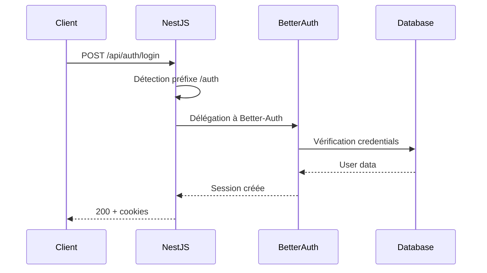

## Organisation modulaire de l'authentification

J'ai isolé l'authentification dans un module NestJS dédié pour séparer les responsabilités et centraliser la configuration Better-Auth.

```markdown
modules/auth/
├── auth.decorator.ts  # Décorateurs pour l'authentification
├── auth.entity.ts     # Entités complémentaires 
├── auth.guard.ts      # Guard de protection des routes
├── auth.module.ts     # Configuration du module
├── auth.service.ts    # Service principal Better-Auth
└── README.md          # Documentation technique
```

## Entités générées par Better-Auth

Better-Auth impose un schéma de base de données spécifique avec quatre entités principales : `User`, `Session`, `Account`, et `Verification`. L'implémentation peut se faire manuellement selon la documentation ou via les scripts de génération fournis par la librairie.

L'intégration dans mon architecture existante s'est concentrée sur la table `User` qui devait s'harmoniser avec mon modèle utilisateur, les autres tables (`Session`, `Account`, `Verification`) étant autonomes.

Le schéma détaillé de ces entités est disponible dans la section [Modèle Logique de Données Better-Auth](/annexes/authentifications/#modèle-logique-de-données-better-auth) pour une vision complète de l'architecture de données.

### Entités clés : Session et Verification

L'entité **Session** gère les sessions actives des utilisateurs en stockant les métadonnées essentielles : ID utilisateur, token de session, date d'expiration, ainsi que l'adresse IP et le User-Agent pour le monitoring de sécurité. Cette approche me permet de détecter les activités suspectes.

L'entité **Verification** s'occupe des tokens temporaires utilisés pour la vérification d'email et la réinitialisation de mot de passe. Chaque token a une durée de vie limitée, gérant automatiquement l'expiration pour renforcer la sécurité.

## Endpoints d'authentification

Better-Auth expose automatiquement des endpoints d'authentification complets sur le préfixe `/auth`, évitant l'implémentation manuelle de ces routes critiques.

```html
|       Route             | Méthode |        Description      |       Usage dans DropIt         |
|------------------------ |---------|-------------------------|---------------------------------|
| `/auth/signup`          | POST    | Inscription utilisateur | Création comptes coachs/athlètes|
| `/auth/login`           | POST    | Connexion               | Accès quotidien à l'application |
| `/auth/logout`          | POST    | Déconnexion             | Sécurisation des sessions       |
| `/auth/me`              | GET     | Profil utilisateur      | Données session courante        |
| `/auth/refresh`         | POST    | Renouvellement token    | Maintien des sessions longues   |
| `/auth/verify`          | GET     | Vérification email      | Sécurisation des comptes        |
| `/auth/reset-password`  | POST    | Réinitialisation        | Récupération comptes oubliés    |
```

Cette standardisation garantit l'implémentation native des bonnes pratiques de sécurité. J'ai ajouté le plugin openAPI() à ma configuration Better-Auth, ce qui génère automatiquement la documentation Swagger de tous ces endpoints pour faciliter le développement côté client. 

## Configuration du middleware d'authentification

Pour intégrer Better-Auth dans mon API NestJS, j'ai configuré un middleware qui redirige automatiquement toutes les requêtes commençant par `/auth` vers les routes gérées par Better-Auth. Cette approche me permet de déléguer complètement la gestion de l'authentification à la librairie.



La configuration se fait dans le point d'entrée de l'API via un middleware conditionnel qui détecte les requêtes commençant par `/api/auth` et les délègue directement à Better-Auth.

## Protection des routes

### Décorateurs

Un décorateur en TypeScript est une fonction qui permet d'annoter et de modifier des classes, méthodes ou propriétés. Dans le contexte de NestJS, j'utilise des décorateurs pour marquer le niveau de sécurité des routes (`@Public()`, `@Optional()`) et injecter les données d'authentification dans les paramètres de méthode (`@CurrentUser()`, `@Session()`).

J'ai configuré l'authentification comme étant globale : par défaut, toutes les routes nécessitent une authentification, sauf si je les marque explicitement avec `@Public()`. Cette approche évite d'oublier de protéger une route sensible. La logique de vérification se fait via un système de Guards présenté dans la section suivante.

> **Exemple d'implémentation des décorateurs** : Voir l'annexe [Implémentation des décorateurs](/annexes/authentifications/#implémentation-des-décorateurs)

### Guards

Les Guards sont des classes qui implémentent une logique de sécurité dans NestJS. Un Guard s'exécute avant chaque route pour déterminer si la requête peut y accéder. Dans le contexte de l'authentification, le Guard vérifie si l'utilisateur est connecté et dispose des droits nécessaires.

Le Guard utilise le service `Reflector` de NestJS pour lire les métadonnées ajoutées par les décorateurs et adapter son comportement. Par exemple, si une route est marquée `@Public()`, le Guard autorisera l'accès même sans authentification. 

> **Exemple d'implémentation du Guard** : Voir l'annexe [Implémentation du Guard](/annexes/authentifications/#implémentation-du-guard)

### Exemple d'utilisation concrète

L'utilisation concrète de ces décorateurs et Guards dans un contrôleur illustre comment l'`AuthGuard` global vérifie l'authentification, comment le décorateur `@CurrentUser()` injecte l'utilisateur connecté, et comment l'absence de `@Public()` rend l'authentification obligatoire.

> **Exemple d'implémentation** : Voir l'annexe [Exemple d'usage concret](/annexes/authentifications/#exemple-dusage-concret)

## Stratégie de sécurisation côté client

### Stockage sécurisé selon la plateforme

La sécurisation du token de session diffère selon la plateforme :

**Sur le web**, j'utilise des cookies HttpOnly. Le flag HttpOnly empêche le code JavaScript d'accéder au cookie : même si un attaquant injecte du code malveillant dans la page (attaque XSS), il ne peut pas lire le token de session. Seul le navigateur envoie automatiquement le cookie à chaque requête.

**Sur mobile**, les cookies ne fonctionnent pas de la même manière. Better-Auth stocke le token dans AsyncStorage, un système de stockage persistant de React Native. Les données sont protégées par le sandboxing de l'OS : chaque application dispose d'un espace de stockage isolé inaccessible aux autres applications. Une amélioration future consisterait à migrer vers `expo-secure-store` pour ajouter un chiffrement matériel (Keychain sur iOS, EncryptedSharedPreferences sur Android), renforçant la protection contre les scénarios d'appareils compromis.

### Configuration des sessions

Les sessions ont une durée de 7 jours configurée via `cookies.maxAge` côté serveur. Cette durée s'applique aux deux plateformes. Better-Auth renouvelle automatiquement l'expiration lorsque l'utilisateur utilise l'application, ce qui équilibre sécurité et expérience utilisateur : un utilisateur actif reste connecté, tandis qu'une session inactive expire après 7 jours.

Les détails d'implémentation sont disponibles dans la section [Configuration côté clients](/annexes/authentifications/#configuration-côté-clients-de-better-auth).

## Implémentation côté clients

L'un des avantages de Better-Auth est sa capacité à sécuriser à la fois l'accès aux APIs et le rendu conditionnel des interfaces utilisateur. Cette approche unifiée permet de maintenir une cohérence entre le backend et le frontend.

Côté backend, mes APIs sont protégées par les Guards comme nous l'avons vu. Côté frontend, Better-Auth fournit des hooks React pour conditionner l'affichage des composants selon l'état d'authentification :

```typescript
// Exemple d'usage côté client web/mobile
import { useSession } from "@better-auth/react";

function WorkoutForm() {
  const { data: session, isPending } = useSession();

  if (isPending) return <LoadingSpinner />;
  if (!session) return <LoginPrompt />;

  // Composant accessible uniquement aux utilisateurs connectés
  return <CreateWorkoutForm user={session.user} />;
}
```

## Conclusion

L'implémentation de Better-Auth répond aux contraintes identifiées : révocation immédiate, architecture multi-plateforme, et sécurité renforcée. Cette base d'authentification me permet de me concentrer sur la couche d'autorisation.

La section suivante présente l'implémentation via le plugin Organization de Better-Auth des permissions granulaires entre administrateurs, coachs et athlètes selon leur périmètre d'action.


