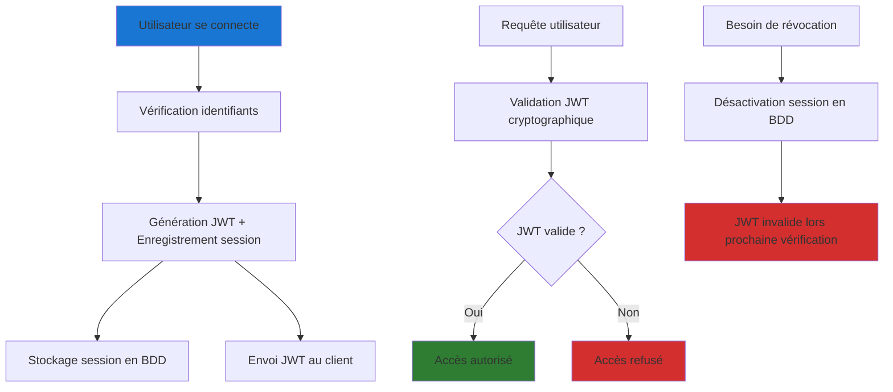

## Introduction

Après avoir défini l'architecture globale, je veux faire un zoom spécifique sur un des aspect de la sécurité dans l'application, en abordant l'authentification des utilisateur ainsi la proctection applicative d'accès aux donnée via un systeme de restriction d'autorisation par rôle des utilisateurs. 

## Analyse des besoins

EVOQUER LES BESOINS 
- Donnée sensibe : rgbd 
- gestion des roles d'acces
- Révocation immédiate souhaité : athlète quitte un club, un athlete devient coach (changement de role), un coach quitte un club...
- Granularité: sur programmes, séances, athlètes

Cette approche s'appuie d'abord sur les obligations légales du RGPD et les bonnes pratiques de sécurité applicative, qui imposent une protection rigoureuse des données personnelles des utilisateurs. Le contexte spécifique d'un club d'haltérophilie ajoute à ces exigences de base la nécessité de gérer différents niveaux d'accès (administrateurs, coachs, athlètes) et de protéger des données sensibles liées aux performances et à la santé.

L'analyse du contexte métier de DropIt m'a permis d'identifier plusieurs profils d'utilisateurs aux besoins différenciés. Les coachs accèdent quotidiennement aux données d'entraînement depuis le backoffice web, les athlètes consultent leurs performances via l'application mobile, tandis que les administrateurs supervisent l'ensemble du système. Cette diversité d'accès m'a conduit à réfléchir à une architecture d'authentification capable de s'adapter à ces différents contextes d'usage.

La particularité du secteur sportif réside dans la sensibilité des données collectées : performances personnelles, évolution physique, historiques d'entraînement. Ces informations requièrent un niveau de protection élevé, non seulement pour respecter la réglementation RGPD, mais aussi pour maintenir la confiance des utilisateurs dans l'application.

## Solutions envisagées

Trois approches s'offraient à moi l'implémentation de l'authentification et de l'autorisation au sein de mon application. A savoir, code de zéro from scratch, utiliser une librairie externe ou délégation ce système à un identity provider. 

Le détails de la reflextion qui a déterminer ce choix est disponible en annexes dans conception authentification

## Le choix de Better-Auth

Better-Auth s'est imposé comme la solution la plus adaptée à mon contexte pour plusieurs raisons.

Authentification prêtre à l'emploi en fournissant des endpoints clé en main et des d'authentification en base de données. 

Better-Auth propose une implémentation de l'authentification hybride, me permettant persistance en session pour la révocation rapide des droit et les JWT pour stocker les session utilisateur je crois..

Propose aussi tout un systeme de plugin d'extensions et notament dans mon cas un systeme d'autorisation qui fourni également des tables en base de donnée et des endpoints qui me permettra de gérer facilement mes roles utilisateur dans mon application

Cette solution s'intègre également naturellement avec l'écosystème TypeScript/Node.js que j'ai choisi pour DropIt ce qui facilite la maintenance et réduit la courbe d'apprentissage.

La librairie implémente également toute les bonnes pratique de sécurité, Ardon2id, Samesite, rate-limit, export RGPD, table audit_log (détaillers toutes ces fonctionnalités pour expliquer ce que c'est)

Rate-limit: Empeche les brute-force (ex: 5 tentatives mdp/min)
Ou spam d'endpoint (scraping, appels coûteux)

Token CSRF (double‐submit) : Pour les requêtes state-changing faites en POST/PUT/DELETE, Better-Auth ajoute un en-tête ou un champ masqué contenant un token aléatoire que le serveur doit retrouver ; un site tiers ne peut pas le deviner.

Samesite=Lax: flag sur un cookie qui vérifie que le cookie est bien envoyé depuis mon site ça permet de réduire les risques d'attaque CRSF

Export RGPD: Bouton télécharger les données qui génère un fichier JSON/ZIP (obligation légale sur la portabilité des données) permet de récup et/ou de quitter le service proprement

Audit_log: Table de log pour tracer qui fait quoi et quand (prouve la conformité RGPD ex: qui a consulté mes données?)
Forensic: comprendre un incident de sécurité
controle interne 

IWKS = « L’annuaire public des clés »
Le serveur met sa clé publique dans un fichier unique.
Tout service qui doit vérifier un JWT vient lire cet annuaire ; il n’y a plus aucun échange manuel de clé.

OIDC discovery: « Le plan de l’office d’authentification »
Un fichier standard qui indique où se trouvent les guichets : endpoint de login, de délivrance de tokens, de profil…
Grâce à ce plan commun, n’importe quel client (web, mobile, futur IdP) sait instantanément où appeler sans qu’on change son code.

### Architecture hybride retenue

L'architecture d'authentification que j'ai implémentée avec Better-Auth combine les approches JWT et sessions pour tirer parti des avantages de chacune :

Cette approche me permet de bénéficier des performances des JWT pour la validation courante, tout en conservant la possibilité de révocation grâce au suivi des sessions en base de données. Concrètement, chaque token émis est enregistré dans une table `AuthSession` qui stocke les métadonnées de connexion (device, IP, date de création).

## Stratégie de sécurisation des tokens

### Stockage côté client

La sécurisation du stockage des tokens côté client constitue un enjeu majeur que j'ai abordé en analysant les différentes approches possibles. Pour le backoffice web de DropIt, j'ai opté pour les cookies HttpOnly qui offrent une protection optimale contre les attaques XSS, vulnérabilité qui permet de ?... dans un environnement web. 

Les coachs accèdent au backoffice depuis des postes potentiellement partagés, rendant crucial le niveau de sécurité du stockage des tokens. Les cookies HttpOnly, inaccessibles depuis JavaScript, réduisent significativement la surface d'attaque.

Pour l'application mobile développée avec Expo et React Native, j'ai opté pour une approche plus intégrée grâce au plugin Expo de Better-Auth. Cette solution utilise automatiquement `expo-secure-store` pour le stockage sécurisé des sessions, gérant de manière transparente les spécificités iOS (Keychain) et Android (EncryptedSharedPreferences) sans nécessiter d'implémentation manuelle. Le plugin `@better-auth/expo/client` prend en charge la gestion automatique des cookies dans les headers, le deep linking (c'est quoi ?) pour l'authentification sociale, et la synchronisation des sessions entre les différentes parties de l'application mobile.

### Sécurité d'accès et expiration des sessions

Dans le contexte de DropIt, j'ai configuré Better-Auth pour gérer automatiquement l'expiration des sessions afin de maintenir un niveau de sécurité approprié sans créer de friction excessive pour les utilisateurs. Les sessions web ont une durée de vie de 7 jours avec renouvellement automatique lors d'activité, tandis que les sessions mobiles persistent 30 jours pour éviter des reconnexions fréquentes qui nuiraient à l'expérience utilisateur.

Cette approche s'appuie sur mon analyse des habitudes d'usage : les coachs accèdent régulièrement au backoffice web pour programmer les séances, tandis que les athlètes consultent leurs données de manière plus sporadique via l'application mobile.

### Évolutions envisagées

L'architecture mise en place ouvre plusieurs perspectives d'évolution que je compte explorer dans la suite du développement de DropIt. L'implémentation de l'authentification à deux facteurs (2FA) constitue une priorité, particulièrement pour les comptes administrateurs qui disposent d'accès privilégiés.

De même, l'intégration de Better-Auth avec les providers OAuth (Google, Apple) pourrait simplifier l'onboarding des athlètes, tout en maintenant le niveau de sécurité requis. Cette évolution nécessitera cependant une analyse approfondie des implications en termes de protection des données personnelles.

## Conclusion

La section suivante détaillera l'implémentation concrète de cette architecture d'authentification, démontrant comment les choix de conception se traduisent en code fonctionnel et sécurisé pour les utilisateurs de DropIt.