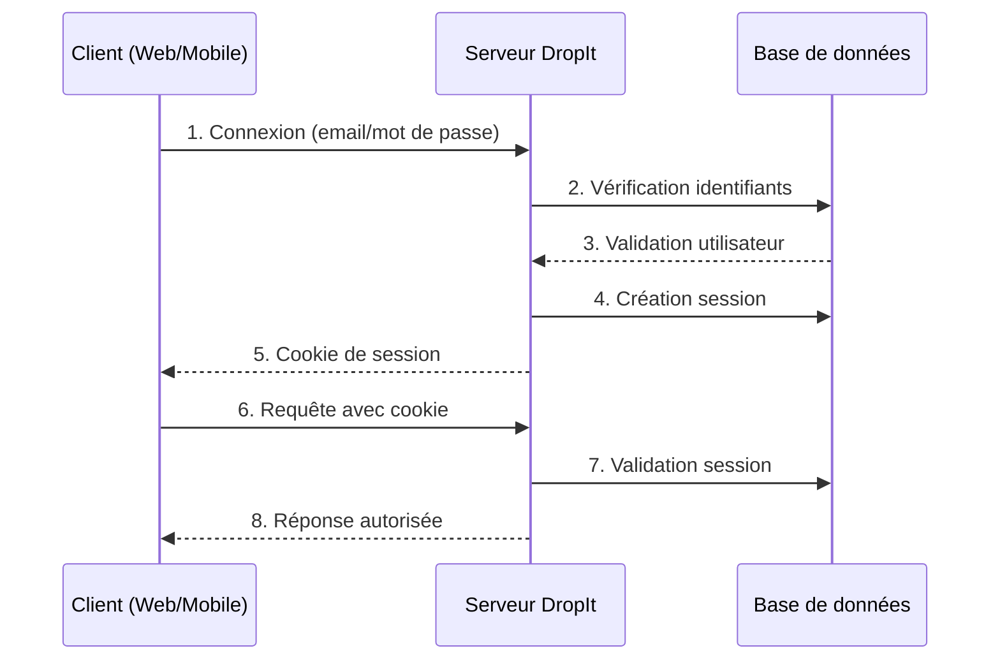
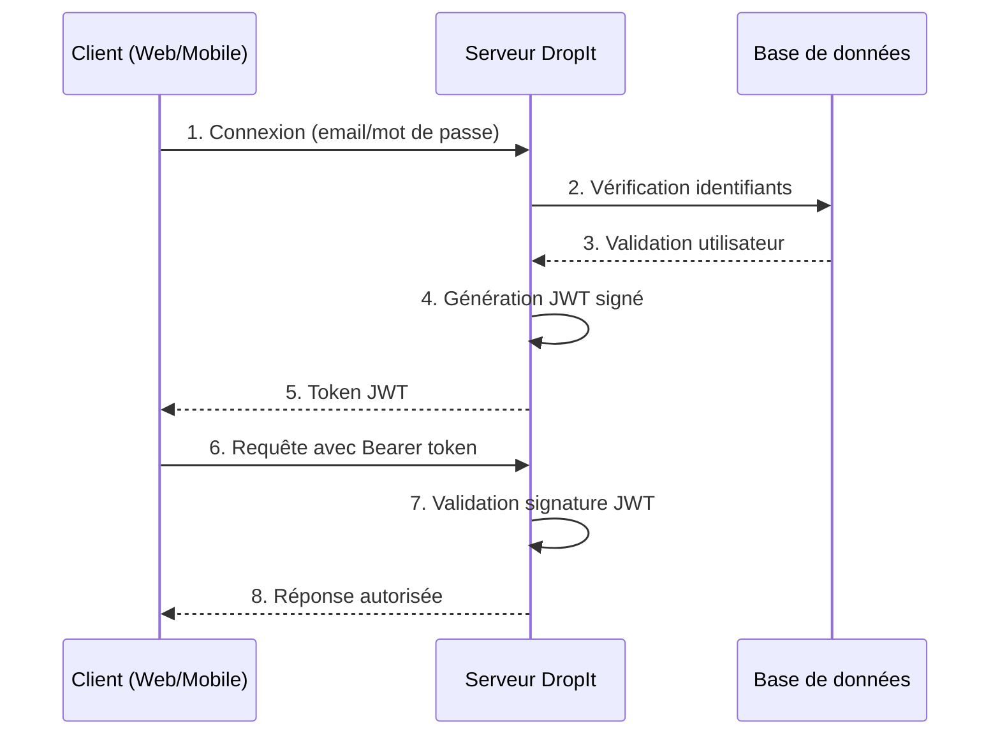

## Introduction : La sécurité au cœur du projet DropIt

Dans le cadre du développement de DropIt, la sécurité constitue un prérequis fondamental, non négociable dans toute application web moderne. Cette approche s'appuie d'abord sur les obligations légales du RGPD et les bonnes pratiques de sécurité applicative, qui imposent une protection rigoureuse des données personnelles des utilisateurs. Le contexte spécifique d'un club d'haltérophilie ajoute à ces exigences de base la nécessité de gérer différents niveaux d'accès (administrateurs, coachs, athlètes) et de protéger des données sensibles liées aux performances et à la santé.

Ma démarche s'inscrit dans une logique de sécurité by design, où chaque choix technique découle d'une analyse méthodique des risques et des contraintes. Cette approche m'a conduit à structurer ma réflexion autour de trois axes complémentaires : l'authentification robuste des utilisateurs, la protection des données sensibles, et la gestion granulaire des autorisations selon les rôles métier.

## Analyse des besoins sécuritaires spécifiques à DropIt

### Contexte métier et utilisateurs

L'analyse du contexte métier de DropIt m'a permis d'identifier plusieurs profils d'utilisateurs aux besoins différenciés. Les coachs accèdent quotidiennement aux données d'entraînement depuis le backoffice web, les athlètes consultent leurs performances via l'application mobile, tandis que les administrateurs supervisent l'ensemble du système. Cette diversité d'accès m'a conduit à réfléchir à une architecture d'authentification capable de s'adapter à ces différents contextes d'usage.

La particularité du secteur sportif réside dans la sensibilité des données collectées : performances personnelles, évolution physique, historiques d'entraînement. Ces informations requièrent un niveau de protection élevé, non seulement pour respecter la réglementation RGPD, mais aussi pour maintenir la confiance des utilisateurs dans l'application.

### Contraintes techniques identifiées

Mon expérience de développement m'a appris que la sécurité ne peut être pensée indépendamment des contraintes techniques du projet. Dans le cas de DropIt, j'ai identifié plusieurs défis spécifiques :

L'architecture multi-plateforme constitue le premier défi majeur. Le backoffice web et l'application mobile nécessitent des approches d'authentification potentiellement différentes, tout en maintenant une cohérence de sécurité. Cette contrainte m'a orienté vers la recherche d'une solution unifiée capable de s'adapter aux spécificités de chaque plateforme.

Le second défi concerne la scalabilité. Bien que DropIt commence avec un nombre limité d'utilisateurs, j'ai souhaité concevoir une architecture capable d'évoluer. Cette anticipation influence directement les choix d'authentification, notamment en favorisant les solutions stateless qui facilitent la montée en charge. Contrairement aux sessions traditionnelles qui nécessitent un stockage serveur et compliquent la répartition de charge entre plusieurs instances, les solutions stateless permettent à chaque serveur de valider indépendamment les tokens sans coordination centralisée, simplifiant ainsi l'ajout de nouvelles instances selon les besoins.

## Étude comparative des solutions d'authentification

### Sessions traditionnelles : analyse dans le contexte DropIt

Ma première réflexion s'est portée sur l'authentification par sessions, méthode traditionnelle que j'ai déjà implémentée dans des projets précédents. Cette approche présente des avantages indéniables pour le contrôle serveur et la révocation des accès, aspects particulièrement importants dans un contexte où les coachs peuvent avoir besoin de gérer les connexions de leurs athlètes.



Cependant, l'analyse approfondie révèle des limitations importantes pour DropIt. La compatibilité avec l'application mobile pose des défis, notamment pour la gestion des cookies dans un environnement natif. De plus, la nécessité de stocker les sessions côté serveur introduit une complexité de gestion qui pourrait impacter les performances lors de la montée en charge.

### JWT : évaluation pour une architecture moderne

L'exploration des JSON Web Tokens m'a séduit par leur approche stateless et leur excellente compatibilité multi-plateforme. Cette technologie répond directement aux contraintes identifiées pour DropIt, particulièrement la nécessité de servir à la fois le web et le mobile avec une API unifiée.



L'avantage principal des JWT pour DropIt réside dans leur capacité à transporter des informations utilisateur (rôle, club d'appartenance) directement dans le token, réduisant ainsi le nombre d'appels en base de données. Cette caractéristique s'avère particulièrement intéressante pour optimiser les performances de l'application mobile où la latence réseau peut impacter l'expérience utilisateur.

Néanmoins, mon analyse a révélé une limitation majeure : la difficulté de révocation des tokens avant leur expiration naturelle. Dans le contexte de DropIt, où un coach pourrait avoir besoin de suspendre immédiatement l'accès d'un athlète, cette contrainte constitue un frein significatif à l'adoption pure des JWT.

## Le choix de Better-Auth : une approche hybride réfléchie

### Justification du choix technologique

Face aux limitations identifiées dans les approches traditionnelles, ma recherche s'est orientée vers des solutions hybrides combinant les avantages des sessions et des JWT. Better-Auth s'est imposé comme la solution la plus adaptée au contexte de DropIt pour plusieurs raisons que j'ai soigneusement évaluées.

Premièrement, Better-Auth propose une implémentation mature de l'authentification hybride, évitant ainsi les écueils d'un développement from scratch qui aurait pu introduire des vulnérabilités sécuritaires. Mon expérience m'a appris que la sécurité n'est pas un domaine où l'innovation non éprouvée est souhaitable, particulièrement dans le cadre d'un projet de formation où la robustesse prime sur l'originalité technique.

Deuxièmement, cette solution s'intègre naturellement avec l'écosystème TypeScript/Node.js que j'ai choisi pour DropIt. Cette cohérence technologique facilite la maintenance et réduit la courbe d'apprentissage, aspects cruciaux dans le contexte de mon développement en autonomie.

### Architecture hybride retenue

L'architecture d'authentification que j'ai implémentée avec Better-Auth combine intelligemment les approches JWT et sessions pour tirer parti des avantages de chacune :


Cette approche me permet de bénéficier des performances des JWT pour la validation courante, tout en conservant la possibilité de révocation grâce au suivi des sessions en base de données. Concrètement, chaque token émis est enregistré dans une table `AuthSession` qui stocke les métadonnées de connexion (device, IP, date de création).

### Implémentation dans l'écosystème DropIt

L'intégration de Better-Auth dans DropIt s'appuie sur une configuration que j'ai adaptée aux besoins spécifiques de l'application, particulièrement pour supporter l'architecture web + mobile Expo :

```typescript
// Configuration Better-Auth côté serveur pour DropIt
const authConfig = {
  database: {
    // Utilisation de la base PostgreSQL existante
    provider: "postgresql",
    url: process.env.DATABASE_URL
  },
  
  // Plugin Expo pour le support mobile
  plugins: [expo()],
  
  // Support multi-plateforme
  cookies: {
    enabled: true,
    httpOnly: true,
    secure: process.env.NODE_ENV === 'production',
    sameSite: 'strict'
  },
  
  // Deep linking et origines de confiance pour Expo
  trustedOrigins: [
    "dropit://", // Scheme principal de l'app mobile
    "dropit://*" // Support des deep links avec chemins
  ],
  
  // Personnalisation pour DropIt
  user: {
    additionalFields: {
      role: "string",
      clubId: "string"
    }
  }
};
```

Du côté client mobile Expo, la configuration s'adapte naturellement à l'écosystème React Native :

```typescript
// Configuration client mobile avec Expo
import { createAuthClient } from "better-auth/react";
import { expoClient } from "@better-auth/expo/client";
import * as SecureStore from "expo-secure-store";

export const authClient = createAuthClient({
  baseURL: process.env.EXPO_PUBLIC_API_URL,
  plugins: [
    expoClient({
      scheme: "dropit",
      storagePrefix: "dropit-auth",
      storage: SecureStore,
    })
  ]
});
```

Cette configuration illustre ma démarche d'adaptation d'une solution générique aux besoins spécifiques de DropIt. L'intégration du plugin Expo simplifie considérablement la gestion de la sécurité mobile en automatisant le stockage sécurisé, la gestion des cookies et le deep linking, tout en maintenant la cohérence avec le backoffice web.

## Stratégie de sécurisation des tokens

### Stockage côté client : analyse des risques

La sécurisation du stockage des tokens côté client constitue un enjeu majeur que j'ai abordé en analysant les différentes approches possibles. Pour le backoffice web de DropIt, j'ai opté pour les cookies HttpOnly qui offrent une protection optimale contre les attaques XSS, vulnérabilité particulièrement critique dans un environnement web.

Cette décision s'appuie sur mon évaluation des risques spécifiques à DropIt. Les coachs accèdent au backoffice depuis des postes potentiellement partagés, rendant crucial le niveau de sécurité du stockage des tokens. Les cookies HttpOnly, inaccessibles depuis JavaScript, réduisent significativement la surface d'attaque.

Pour l'application mobile développée avec Expo et React Native, j'ai opté pour une approche plus intégrée grâce au plugin Expo de Better-Auth. Cette solution utilise automatiquement `expo-secure-store` pour le stockage sécurisé des sessions, gérant de manière transparente les spécificités iOS (Keychain) et Android (EncryptedSharedPreferences) sans nécessiter d'implémentation manuelle. Le plugin `@better-auth/expo/client` prend en charge la gestion automatique des cookies dans les headers, le deep linking pour l'authentification sociale, et la synchronisation des sessions entre les différentes parties de l'application mobile.

### Sécurité d'accès et expiration des sessions

Dans le contexte de DropIt, j'ai configuré Better-Auth pour gérer automatiquement l'expiration des sessions afin de maintenir un niveau de sécurité approprié sans créer de friction excessive pour les utilisateurs. Les sessions web ont une durée de vie de 7 jours avec renouvellement automatique lors d'activité, tandis que les sessions mobiles persistent 30 jours pour éviter des reconnexions fréquentes qui nuiraient à l'expérience utilisateur.

Cette approche équilibrée s'appuie sur mon analyse des patterns d'usage : les coachs accèdent régulièrement au backoffice web pour programmer les séances, tandis que les athlètes consultent leurs données de manière plus sporadique via l'application mobile. La différenciation des durées de sessions reflète ces habitudes d'utilisation tout en maintenant une sécurité appropriée.

## Perspectives et apprentissages

### Retour d'expérience sur l'implémentation

L'implémentation de cette architecture d'authentification dans DropIt m'a permis d'approfondir ma compréhension des enjeux de sécurité dans les applications modernes. Particulièrement, j'ai pu mesurer l'importance de l'équilibre entre sécurité et expérience utilisateur, aspects souvent perçus comme antagonistes.

La mise en œuvre de Better-Auth m'a également confronté à la réalité de l'intégration d'une solution tierce dans un projet existant. Cette expérience m'a renforcé dans l'idée que le choix d'outils matures et bien documentés constitue souvent la meilleure stratégie, particulièrement pour des aspects critiques comme la sécurité.

### Évolutions envisagées

L'architecture mise en place ouvre plusieurs perspectives d'évolution que je compte explorer dans la suite du développement de DropIt. L'implémentation de l'authentification à deux facteurs (2FA) constitue une priorité, particulièrement pour les comptes administrateurs qui disposent d'accès privilégiés.

De même, l'intégration de Better-Auth avec les providers OAuth (Google, Apple) pourrait simplifier l'onboarding des athlètes, tout en maintenant le niveau de sécurité requis. Cette évolution nécessitera cependant une analyse approfondie des implications en termes de protection des données personnelles.

### Impact sur ma montée en compétences

Ce travail de conception sécurisée m'a permis de développer une approche méthodologique de l'analyse des risques et du choix technologique. La confrontation entre théorie sécuritaire et contraintes pratiques du développement m'a donné une vision plus nuancée des compromis nécessaires dans tout projet logiciel.

L'expérience acquise avec Better-Auth enrichit également ma boîte à outils de développeur, en me dotant d'une solution éprouvée pour les futurs projets nécessitant une authentification robuste. Cette compétence s'avère particulièrement valorisable dans un contexte professionnel où la sécurité devient un critère de plus en plus déterminant.

## Conclusion

La conception sécurisée de DropIt illustre l'importance d'une approche méthodique qui allie analyse des besoins métier, évaluation des contraintes techniques et choix technologiques éclairés. L'adoption de Better-Auth pour implémenter une architecture d'authentification hybride répond précisément aux défis identifiés : compatibilité multi-plateforme, sécurité renforcée et capacité de révocation.

Cette démarche de conception m'a permis de développer une vision holistique de la sécurité applicative, où chaque décision technique s'appuie sur une analyse rigoureuse des risques et des opportunités. L'expérience acquise dans ce projet constitue un socle solide pour aborder les enjeux sécuritaires des applications modernes avec confiance et méthodologie.

La suite de ce mémoire détaillera l'implémentation concrète de cette architecture d'authentification, démontrant comment les choix de conception se traduisent en code fonctionnel et sécurisé pour les utilisateurs de DropIt.