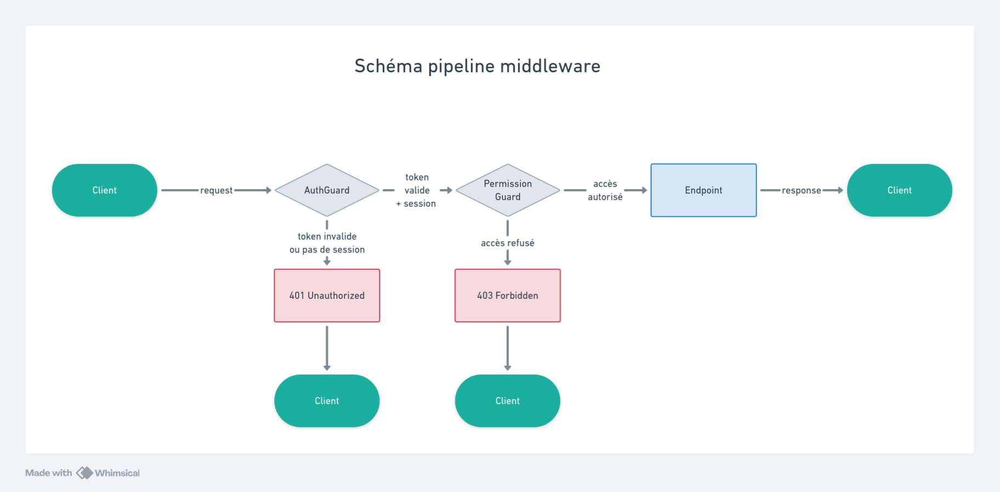

## Introduction

Après avoir établi une base d'authentification avec Better-Auth, cette section présente la couche d'autorisation dans l'application. Cette étape transforme l'identification des utilisateurs en contrôle d'accès granulaire aux ressources.

Dans DropIt, chaque utilisateur évolue au sein d'une organisation (club de d'haltérophilie) avec un rôle spécifique : coach ou athlète. Ces rôles déterminent les actions autorisées sur chaque ressource métier. 

## Organisation modulaire des permissions

Dans mon API, j'ai choisi d'intégrer la gestion des permissions au sein du module d'identité existant, aux côtés de l'authentification afin de maintenir une cohérence architecturale et de centraliser toutes les préoccupations liées à la sécurité.

```markdown
modules/identity/
├── domain/
│   ├── auth/                    # Entités d'authentification
│   │   ├── user.entity.ts
│   │   ├── session.entity.ts
│   │   └── verification.entity.ts
│   └── organization/            # Entités d'organisation
│       ├── organization.entity.ts
│       ├── member.entity.ts
│       └── invitation.entity.ts
├── infrastructure/
│   ├── guards/                  # Guards de sécurité
│   │   ├── auth.guard.ts
│   │   └── permissions.guard.ts
│   └── decorators/              # Décorateurs
│       ├── auth.decorator.ts
│       ├── permissions.decorator.ts
│       └── organization.decorator.ts
├── application/
│   └── auth.service.ts          # Service Better-Auth
└── identity.module.ts           # Configuration du module
```

## Entités générées par Better Auth

### Plugin Organization

Mon système intègre le plugin Organization de Better-Auth qui étend l'infrastructure d'authentification avec la gestion native des organisations multi-utilisateurs. Cette extension se configure simplement en ajoutant le plugin à ma configuration Better-Auth existante :

```typescript
// Configuration Better-Auth avec plugin Organization
export const auth = betterAuth({
  // ... configuration de base
  plugins: [
    organization(), // Plugin pour les organisations
    // ... autres plugins
  ],
});
```

Le plugin génère automatiquement trois nouvelles entités qui s'intègrent avec les entités d'authentification :

- **Organization** : Représente le club de sport avec ses métadonnées
- **Member** : Lie un utilisateur à une organisation avec un rôle spécifique
- **Invitation** : Gère le processus d'ajout de nouveaux membres

Les schémas détaillés de ces entités (MCD, MLD, MPD) et leurs relations sont disponibles dans la section [Annexes permissions](/annexes/permissions/) pour une vision complète de l'architecture de données.

### Adaptation du modèle métier

L'intégration de ce plugin a nécessité une évolution significative de mon modèle de données initial. Initialement, j'avais conçu une relation directe coach-athlète, mais l'approche organisationnelle m'a conduit à repenser cette architecture.

Plutôt que d'avoir des relations individuelles entre coachs et athlètes, j'ai restructuré le modèle autour du concept d'organisation (club). Cette approche organisationnelle apporte une scalabilité naturelle où un club peut accueillir plusieurs coachs et de nombreux athlètes, tout en conservant la flexibilité nécessaire pour faire évoluer les rôles selon les besoins (un athlète expérimenté peut devenir coach). L'isolation entre organisations garantit l'autonomie de chaque club, tout en permettant la collaboration entre plusieurs coachs au sein du même établissement.

Cette refactorisation a permis de passer d'un modèle rigide à une architecture flexible qui correspond mieux à la réalité organisationnelle des clubs de sport.

Cette évolution architecturale n'a pas posé de problème de migration en pratique car j'utilise un système de seeds pour alimenter la base de données en développement. Cette approche, qui sera détaillée dans la section sur les tests, me permet de recréer facilement un jeu de données cohérent à chaque évolution du modèle.

## Endpoints d'autorisation

Comme pour l'authentification, Better-Auth expose automatiquement des endpoints dédiés à la gestion des organisations et permissions sur le préfixe `/auth/organization`, évitant le développement manuel de ces routes critiques.

```html
|                    Route                     | Méthode |        Description        |       Usage dans DropIt         |
|----------------------------------------------|---------|---------------------------|---------------------------------|
| `/auth/organization/create`                  | POST    | Création d'organisation   | Nouveau club de sport           |
| `/auth/organization/invite-member`           | POST    | Invitation de membre      | Ajout d'athlètes/coachs         |
| `/auth/organization/accept-invitation`       | POST    | Acceptation d'invitation  | Adhésion au club                |
| `/auth/organization/get-invitations`         | GET     | Liste des invitations     | Gestion des demandes            |
| `/auth/organization/remove-member`           | POST    | Exclusion de membre       | Gestion des départs             |
| `/auth/organization/update-member-role`      | POST    | Modification de rôle      | Promotion coach/admin           |
| `/auth/organization/set-active`              | POST    | Organisation active       | Changement de club actif        |
```

Ces endpoints intègrent automatiquement les vérifications de permissions : seuls les utilisateurs autorisés peuvent effectuer ces actions selon leur rôle dans l'organisation. La documentation complète de ces APIs est générée automatiquement via le plugin openAPI() de Better-Auth.

## Définition des permissions métier

J'ai créé un package dédié `@dropit/permissions` au sein du monorepo pour centraliser la logique d'autorisation et maintenir la cohérence des permissions entre l'API backend et les interfaces client (web et mobile).

Le package définit les ressources disponibles (workout, exercise, athlete...), les actions possibles sur chaque ressource (read, create, update, delete), et les permissions accordées à chaque rôle organisationnel selon les besoins des clubs d'haltérophilie.

### Structure des permissions

Exemple de déclaration des actions possibles sur chaque ressource:

```typescript
const statement = {
  // Ressources métier DropIt
  workout: ["read", "create", "update", "delete"],
  exercise: ["read", "create", "update", "delete"],
  complex: ["read", "create", "update", "delete"],
  athlete: ["read", "create", "update", "delete"],
  personalRecord: ["read", "create", "update", "delete"],
  // ... autres ressources
} as const;
```

Cette déclaration limite les actions possibles à celles définies, évitant les permissions erronées ou inexistantes.

### Rôles et permissions

Better-Auth propose trois rôles par défaut que j'ai réutilisés car ils correspondent aux besoins des clubs d'haltérophilie :

**Member (Athlète)** : Consultation des programmes et saisie des performances personnelles
```typescript
export const member = ac.newRole({
  workout: ["read"],
  exercise: ["read"],
  athlete: ["read", "create", "update", "delete"], // Gestion de son profil
  personalRecord: ["read", "create"], // Saisie de ses performances
});
```

**Admin (Coach)** : Gestion complète des ressources d'entraînement et des athlètes
```typescript
export const admin = ac.newRole({
  workout: ["read", "create", "update", "delete"],
  exercise: ["read", "create", "update", "delete"],
  athlete: ["read"],
  // ... toutes permissions métier
});
```

**Owner (Administrateur)** : Accès total incluant la gestion administrative pour les interventions techniques
```typescript
export const owner = ac.newRole({
  // Hérite de toutes les permissions admin
  athlete: ["read", "create", "update", "delete"],
  // Plus gestion organisation, paramètres avancés
});
```

Ce modèle RBAC (Role-Based Access Control) assure la cohérence des permissions entre toutes les parties de l'application. Les détails sur les autres modèles évalués sont disponibles dans les [Annexes permissions](/annexes/permissions/).

## Décorateurs de permissions

Côté serveur, j'ai créé des décorateurs spécifiques aux permissions pour maintenir la cohérence avec l'approche utilisée pour l'authentification.

```typescript
/**
 * Décorateur pour spécifier les permissions requises
 */
export const RequirePermissions = (...permissions: string[]) =>
  SetMetadata('REQUIRED_PERMISSIONS', permissions);

/**
 * Décorateur pour les actions sans organisation
 */
export const NoOrganization = () =>
  SetMetadata(NO_ORGANIZATION, true);
```

Ces décorateurs permettent de définir explicitement les permissions requises au niveau de chaque route. Le `PermissionsGuard` lit ensuite ces métadonnées pour valider l'accès selon le rôle de l'utilisateur dans son organisation.

## Guard de permission

Le `PermissionsGuard` s'exécute après l'`AuthGuard` pour valider les droits d'accès selon le rôle organisationnel de l'utilisateur.

```typescript
@Injectable()
export class PermissionsGuard implements CanActivate {
  constructor(
    private readonly reflector: Reflector,
    private readonly em: EntityManager
  ) {}

  async canActivate(context: ExecutionContext): Promise<boolean> {
    const request = context.switchToHttp().getRequest();
    const session = request.session;
    const user = session?.user;

    // 1. Récupération des permissions requises
    const requiredPermissions = this.reflector.get<string[]>(
      'REQUIRED_PERMISSIONS',
      context.getHandler()
    );

    // 2. Détermination de la ressource depuis le controller
    const controllerName = context.getClass().name;
    const resource = this.extractResourceFromController(controllerName);

    // 3. Vérification du rôle d'organisation
    const organizationId = session?.session?.activeOrganizationId;
    const memberRecord = await this.em.findOne(Member, {
      user: { id: user.id },
      organization: { id: organizationId },
    });

    // 4. Validation des permissions
    return this.checkUserRolePermissions(
      memberRecord.role,
      resource,
      requiredPermissions
    );
  }
}
```

Le Guard lit les métadonnées définies par les décorateurs, identifie la ressource concernée à partir du nom du contrôleur (`WorkoutController` → `workout`), puis compare les permissions requises avec celles accordées au rôle de l'utilisateur dans l'organisation active.

## Exemple d'utilisation

Application concrète dans le `WorkoutController` :

```typescript
@UseGuards(PermissionsGuard)
@Controller('workouts')
export class WorkoutController {
  @RequirePermissions('read')
  getWorkouts(
    @CurrentOrganization() organizationId: string,
    @CurrentUser() user: AuthenticatedUser
  ) {
    return tsRestHandler(c.getWorkouts, async () => {
      return await this.workoutUseCase.getAll(organizationId, user.id);
    });
  }

  @RequirePermissions('create')
  createWorkout(
    @CurrentOrganization() organizationId: string,
    @CurrentUser() user: AuthenticatedUser
  ) {
    return tsRestHandler(c.createWorkout, async ({ body }) => {
      return await this.workoutUseCase.create(body, organizationId, user.id);
    });
  }
}
```

Le `PermissionsGuard` appliqué au contrôleur vérifie automatiquement que l'utilisateur possède les droits requis (`read`, `create`) sur la ressource `workout` selon son rôle dans l'organisation active.

## Pipeline d'accès aux ressources

Le pipeline complet de middlewares illustre la défense en profondeur : l'AuthGuard valide d'abord l'identité de l'utilisateur, puis le PermissionGuard contrôle ses droits d'accès à la ressource demandée.



## Perspectives d'évolution côté client

L'architecture centralisée du package `@dropit/permissions` permet d'étendre la gestion des permissions aux interfaces utilisateur.

Bien que DropIt utilise des clients séparés pour athlètes et coachs, cette approche devient pertinente pour les fonctionnalités administratives du rôle owner ou pour différencier certains éléments d'interface dans le backoffice web selon les permissions.

Cette extension permettrait de masquer automatiquement les actions non autorisées, transformant les erreurs de permissions en prévention d'interface et améliorant l'expérience utilisateur.

## Conclusion

L'implémentation du système de permissions complète la couche d'authentification avec un contrôle d'accès granulaire basé sur les rôles d'organisation. Cette architecture maintient la simplicité d'utilisation tout en assurant la sécurité des ressources selon le contexte organisationnel.

La section suivante présente les stratégies de tests mises en place pour garantir la fiabilité de cette infrastructure de sécurité.


